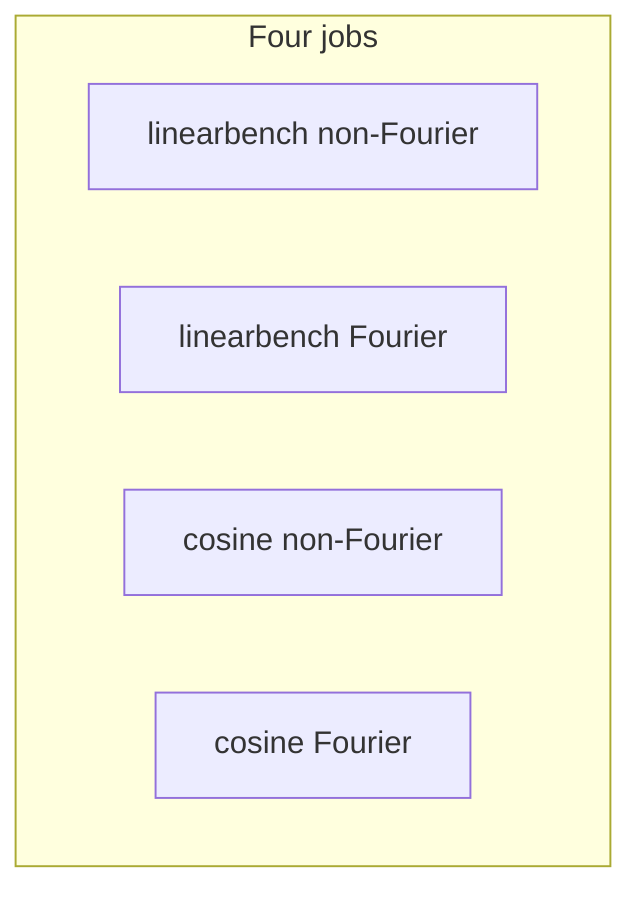

# Benchmark-1D twofig: Fourier vs non-Fourier × periodic vs linear

## Scope (benchmark-1D)

- **Linear (“linear dataset”)**: [`data/randamp_gaussian_sqrtd_xdim5/randamp_gaussian_sqrtd_xdim5_pr30d.npz`](data/randamp_gaussian_sqrtd_xdim5/randamp_gaussian_sqrtd_xdim5_pr30d.npz) with `--dataset-family randamp_gaussian_sqrtd` ([linearbench](.cursor/skills/linearbench/SKILL.md)).
- **Periodic (“periodic dataset”)**: [`data/cosine_sqrtd_rand_tune_additive_xdim5_noise2x_alpha4x/cosine_sqrtd_rand_tune_additive_xdim5_noise2x_alpha4x_pr30d.npz`](data/cosine_sqrtd_rand_tune_additive_xdim5_noise2x_alpha4x/cosine_sqrtd_rand_tune_additive_xdim5_noise2x_alpha4x_pr30d.npz) with `--dataset-family cosine_gaussian_sqrtd_rand_tune_additive` ([benchmark-1D](.cursor/skills/benchmark-1d/SKILL.md)).

All commands: `mamba run -n geo_diffusion`, `--device cuda`, `PYTHONUNBUFFERED=1`, log via `tee` into each `--output-dir` per [AGENTS.md](AGENTS.md).

## Unified method rows (all four quadrants)

Use the **same** row list every time:

```text
--theta-field-rows bin_gaussian,contrastive_soft,linear_x_flow_t,xflow_sir_lrank
```

**Fourier vs non-Fourier** is controlled only by the shared Fourier CLI (no separate split jobs):

| Mode | Flags |
|------|--------|
| **Non-Fourier** | Omit `--theta-flow-fourier-state`. Contrastive-soft follows scalar-θ behavior (`contrastive_soft_fourier_settings_from_theta_flow_args` returns `k=0` when the flag is off). |
| **Fourier** | Set `--theta-flow-fourier-state` plus `--theta-flow-fourier-k`, `--theta-flow-fourier-period-mult`, `--theta-flow-fourier-include-linear` as desired. Twofig builds one shared Fourier θ state for the subset bundle ([`fisher/h_decoding_twofig.py`](fisher/h_decoding_twofig.py)); flows and contrastive-soft consume that same interface per your revised wiring. |

**Low-rank / SIR**: `--lxf-low-rank-dim` (default **3**). **`--sir-num-bins` / `--sir-ridge`** at defaults unless you have a fixed recipe.

**Scheduled LXF budget**: `--lxfs-path-schedule cosine --lxfs-epochs 50000 --lxfs-early-patience 1000` ([benchmark-1D](.cursor/skills/benchmark-1d/SKILL.md)).

**Subset sweep**: `--n-list 80,200,400,600`.

## Run matrix (4 GPU jobs)



- One job per cell: identical rows and training budget; only Fourier CLI differs.
- Use distinct `--output-dir` paths (e.g. tags `_nf` vs `_fourier_k4` and dataset slug).

**Optional**: two GPUs—run linear and cosine in parallel (`CUDA_VISIBLE_DEVICES=0/1`).

## Artifacts

Each run produces the usual twofig bundle (`h_decoding_twofig_results.npz`, sweep/GT/corr/NMSE/loss SVGs, summary). Summary should record `theta_flow_fourier_state` and Fourier hyperparameters when enabled ([`fisher/h_decoding_twofig.py`](fisher/h_decoding_twofig.py) writer block ~1102–1110).

## Interpretation note (SIR + Fourier bundle)

With `--theta-flow-fourier-state`, the training bundle’s θ columns are the shared Fourier state; `xflow_sir_lrank` fits SIR from that bundle unless you use a separate `sir_first` workflow. Treat results as “SIR on the same θ features the flow sees.”

## Obsolete (prior plan)

The earlier **six-job split** (Fourier-A vs Fourier-B per dataset) and external merging of panels apply only to the **old** constraint where contrastive-soft required scalar θ while LXF needed `--theta-flow-fourier-state` globally. Your unified CLI removes that split.
