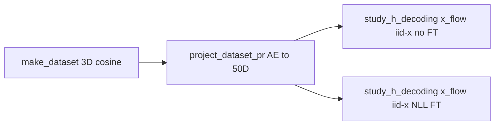

# 3D cosine_gaussian_sqrtd → PR 50D + x_flow (iid-x), with/without NLL fine-tune

## Blocker: meta roundtrip for cosine + PR

[`build_dataset_from_meta`](fisher/shared_fisher_est.py) only applies `pr_autoencoder_embedded` → `pr_autoencoder_z_dim` for **`randamp_gaussian_sqrtd`** (see `gen_x_dim` logic around lines 838–841). For **`cosine_gaussian_sqrtd`** and **`cosine_gaussian_sqrtd_rand_tune`**, the constructor still uses `x_dim=int(meta["x_dim"])`, which becomes **50** after projection—wrong for GT MC / `sample_x` (should stay **3**).

**Change:** mirror the randamp pattern:

- **`cosine_gaussian_sqrtd`:** before constructing `ToyConditionalGaussianSqrtdDataset`, set `gen_x_dim = int(meta["x_dim"])`; if `pr_autoencoder_embedded`, replace with `int(meta["pr_autoencoder_z_dim"])`, and pass `x_dim=gen_x_dim`.
- **`cosine_gaussian_sqrtd_rand_tune`:** same for `ToyConditionalGaussianCosineRandampSqrtdDataset`.

**Test:** add a unit test analogous to [`test_meta_roundtrip_gaussian_randamp_sqrtd_pr_embedded_uses_zdim`](tests/test_gaussian_tuning_curve.py) (cosine meta with `x_dim=16`, `pr_autoencoder_z_dim=3`, embedded flags) asserting `build_dataset_from_meta(meta).x_dim == 3`.

**Docs (light):** extend [`docs/dataset_pr_autoencoder_workflow.md`](docs/dataset_pr_autoencoder_workflow.md) and the top docstring in [`bin/project_dataset_pr_autoencoder.py`](bin/project_dataset_pr_autoencoder.py) to state that **non-randamp** families (e.g. `cosine_gaussian_sqrtd`) require **`--allow-non-randamp-sqrtd`** (existing CLI flag).

## Dataset pipeline (two commands)

All Python via **`mamba run -n geo_diffusion`** and **`--device cuda`** per [AGENTS.md](AGENTS.md). Use timestamps or clear suffixes in filenames. Ensure **`--n-total` ≥ `--n-ref`** for the study (default `n_ref=5000` in [`bin/study_h_decoding_convergence.py`](bin/study_h_decoding_convergence.py)); e.g. **`--n-total 8000`** if keeping default `n_ref`.

1. **Low-dimensional NPZ (native 3D `x`):**

```bash
mamba run -n geo_diffusion python bin/make_dataset.py \
  --dataset-family cosine_gaussian_sqrtd \
  --x-dim 3 \
  --n-total 8000 \
  --output-npz <repo>/data/shared_fisher_dataset_cosine_sqrtd_xdim3_<tag>.npz \
  --device cuda
```

2. **PR embed to 50D** (writes `pr_projection_summary.{png,svg}` next to output):

```bash
mamba run -n geo_diffusion python bin/project_dataset_pr_autoencoder.py \
  --input-npz <repo>/data/shared_fisher_dataset_cosine_sqrtd_xdim3_<tag>.npz \
  --output-npz <repo>/data/shared_fisher_dataset_cosine_sqrtd_pr50_zdim3_<tag>.npz \
  --h-dim 50 \
  --allow-non-randamp-sqrtd \
  --device cuda
```

Optional: **`--use-cache`** for reproducible reruns without retraining the PR-AE.

## Two convergence studies

Use [`bin/study_h_decoding_convergence.py`](bin/study_h_decoding_convergence.py) with **`--dataset-npz`** pointing at the **50D embedded** NPZ, **`--dataset-family cosine_gaussian_sqrtd`**, **`--theta-field-method x_flow`**, **`--flow-arch iid-x`**.

Shared flags (tune to match your other x-flow runs, e.g. exact divergence / `n_list`):

- **`--flow-likelihood-exact-divergence`** if you want parity with recent 10D runs.
- **`--n-list`** as desired (default script default is `80,200,400,600`; override e.g. `400` only if you want a single column).

**Run A — no NLL fine-tune:** omit finetune or set **`--flow-likelihood-finetune-epochs 0`** (per [`fisher/cli_shared_fisher.py`](fisher/cli_shared_fisher.py)).

**Run B — with NLL fine-tune:** e.g. **`--flow-likelihood-finetune-epochs 2000`** (and optional **`--flow-likelihood-finetune-lr`**, **`--flow-likelihood-finetune-exact-divergence`** if you want exact div during finetune).

Use distinct **`--output-dir`** paths under `data/` (e.g. `h_decoding_conv_cosine_sqrtd_xdim3_pr50_x_flow_iidx_...` / `..._nllft2000_...`).

## Preconditions / reporting

- **CUDA** must be available; project rules say not to fall back to CPU silently.
- When reporting paths to you, use **`/grad/zeyuan/score-matching-fisher/data/...`** (repo `data/` symlink), not bare `DATAROOT`.
- Long jobs: **`PYTHONUNBUFFERED=1`**, redirect logs, avoid `pgrep -f` wait loops ([AGENTS.md](AGENTS.md)).


