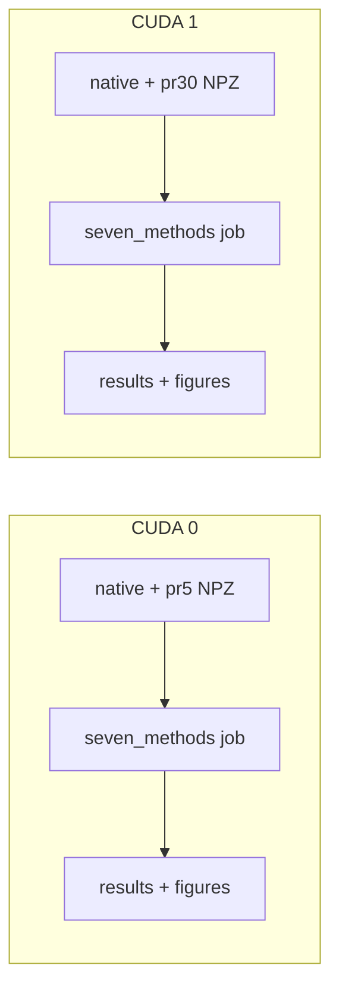

# mog-5pr5 / mog-5pr30 seven-method categorical twofig

## Goal

Execute [`bin/study_h_decoding_categorical_twofig.py`](bin/study_h_decoding_categorical_twofig.py) on **mog-5pr5** and **mog-5pr30** with these methods in **one combined run per dataset** (your choice):

| CLI alias (user) | Internal name |
|------------------|---------------|
| `xflow` | `x_flow` |
| `linear-x-flow-t` | `linear_x_flow_t` |
| `xflow-sir-lrank` | `xflow_sir_lrank` |
| `theta-flow-cate` | `theta_flow_cate` |
| `bin-gaussian` | `bin_gaussian` |
| `contrastive-soft-categorical` | `contrastive_soft_categorical` |
| `binary_classifier` | `binary_classifier` |

All aliases are defined in [`fisher/h_decoding_categorical_twofig.py`](fisher/h_decoding_categorical_twofig.py) (`_METHOD_ALIASES` / `parse_methods`).

## Prerequisites (already satisfied)

Canonical NPZs exist on disk:

- **mog-5pr5:** [`data/mog_5pr5_default/random_mog_categorical.npz`](data/mog_5pr5_default/random_mog_categorical.npz), [`data/mog_5pr5_default/random_mog_categorical_pr5.npz`](data/mog_5pr5_default/random_mog_categorical_pr5.npz)
- **mog-5pr30:** [`data/mog_5pr30_default/random_mog_categorical.npz`](data/mog_5pr30_default/random_mog_categorical.npz), [`data/mog_5pr30_default/random_mog_categorical_pr30.npz`](data/mog_5pr30_default/random_mog_categorical_pr30.npz)

No dataset regeneration unless a file is missing.

## Run configuration (match prior six-method sweeps + contrastive)

Use script defaults unless you want overrides:

- `--num-categories 5`
- `--n-list 80,200,400,600` (default)
- `--n-ref 10000` (default)
- `--run-seed 7` (default)
- `--device cuda` (required per [`AGENTS.md`](AGENTS.md)); pin GPUs via `CUDA_VISIBLE_DEVICES` (see **GPU assignment** below)
- `--pr-project` with dataset-specific `--pr-dim` and `--pr-output-npz`
- **Do not** pass `--force-regenerate` (reuse existing PR embeddings)

**Methods string** (order arbitrary; script deduplicates):

```text
xflow,linear-x-flow-t,xflow-sir-lrank,theta-flow-cate,bin-gaussian,contrastive-soft-categorical,binary_classifier
```

## Output directories (new, avoid overwriting old six-method runs)

| Dataset | Output dir |
|---------|------------|
| mog-5pr5 | `/grad/zeyuan/score-matching-fisher/data/mog_5pr5_default/h_decoding_categorical_twofig_seven_methods/` |
| mog-5pr30 | `/grad/zeyuan/score-matching-fisher/data/mog_5pr30_default/h_decoding_categorical_twofig_seven_methods/` |

Prior runs under `h_decoding_categorical_twofig_six_methods/` lack `contrastive_soft_categorical`; keep them for comparison.

## GPU assignment (fixed two-GPU split)

| Dataset | Physical GPU | Env var | Job |
|---------|--------------|---------|-----|
| **mog-5pr5** | `cuda:0` | `CUDA_VISIBLE_DEVICES=0` | PR5 embed, 7 methods |
| **mog-5pr30** | `cuda:1` | `CUDA_VISIBLE_DEVICES=1` | PR30 embed, 7 methods |

Both jobs launch **in parallel** (one process per GPU). Each command still passes `--device cuda`; with `CUDA_VISIBLE_DEVICES` set, PyTorch sees a single logical `cuda:0` mapped to the chosen physical device.

**Pre-flight:** `nvidia-smi` — confirm GPUs 0 and 1 are free before starting.

## Commands (repo root, `geo_diffusion`)

Launch both from repo root in one shell (background `&`, capture both PIDs):

**mog-5pr5 on GPU 0:**

```bash
out=data/mog_5pr5_default/h_decoding_categorical_twofig_seven_methods
mkdir -p "$out"
CUDA_VISIBLE_DEVICES=0 PYTHONUNBUFFERED=1 \
  mamba run -n geo_diffusion python bin/study_h_decoding_categorical_twofig.py \
  --num-categories 5 \
  --dataset-npz data/mog_5pr5_default/random_mog_categorical.npz \
  --pr-project --pr-dim 5 \
  --pr-output-npz data/mog_5pr5_default/random_mog_categorical_pr5.npz \
  --methods xflow,linear-x-flow-t,xflow-sir-lrank,theta-flow-cate,bin-gaussian,contrastive-soft-categorical,binary_classifier \
  --output-dir "$out" \
  --device cuda \
  > "$out/run.log" 2>&1 &
pid_pr5=$!
```

**mog-5pr30 on GPU 1:**

```bash
out=data/mog_5pr30_default/h_decoding_categorical_twofig_seven_methods
mkdir -p "$out"
CUDA_VISIBLE_DEVICES=1 PYTHONUNBUFFERED=1 \
  mamba run -n geo_diffusion python bin/study_h_decoding_categorical_twofig.py \
  --num-categories 5 \
  --dataset-npz data/mog_5pr30_default/random_mog_categorical.npz \
  --pr-project --pr-dim 30 \
  --pr-output-npz data/mog_5pr30_default/random_mog_categorical_pr30.npz \
  --methods xflow,linear-x-flow-t,xflow-sir-lrank,theta-flow-cate,bin-gaussian,contrastive-soft-categorical,binary_classifier \
  --output-dir "$out" \
  --device cuda \
  > "$out/run.log" 2>&1 &
pid_pr30=$!
```

## Execution strategy



1. **Launch** both jobs back-to-back in the same shell (commands above); record `pid_pr5` and `pid_pr30` ([`AGENTS.md`](AGENTS.md) background-job rules).
2. **Parallelism:** Always concurrent — mog-5pr5 on GPU 0, mog-5pr30 on GPU 1. No sequential fallback unless a GPU is unavailable (then stop and report rather than sharing one GPU).
3. **Monitor:** Poll each PID with `kill -0 "$pid_pr5"` / `kill -0 "$pid_pr30"`, or wait for `[cat-twofig] Saved:` in each `run.log` — **not** `pgrep -f` loops on the script name.
4. **Wall time:** Prior `six_methods` logs are ~5k+ lines each. With two GPUs, wall clock ≈ **max(pr5, pr30)** (~1–3+ hours), not the sum; PR30 may finish after PR5.

## Expected artifacts (per dataset)

Under each `h_decoding_categorical_twofig_seven_methods/`:

- `run.log`
- `h_decoding_categorical_twofig_results.npz` (all 7 methods × 4 `n`)
- `h_decoding_categorical_twofig_summary.txt`
- `h_decoding_categorical_twofig_sweep.svg`, `..._corr_nmse.svg`, `..._training_losses_panel.svg`, `..._all_columns.png`
- `llr_est_vs_true_all.png` / `.svg`, `hellinger_est_vs_gt_all.png` / `.svg`
- `training_losses/` per-method curves

## Post-run checks

1. Confirm `h_decoding_categorical_twofig_summary.txt` lists all seven methods and `pr_project: True`.
2. Load `h_decoding_categorical_twofig_results.npz` and verify `method_names` length is 7.
3. Spot-check `llr_est_vs_true_all.png` for all method columns.
4. Report full paths under `/grad/zeyuan/score-matching-fisher/data/mog_5pr5_default/...` and `.../mog_5pr30_default/...`.

## Out of scope (unless you ask)

- Regenerating native or PR NPZs
- Rerunning `ctsm_v` or other methods not in your list
- Per-method output dirs (superseded by combined runs)
