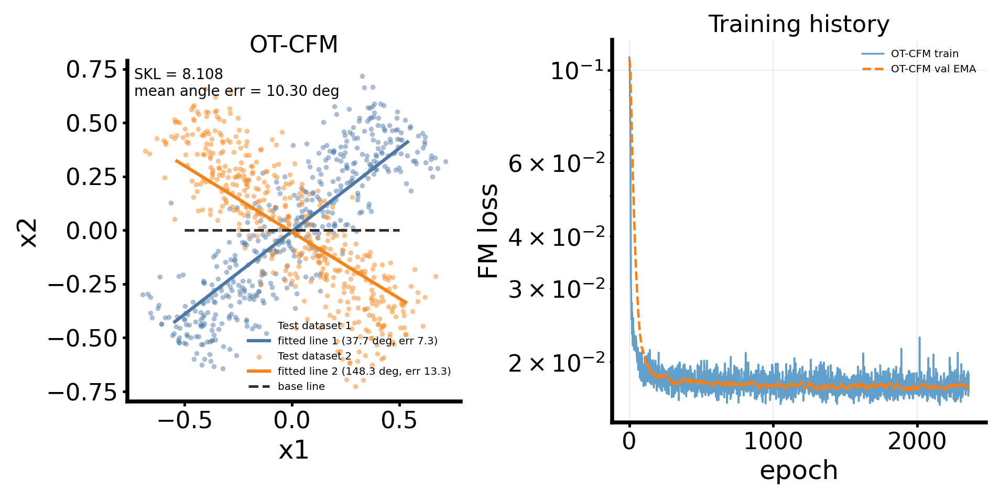
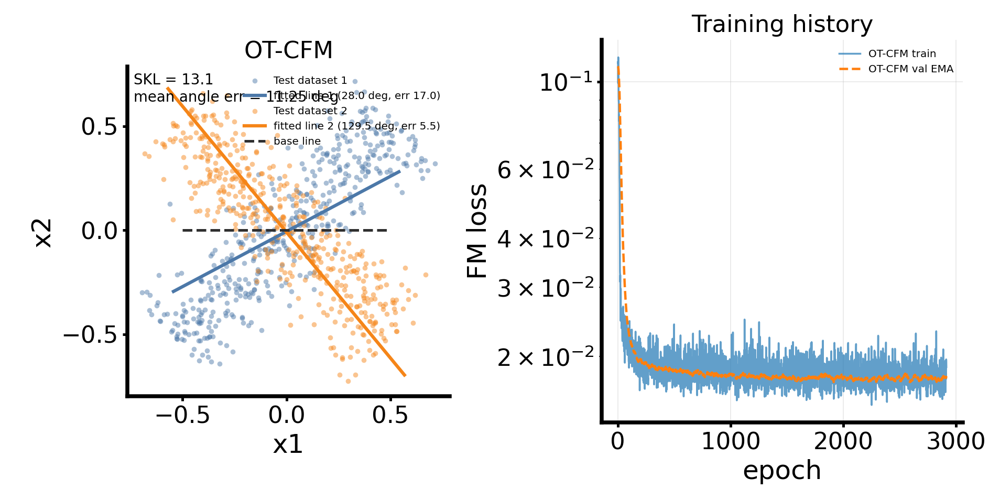
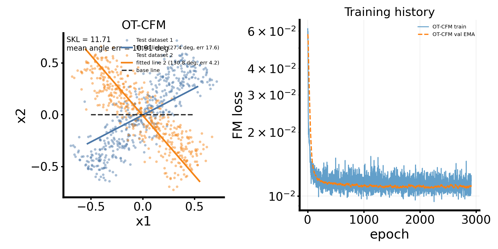

# OT-CFM Line-Fitting Failure: Problem Statement for Flow-Matching Review

Date: 2026-06-29

This folder is a self-contained package of the current failing diagnostic. It
contains this note, the figures from the latest OT-CFM-only runs, and the JSON
summaries with all run metadata.

## Short Summary

We are trying to learn a flow from a noiseless one-dimensional base line to two
noisy target line distributions in $\mathbb R^2$. The target lines are centered
at the origin and have angles $45^\circ$ and $135^\circ$, so the two target
datasets form an X shape.

Even with thousands of target samples per condition and minibatch OT-CFM
pairing, the fitted pushed-forward base line has large angle error. Increasing
batch size and switching between cosine and linear interpolation schedules does
not fix the problem. This suggests that the current flow-matching objective, or
its coupling/path/model combination, may be biased relative to the geometric
line-fitting objective we care about.

## Files in This Folder

- `problem_statement_for_flow_matching_expert.md`: this note.
- `ot_cfm_bs1024_cosine.png`: OT-CFM only, batch size 1024, cosine path.
- `ot_cfm_bs1024_cosine_summary.json`: full metadata for the above run.
- `ot_cfm_bs2048_cosine.png`: OT-CFM only, batch size 2048, cosine path.
- `ot_cfm_bs2048_cosine_summary.json`: full metadata for the above run.
- `ot_cfm_bs2048_linear.png`: OT-CFM only, batch size 2048, linear path.
- `ot_cfm_bs2048_linear_summary.json`: full metadata for the above run.

The original artifact paths are under:

- `/home/zeyuan/score-matching-fisher/data/geometric_base_line_fit_ot_compare/`
- `/home/zeyuan/score-matching-fisher/data/geometric_base_line_fit_ot_compare_bs2048_cosine/`
- `/home/zeyuan/score-matching-fisher/data/geometric_base_line_fit_ot_compare_bs2048_linear/`

## Goal

For condition $c \in \{1,2\}$, define a base line

$$
x_0 = f(u) = a + d u, \qquad u \sim \mathrm{Unif}[-0.5,0.5],
$$

where currently

$$
a=(0,0), \qquad d=(1,0).
$$

The target datasets are noisy line distributions

$$
x_1 = \ell u\,e_{\theta_c} + \epsilon,
\qquad
u \sim \mathrm{Unif}[-0.5,0.5],
\qquad
\epsilon \sim \mathcal N(0,\sigma_{\mathrm{target}}^2 I),
$$

with

$$
\theta_1 = 45^\circ,\qquad
\theta_2 = 135^\circ,\qquad
\ell = 1.5,\qquad
\sigma_{\mathrm{target}} = 0.12.
$$

We train a conditional flow-matching model for both conditions. After training,
we push the noiseless base line through the learned ODE to obtain fitted curves

$$
\gamma_c(u) = T_c(f(u)).
$$

For downstream use, we define a smoothed fitted distribution

$$
q_c(x) = \int \mathcal N(x \mid \gamma_c(u), \sigma_{\mathrm{smooth}}^2 I)\,du
$$

and estimate the symmetric KL

$$
D_{\mathrm{SKL}}(q_1,q_2)
=D_{\mathrm{KL}}(q_1\|q_2)+D_{\mathrm{KL}}(q_2\|q_1).
$$

However, the immediate failure is more basic: the learned fitted curves do not
align well with the target centerlines.

## Current Model

The script uses `CenteredConditionAffineFlowSKLModel` from
`fisher/flow_matching_skl.py`.

The learned velocity has the form

$$
v_\phi(x,t,c)
=
\dot\beta_t b_\phi(c)
+
A_\phi(c,t)\left[x-\beta_t b_\phi(c)\right].
$$

Here:

- $c$ is a one-hot condition label.
- $b_\phi(c)\in\mathbb R^2$ is learned by an MLP.
- $A_\phi(c,t)\in\mathbb R^{2\times 2}$ is learned by an MLP.
- $A_\phi(c,t)$ is symmetrized in code:

$$
A_\phi(c,t)=\frac12\left(A_{\mathrm{raw}}(c,t)+A_{\mathrm{raw}}(c,t)^\top\right).
$$

The path schedule provides $\beta_t$ and $\dot\beta_t$.

Current network hyperparameters:

- `hidden_dim = 64`
- `depth = 4`
- `theta_dim = 2`, because condition labels are one-hot.
- `x_dim = 2`
- MLP activation: `SiLU`
- optimizer: `AdamW`
- learning rate: `1e-3`
- weight decay: `0`
- max grad norm: `10`

## Current Flow-Matching Objective

At each training step:

1. Sample a target minibatch $(c_j,x_{1,j})$ from the empirical target data.
2. Sample the same number of base points $x_{0,i}$ from the base line.
3. If OT-CFM is enabled, compute a minibatch OT plan between base points and
   target points using squared Euclidean cost.
4. Resample source-target pairs $(x_0,x_1,c)$ from this plan.
5. Sample $t \sim \mathrm{Unif}[\epsilon,1-\epsilon]$ with `t_eps = 0.0005`.
6. Construct the interpolation path:

$$
x_t = \alpha_t x_0 + \beta_t x_1,
$$

with target velocity

$$
u_t = \dot\alpha_t x_0 + \dot\beta_t x_1.
$$

7. Minimize the velocity regression loss:

$$
\mathcal L(\phi)
=
\mathbb E\left[
\|v_\phi(x_t,t,c)-u_t\|_2^2
\right].
$$

Validation uses the same flow-matching MSE. Early stopping is based on an EMA of
validation flow-matching loss, not on fitted-line angle error or downstream SKL.

## OT-CFM Implementation

The current default OT method is a torch-native balanced entropic Sinkhorn
solver:

- `ot_method = torch_sinkhorn`
- `ot_reg = 0.05`
- `ot_sinkhorn_iters = 100`
- cost: squared Euclidean distance between minibatch base samples and minibatch
  target samples
- plan marginals: uniform on the minibatch
- sampling: source-target pair indices sampled from the resulting plan

No hidden latent line coordinate is used. The OT plan only sees the observed
base points and noisy target points.

## Data Split

For each condition:

- `n_per_theta = 3000`
- train fraction: `0.7`
- validation fraction: `0.15`
- test fraction: remaining `0.15`

The base distribution is not split, because it is assumed we can sample from it
freely during training and validation. Only the empirical target dataset is
split.

## Recent Runs

All runs below used OT-CFM only, one-hot condition labels, torch Sinkhorn OT,
and CUDA device `cuda:1`.

| Run | Path | Batch size | Best epoch | Best val FM loss | Fitted angles | Angle errors | SKL |
|---|---:|---:|---:|---:|---:|---:|---:|
| `ot_cfm_bs1024_cosine` | cosine | 1024 | 1357 | 0.017124 | 37.70, 148.30 | 7.30, 13.30 | 8.1085 |
| `ot_cfm_bs2048_cosine` | cosine | 2048 | 1914 | 0.017232 | 27.96, 129.55 | 17.04, 5.45 | 13.0959 |
| `ot_cfm_bs2048_linear` | linear | 2048 | 1914 | 0.010817 | 27.39, 130.79 | 17.61, 4.21 | 11.7107 |

Important observation: the linear path obtains a much lower validation
flow-matching loss than the cosine path, but it does not produce a better
geometric line fit. This is the main reason we suspect objective mismatch or
bias rather than insufficient optimization alone.

## Figures

### Batch size 1024, cosine path



### Batch size 2048, cosine path



### Batch size 2048, linear path



## Why This Is Surprising

This task looks simple. The target centerlines are two straight lines through
the origin, and the model has a condition-dependent affine velocity. In
principle, a linear map should be able to rotate and scale the horizontal base
line into either target line.

Despite that, the learned pushed-forward base line is often noticeably tilted
away from the target centerline. The failure persists after:

- using one-hot condition labels;
- using train/validation/test splits only on target data;
- increasing data size to thousands per condition;
- using minibatch OT-CFM rather than independent pairing;
- using torch-native Sinkhorn so larger minibatches are feasible;
- trying both cosine and linear interpolation schedules;
- increasing batch size from 1024 to 2048.

## Current Hypotheses

### 1. FM velocity regression is not the same as fitting the centerline

The loss regresses conditional path velocities. It does not directly penalize
angle error, centerline error, or SKL between smoothed fitted curves. A lower
flow-matching MSE can therefore correspond to a worse fitted centerline.

### 2. OT on noisy target points may still not recover the latent line coordinate

The natural geometric map would pair base coordinate $u$ with the same target
line coordinate $u$. We intentionally do not reveal this latent coordinate.
Minibatch OT sees only noisy target points, so the plan may be affected by
normal noise and by finite-minibatch geometry. The optimal plan for the noisy
tube may not correspond to the desired centerline map.

### 3. The target is two-dimensional noisy data, but the pushed-forward base is one-dimensional

The base is singular: it is exactly a line. The learned deterministic ODE maps
it to another curve, not to a full noisy tube. During training, the endpoints
$x_1$ include two-dimensional noise, so the velocity target includes normal
noise components. The model may compromise between fitting centerline motion and
fitting noise-induced velocity components.

### 4. The symmetric $A(c,t)$ constraint may be too restrictive

The current model symmetrizes $A(c,t)$. Although time-varying symmetric matrices
can generate nontrivial linear transformations through ODE integration, this is
still a restriction. A direct rotation generator is skew-symmetric, so the
symmetry constraint may make the intended line rotation difficult or indirect.

### 5. Early stopping selects best velocity MSE, not best geometry

The restored checkpoint minimizes smoothed validation FM loss. It may not be the
checkpoint with minimum angle error or best SKL. The observed mismatch between
validation loss and geometry suggests that a geometry-aware validation rule may
be necessary.

### 6. The interpolation path may induce a biased target field for this singular-base/noisy-target setting

The path determines the regression target $u_t$. The linear path gives lower
velocity MSE but worse geometry in the current runs. This suggests that the path
and coupling jointly define a vector-field target whose minimizer may not be the
geometric line map we want.

## Questions for a Flow-Matching Expert

1. For a singular one-dimensional base distribution and a noisy
   two-dimensional target tube, what is the population minimizer of the CFM or
   OT-CFM velocity regression objective?
2. Does the population OT-CFM objective recover the intuitive centerline map, or
   does it recover a different transport because the target has normal noise?
3. Is the line-angle error an expected bias from using noisy endpoints in the FM
   target while evaluating only the pushed-forward noiseless base?
4. Does the symmetric $A(c,t)$ constraint prevent or bias the desired
   line-to-line rotation? Should $A(c,t)$ be unrestricted, decomposed into
   symmetric plus skew-symmetric parts, or parameterized by an endpoint map
   directly?
5. Should the objective include a denoised target, a projected target endpoint,
   or an explicit centerline loss if the desired metric is between fitted
   smoothed centerline distributions?
6. Is minibatch Sinkhorn with `ot_reg = 0.05` too entropic for this line-fitting
   diagnostic? Would exact OT, lower regularization, deterministic barycentric
   pairing, or condition-wise sorted 1D pairing be more appropriate?
7. Is there a theoretically justified validation criterion that better matches
   the final SKL/line geometry than validation FM loss?

## Minimal Reproduction Commands

From repo root `/home/zeyuan/score-matching-fisher`:

```bash
PYTHONUNBUFFERED=1 mamba run -n geo_diffusion python tests/run_geometric_base_line_fit_ot_compare.py \
  --device cuda:1 \
  --run-method ot \
  --batch-size 1024 \
  --path-schedule cosine \
  --output-dir data/geometric_base_line_fit_ot_compare
```

```bash
PYTHONUNBUFFERED=1 mamba run -n geo_diffusion python tests/run_geometric_base_line_fit_ot_compare.py \
  --device cuda:1 \
  --run-method ot \
  --batch-size 2048 \
  --path-schedule cosine \
  --output-dir data/geometric_base_line_fit_ot_compare_bs2048_cosine
```

```bash
PYTHONUNBUFFERED=1 mamba run -n geo_diffusion python tests/run_geometric_base_line_fit_ot_compare.py \
  --device cuda:1 \
  --run-method ot \
  --batch-size 2048 \
  --path-schedule linear \
  --output-dir data/geometric_base_line_fit_ot_compare_bs2048_linear
```

## Code Pointers

- Experiment script:
  `tests/run_geometric_base_line_fit_ot_compare.py`
- Geometric-base training loop and torch Sinkhorn implementation:
  `fisher/geometric_base_flow_skl.py`
- Velocity model:
  `fisher/flow_matching_skl.py`, class `CenteredConditionAffineFlowSKLModel`
- Prior local diagnosis note:
  `journal/notes/2026-06-28-geometric-base-line-fit-failure-diagnosis.md`
- Minibatch OT-CFM method note:
  `report/notes/2026-06-29-minibatch-ot-cfm.tex`
