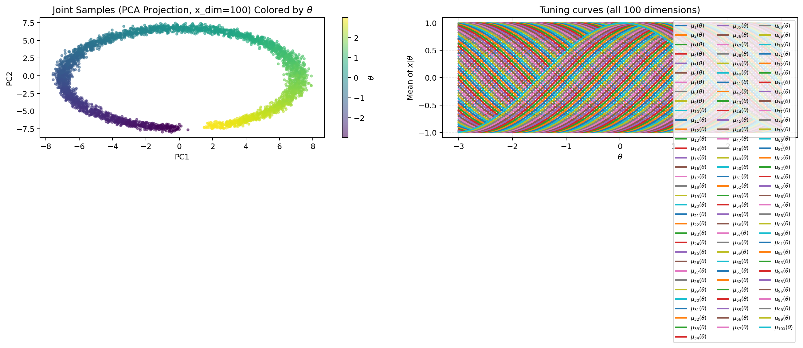
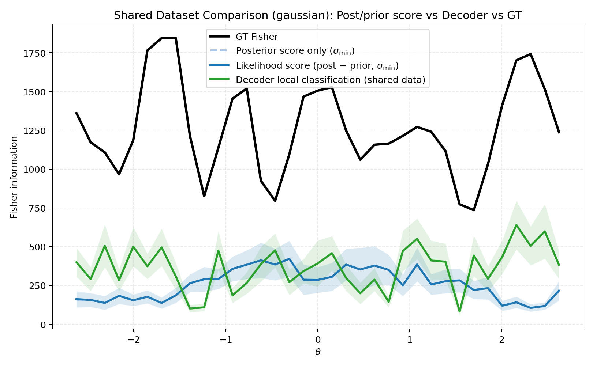
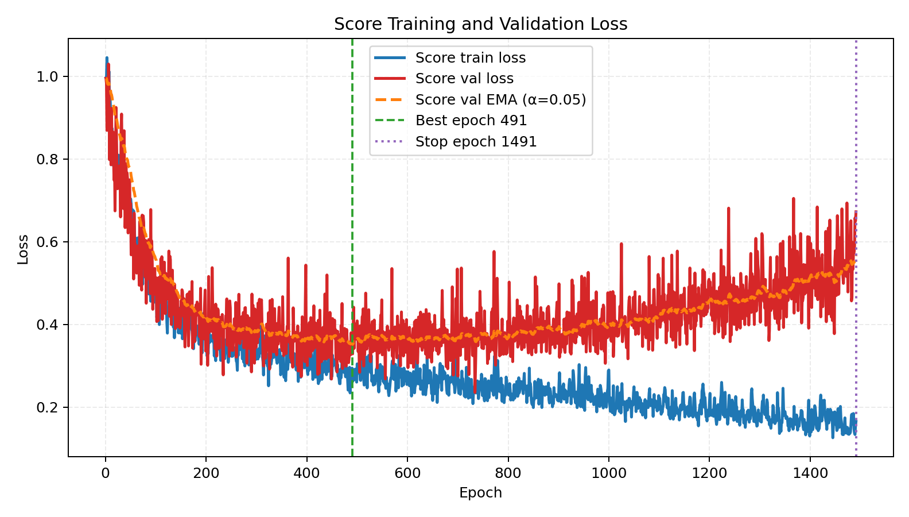
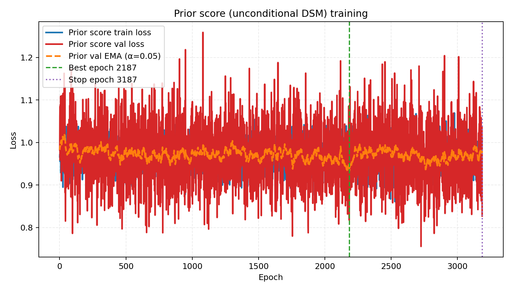

# 2026-04-05 Fisher estimation at high $x$-dimension: Gaussian $x \in \mathbb{R}^{100}$, $N=4000$

**Takeaway:** With the **same pipeline and default hyperparameters** as the low-dimensional Gaussian runs, Fisher curve estimation **fails badly** when the observation dimension is **100**. Score-based curves (posterior-only and posterior-minus-prior) and the local decoder **do not track** the analytic ground truth: large RMSE/MAE and **negative or weak** correlation with GT across $\theta$ bins. This note documents the run for reproducibility and flags **high ambient dimension** as a major stress test for the current score-matching Fisher estimator—not a regime where the method should be trusted without redesign (architecture, noise schedule, binning, or sample size).

The generative model is unchanged in family (`ToyConditionalGaussianDataset`); only **`x_dim=100`** and **`n_total=4000`** differ from the well-behaved $x \in \mathbb{R}^2$ journal note at the same $N$.

---

## 1. Data generation

Uniform $\theta \in [\theta_{\text{low}},\theta_{\text{high}}]$, conditional Gaussian $x\mid\theta$ with cosine means and $\theta$-dependent **diagonal** covariance for $d>2$ (off-diagonal correlation only in the $d=2$ specialization).

**Split:** `train_frac=0.7`, `seed=7` → **2800 train / 1200 eval**.

**Reproduction:**

```bash
mamba run -n geo_diffusion python bin/fisher_make_dataset.py \
  --dataset-family cosine_gaussian \
  --x-dim 100 \
  --n-total 4000 \
  --output-npz data/fisher_gaussian_xdim100_n4000.npz
```

**Output:** `data/fisher_gaussian_xdim100_n4000.npz`.

---

## 2. Dataset visualization (sanity check)

PCA-based joint view and conditional slices (high-$d$ $x$ projected to 2D for plotting).

```bash
mamba run -n geo_diffusion python bin/visualize_dataset.py \
  --dataset-npz data/fisher_gaussian_xdim100_n4000.npz \
  --output-dir data/outputs_step2_gaussian_xdim100_n4000
```

<figure id="fig:joint-xdim100">

<figcaption>Joint $\theta$–$x$ view (PCA of $x$) and binned empirical means vs cosine tuning curve. The **data** look reasonable; the failure mode below is in **Fisher estimation**, not obviously in sampling.</figcaption>
</figure>

---

## 3. Fisher estimation pipeline

Same entrypoint and defaults as other shared-dataset runs: posterior `ConditionalScore1D`, prior `PriorScore1D`, combined primary curve `posterior_minus_prior`, NCSM continuous noise, `theta_std` $\sigma$ scaling, 35 bins / 0.30 margin / min bin count 10, decoder baseline.

```bash
mamba run -n geo_diffusion python bin/fisher_estimate_from_dataset.py \
  --dataset-npz data/fisher_gaussian_xdim100_n4000.npz \
  --output-dir data/outputs_fisher_gaussian_xdim100_n4000_prior \
  --device cuda
```

**Diagnostics from run:** `score_sigma_scale_mode=theta_std`, `theta_std_train ≈ 1.7273`, evaluation uses **`sigma_min_direct`** with $\sigma_* \approx 0.01727$. Early stopping: **posterior** score best epoch **491**, stop **1491**; **prior** score best **2187**, stop **3187**.

---

## 4. Results: poor agreement with GT (emphasis)

### 4.1 Metrics vs analytic Fisher (35/35 valid bins)

| Estimator | RMSE vs GT | MAE vs GT | Pearson $r$ vs GT |
|:----------|-----------:|----------:|-------------------:|
| Likelihood score ($s_{\text{post}} - s_{\text{prior}}$, primary) | **1065.94** | **1008.31** | **−0.40** |
| Posterior-only score | 1066.43 | 1008.78 | −0.40 |
| Local decoder | 944.40 | 902.13 | 0.35 |

For comparison, the **$x \in \mathbb{R}^2$, $N=4000$** run with the same defaults achieved order-one RMSE/MAE and **positive** correlation with GT (see [2026-04-05 Fisher … $x \in \mathbb{R}^2$, $N=4000$](2026-04-05-fisher-gaussian-xdim2-n4000.md)). Here, **all** reported estimators are **misaligned** with the analytic curve at $d=100$ under this setup.

### 4.2 Fisher curves

<figure id="fig:fisher-curve-xdim100">

<figcaption>Analytic GT vs score-based and decoder curves. The learned curves **do not** reproduce the GT shape or scale; uncertainty bands do not rescue agreement. This is the main visual evidence that **high-dimensional $x$** breaks the current estimator in practice.</figcaption>
</figure>

### 4.3 Training losses (models did optimize DSM objectives)

<figure id="fig:score-loss-xdim100">

<figcaption>Posterior score DSM losses decrease and early stopping triggers; **low DSM loss does not imply** a good Fisher curve here.</figcaption>
</figure>

<figure id="fig:prior-loss-xdim100">

<figcaption>Prior score DSM on $\theta$ alone: also trains cleanly. The gap to GT is therefore not explained by “training didn’t run.”</figcaption>
</figure>

---

## 5. Interpretation (brief)

Several non-exclusive explanations are consistent with this log: **curse of dimensionality** for learning scores in $\mathbb{R}^{100}$ with $N=4000$; **noise-conditional** training may emphasize scales mis-matched to the Fisher-relevant signal; **squaring** noisy score estimates in the Fisher formula can explode variance; the **MLP** may be under-capacity or need architecture tuned to $d$. The point of this note is empirical: **do not assume** the pipeline transfers to high $x$-dimension without explicit validation.

---

## 6. Output files

| Artifact | Path |
|:---------|:-----|
| Dataset NPZ | `data/fisher_gaussian_xdim100_n4000.npz` |
| Visualization dir | `data/outputs_step2_gaussian_xdim100_n4000/` |
| Fisher run dir | `data/outputs_fisher_gaussian_xdim100_n4000_prior/` |
| Metrics | `data/outputs_fisher_gaussian_xdim100_n4000_prior/metrics_vs_gt_theta_cov.txt` |
| Curves NPZ | `data/outputs_fisher_gaussian_xdim100_n4000_prior/shared_dataset_compare_curves_theta_cov.npz` |
| Full log | `data/outputs_fisher_gaussian_xdim100_n4000_prior/run.log` |
