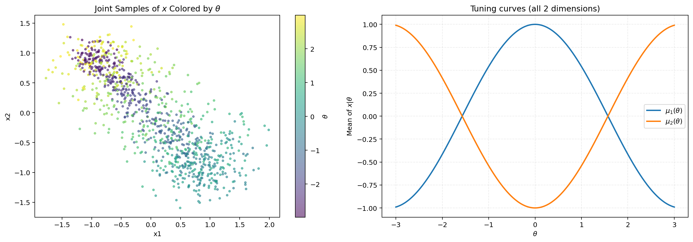
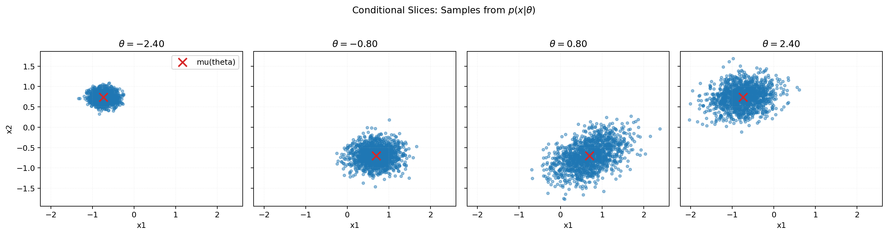
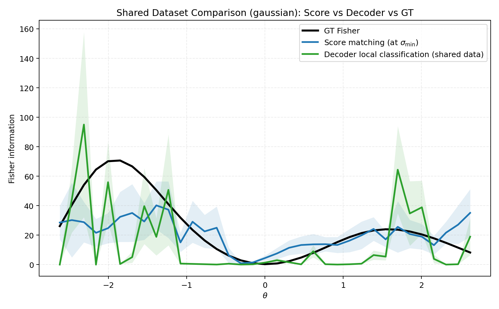
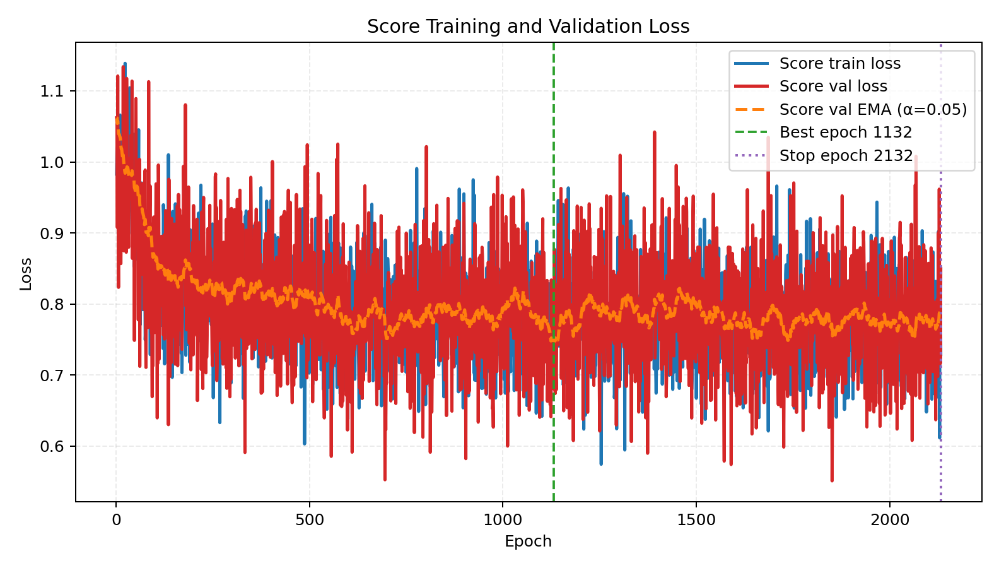

# 2026-04-05 Shared Fisher estimation: Gaussian toy, $x \in \mathbb{R}^2$, $N=1000$

This note documents a full pipeline run on a **smaller** shared dataset ($n_{\text{total}}=1000$): generation of $(\theta, x)$ pairs from a conditional Gaussian toy model, visualization, and Fisher information estimation via **score matching** and **local decoder** baselines compared to **analytic ground truth**. The note is written for reproducibility with exact commands and default hyperparameters from the codebase at the time of the run.

---

## 1. Data generation

### Generative model

We use `ToyConditionalGaussianDataset` in [`fisher/data.py`](../../fisher/data.py). Stimulus $\theta$ is drawn uniformly on $[\theta_{\text{low}}, \theta_{\text{high}}]$. The mean response (tuning curve) for neuron $j$ uses **cosine** shapes with **uniformly spaced phases** over $[0, 2\pi)$:

$$
\mu_j(\theta) = A \cos(\omega \theta + \phi_j), \qquad \phi_j = \frac{2\pi (j-1)}{N_{\text{neurons}}}, \quad j=1,\ldots,N_{\text{neurons}}.
$$

Conditional on $\theta$, $x \in \mathbb{R}^{N_{\text{neurons}}}$ is Gaussian with mean $\mu(\theta)$ and a **$\theta$-dependent** covariance (parameters from CLI defaults; see [`fisher/cli_shared_fisher.py`](../../fisher/cli_shared_fisher.py) `add_dataset_arguments`).

### Empirical dataset

- **Script:** [`bin/fisher_make_dataset.py`](../../bin/fisher_make_dataset.py)
- **Split:** `train_frac=0.7` $\Rightarrow$ 700 train / 300 eval indices (random permutation, seed fixed).
- **This run:** `dataset_family=gaussian`, `x_dim=2`, `n_total=1000`, defaults otherwise (e.g. `seed=7`, `theta_low=-3`, `theta_high=3`).

**Reproduction command:**

```bash
mamba run -n geo_diffusion python bin/fisher_make_dataset.py \
  --dataset-family gaussian \
  --x-dim 2 \
  --n-total 1000 \
  --output-npz data/shared_fisher_dataset_gaussian_xdim2_n1000.npz
```

**Output:** `data/shared_fisher_dataset_gaussian_xdim2_n1000.npz` (metadata + `theta_*`, `x_*`, train/eval indices).

---

## 2. Visualization

**Script:** [`bin/visualize_dataset.py`](../../bin/visualize_dataset.py) with `--dataset-npz` so parameters match file metadata.

**Reproduction command:**

```bash
mamba run -n geo_diffusion python bin/visualize_dataset.py \
  --dataset-npz data/shared_fisher_dataset_gaussian_xdim2_n1000.npz \
  --output-dir data/outputs_step2_gaussian_xdim2_n1000
```

<figure id="fig:joint">

<figcaption>Left: samples in $x_1$–$x_2$ colored by $\theta$. Right: cosine tuning curves $\mu_j(\theta)$ for both dimensions (full $x_{\text{dim}}$).</figcaption>
</figure>

<figure id="fig:slices">

<figcaption>Conditional slices $p(x\mid\theta)$ at several reference $\theta$ values (diagnostic panels).</figcaption>
</figure>

---

## 3. Fisher estimation pipeline

**Script:** [`bin/fisher_estimate_from_dataset.py`](../../bin/fisher_estimate_from_dataset.py) loads the `.npz`, merges metadata into estimation args, and calls `run_shared_fisher_estimation` in [`fisher/shared_fisher_est.py`](../../fisher/shared_fisher_est.py).

### 3.1 Ground truth Fisher (Gaussian)

For the Gaussian family, the GT curve at bin centers $\{\theta_k\}$ is computed analytically (`analytic_fisher_curve`): Fisher information as a function of $\theta$ for the conditional model (mean term + covariance-derivative term involving $\Sigma(\theta)$ and $\Sigma'(\theta)$). No Monte Carlo is required for GT in this family.

### 3.2 Score matching

- **Model:** `ConditionalScore1D` (architecture: default `score_hidden_dim=128`, `score_depth=3`).
- **Training data:** `score_data_mode=split` $\Rightarrow$ score train/eval from the saved train/eval split (700 / 300).
- **Validation split (within score train):** `score_val_source=train_split`, `score_val_frac=0.15`, `score_min_val_size=256` $\Rightarrow$ reported fit 444 / val 256 on this $N=1000$ run.
- **Noise / NCSM:** `score_noise_mode=continuous`, $\sigma$ ladder scaled by `theta_std` of the score **fit** set (`score_sigma_scale_mode=theta_std`), with `score_eval_sigmas=12` levels between `alpha_min` and `alpha_max` multiples of that scale.
- **Early stopping:** validation loss monitored with **EMA** (`score_early_ema_alpha=0.05`), `score_early_patience=1000`, `score_early_min_delta=1e-4`, restore best checkpoint.

**Score-based Fisher at $\theta$:** For each noise level, binned averages of squared model score; the curve reported vs GT uses the **smallest** $\sigma$ in the ladder (`sigma_min_direct`). Per-bin, the estimator is essentially the mean of $s_\theta(x)^2$ over samples in that $\theta$ bin (with bin validity controlled by `n_bins`, `eval_margin`, `score_min_bin_count`).

### 3.3 Local decoder

For each score bin center $\theta_0$, two local classes are formed at $\theta_0 \pm \varepsilon/2$ with band-limited subsets (`decoder_bandwidth`). Balanced class counts require sufficient points in **both** train and eval windows; defaults include `decoder_min_class_count=5`, `decoder_epsilon=0.12`, `decoder_val_frac=0.15`, `decoder_min_val_class_size=10`. A small MLP (`LocalDecoderLogit`, `decoder_hidden_dim=64`, `decoder_depth=2`) is trained with decoder early stopping (EMA `decoder_early_ema_alpha=0.2`).

**Decoder Fisher estimate** at $\theta_0$: with logits $\ell$ on pooled eval positives/negatives and finite-difference scale $\varepsilon$,

$$
\hat{I}_{\text{dec}}(\theta_0) = \frac{1}{N_{\text{eval}}} \sum_{i=1}^{N_{\text{eval}}} \frac{\ell_i^2}{\varepsilon^2},
$$

with a standard error from the sample standard deviation of $\ell_i^2/\varepsilon^2$.

### 3.4 Metrics vs GT

For each method, RMSE / MAE / Pearson correlation are computed between the **valid** bin predictions and the analytic GT curve (see `compute_metrics` in [`fisher/shared_fisher_est.py`](../../fisher/shared_fisher_est.py)):

$$
\text{RMSE} = \sqrt{\frac{1}{|\mathcal{V}|}\sum_{k\in\mathcal{V}} (\hat{I}_k - I^{\text{GT}}_k)^2}, \quad
\text{MAE} = \frac{1}{|\mathcal{V}|}\sum_{k\in\mathcal{V}} |\hat{I}_k - I^{\text{GT}}_k|,
$$

where $\mathcal{V}$ is the set of bins with valid estimates.

**Reproduction command (CUDA):**

```bash
mamba run -n geo_diffusion python bin/fisher_estimate_from_dataset.py \
  --dataset-npz data/shared_fisher_dataset_gaussian_xdim2_n1000.npz \
  --output-dir data/outputs_fisher_gaussian_xdim2_n1000 \
  --device cuda
```

---

## 4. Results

### Training

| Component | Setting | Outcome (this run) |
|:----------|:--------|:-------------------|
| Score | max `score_epochs=10000`, EMA $\alpha=0.05$, patience 1000 | Early stop: **stopped_epoch=2132**, **best_epoch=1132**, best val EMA $\approx 0.7454$ |
| Decoder | 80 epochs max, patience 100, EMA $\alpha=0.2$ | Per-bin training with restore-best |

### Metrics vs analytic GT

| Method | Valid bins | RMSE | MAE | Corr |
|:-------|------------:|-----:|----:|-----:|
| Score ($\sigma_{\min}$) | 35/35 | 16.965 | 11.296 | 0.666 |
| Decoder | 32/35 | 26.607 | 19.540 | 0.433 |

Decoder **skip counts** (see `metrics_vs_gt_theta_cov.txt`): `insufficient_counts=2`, `insufficient_fit_after_val=1` (remaining bins OK). With only 1000 total samples, some $\theta$ centers have too few local train/eval points for the default windows and thresholds.

<figure id="fig:fisher-curve">

<figcaption>Analytic GT Fisher vs score-matching estimate (min $\sigma$) vs decoder-based Fisher. Shaded bands: nominal uncertainty where available.</figcaption>
</figure>

<figure id="fig:score-loss">

<figcaption>Score training loss, raw validation loss, and EMA-smoothed validation monitor; vertical lines for best and stop epochs.</figcaption>
</figure>

---

## 5. Output files (repo paths)

| Artifact | Path |
|:---------|:-----|
| Shared dataset | `data/shared_fisher_dataset_gaussian_xdim2_n1000.npz` |
| Visualization | `data/outputs_step2_gaussian_xdim2_n1000/joint_scatter_and_tuning_curve.png`, `conditional_slices.png` |
| Fisher run | `data/outputs_fisher_gaussian_xdim2_n1000/` (`fisher_curve_shared_dataset_vs_gt_theta_cov.png`, `score_loss_vs_epoch.png`, `shared_dataset_compare_curves_theta_cov.npz`, `metrics_vs_gt_theta_cov.txt`, `decoder_bin_diagnostics.txt`) |

---

## 6. Interpretation (brief)

- **Score curve** tracks GT with moderate correlation under $N=1000$; variance is expected with a smaller dataset and a single train/val draw.
- **Decoder** is more sensitive to **local sample counts** at each $\theta$: three bins were skipped; correlation vs GT is lower than the score baseline here, consistent with noisier finite-difference scaling and shallow training for some bins.
- Raising $n_{\text{total}}$, widening `decoder_bandwidth`, or lowering `decoder_min_class_count` further (already 5 by default) trades off bias/variance for local windows—see `decoder_bin_diagnostics.txt` for per-bin counts.
