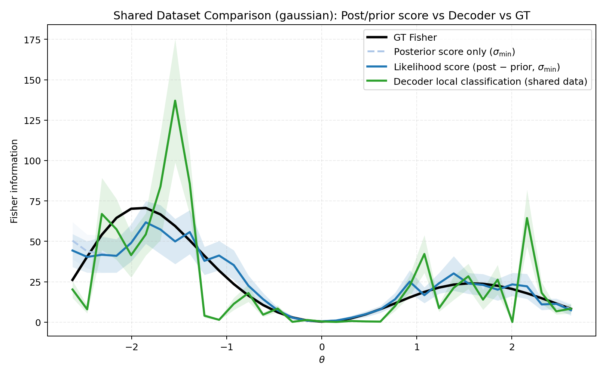
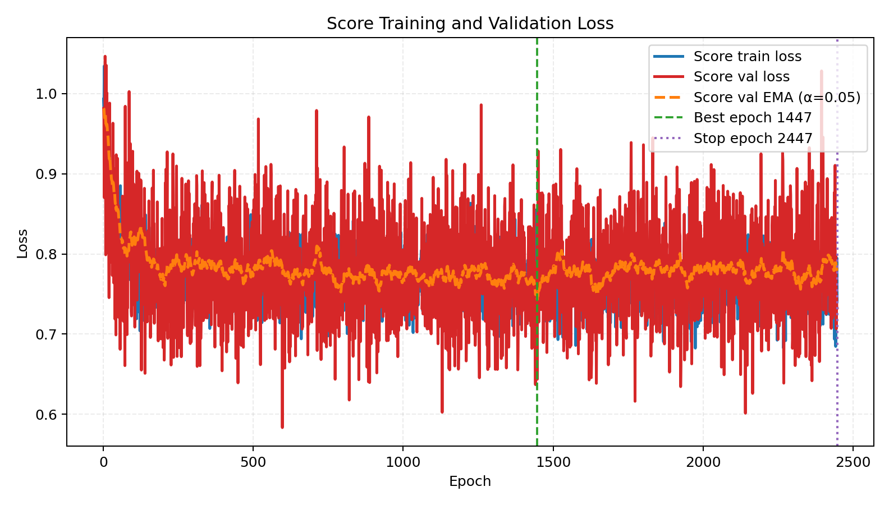
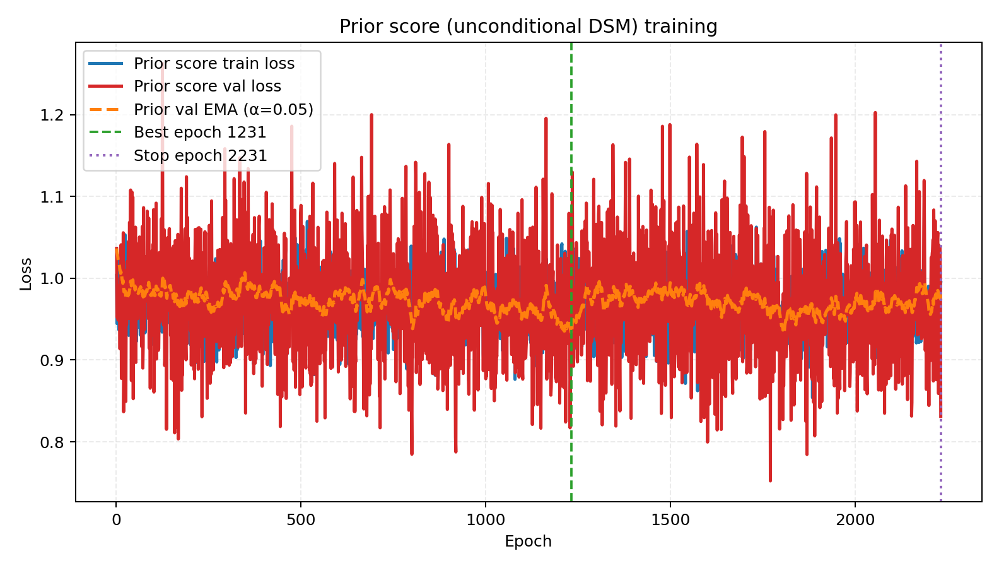

# 2026-04-05 Shared Fisher estimation: Gaussian toy, $x \in \mathbb{R}^2$, $N=4000$

This note records a single full pipeline run at **$n_{\text{total}}=4000$**: sampling $(\theta,x)$ from a conditional Gaussian toy, then estimating the $\theta$-dependent Fisher information curve with **conditional denoising score matching** (posterior), a second **unconditional** DSM on $\theta$ (prior score), and a **local decoder** baseline, compared to **analytic ground truth**. The primary score-based curve uses **likelihood score** $\hat s_{\text{post}} - \hat s_{\text{prior}}$ (`fisher_score_mode=posterior_minus_prior`, default). Full reproduction commands and output paths are below.

---

## 1. Data generation

**Generative model:** `ToyConditionalGaussianDataset` in [`fisher/data.py`](../../fisher/data.py): uniform $\theta \in [\theta_{\text{low}},\theta_{\text{high}}]$, cosine tuning means $\mu_j(\theta)$, Gaussian $x\mid\theta$ with $\theta$-dependent covariance (CLI defaults in [`fisher/cli_shared_fisher.py`](../../fisher/cli_shared_fisher.py)).

**Empirical split:** `train_frac=0.7`, `seed=7` $\Rightarrow$ **2800 train / 1200 eval** indices.

**Reproduction command:**

```bash
mamba run -n geo_diffusion python bin/fisher_make_dataset.py \
  --dataset-family gaussian \
  --x-dim 2 \
  --n-total 4000 \
  --output-npz data/fisher_gaussian_xdim2_n4000.npz
```

**Output:** `data/fisher_gaussian_xdim2_n4000.npz`.

---

## 2. Fisher estimation pipeline

**Driver:** [`bin/fisher_estimate_from_dataset.py`](../../bin/fisher_estimate_from_dataset.py) $\rightarrow$ `run_shared_fisher_estimation` in [`fisher/shared_fisher_est.py`](../../fisher/shared_fisher_est.py).

**Ground truth:** Analytic Fisher vs $\theta$ for the Gaussian family (`analytic_fisher_curve`); no MC for GT in this family.

**Score models:**

- **Posterior:** `ConditionalScore1D` (default hidden 128, depth 3); NCSM with `score_noise_mode=continuous`, $\sigma$ ladder from `theta_std` of the score **fit** split (`score_sigma_scale_mode=theta_std`), 12 eval noise levels; early stopping (EMA val monitor, `patience=1000`, `min_delta=1e-4`).
- **Prior:** `PriorScore1D` trained on $\theta$ samples only; same early-stopping style. Combined Fisher uses $s_{\text{lik}} = s_{\text{post}} - s_{\text{prior}}$ at **`sigma_min_direct`** for the plotted curve.

**Binning:** Fisher vs $\theta$ uses `n_bins=35`, `eval_margin=0.30`, `score_min_bin_count=10` on the trimmed $\theta$ range.

**Decoder:** Local two-window classifier per bin center (`decoder_epsilon=0.12`, `decoder_bandwidth=0.10`, 80 epochs max, decoder early stopping).

**Metrics vs GT:** Over valid bins $\mathcal{V}$,

$$
\text{RMSE} = \sqrt{\frac{1}{|\mathcal{V}|}\sum_{k\in\mathcal{V}} (\hat{I}_k - I^{\text{GT}}_k)^2}, \quad
\text{MAE} = \frac{1}{|\mathcal{V}|}\sum_{k\in\mathcal{V}} |\hat{I}_k - I^{\text{GT}}_k|,
$$

and Pearson correlation between $\{\hat{I}_k\}$ and $\{I^{\text{GT}}_k\}$ on $\mathcal{V}$.

**Reproduction command:**

```bash
mamba run -n geo_diffusion python bin/fisher_estimate_from_dataset.py \
  --dataset-npz data/fisher_gaussian_xdim2_n4000.npz \
  --output-dir data/outputs_fisher_gaussian_xdim2_n4000_prior \
  --device cuda
```

---

## 3. Results

### 3.1 Fisher curves vs GT

<figure id="fig:fisher-curve-n4000">

<figcaption>Ground truth (black) vs posterior-only score at $\sigma_{\min}$ (dashed blue), likelihood score $s_{\text{post}}-s_{\text{prior}}$ at $\sigma_{\min}$ (solid blue), and local decoder (green). Light bands: reported uncertainty. At $N=4000$, the score-based curves follow the bimodal GT shape; the likelihood curve is slightly closer overall than posterior-only (see table). The decoder is noisier and can spike above GT in places.</figcaption>
</figure>

### 3.2 Training losses

<figure id="fig:score-loss-n4000">

<figcaption>Conditional (posterior) score DSM: train loss, raw validation, EMA-smoothed validation; vertical markers for best and stop epochs. Early stop: best epoch 1447, stopped epoch 2447 (best smoothed val $\approx 0.743$).</figcaption>
</figure>

<figure id="fig:prior-loss-n4000">

<figcaption>Prior score DSM on $\theta$ only. Early stop: best epoch 1231, stopped epoch 2231 (best smoothed val $\approx 0.934$).</figcaption>
</figure>

### 3.3 Metrics vs analytic GT

| Method | Valid bins | RMSE | MAE | Corr |
|:-------|------------:|-----:|----:|-----:|
| Score posterior-only ($\sigma_{\min}$) | 35/35 | 8.525 | 5.489 | 0.918 |
| Score combined (post − prior), **primary** | 35/35 | **8.039** | **5.246** | **0.930** |
| Decoder | 35/35 | 21.417 | 13.738 | 0.727 |

Decoder: no skipped bins (`ok=35`). Primary row matches `score_vs_gt_primary` in `metrics_vs_gt_theta_cov.txt`.

### 3.4 Stopping summary

| Component | Best epoch | Stopped epoch | Notes |
|:----------|------------:|--------------:|:------|
| Posterior score | 1447 | 2447 | `restore_best=True` |
| Prior score | 1231 | 2231 | |
| Decoder | per-bin | per-bin | 80 epochs max, patience 100 |

---

## 4. Output files

| Artifact | Path |
|:---------|:-----|
| Dataset | `data/fisher_gaussian_xdim2_n4000.npz` |
| Run directory | `data/outputs_fisher_gaussian_xdim2_n4000_prior/` |
| Metrics | `data/outputs_fisher_gaussian_xdim2_n4000_prior/metrics_vs_gt_theta_cov.txt` |
| Curves NPZ | `data/outputs_fisher_gaussian_xdim2_n4000_prior/shared_dataset_compare_curves_theta_cov.npz` |
| Decoder diagnostics | `data/outputs_fisher_gaussian_xdim2_n4000_prior/decoder_bin_diagnostics.txt` |
| Full log | `data/outputs_fisher_gaussian_xdim2_n4000_prior/run.log` (if present) |

Embedded copies of the main figures for this note live under `journal/notes/figs/2026-04-05-fisher-gaussian-xdim2-n4000/`.

---

## 5. Brief interpretation

With **4000** samples, the **likelihood** score estimate (posterior minus prior) tracks analytic GT with high correlation ($\approx 0.93$) and lower error than posterior-only on this run. The **decoder** remains more variable bin-to-bin despite full coverage (35/35), consistent with local finite-difference noise and shallow per-bin fits.
