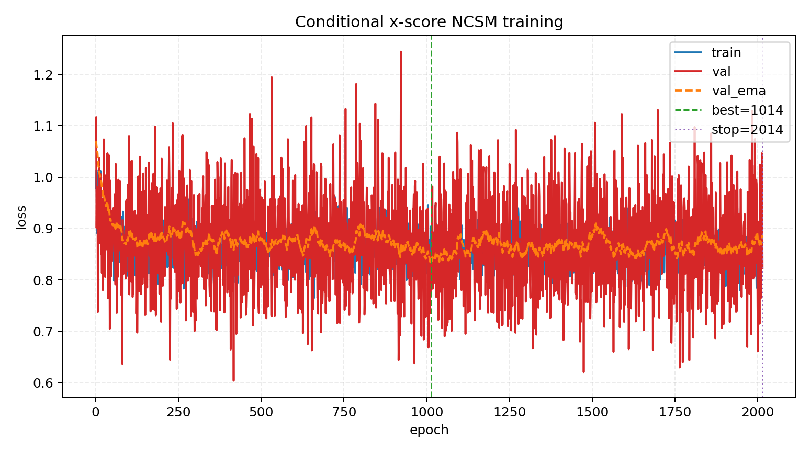
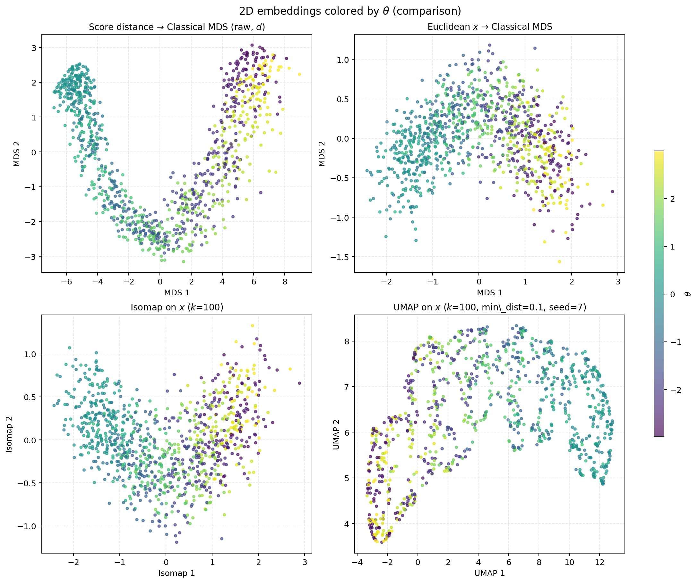
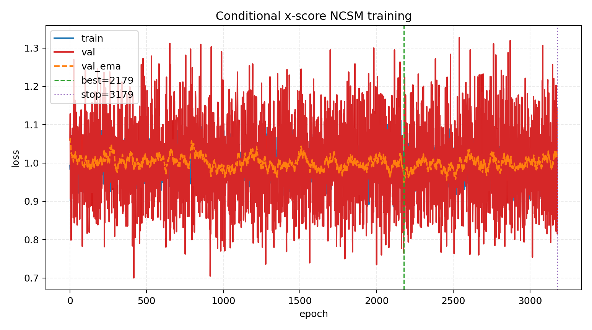
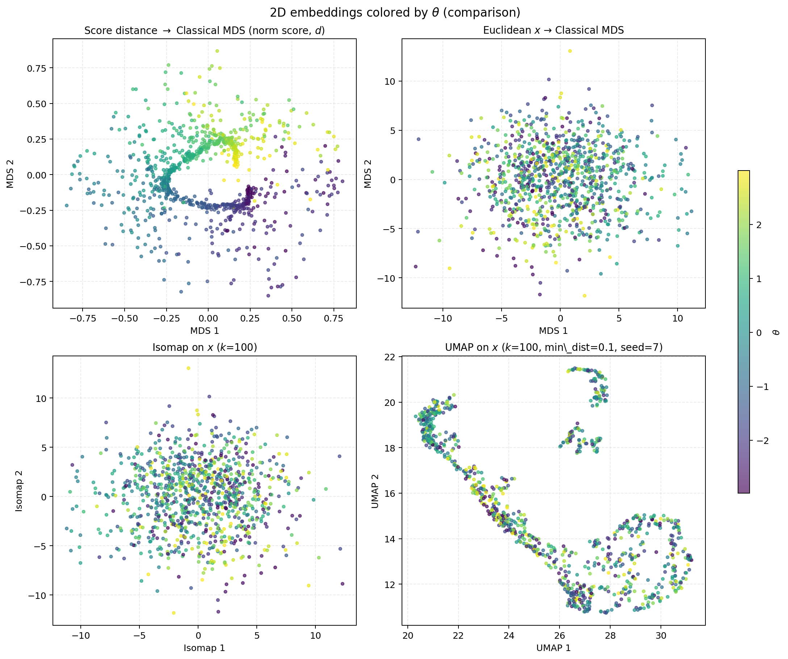
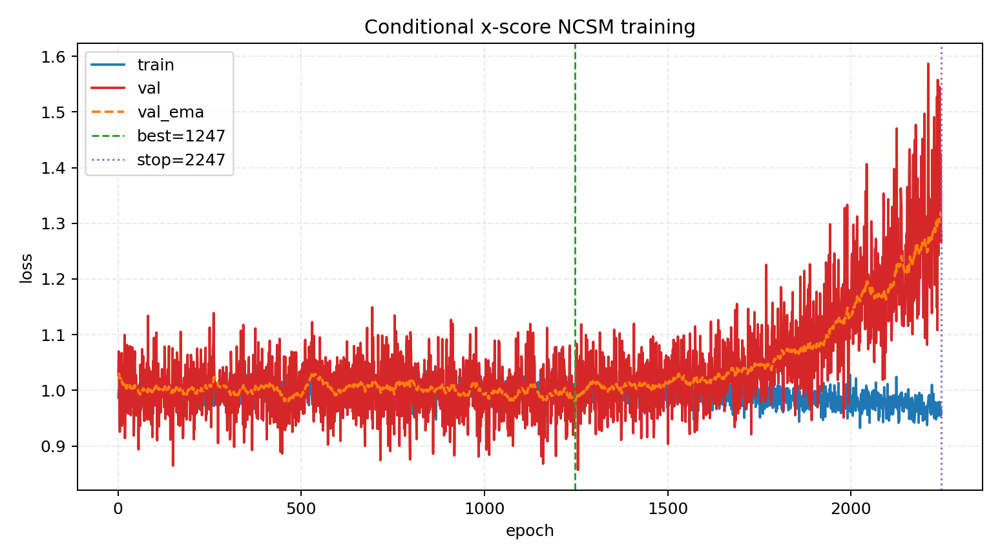
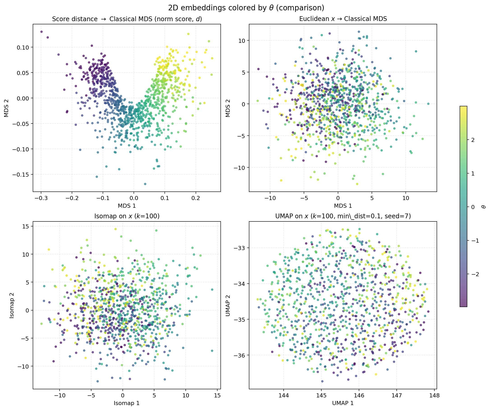

# 2026-04-06 Conditional score distance + classical MDS: three Gaussian–von Mises runs

This note compares three end-to-end runs of the **conditional denoising score matching** pipeline for an **x-score** model $s_\phi(\tilde x \mid \theta, \sigma)$, followed by a **cross-score matrix** $S_{ij} = s_\phi(x_i \mid \theta_j)$, **score-based distances**, and **classical MDS** (plus baselines on raw $x$). We vary **observation noise** (standard vs $10\times$) and **ambient dimension** ($x \in \mathbb{R}^2$ vs $\mathbb{R}^{10}$).

**Runs compared**

| Label | Dataset | $x$ dim | Notes |
|:------|:--------|--------:|:------|
| `vm2d1000` | `data/gaussian_vonmises_2d_n1000.npz` | 2 | baseline noise level |
| `vm2d1000_noise10x` | `data/gaussian_vonmises_2d_n1000_noise10x.npz` | 2 | $10\times$ noise |
| `vm10d1000_noise10x` | `data/gaussian_vonmises_10d_n1000_noise10x.npz` | 10 | $10\times$ noise, higher $d$ |

Driver script: [`bin/visualize_score_distance_mds.py`](../../bin/visualize_score_distance_mds.py). Core definitions: [`fisher/score_distance.py`](../../fisher/score_distance.py), model [`ConditionalXScore`](../../fisher/models.py), trainer [`train_conditional_x_score_model_ncsm_continuous`](../../fisher/trainers.py).

---

## 1. Training objective (conditional NCSM on $x$)

For each batch, sample noise level $\sigma$, sample $\varepsilon \sim \mathcal{N}(0,I)$, and set $\tilde x = x + \sigma \varepsilon$. The model predicts the **score** of the noisy density; the objective is **denoising score matching** (continuous $\sigma$):

$$
\mathcal{L} = \mathbb{E}\left[\left\lVert \sigma\, s_\phi(\tilde x, \theta, \sigma) + \varepsilon \right\rVert^2\right].
$$

Validation uses a held-out split; **early stopping** monitors an **EMA** of validation loss (`patience=1000`, `min_delta=1e-4`, `restore_best=True` by default in the script).

---

## 2. Cross-score matrix and score distances

After training, fix an evaluation noise $\sigma_{\text{eval}}$ (here **minimum** of the geometric ladder, matching `sigma_eval(min)` in each summary). Define the **cross-score tensor**

$$
S_{ij} = s_\phi(x_i, \theta_j, \sigma_{\text{eval}}) \in \mathbb{R}^{d_x},\quad i,j \in \{1,\ldots,N\}.
$$

**Normalize** (optional): each vector $S_{ij}$ is divided by its $\ell_2$ norm (per $(i,j)$) in the “norm score” variants.

**Score distance** (symmetrized; average over $d_x$): with diagonal entries $S_{ii}$,

$$
d_{ij}^2 = \tfrac{1}{2}\left\lVert S_{ii} - S_{ij}\right\rVert^2 + \tfrac{1}{2}\left\lVert S_{ji} - S_{jj}\right\rVert^2
$$

(with per-dimension averaging as implemented in code). Two variants are reported: **$d$** (`use_sqrt=True`) and **$d^2$** (`use_sqrt=False`).

---

## 3. Classical MDS and strain

**Classical MDS** embeds a distance matrix into $\mathbb{R}^2$ via the double-centering construction on $B = -\tfrac{1}{2} J D^{(2)} J$ with $D^{(2)}_{ij} = d_{ij}^2$ and $J = I - \tfrac{1}{N}\mathbf{1}\mathbf{1}^\top$.

**Relative strain** (Frobenius norm ratio, as in [`classical_mds_from_distances`](../../fisher/score_distance.py), matching `strain_relative` in logs):

$$
\text{strain} = \frac{\lVert B - \hat B \rVert_F}{\lVert B \rVert_F + \varepsilon},
$$

where $\hat B$ is the rank-2 Gram matrix from the top two eigencomponents. **Lower is better** (better 2D Euclidean approximation of the inner-product structure).

---

## 4. Run configuration (from summaries)

All runs: $N=1000$, `data_split=full`, `row_batch_size=128`, `cross-score` tensor shape $(N,N,d_x)$, shared `theta_std` and geometric $\sigma$ schedule (`sigma_min`, `sigma_max` proportional to `theta_std` with script defaults), $\sigma_{\text{eval}} \approx 0.017415$.

| Run | `score-epochs` | Best epoch | Stopped epoch | Early stop |
|:----|---------------:|-----------:|--------------:|:-----------|
| `vm2d1000` | 2500 | 1014 | 2014 | yes |
| `vm2d1000_noise10x` | 10000 | 2179 | 3179 | yes |
| `vm10d1000_noise10x` | 10000 | 1247 | 2247 | yes |

**Baselines on $x$** (same script): Euclidean MDS on $x$, Isomap ($k=100$), UMAP ($k=100$, `min_dist=0.1`, seed from NPZ meta when `umap_random_state=-1`; summaries report `seed=7`).

---

## 5. MDS strain comparison (lower is better)

| Run | raw score + $d$ | raw score + $d^2$ | norm score + $d$ | norm score + $d^2$ | Euclidean MDS on $x$ |
|:----|----------------:|------------------:|-----------------:|-------------------:|---------------------:|
| `vm2d1000` | **0.052** | 0.184 | 0.463 | 0.417 | **0.000** |
| `vm2d1000_noise10x` | 0.507 | 0.565 | 0.586 | 0.621 | **0.000** |
| `vm10d1000_noise10x` | 0.295 | 0.580 | **0.170** | 0.352 | 0.835 |

**Positive eigenvalue counts** (for score-MDS variants, typically $\approx 498$–$501$; see each `score_distance_mds_summary.txt`).

**Takeaways**

- **Clean 2D (`vm2d1000`):** In the **strain table**, **raw score + $d$** achieves the lowest score strain ($\approx 0.05$). The **multi-panel figure** always plots **norm score + $d$** in the top-left (see §6). Euclidean MDS on $x$ has **zero** strain in 2D because the data live in a 2D plane; strain is **not** comparable across “score” vs “raw $x$” without caveats—Euclidean MDS is a near-perfect 2D embedding of $x$ itself, while score distances aim to reflect **$\theta$-related** structure via the learned score.
- **2D + $10\times$ noise:** all four score-strain variants **degrade** to $\sim 0.5$–$0.62$, consistent with a harder score fit and noisier $S_{ij}$.
- **10D + $10\times$ noise:** **norm score + $d$** achieves the best score strain among variants ($\approx 0.17$); **Euclidean MDS on $x$** strain is **large** ($\approx 0.83$), reflecting that a 2D linear embedding of high-dimensional Euclidean distances is a poor fit—contrasting with the 2D case where Euclidean MDS strain is trivially small.

---

## 6. Figures (per run)

**Top-left score panel:** In [`visualize_score_distance_mds.py`](../../bin/visualize_score_distance_mds.py), the plotted embedding is always **norm score + $d$** (L2-normalize each $S_{ij}$ along the data dimension, then score distance with `use_sqrt=True`). Strain numbers in §5 still report **all four** variants (raw/norm $\times$ $d$/$d^2$).

### 6.1 `vm2d1000` — `gaussian_vonmises_2d_n1000.npz`

<figure id="fig:vm2d-loss">

<figcaption>Conditional x-score NCSM: train loss, raw validation, EMA-smoothed validation; vertical markers at best epoch 1014 and stop 2014 (patience 1000).</figcaption>
</figure>

<figure id="fig:vm2d-mds">

<figcaption>2D embeddings colored by $\theta$. Top-left: classical MDS on **score distance** (**norm score**, $d$)—smooth color progression along a clear curved manifold. **Euclidean MDS / Isomap / UMAP on $x$** (other panels) show noisier or less global $\theta$ organization than the score-distance MDS panel in this run.</figcaption>
</figure>

### 6.2 `vm2d1000_noise10x` — `gaussian_vonmises_2d_n1000_noise10x.npz`

<figure id="fig:vm2d-n10-loss">

<figcaption>Same training setup with longer epoch cap (10000): best epoch 2179, stopped 3179.</figcaption>
</figure>

<figure id="fig:vm2d-n10-mds">

<figcaption>Top-left score panel: **norm score + $d$** (same as all runs). $\theta$ coloring is less cleanly ordered than the low-noise 2D run, consistent with higher strain values.</figcaption>
</figure>

### 6.3 `vm10d1000_noise10x` — `gaussian_vonmises_10d_n1000_noise10x.npz`

<figure id="fig:vm10d-loss">

<figcaption>Best epoch 1247, stopped 2247 ($d_x=10$).</figcaption>
</figure>

<figure id="fig:vm10d-mds">

<figcaption>Top-left score panel: **norm score + $d$**. Among the four **numerical** strain entries, **norm score + $d$** is best for this run; Euclidean MDS on $x$ remains a high-strain 2D embedding of ambient distances.</figcaption>
</figure>

---

## 7. Reproducibility

From the repo root, using the `geo_diffusion` environment and **CUDA** (per [`AGENTS.md`](../../AGENTS.md)):

```bash
# Run 1: 2D, baseline noise
mamba run -n geo_diffusion python bin/visualize_score_distance_mds.py \
  --dataset-npz data/gaussian_vonmises_2d_n1000.npz \
  --output-dir data/score_distance_mds_vm2d1000 \
  --device cuda \
  --score-epochs 2500

# Run 2: 2D, 10x noise
mamba run -n geo_diffusion python bin/visualize_score_distance_mds.py \
  --dataset-npz data/gaussian_vonmises_2d_n1000_noise10x.npz \
  --output-dir data/score_distance_mds_vm2d1000_noise10x \
  --device cuda \
  --score-epochs 10000

# Run 3: 10D, 10x noise
mamba run -n geo_diffusion python bin/visualize_score_distance_mds.py \
  --dataset-npz data/gaussian_vonmises_10d_n1000_noise10x.npz \
  --output-dir data/score_distance_mds_vm10d1000_noise10x \
  --device cuda \
  --score-epochs 10000
```

Other hyperparameters match script defaults (`--score-batch-size 256`, `--score-lr 1e-3`, `--score-hidden-dim 128`, `--score-depth 3`, geometric $\sigma$ scales, `--score-val-frac 0.1`, early stopping as above). Stochastic seeds follow the dataset NPZ and `umap_random_state` handling in the script.

---

## 8. Output files

| Run | Directory | Key artifacts |
|:----|:----------|:----------------|
| `vm2d1000` | `data/score_distance_mds_vm2d1000/` | `score_distance_mds_summary.txt`, `score_distance_mds_results.npz`, `score_x_loss_vs_epoch.png`, `score_distance_mds_theta_color.png` |
| `vm2d1000_noise10x` | `data/score_distance_mds_vm2d1000_noise10x/` | same pattern |
| `vm10d1000_noise10x` | `data/score_distance_mds_vm10d1000_noise10x/` | same pattern |

**Embedded figure copies** for this note: `journal/notes/figs/2026-04-06-score-distance-mds-comparison/` (prefixes `vm2d1000_*`, `vm2d1000_noise10x_*`, `vm10d1000_noise10x_*`).

---

## 9. Brief interpretation

- **Noise:** Increasing observation noise in 2D **hurts** score-model fit and **inflates** MDS strain for score-based distances, suggesting noisier or less consistent $S_{ij}$.
- **Dimension:** In **10D** with noise, **normalizing** score vectors before distance (`norm score + $d$`) gives the **lowest strain** among the four score variants, and the **Euclidean-on-$x$** baseline strain becomes **large**, highlighting that raw ambient geometry is a weak 2D summary compared to the score-based distance in this setting.
- **Panel choice:** the multi-panel PNG always uses **norm score + $d$** for the top-left (see script); each `score_distance_mds_summary.txt` still lists strains for **raw** and **norm** variants for offline comparison.
