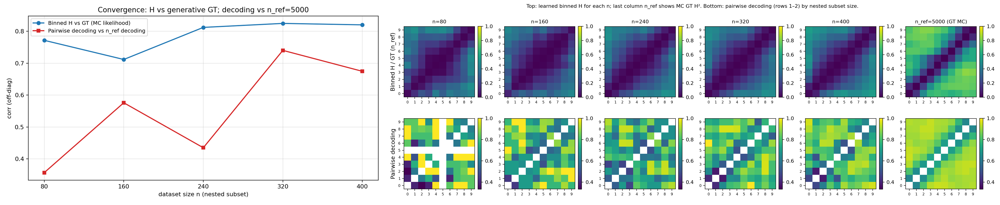
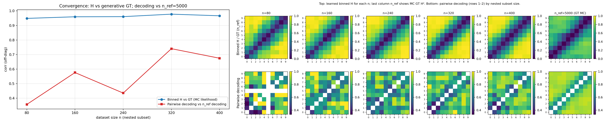
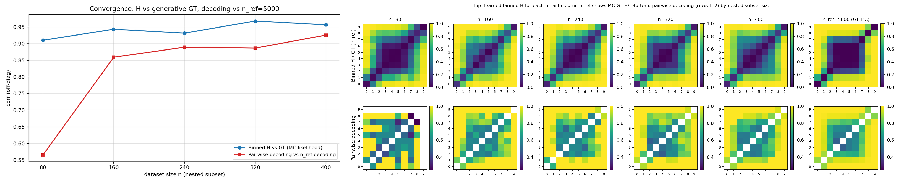
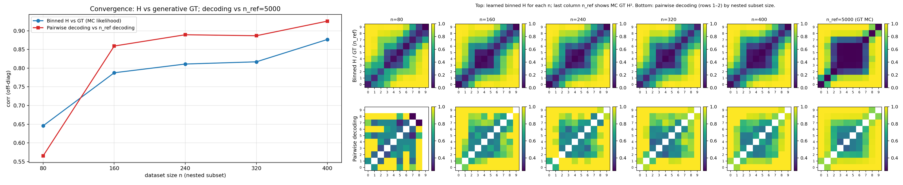

# DSM vs flow ($\theta$-field): H-decoding convergence in 2D vs 50D (`randamp_gaussian_sqrtd`)

## Question / context

We compare **denoising score matching (DSM)** and a **flow-style $\theta$-velocity field** on the same H-decoding convergence protocol: for each nested training size $n$, we measure **off-diagonal correlation** between **theta-binned** entries derived from the learned field and a **Monte Carlo generative ground-truth** squared Hellinger matrix (see `bin/study_h_decoding_convergence.py` and `fisher/hellinger_gt.py`). Higher **corr (binned H vs MC GT)** means the learned geometry aligns better with the generative bin-conditional geometry.

We ask how this comparison behaves in **low dimension (2D)** vs **higher dimension (50D)** on the same family (**random-amplitude Gaussian bumps + $\sqrt{d}$ observation-noise scaling**).

## Method (short)

- **Dataset family:** `randamp_gaussian_sqrtd` (NPZ from `bin/make_dataset.py`).
- **Convergence script:** `bin/study_h_decoding_convergence.py` with `--theta-field-method dsm` or `flow`, `--n-ref 5000`, default `--n-list 80,160,240,320,400`.
- **Left panel of the combined figure:** curves are **corr (off-diagonal)** of **binned learned $H$** vs **MC GT $H^2$** (not DSM/flow for the GT).
- **Matrix panel:** top row uses **learned** binned $H$ for each $n$; the **last column (`n_ref`)** shows **MC GT** on the top row (no $n_\mathrm{ref}$ model run), pairwise decoding on the bottom row.

## Reproduction (commands & scripts)

Environment (see `AGENTS.md`):

```bash
mamba run -n geo_diffusion python bin/study_h_decoding_convergence.py ... --device cuda
```

**50D NPZ** (same file for both methods in this note):

```bash
/data/zeyuan/score-matching-fisher/randamp_sqrtd_figs/xdim50_sigma020/shared_fisher_dataset_randamp_gaussian_sqrtd_n5000.npz
```

**2D NPZ:**

```bash
/data/zeyuan/score-matching-fisher/shared_fisher_dataset_randamp_gaussian_sqrtd_xdim2_n5000.npz
```

**Runs executed for this note (2026-04-11, fresh outputs):**

```bash
cd /grad/zeyuan/score-matching-fisher

# 50D DSM
mamba run -n geo_diffusion python bin/study_h_decoding_convergence.py \
  --dataset-npz /data/zeyuan/score-matching-fisher/randamp_sqrtd_figs/xdim50_sigma020/shared_fisher_dataset_randamp_gaussian_sqrtd_n5000.npz \
  --dataset-family randamp_gaussian_sqrtd \
  --output-dir /data/zeyuan/score-matching-fisher/h_decoding_journal_2026-04-11_randamp_sqrtd_xdim50_dsm \
  --n-ref 5000 --theta-field-method dsm --device cuda

# 50D flow
mamba run -n geo_diffusion python bin/study_h_decoding_convergence.py \
  --dataset-npz /data/zeyuan/score-matching-fisher/randamp_sqrtd_figs/xdim50_sigma020/shared_fisher_dataset_randamp_gaussian_sqrtd_n5000.npz \
  --dataset-family randamp_gaussian_sqrtd \
  --output-dir /data/zeyuan/score-matching-fisher/h_decoding_journal_2026-04-11_randamp_sqrtd_xdim50_flow \
  --n-ref 5000 --theta-field-method flow --device cuda

# 2D DSM
mamba run -n geo_diffusion python bin/study_h_decoding_convergence.py \
  --dataset-npz /data/zeyuan/score-matching-fisher/shared_fisher_dataset_randamp_gaussian_sqrtd_xdim2_n5000.npz \
  --dataset-family randamp_gaussian_sqrtd \
  --output-dir /data/zeyuan/score-matching-fisher/h_decoding_journal_2026-04-11_randamp_sqrtd_xdim2_dsm \
  --n-ref 5000 --theta-field-method dsm --device cuda

# 2D flow
mamba run -n geo_diffusion python bin/study_h_decoding_convergence.py \
  --dataset-npz /data/zeyuan/score-matching-fisher/shared_fisher_dataset_randamp_gaussian_sqrtd_xdim2_n5000.npz \
  --dataset-family randamp_gaussian_sqrtd \
  --output-dir /data/zeyuan/score-matching-fisher/h_decoding_journal_2026-04-11_randamp_sqrtd_xdim2_flow \
  --n-ref 5000 --theta-field-method flow --device cuda
```

Core implementation paths: `bin/study_h_decoding_convergence.py`, `fisher/shared_fisher_est.py` ($\theta$-field method dispatch), `fisher/hellinger_gt.py` (MC GT).

## Results

Off-diagonal correlation **binned H vs MC GT** (`corr_h_binned_vs_gt_mc`), by nested subset size $n$:

| Setting | $n=80$ | $n=160$ | $n=240$ | $n=320$ | $n=400$ |
|--------|--------|---------|---------|---------|---------|
| 50D DSM | 0.7716 | 0.7116 | 0.8122 | 0.8247 | **0.8201** |
| 50D flow | 0.9484 | 0.9595 | 0.9604 | 0.9775 | **0.9664** |
| 2D DSM | 0.9101 | 0.9433 | 0.9314 | 0.9680 | **0.9566** |
| 2D flow | 0.6458 | 0.7875 | 0.8109 | 0.8168 | **0.8766** |

**Pairwise decoding vs $n_\mathrm{ref}$ decoding** (red curve) is **identical** across DSM vs flow at each $n$ for a given dimension (same data and binning); the separation is in the **blue** H-vs-GT curve.

**Observation:** On this protocol, **DSM degrades strongly in 50D** relative to **flow**, while **flow is lower than DSM in 2D** at comparable $n$.

**Interpretation (tentative):** In high dimension, score-based estimation of the $\theta$-derivative pipeline appears harder for this toy; the flow parameterization can track the MC GT geometry better here. In 2D, the flow path is weaker—consistent with the implementation being a **pragmatic replacement** of a score-like object by a **velocity field**, which is not guaranteed to be the “right” object for the same Hellinger construction without a more careful velocity–score relationship.

## Figures (combined: line plot + matrix panel)

Embedded copies of the **fresh** `h_decoding_convergence_combined.png` from each run:









At $n=400$, the **blue** curve is much higher for flow than DSM in **50D**, and much higher for DSM than flow in **2D**, matching the table.

## Artifacts (absolute paths)

**Run directories (full outputs: NPZ, CSV, PNG, SVG, summary):**

- `/data/zeyuan/score-matching-fisher/h_decoding_journal_2026-04-11_randamp_sqrtd_xdim50_dsm/`
- `/data/zeyuan/score-matching-fisher/h_decoding_journal_2026-04-11_randamp_sqrtd_xdim50_flow/`
- `/data/zeyuan/score-matching-fisher/h_decoding_journal_2026-04-11_randamp_sqrtd_xdim2_dsm/`
- `/data/zeyuan/score-matching-fisher/h_decoding_journal_2026-04-11_randamp_sqrtd_xdim2_flow/`

**Copied figures for this note:**

- `/grad/zeyuan/score-matching-fisher/journal/notes/figs/2026-04-11-dsm-vs-flow-flowdim/h_decoding_convergence_combined_xdim50_dsm.png`
- `/grad/zeyuan/score-matching-fisher/journal/notes/figs/2026-04-11-dsm-vs-flow-flowdim/h_decoding_convergence_combined_xdim50_flow.png`
- `/grad/zeyuan/score-matching-fisher/journal/notes/figs/2026-04-11-dsm-vs-flow-flowdim/h_decoding_convergence_combined_xdim2_dsm.png`
- `/grad/zeyuan/score-matching-fisher/journal/notes/figs/2026-04-11-dsm-vs-flow-flowdim/h_decoding_convergence_combined_xdim2_flow.png`

## Takeaway & next steps

1. **High dimension (50D):** DSM scores **much lower** agreement with MC GT Hellinger bin geometry than flow on this run, suggesting **score-matching estimation** (architecture, optimization, or scaling with $d$) is a bottleneck for this pipeline.
2. **Low dimension (2D):** Flow **underperforms** DSM on the same metric—so the current flow head is **not** universally better; it may still have **headroom** if we stop treating it as a drop-in substitute for the score.
3. **Next steps (either direction):**
   - **Improve DSM:** better posteriors/priors, training stability, or H-matrix estimation steps for high-$d$ conditional models.
   - **Correct the flow side:** replace the ad hoc “velocity instead of score” usage with a **consistent map** from learned flow quantities to the **$\theta$-derivative objects** actually used in the Hellinger / H-matrix pipeline (or derive an H matrix from a principled flow–density relationship).

These conclusions are **specific to this toy family, metric, and training budget**; they are meant to guide implementation priorities, not a general claim about DSM vs flow everywhere.
