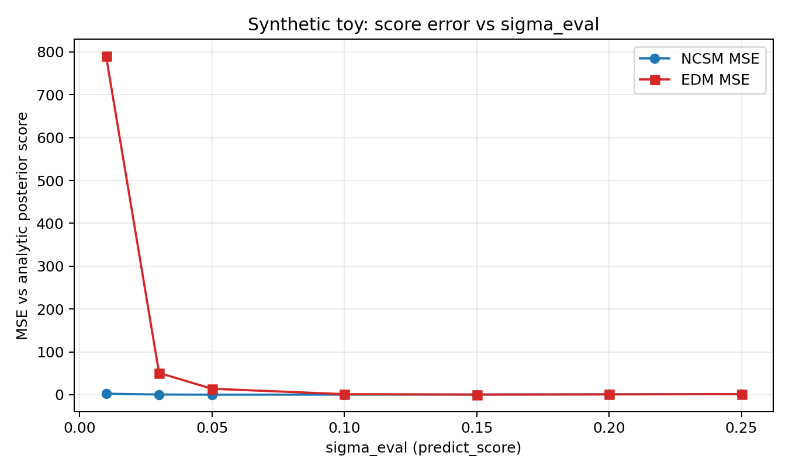
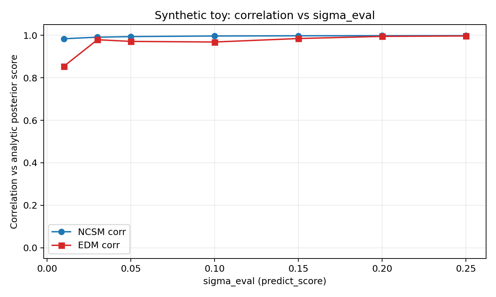
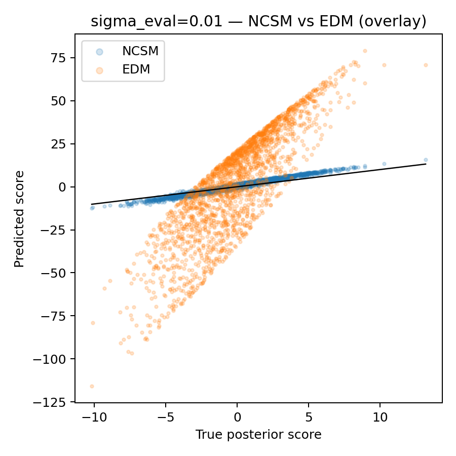
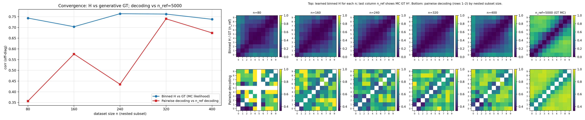
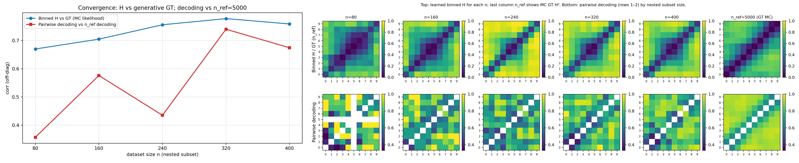

# 2026-04-11 EDM vs NCSM baseline: synthetic score fit and 50D H-decoding

## Question / context

We added an **EDM** training path (`--score-train-objective edm`) alongside the usual **noise-conditional score matching (NCSM)** target (`--score-train-objective ncsm`, default). Both still use a **denoising score network** (`--theta-field-method dsm`); the difference is the regression target and noise sampling (see `fisher/trainers.py`, `fisher/shared_fisher_est.py`).

Colloquially people sometimes say “DSM” or “DCSM” for the **NCSM score-target** baseline; here we call that baseline **NCSM** to match the CLI flag.

**Question:** Does switching to EDM improve practical quality of the learned field, relative to NCSM, on (i) direct score prediction against an analytic benchmark and (ii) the **H-decoding convergence** study?

**Short answer:** On the **synthetic conditional theta-score** benchmark, EDM is **much worse** than NCSM at comparable evaluation noise levels (especially small $\sigma_{\mathrm{eval}}$). On **50D `randamp_gaussian_sqrtd` H-decoding** with $\sigma_{\min} = 0.10 \times \mathrm{std}(\theta)$, EDM **does not show a consistent win**; it is **clearly weaker at small training budgets** ($n=80$), while at $n=400$ headline correlations can look similar. Overall, EDM does **not** look like a drop-in improvement over the NCSM baseline in these checks.

## NCSM vs EDM (definitions in this codebase)

Both objectives train on noisy parameters $\tilde{\theta} = \theta + \sigma \varepsilon$ with $\varepsilon \sim \mathcal{N}(0,I)$ and the same conditioning on $x$ (posterior path) or nothing extra (prior path). The **network role and loss** differ.

### NCSM (`--score-train-objective ncsm`)

- The model is a **score network** $s_\phi(\tilde{\theta}, x, \sigma)$ (same interface as the DSM backbone in `ConditionalScore1D` / FiLM).
- **Training noise:** $\sigma$ is drawn **continuously** between $\sigma_{\min}$ and $\sigma_{\max}$ (from `--score-sigma-*` and `--score-sigma-scale-mode`, e.g. fractions of $\mathrm{std}(\theta)$ on the score-fit split), typically **uniform in $\log\sigma$** (`train_score_model_ncsm_continuous` in `fisher/trainers.py`).
- **Loss (noise-conditional score matching):** the residual is chosen so that, at the optimum, $\sigma\, s_\phi + \varepsilon \to 0$, i.e. the model matches the **score** implied by Gaussian denoising:
  $$
  \text{target residual} \propto \sigma\, s_\phi(\tilde{\theta}, x, \sigma) + \varepsilon.
  $$
  In code this is `residual = sigma * pred + eps` with Huber/MSE on that residual (`_score_matching_loss`).
- **Interpretation:** you are directly regressing toward the **$\theta$-score** (up to the DSM reparameterization).

### EDM (`--score-train-objective edm`)

- The outer class is **`ConditionalThetaEDM`** (`fisher/models.py`): the same FiLM/MLP **backbone** is wrapped with **EDM preconditioning** ($c_{\mathrm{in}}, c_{\mathrm{skip}}, c_{\mathrm{out}}, c_{\mathrm{noise}}$) so the forward map produces a **denoised** $\hat{\theta} = D_\phi(\tilde{\theta}, x, \sigma)$, not a raw score.
- **Training noise:** $\sigma$ is drawn from a **log-normal** in log-space (`sample_edm_sigmas` with `--edm-p-mean`, `--edm-p-std`), **independently** of the $\sigma_{\min}/\sigma_{\max}$ band used for NCSM training (those CLI knobs still set evaluation and other paths, but EDM optimization uses the EDM sampler).
- **Loss (denoising / EDM-style):** match $\hat{\theta}$ to the clean $\theta$ with a **variance-dependent weight** involving `--edm-sigma-data` (`_edm_theta_loss`: weighted residual $\sqrt{w(\sigma)}(\hat{\theta}-\theta)$ with $w$ built from $\sigma$ and $\sigma_{\mathrm{data}}$).
- **Score at inference:** for H-matrix and benchmarks, the code converts the denoiser to a score with the same Gaussian identity as elsewhere:
  $$
  s(\tilde{\theta}, x, \sigma) \approx \frac{D_\phi(\tilde{\theta}, x, \sigma) - \tilde{\theta}}{\sigma^2}
  $$
  (`ConditionalThetaEDM.predict_score`).

### Summary table

| | **NCSM** | **EDM** |
|---|----------|---------|
| Network output | Score $s_\phi$ | Denoised $\theta$, $D_\phi$ (preconditioned backbone) |
| Train $\sigma$ sampling | Uniform in $\log\sigma$ on $[\sigma_{\min},\sigma_{\max}]$ | Log-normal (`edm_p_mean`, `edm_p_std`) |
| Training target | $\sigma s + \varepsilon \to 0$ | $\hat{\theta} \to \theta$ with EDM weights |
| Key extra hyperparameter | $\sigma$ range (e.g. vs $\mathrm{std}(\theta)$) | $\sigma_{\mathrm{data}}$ (and log-normal params) |

So **NCSM** fits the **score field** end-to-end under the DSM parameterization; **EDM** fits a **denoiser** with Karras-style preconditioning, then **derives** the score from $D$ when needed. They are **not** the same optimization problem; neither guarantees the other will be best at a fixed `sigma_eval` without tuning.

## Method (high level)

- **Synthetic benchmark:** Train NCSM vs EDM on the same 2D Gaussian likelihood toy, then compare predicted score vs analytic posterior score at several `sigma_eval` values. Full protocol is in [2026-04-11-edm-vs-ncsm-synthetic-theta-score.md](2026-04-11-edm-vs-ncsm-synthetic-theta-score.md); extended sweep artifacts live under `journal/notes/figs/2026-04-11-edm-vs-ncsm-synthetic-sigma-sweep-full/`.
- **H-decoding convergence:** `bin/study_h_decoding_convergence.py` trains nested posterior/prior models for each $n \in \{80,160,240,320,400\}$ and reports correlation of **binned learned $H$** vs **MC ground-truth** (`corr_h_binned_vs_gt_mc`) and decoding-matrix agreement vs the $n_{\mathrm{ref}}$ reference (`corr_clf_vs_ref`). Same dataset NPZ and $n_{\mathrm{ref}}=5000$; only `score-train-objective` differs.

## Reproduction (commands and scripts)

Environment (see `AGENTS.md`):

```bash
mamba run -n geo_diffusion python … --device cuda
```

### 50D H-decoding — NCSM baseline (default objective)

Dataset: `randamp_gaussian_sqrtd`, $d=50$, NPZ with 5000 pooled samples.

```bash
cd /grad/zeyuan/score-matching-fisher
mamba run -n geo_diffusion python bin/study_h_decoding_convergence.py \
  --dataset-npz /data/zeyuan/score-matching-fisher/randamp_sqrtd_figs/xdim50_sigma020/shared_fisher_dataset_randamp_gaussian_sqrtd_n5000.npz \
  --dataset-family randamp_gaussian_sqrtd \
  --output-dir /data/zeyuan/score-matching-fisher/h_decoding_conv_randamp_sqrtd_xdim50_dsm_sigma_min10pct_20260411_151911 \
  --n-ref 5000 \
  --theta-field-method dsm \
  --score-train-objective ncsm \
  --score-sigma-min-alpha 0.10 \
  --device cuda
```

### 50D H-decoding — EDM objective

Same flags except:

```bash
  --score-train-objective edm \
  --output-dir /data/zeyuan/score-matching-fisher/h_decoding_conv_randamp_sqrtd_xdim50_edm_sigma_min10pct_20260411_152331
```

(EDM hyperparameters `edm_p_mean`, `edm_p_std`, `edm_sigma_data` left at CLI defaults.)

### Synthetic sigma sweep

Script: `bin/compare_edm_ncsm_synthetic_sigma_eval.py` (repo root on `PYTHONPATH`). Summary JSON:

`/grad/zeyuan/score-matching-fisher/journal/notes/figs/2026-04-11-edm-vs-ncsm-synthetic-sigma-sweep-full/edm_vs_ncsm_sigma_sweep_summary.json`

## Results

### 1. Synthetic score prediction (strong signal: EDM worse)

At $\sigma_{\mathrm{eval}}=0.01$, NCSM achieves correlation $\approx 0.984$ vs EDM $\approx 0.854$, with MSE orders of magnitude larger for EDM (`edm_vs_ncsm_sigma_sweep_summary.json`). The gap persists across most of the sweep: MSE and correlation curves favor NCSM except in a narrow mid-$\sigma$ band where EDM can be competitive on MSE.



*Interpretation:* EDM’s predicted score deviates strongly from the analytic score at small evaluation noise, where NCSM remains accurate—so **EDM is a poor substitute** for this “Layer A” sanity check.





*Interpretation:* At $\sigma_{\mathrm{eval}}=0.01$, the combined scatter shows tighter alignment for NCSM than for EDM (see also per-method panels in the same `sigma-sweep-full` folder).

### 2. 50D H-decoding (mixed headline; EDM weaker at small $n$)

Correlations from saved CSVs:

| $n$ | NCSM `corr_h` | EDM `corr_h` | NCSM `corr_clf` | EDM `corr_clf` |
|-----|----------------|--------------|-----------------|----------------|
| 80  | 0.744          | **0.670**    | 0.357           | 0.357          |
| 160 | 0.703          | 0.705        | 0.576           | 0.576          |
| 240 | 0.764          | 0.756        | 0.435           | 0.435          |
| 320 | 0.762          | **0.778**    | 0.740           | 0.740          |
| 400 | **0.738**      | 0.759        | 0.675           | 0.675          |

**Observations:**

- **`corr_clf` is identical** across objectives for every $n$ in this run (same binning and reference split), so it does **not** differentiate NCSM vs EDM here.
- **EDM is worse at $n=80$** on `corr_h` (0.67 vs 0.74), which is the regime that stresses sample efficiency.
- At **$n=400$**, EDM reports a slightly **higher** `corr_h` than NCSM (0.759 vs 0.738)—a small difference and **not** aligned with the synthetic benchmark, so we should treat it as **noisy / not a reliable “win”** without repeats.

**Conclusion (H-decoding):** EDM does **not** clearly outperform NCSM; it is **worse where small-$n$ behavior matters**, and the synthetic layer already shows **large score error** for EDM.

### Figures: combined H-decoding panels (same layout, different objective)

NCSM (`score-train-objective ncsm`):



EDM (`score-train-objective edm`):



*Interpretation:* The two panels are directly comparable (same $\sigma$ scaling and $n$-list); visually they are in the same ballpark, which matches the **mixed** numeric story above—unlike the synthetic benchmark, where EDM is clearly off.

## Artifacts (absolute paths)

**H-decoding — NCSM run**

- Directory: `/data/zeyuan/score-matching-fisher/h_decoding_conv_randamp_sqrtd_xdim50_dsm_sigma_min10pct_20260411_151911`
- CSV: `…/h_decoding_convergence_results.csv`
- Combined figure: `…/h_decoding_convergence_combined.png`

**H-decoding — EDM run**

- Directory: `/data/zeyuan/score-matching-fisher/h_decoding_conv_randamp_sqrtd_xdim50_edm_sigma_min10pct_20260411_152331`
- CSV: `…/h_decoding_convergence_results.csv`
- Combined figure: `…/h_decoding_convergence_combined.png`

**Synthetic sweep (metrics + figures)**

- Summary: `/grad/zeyuan/score-matching-fisher/journal/notes/figs/2026-04-11-edm-vs-ncsm-synthetic-sigma-sweep-full/edm_vs_ncsm_sigma_sweep_summary.json`

## Takeaway

- **Synthetic theta-score:** EDM is **substantially worse** than NCSM on MSE/correlation across most $\sigma_{\mathrm{eval}}$ values we tried—this is the cleanest evidence that **EDM is not “as good”** as the NCSM baseline for learning the conditional score here.
- **50D H-decoding:** EDM is **not uniformly better**; it is **worse at $n=80$** on `corr_h`, and **does not improve** `corr_clf` in this run. A slight **higher** `corr_h` at $n=400$ for EDM should be read cautiously given the synthetic results and lack of seed sweeps.

Overall, **EDM does not fix the quality issues** we care about in these two diagnostics; for the score-matching Fisher pipeline, **NCSM remains the safer default** until EDM is retuned or re-scoped to settings where its preconditioning actually helps.
