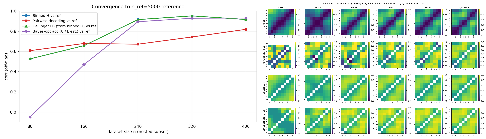
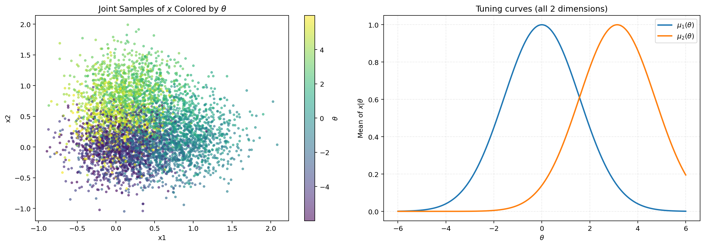
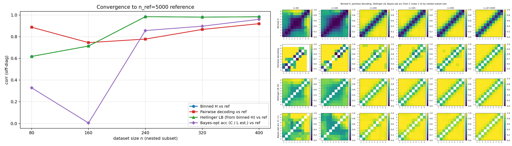

# 2026-04-11 H-decoding convergence (Experiment 1): Gaussian tuning, $x \in \mathbb{R}^2$ and $\mathbb{R}^{10}$

## Introduction

This note is **Experiment 1** in a planned **series** of runs. The overarching goal is to **inspect how the pipeline behaves as the observation dimension grows** (score-based H-matrix, binned metrics, and decoding-style summaries vs a large-$n$ reference). To make higher-dimensional synthetic data easier to control and interpret, we adopt a **simple Gaussian-bump tuning curve** for the conditional mean $\mu(\theta)$ instead of more structured curves used elsewhere in the repo.

**Experiment 1a** is the **2D** baseline: observation dimension **`--x-dim 2`**, with the shared Gaussian observation model and heteroscedastic diagonal noise described in `fisher/data.py` (`ToyConditionalGaussianDataset`). **Experiment 1b** (appended below) uses the **same** generator and tuning family at **`--x-dim 10`**, with $N$ large enough for the default reference size $n_{\mathrm{ref}}=5000$.

---

## Method (high level)

- **Dataset family:** `gaussian` (`bin/make_dataset.py`), i.e. conditional Gaussian $x \mid \theta$ with mean $\mu(\theta)$ from the selected tuning curve and **diagonal** variances that depend on $|\mu_j(\theta)|$ (“activity coupling”).
- **Tuning curve:** `gaussian_raw`, with separate `--gauss-mu-amp`, `--gauss-kappa`, `--gauss-omega` (not shared with Von Mises flags); defaults use **`gauss_kappa = 0.2`** as the precision in $\mu_j(\theta) = A \exp(-\kappa(\omega\theta - \phi_j)^2)$.
- **Convergence study:** `bin/study_h_decoding_convergence.py` trains posterior (FiLM) and prior (MLP) score models on nested subsets of a permuted pool, builds binned H / classifier / Hellinger / Bayes-from-$C$ metrics vs a **reference** run, and plots off-diagonal correlation to the reference as $n$ increases.

---

## Reproduction (commands and scripts)

**Environment:** `mamba run -n geo_diffusion` (see `AGENTS.md`). **Device:** CUDA for the convergence study.

### 1. Generate the 2D dataset ($N=5000$)

`n_ref = 5000` requires at least 5000 joint samples in the NPZ.

```bash
cd /grad/zeyuan/score-matching-fisher

mamba run -n geo_diffusion python bin/make_dataset.py \
  --dataset-family gaussian \
  --tuning-curve-family gaussian_raw \
  --n-total 5000 \
  --output-npz data/shared_fisher_dataset_gaussian_tuning_n5000.npz
```

Other flags (noise baselines, `cov_theta_*`, seed, etc.) were **defaults** from `fisher/cli_shared_fisher.py`.

### 2. Run H-decoding convergence with $n_{\mathrm{ref}} = 5000$

Default nested sizes: $n \in \{80,160,240,320,400\}$ (each $\leq n_{\mathrm{ref}}$).

```bash
mamba run -n geo_diffusion python bin/study_h_decoding_convergence.py \
  --dataset-npz /grad/zeyuan/score-matching-fisher/data/shared_fisher_dataset_gaussian_tuning_n5000.npz \
  --n-ref 5000 \
  --output-dir /grad/zeyuan/score-matching-fisher/data/h_decoding_conv_gauss_k02_n5000 \
  --device cuda
```

**Scripts:** `bin/make_dataset.py`, `bin/study_h_decoding_convergence.py`; core logic in `fisher/data.py`, `fisher/shared_fisher_est.py`.

---

## Results (Experiment 1a, 2D)

Off-diagonal Pearson correlation to the $n_{\mathrm{ref}}=5000$ reference (from `h_decoding_convergence_results.csv`):

| $n$ | corr binned H | corr clf | corr Hellinger LB | corr Bayes-$C$ |
|-----|----------------|----------|-------------------|------------------|
| 80  | 0.527          | 0.608    | 0.527             | $-0.049$         |
| 160 | 0.658          | 0.679    | 0.658             | 0.470            |
| 240 | 0.915          | 0.672    | 0.915             | 0.894            |
| 320 | 0.952          | 0.743    | 0.952             | 0.929            |
| 400 | 0.916          | 0.819    | 0.916             | 0.931            |

The smallest-$n$ rows are noisier (especially Bayes-from-$C$ at $n=80$); by $n \geq 240$, binned-H and Hellinger tracks align tightly with the reference, and Bayes-$C$ correlation is high.

---

## Figures (Experiment 1a)

**Convergence study (line plot + matrix panel):** correlation vs subset size $n$ for four metrics, with reference column on the right.



**Dataset check:** joint $(\theta,x)$ scatter and empirical tuning vs $\theta$ from the same generator (figure copied from the run that produced the NPZ).



---

## Artifacts — Experiment 1a (absolute paths)

| Kind | Path |
|------|------|
| Dataset NPZ | `/grad/zeyuan/score-matching-fisher/data/shared_fisher_dataset_gaussian_tuning_n5000.npz` |
| Convergence output dir | `/grad/zeyuan/score-matching-fisher/data/h_decoding_conv_gauss_k02_n5000/` |
| Combined figure (copy for journal) | `/grad/zeyuan/score-matching-fisher/journal/notes/figs/h-decoding-gaussian-exp1/h_decoding_convergence_combined.png` |
| Results table | `/grad/zeyuan/score-matching-fisher/data/h_decoding_conv_gauss_k02_n5000/h_decoding_convergence_results.csv` |
| Full log | `/grad/zeyuan/score-matching-fisher/data/h_decoding_conv_gauss_k02_n5000/run.log` |

---

## Takeaway

For **Experiment 1a (2D, Gaussian tuning)**, the binned-H and Hellinger lower-bound correlations to the large-$n$ reference exceed **0.9** by $n \geq 240$ under this configuration; pairwise classifier correlation increases more slowly but reaches **~0.82** at $n=400$. This establishes a **2D baseline** for the dimension-scaling series. **Experiment 1b** (10D, below) shows similar strong agreement for binned H and the Hellinger track by $n \geq 240$; see that section for numbers and artifacts.

---

## Experiment 1b: $x \in \mathbb{R}^{10}$, Gaussian raw tuning ($\kappa=0.2$)

### Context

We keep **`gaussian_raw`** tuning and default hyperparameters from `fisher/cli_shared_fisher.py`, changing only **`--x-dim 10`**. The convergence study still uses **`--n-ref 5000`** and nested $n \in \{80,160,240,320,400\}$, so the shared dataset must have **at least 5000** joint samples (`make_dataset.py` defaults to `--n-total 3000`, which is insufficient unless `--n-ref` is lowered).

### Reproduction

**1. Dataset ($N=5000$, $d=10$)**

```bash
cd /grad/zeyuan/score-matching-fisher

mamba run -n geo_diffusion python bin/make_dataset.py \
  --dataset-family gaussian \
  --tuning-curve-family gaussian_raw \
  --x-dim 10 \
  --n-total 5000 \
  --output-npz data/shared_fisher_dataset_gaussian_tuning_xdim10_n5000.npz
```

**2. H-decoding convergence study**

```bash
mamba run -n geo_diffusion python bin/study_h_decoding_convergence.py \
  --dataset-npz /grad/zeyuan/score-matching-fisher/data/shared_fisher_dataset_gaussian_tuning_xdim10_n5000.npz \
  --n-ref 5000 \
  --output-dir /grad/zeyuan/score-matching-fisher/data/h_decoding_conv_gauss_xdim10_k02_n5000 \
  --device cuda
```

### Results (10D)

Off-diagonal Pearson correlation to the $n_{\mathrm{ref}}=5000$ reference (`h_decoding_convergence_results.csv`):

| $n$ | corr binned H | corr clf | corr Hellinger LB | corr Bayes-$C$ |
|-----|----------------|----------|-------------------|----------------|
| 80  | 0.619          | 0.888    | 0.619             | 0.329          |
| 160 | 0.714          | 0.746    | 0.714             | 0.005          |
| 240 | 0.985          | 0.778    | 0.985             | 0.857          |
| 320 | 0.981          | 0.867    | 0.981             | 0.897          |
| 400 | 0.984          | 0.920    | 0.984             | 0.961          |

By $n \geq 240$, **binned H** and **Hellinger LB** correlations are already **$\approx 0.98$–0.99$**; **pairwise decoding** reaches **$\approx 0.92$** at $n=400$. The Bayes-from-$C$ row is noisier at small $n$ (similar to the 2D run) but is **high by $n=320$–400**.

### Figure (10D)



The layout matches Experiment 1a: correlation vs $n$ (left) and four-row matrix panel including reference column (right).

### Artifacts — Experiment 1b (absolute paths)

| Kind | Path |
|------|------|
| Dataset NPZ | `/grad/zeyuan/score-matching-fisher/data/shared_fisher_dataset_gaussian_tuning_xdim10_n5000.npz` |
| Convergence output dir | `/grad/zeyuan/score-matching-fisher/data/h_decoding_conv_gauss_xdim10_k02_n5000/` |
| Combined figure (journal copy) | `/grad/zeyuan/score-matching-fisher/journal/notes/figs/h-decoding-gaussian-exp1/h_decoding_convergence_combined_xdim10.png` |
| Results CSV | `/grad/zeyuan/score-matching-fisher/data/h_decoding_conv_gauss_xdim10_k02_n5000/h_decoding_convergence_results.csv` |
| Run log | `/grad/zeyuan/score-matching-fisher/data/h_decoding_conv_gauss_xdim10_k02_n5000/run.log` |

Joint scatter / tuning diagnostic from `make_dataset.py` is written under `DATAROOT` (see `global_setting.py`); with default `DATAROOT`, the latest run’s plots include e.g. `/nfsdata2/zeyuan/score-matching-fisher/joint_scatter_and_tuning_curve.png` (also visible via the repo `data/` symlink when present).

### Takeaway — 10D

Under the **same** Gaussian-tuning and convergence-study configuration as 2D, the pipeline **still tracks the large-$n$ reference well** in observation dimension **10**: binned-H and Hellinger correlations are near **1** for $n \geq 240$, and decoding / Bayes-$C$ metrics are strong at the largest nested sizes. This supports treating **10D** as a non-degenerate check that the method is not confined to $d=2$ for this synthetic family.
