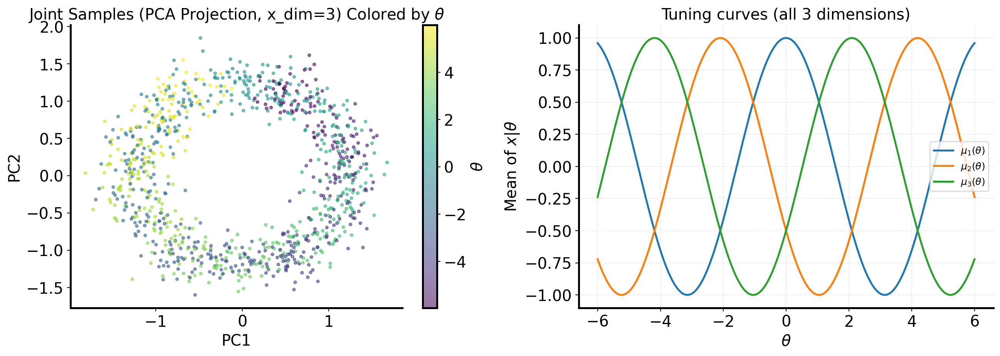
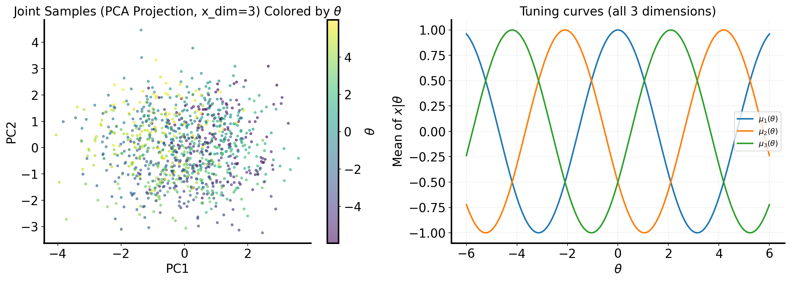
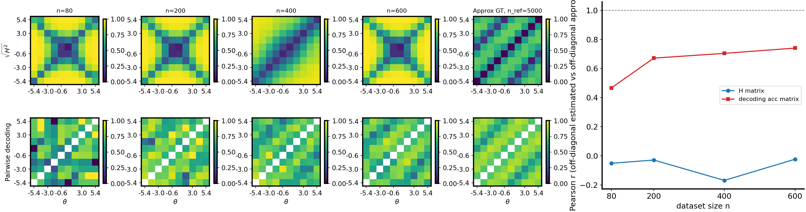

# Cosine Gaussian observation noise: base vs $\sqrt{d}$ scaling (`cosine_gaussian` vs `cosine_gaussian_sqrtd`)

## Question / context

The repo’s conditional toy datasets `cosine_gaussian` and `cosine_gaussian_sqrtd` share **cosine tuning means** $\mu(\theta)$ but differ in how **diagonal observation noise** scales with dimension $d = \texttt{x\_dim}$. This note records the **exact variance formulas**, the **numeric recipe values** in `fisher/dataset_family_recipes.py`, and a **reproducible** `make_dataset.py` run with the standard joint scatter + tuning-curve figure.

**Observation vs conclusion:** the $\sqrt{d}$ construction is an implementation choice (documented in `ToyConditionalGaussianSqrtdDataset`) to avoid extremely high SNR in large $d$; this note does not argue optimality, only definitions.

## Method

### Latent and mean

$\theta \sim \mathrm{Unif}[\theta_{\mathrm{low}}, \theta_{\mathrm{high}}]$ (CLI defaults $[-6,6]$). For `tuning_curve_family="cosine"` (fixed in the Gaussian-branch recipe),

$$
\mu_j(\theta) = \cos(\theta + \phi_j), \qquad \phi_j = \frac{2\pi j}{d}, \quad j = 0,\ldots,d-1,
$$

with unit amplitude and frequency in code (`fisher/data.py`, `ToyConditionalGaussianDataset`).

### Baseline scales $\sigma_{\mathrm{base},j}$

Across coordinates, $\sigma_{\mathrm{base},j}$ linearly interpolates from `sigma_x1` to `sigma_x2` in $j$. When the recipe sets `sigma_x1 == sigma_x2`, every dimension shares the same $\sigma_{\mathrm{base}}$.

### Activity-coupled diagonal variance (base class)

Let $\alpha = \tfrac{1}{2}(\texttt{cov\_theta\_amp1} + \texttt{cov\_theta\_amp2})$. The **base** per-coordinate variance is

$$
\mathrm{Var}_j^{\mathrm{(base)}}(\theta)
= \sigma_{\mathrm{base},j}^2 \bigl(1 + \alpha\,|\mu_j(\theta)|\bigr) + 10^{-8}.
$$

Sampling is diagonal Gaussian: $x \mid \theta \sim \mathcal{N}(\mu(\theta), \mathrm{diag}_j \mathrm{Var}_j)$.

The meta field `rho` and the oscillatory `cov_theta_freq*`, `cov_theta_phase*` entries appear in NPZ metadata but **do not** enter this diagonal variance (they are not used in `_variance_diag_from_mu`).

### $\sqrt{d}$ family (`cosine_gaussian_sqrtd`)

`ToyConditionalGaussianSqrtdDataset` multiplies the **entire** diagonal variance vector by $d$:

$$
\mathrm{Var}_j^{\mathrm{(sqrtd)}}(\theta) = d \cdot \mathrm{Var}_j^{\mathrm{(base)}}(\theta).
$$

Thus marginal standard deviations scale **approximately** like $\sqrt{d}$ times the base-construction std (up to the tiny $10^{-8}$ term).

### Fixed recipe values (`family_recipe_dict`)

From `fisher/dataset_family_recipes.py` (Gaussian-like base `_base_gaussian_like()`):

| symbol / field | value |
|----------------|-------|
| `cov_theta_amp1` | 0.35 |
| `cov_theta_amp2` | 0.30 |
| $\alpha = \frac{1}{2}(\texttt{cov\_theta\_amp1}+\texttt{cov\_theta\_amp2})$ | **0.325** |
| `cosine_gaussian` | `sigma_x1` = `sigma_x2` = **0.50** |
| `cosine_gaussian_sqrtd` | `sigma_x1` = `sigma_x2` = **0.50** |

For **`cosine_gaussian_sqrtd`** with $d=3$, $\sigma_{\mathrm{base},j}=0.5$ for all $j$, so

$$
\mathrm{Var}_j^{\mathrm{(sqrtd)}}(\theta)
= 3\left[0.25\bigl(1 + 0.325\,|\mu_j(\theta)|\bigr) + 10^{-8}\right],
$$

and reported $\sigma_j = \sqrt{\mathrm{Var}_j}$ ranges roughly **0.866–0.997** when $|\mu_j|\le 1$, matching `make_dataset` summaries.

## Reproduction (commands & scripts)

**Implementation:** `fisher/data.py` (`ToyConditionalGaussianDataset`, `ToyConditionalGaussianSqrtdDataset`), recipes in `fisher/dataset_family_recipes.py`, CLI in `bin/make_dataset.py`.

**Canonical $N=5000$ archive under DATAROOT:**

```bash
mamba run -n geo_diffusion python bin/make_dataset.py \
  --dataset-family cosine_gaussian_sqrtd \
  --x-dim 3 \
  --n-total 5000 \
  --output-npz /grad/zeyuan/score-matching-fisher/data/shared_fisher_dataset_cosine_gaussian_sqrtd_xdim3_n5000.npz
```

**Journal-local bundle ($N=3000$, current recipe $\sigma_{\mathrm{base}}=0.5$):**

```bash
mamba run -n geo_diffusion python bin/make_dataset.py \
  --dataset-family cosine_gaussian_sqrtd \
  --x-dim 3 \
  --n-total 3000 \
  --output-npz /grad/zeyuan/score-matching-fisher/journal/notes/figs/cosine-gaussian-noise-sqrtd-3d/sigma_base_0p50/shared_fisher_dataset_cosine_gaussian_sqrtd_xdim3_n3000_journal.npz
```

`make_dataset.py` writes `joint_scatter_and_tuning_curve.{png,svg}` next to the resolved parent directory of `--output-npz`.

## Figures

### Figure A — `cosine_gaussian_sqrtd`, $d=3$, legacy $\sigma_{\mathrm{base}}=0.1$

Joint $\theta$–$x$ marginals (first two observation coordinates) and binned empirical means vs the cosine tuning curve, $N=3000$. This matches the **previous** fixed recipe ($\sigma_{x1}=\sigma_{x2}=0.1$); the PNG/SVG are **archived** under stable filenames for comparison after the recipe was raised to $0.5$.



### Figure B — `cosine_gaussian_sqrtd`, $d=3$, current $\sigma_{\mathrm{base}}=0.5$

Same layout as Figure A, $N=3000$, after regenerating with **`sigma_x1` = `sigma_x2` = 0.5** in `family_recipe_dict`. Scatter is substantially wider ($\sigma_j \approx 0.87$–$1.0$ vs $\approx 0.17$–$0.20$ under the old $\sigma_{\mathrm{base}}=0.1$ recipe).



## Artifacts

| Description | Absolute path |
|-------------|-----------------|
| Figure A PNG ($\sigma_{\mathrm{base}}=0.1$, archived) | `/grad/zeyuan/score-matching-fisher/journal/notes/figs/cosine-gaussian-noise-sqrtd-3d/joint_scatter_sigma_base_0p10_d3.png` |
| Figure B PNG ($\sigma_{\mathrm{base}}=0.5$) | `/grad/zeyuan/score-matching-fisher/journal/notes/figs/cosine-gaussian-noise-sqrtd-3d/joint_scatter_sigma_base_0p50_d3.png` |
| Figure B SVG | `/grad/zeyuan/score-matching-fisher/journal/notes/figs/cosine-gaussian-noise-sqrtd-3d/joint_scatter_sigma_base_0p50_d3.svg` |
| Journal NPZ ($N=3000$, $\sigma_{\mathrm{base}}=0.5$) | `/grad/zeyuan/score-matching-fisher/journal/notes/figs/cosine-gaussian-noise-sqrtd-3d/sigma_base_0p50/shared_fisher_dataset_cosine_gaussian_sqrtd_xdim3_n3000_journal.npz` |
| Data-root NPZ ($N=5000$, $\sigma_{\mathrm{base}}=0.5$) | `/grad/zeyuan/score-matching-fisher/data/shared_fisher_dataset_cosine_gaussian_sqrtd_xdim3_n5000.npz` |

## Takeaway

- **`cosine_gaussian`:** $\mathrm{Var}_j = \sigma_{\mathrm{base},j}^2(1+\alpha|\mu_j|) + 10^{-8}$; recipe uses $\sigma_{\mathrm{base}}=0.5$ (equal endpoints).
- **`cosine_gaussian_sqrtd`:** same expression scaled by an overall factor $d$; the fixed recipe now uses the **same** $\sigma_{\mathrm{base}}=0.5$ as `cosine_gaussian`, so per-coordinate std is **$\sqrt{d}$ larger** than in `cosine_gaussian` at the same $\sigma_{\mathrm{base}}$ (for $d=3$, roughly $\times\sqrt{3}$ in the mid-$|\mu|$ range).
- Reproduce visuals and NPZ with `bin/make_dataset.py` and embed the emitted `joint_scatter_and_tuning_curve.png` for documentation.

---

## Addendum: $d=50$ `cosine_gaussian_sqrtd`, flow-matching likelihood H-decoding

**Goal:** stress the **high-dimensional** regime with the same $\sqrt{d}$ noise family and evaluate **`study_h_decoding_convergence.py`** with **`--theta-field-method flow_likelihood`** (direct ODE likelihood ratios for the $\theta$-space $H$ matrix).

### Dataset ($N=6000$, $d=50$)

```bash
mamba run -n geo_diffusion python bin/make_dataset.py \
  --dataset-family cosine_gaussian_sqrtd \
  --x-dim 50 \
  --n-total 6000 \
  --output-npz /grad/zeyuan/score-matching-fisher/data/shared_fisher_dataset_cosine_gaussian_sqrtd_xdim50_n6000.npz
```

Fixed recipe at run time: `sigma_x1` = `sigma_x2` = $0.5$, cosine means, variance scaled by $d$ as in the main note.

### H-decoding study (flow likelihood)

Defaults unless noted: **`--flow-epochs` 10000**, **`--flow-early-patience` 1000**, **`--prior-early-patience` 1000**, MLP theta-flow nets, **`--decoder-epochs` 50**, **`--device cuda`**.

```bash
mamba run -n geo_diffusion python bin/study_h_decoding_convergence.py \
  --dataset-npz /grad/zeyuan/score-matching-fisher/data/shared_fisher_dataset_cosine_gaussian_sqrtd_xdim50_n6000.npz \
  --dataset-family cosine_gaussian_sqrtd \
  --theta-field-method flow_likelihood \
  --n-ref 5000 \
  --n-list 80,200,400,600 \
  --output-dir /grad/zeyuan/score-matching-fisher/data/h_decoding_conv_cosine_gaussian_sqrtd_xdim50_flow_likelihood_n6000 \
  --device cuda \
  --decoder-epochs 50
```

### Results (Pearson $r$, off-diagonal)

| $n$ | `corr_h_binned_vs_gt_mc` | `corr_clf_vs_ref` |
|-----|--------------------------|-------------------|
| 80 | $-0.052$ | $0.466$ |
| 200 | $-0.029$ | $0.671$ |
| 400 | $-0.169$ | $0.704$ |
| 600 | $-0.024$ | $0.740$ |

**Observation:** off-diagonal Pearson correlation between **binned learned $\sqrt{H_{\mathrm{sym}}}$** and **MC generative $\sqrt{H^2}$** stays **near zero or negative** for this sweep, while the **pairwise decoding** track versus the $n_{\mathrm{ref}}$ subset remains **moderately positive** and increases with $n$. That pattern is consistent with **poor rank alignment** of the flow-likelihood $H$ geometry to the MC Hellinger reference in $d=50$ at these training sizes—not a claim about statistical significance.

### Figure (combined convergence + matrix panel)



### Artifacts (50D run)

| Item | Absolute path |
|------|----------------|
| Dataset NPZ | `/grad/zeyuan/score-matching-fisher/data/shared_fisher_dataset_cosine_gaussian_sqrtd_xdim50_n6000.npz` |
| Study output dir | `/grad/zeyuan/score-matching-fisher/data/h_decoding_conv_cosine_gaussian_sqrtd_xdim50_flow_likelihood_n6000/` |
| Run log | `/grad/zeyuan/score-matching-fisher/data/h_decoding_conv_cosine_gaussian_sqrtd_xdim50_flow_likelihood_n6000/run.log` |
| Results CSV | `/grad/zeyuan/score-matching-fisher/data/h_decoding_conv_cosine_gaussian_sqrtd_xdim50_flow_likelihood_n6000/h_decoding_convergence_results.csv` |
| Combined figure (journal copy) | `/grad/zeyuan/score-matching-fisher/journal/notes/figs/cosine-gaussian-sqrtd-xdim50-flow-likelihood/h_decoding_convergence_combined.png` |
