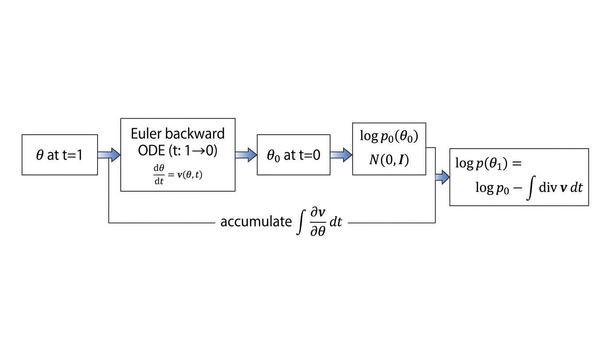

# Flow ODE direct likelihood for $\theta$ H-matrix (`flow_likelihood`)

## Context

The repository’s older **`flow`** path for the theta field trains conditional and prior **flow-matching velocity** models, then converts velocity to a **score** (`velocity_to_epsilon` and $s = -\epsilon/\sigma_t$) and **path-integrates** score differences along $\theta$ to build a $\Delta \log$-type matrix for H-decoding.

The **`flow_likelihood`** option keeps the **same trained networks** but skips score conversion and score integration. Instead it uses the **continuity equation / change-of-variables** along the learned ODE to estimate **$\log p(\theta)$** at the endpoint and forms **pairwise log-likelihood ratios** directly. Those ratios feed the same downstream H-building steps (symmetric Hellinger matrix) as the score-based pipeline.

**Implementation:** `fisher/h_matrix.py` (`HMatrixEstimator`, `field_method="flow_likelihood"`), invoked from `fisher/shared_fisher_est.py` when `--theta-field-method flow_likelihood`.

## Method (continuous time)

Let $\theta \in \mathbb{R}$ be the **scalar** latent (this codebase uses 1D $\theta$). Suppose a flow on $t \in [0,1]$ with velocity $v(\theta,t)$ and ODE

$$
\frac{d\theta}{dt} = v(\theta_t, t).
$$

If $\theta_0 \sim p_0$ and $\theta_1$ is obtained by integrating forward to $t=1$, the **instantaneous change-of-variables** formula for the density carried along the flow gives, in **one dimension**,

$$
\frac{d}{dt} \log p_t(\theta_t) = - \frac{\partial v}{\partial \theta}(\theta_t, t),
$$

so

$$
\log p_1(\theta_1) = \log p_0(\theta_0) - \int_0^1 \frac{\partial v}{\partial \theta}(\theta_t, t)\,dt,
$$

where $\theta_t$ is the **same** trajectory as in the forward ODE.

**Base density at $t=0$.** The implementation uses an **isotropic standard normal** on the ODE state (here one coordinate, matching scalar $\theta$). In code, `log_p0` sums over flattened dimensions:

$$
\log p_0(\theta_0) = -\tfrac{1}{2}\left(\|\theta_0\|^2 + d\log(2\pi)\right), \quad d=\dim(\theta_0).
$$

For this pipeline $d=1$, which reduces to $-\tfrac{1}{2}\left(\theta_0^2 + \log(2\pi)\right)$.

**Posterior vs prior.** For a **conditional** posterior velocity $v_{\mathrm{post}}(\theta,t\mid x)$ and **prior** velocity $v_{\mathrm{prior}}(\theta,t)$, the code evaluates $\log p_{\mathrm{post}}(\theta \mid x)$ and $\log p_{\mathrm{prior}}(\theta)$ with the **same** formula but different $v$, then forms the **log-likelihood ratio** for each pair $(i,j)$:

$$
r_{ij} = \log p(\theta_j \mid x_i) - \log p(\theta_j).
$$

## Discrete algorithm (matches `HMatrixEstimator`)

The implementation uses `flow_matching.solver.ode_solver.ODESolver.compute_likelihood(...)` directly.

**Time grid and solver.** For each block, the code builds a uniform reverse grid from $1 \to 0$ with `flow_ode_steps + 1` points and calls `compute_likelihood` with:

- `method="midpoint"` (requested default),
- `exact_divergence=True`,
- `time_grid=torch.linspace(1.0, 0.0, flow_ode_steps + 1)`.

This keeps the internal knob `flow_ode_steps` (default **64** on `HMatrixEstimator`; not currently exposed as a CLI flag) while delegating time stepping and divergence accumulation to `torchdiffeq` via the package solver.

**Posterior vs prior calls.** `ODESolver` invokes the wrapped velocity as `velocity_model(x=theta, t=t, **model_extras)`. In this repo:

- **Posterior:** `model_extras` supplies `x_cond` (the observation $x_i$ replicated across the pairwise batch) so each row uses $v_{\mathrm{post}}(\theta,t\mid x_i)$.
- **Prior:** no extra keys; $v_{\mathrm{prior}}(\theta,t)$ depends only on $\theta$ and $t$.

For each block, `compute_likelihood` is called twice on the same `theta_t` endpoints; returned log-densities are subtracted row-wise.

The solver returns log-likelihood values equivalent to

$$
\log p(\theta_1) = \log p_0(\theta_0) - \int_0^1 \frac{\partial v}{\partial \theta}(\theta_t, t)\,dt,
$$

but now computed through `ODESolver.compute_likelihood(...)` rather than a hand-written loop.

**Pairwise matrix.** For sorted $\theta$ and aligned $x$, the implementation fills

$$
C_{ij} = r_{ij} = \log p(\theta_j \mid x_i) - \log p(\theta_j),
$$

using the posterior velocity with $x_i$ fixed in the batch and the prior velocity without $x$. The **G-matrix** is unused (zeros); **$\Delta L$** is still `compute_delta_l` applied to this “pseudo–$C$” matrix (off-diagonal log-ratio contrasts relative to the diagonal), then **Hellinger** matrices are computed as in the DSM path.

**Scope note.** The H-matrix pipeline here is built for **scalar $\theta$** (state shape `(batch, 1)`). `ODESolver.compute_likelihood` with `exact_divergence=True` evaluates the divergence of the velocity field with respect to that state; for a single output dimension this matches $\partial v/\partial\theta$. Extending to **vector $\theta$** would require compatible velocity outputs and training, which this codebase does not use for the theta flow models.



*Figure:* Conceptual flow for one endpoint $\theta$ at $t=1$: backward integration yields $\theta_0$; $\log p_0(\theta_0)$ minus the integrated $\partial v/\partial \theta$ gives $\log p(\theta_1)$. In code this is obtained via `ODESolver.compute_likelihood(...)`.

## Reproduction (commands & scripts)

Run Fisher / H-matrix estimation with the third theta-field method:

```bash
cd /grad/zeyuan/score-matching-fisher
mamba run -n geo_diffusion python run_fisher.py score \
  --theta-field-method flow_likelihood \
  --compute-h-matrix \
  ... \
  --device cuda
```

- **Core implementation:** `fisher/h_matrix.py` — ODE-solver adapters plus `compute_log_ratio_matrix` / `run` branch for `flow_likelihood`.
- **Runner wiring:** `fisher/shared_fisher_est.py` — for `flow_likelihood`, `h_eval` is set to **$1.0$** (full $[0,1]$ span in the likelihood step; `flow_eval_t` still affects training logs for flow models but the ODE likelihood uses the fixed backward grid $1\to 0$ in `h_matrix.py`).
- **CLI:** `fisher/cli_shared_fisher.py` — `--theta-field-method` includes `flow_likelihood`.
- **Tests:** `tests/test_h_matrix_flow_likelihood.py` — identical post/prior $\Rightarrow$ near-zero $\Delta L$ / $H_{\mathrm{sym}}$; plus a finite-output check for shifted posterior vs prior.
- **Convergence study:** `bin/study_h_decoding_convergence.py` with `--theta-field-method flow_likelihood` (same trained flow models as `flow`, different H-matrix construction).

Optional: run only the `flow_likelihood` unit tests (recommended: `discover -s tests` avoids `ModuleNotFoundError` when `tests` is not on the import path as a dotted module):

```bash
cd /grad/zeyuan/score-matching-fisher
PYTHONPATH=. mamba run -n geo_diffusion python -m unittest discover -s tests -p 'test_h_matrix_flow_likelihood.py' -v
```

## Artifacts

- H-matrix NPZ/summary/figures are written under the run `--output-dir` by the same `_save_h_matrix_dsm_artifacts` path as other methods.
- `HMatrixResult.eval_scalar_name` is **`flow_ode_t_span`** (artifact scalar; the ODE likelihood integration always uses the full reverse interval $t:1\to 0$ in `h_matrix.py`).
- `HMatrixResult.flow_score_mode` is the string **`direct_ode_likelihood`** (historical field name; meaning: likelihood from flow ODE, not velocity-to-score).

## Takeaway

**`flow_likelihood`** replaces score conversion + $\theta$-axis integration with **package-backed ODE likelihood evaluation** (`ODESolver.compute_likelihood`) from the trained velocity fields. It is an alternative **inference-time** construction of the same $\Delta L$ / H objects for comparison with **`flow`** and **`dsm`**, without changing the ground-truth Monte Carlo Hellinger path in convergence studies.
