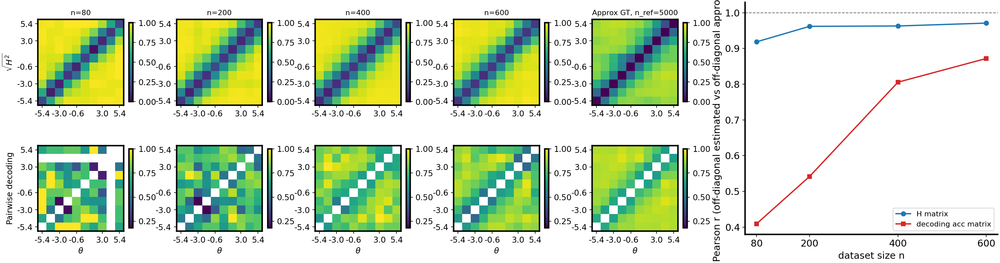
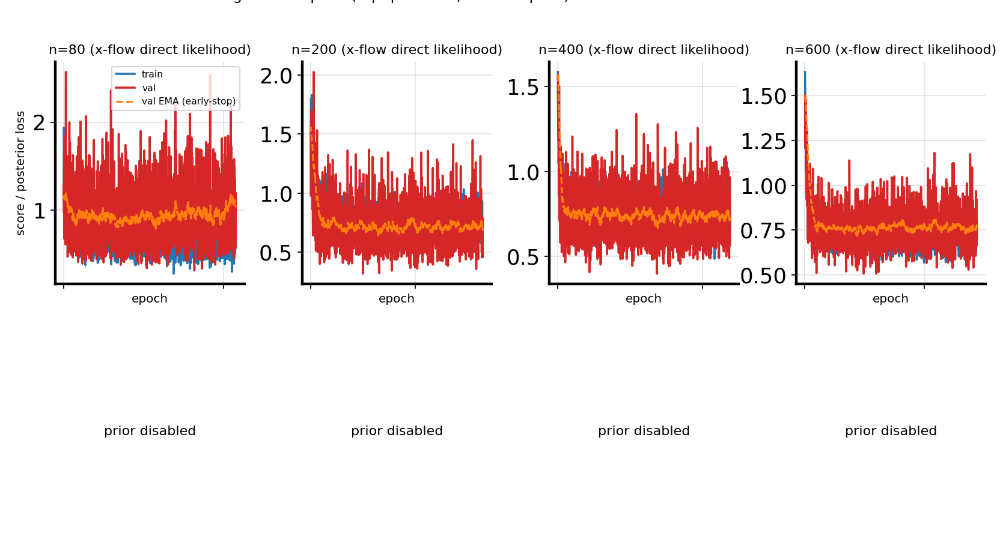

# `flow_x_likelihood`: x-space flow ODE log-density for the H-matrix (direct $\log p(x\mid\theta)$)

> **CLI (2026-04-18):** use `--theta-field-method x_flow` (internal `field_method="flow_x_likelihood"`). The θ-space ODE Bayes-ratio method is `--theta-field-method theta_flow`; path integration is `theta_path_integral`. See [rename note](2026-04-18-theta-flow-rename-and-bayes-ratio.md).

## Question / context

The existing **`theta_flow`** θ-space path ([note](2026-04-13-flow-ode-direct-likelihood-theta-h-matrix.md)) trains **$\theta$-space** conditional and prior flows and evaluates **$\log p(\theta\mid x)$** (up to training fidelity) via an ODE change-of-variables on $\theta$, then uses **posterior minus prior** log-densities to build pairwise ratios. That is naturally read as a **Bayes-rule** construction on the latent.

This note documents **`flow_x_likelihood`**, which instead trains a **conditional flow in observation space** and estimates **$\log p(x\mid\theta)$** directly with the **same** ODE likelihood machinery, but with **state $x \in \mathbb{R}^{d_x}$** and **no unconditional $p(x)$** subtraction (conditional-only formulation). The downstream H-decoding pipeline still applies **$\Delta L$ centering** and the usual Hellinger map from `HMatrixEstimator`.

**Implementation:** [`fisher/h_matrix.py`](../../fisher/h_matrix.py) (`field_method="flow_x_likelihood"`, `compute_x_conditional_loglik_matrix`), training in [`fisher/shared_fisher_est.py`](../../fisher/shared_fisher_est.py) via `train_conditional_x_flow_model` and models `ConditionalXFlowVelocity` / `ConditionalXFlowVelocityFiLMPerLayer` / `ConditionalXFlowVelocityThetaFourierMLP` (`--flow-score-arch theta_fourier_mlp`) in [`fisher/models.py`](../../fisher/models.py). CLI: `--theta-field-method x_flow` in [`fisher/cli_shared_fisher.py`](../../fisher/cli_shared_fisher.py).

## Method

### Flow matching on $x$ (training)

For each pair $(\theta, x)$ in the dataset, let $x_1 = x$ and sample $x_0 \sim \mathcal{N}(0, I_{d_x})$ on $\mathbb{R}^{d_x}$. With a chosen probability path (same schedulers as other flows in-repo, e.g. cosine VP via `flow_matching`), interpolate $x_t$ and target velocity $\dot{x}_t$ for $t \in [0,1]$. The network learns a **conditional** velocity $v_\phi(x_t, \theta, t) \in \mathbb{R}^{d_x}$ by minimizing squared error to the path velocity (see `train_conditional_x_flow_model` in [`fisher/trainers.py`](../../fisher/trainers.py)).

### ODE likelihood for $\log p(x_1 \mid \theta)$

At **evaluation** time, fix $\theta$ and treat $x$ as the **ODE state**. For the learned flow, the instantaneous change-of-variables law in $d_x$ dimensions is

$$
\frac{d}{dt} \log p_t(x_t \mid \theta) = - \nabla_{x_t}\cdot v_\phi(x_t, \theta, t),
$$

so, integrating from $t=1$ to $t=0$ along the **reverse-time** trajectory consistent with the solver,

$$
\log p(x_1 \mid \theta) = \log p_0(x_0) - \int_0^1 \nabla_{x_t}\cdot v_\phi(x_t, \theta, t)\,dt,
$$

with base density $\log p_0$ taken as an **isotropic standard normal** on $\mathbb{R}^{d_x}$ (same functional form as for $\theta$ in `flow_likelihood`, but with $d = d_x$):

$$
\log p_0(x_0) = -\tfrac{1}{2}\left(\|x_0\|^2 + d_x \log(2\pi)\right).
$$

In code, `ODESolver.compute_likelihood(...)` is called with `exact_divergence=True`, `method="midpoint"`, and `time_grid` from $1 \to 0$ (default `flow_ode_steps=64` on `HMatrixEstimator`). The velocity wrapper passes **`theta_cond`** as `model_extras` so each batch element uses $v_\phi(\cdot, \theta_j, t)$.

### Pairwise matrix and H-building

For sorted $\theta$ and aligned observations $x$, the code fills

$$
C_{ij} = \log p(x_i \mid \theta_j).
$$

There is **no** subtraction of $\log p(x_i)$ in this mode. As for other methods, the implementation sets

$$
(\Delta L)_{ij} = C_{ij} - C_{ii},
$$

then maps $\Delta L$ to directed and symmetric Hellinger-style matrices as in the DSM / `flow` / `flow_likelihood` paths. Artifact metadata records `h_flow_score_mode = direct_ode_x_cond_likelihood`.

**Contrast with `flow_likelihood`.** The theta-space method builds ratios $\log p(\theta_j\mid x_i) - \log p(\theta_j)$ using two ODEs (posterior and prior on $\theta$). Here, a **single** conditional x-flow gives $\log p(x_i\mid\theta_j)$ directly; indifference to an additive row-wise offset in $C$ is handled by the $\Delta L$ diagonal subtraction.

## Results (50D `randamp_gaussian_sqrtd`, $N_{\mathrm{pool}}=6000$)

We ran [`bin/study_h_decoding_convergence.py`](../../bin/study_h_decoding_convergence.py) on the fixed dataset below with **`flow_x_likelihood`**, **MLP** conditional x-flow (`--flow-score-arch mlp`), reference size **`n_ref=5000`**, nested **`n_list=80,200,400,600`**, **`num_theta_bins=10`**, permutation seed **7** (dataset meta seed). **Pearson $r$** is off-diagonal correlation of binned $\sqrt{H_{\mathrm{sym}}}$ vs MC generative GT $\sqrt{H^2}$, and of pairwise decoding vs the $n_{\mathrm{ref}}$ decoding matrix (same bin edges).

| $n$ | corr_h_binned_vs_gt_mc | corr_clf_vs_ref | wall_s |
|-----|-------------------------|-----------------|--------|
| 80  | 0.919 | 0.409 | 8.4 |
| 200 | 0.962 | 0.542 | 9.7 |
| 400 | 0.963 | 0.806 | 30.6 |
| 600 | 0.971 | 0.872 | 61.7 |

**Observation.** Binned-$H$ track vs GT stays **high** across $n$, similar in spirit to the strong **`flow_likelihood`** behavior on this family in 50D (random-amplitude bumps + $\sqrt{d_x}$ noise). Decoding correlation rises with $n$ as expected when more data improves the bin-wise classifiers.

## Figures



*Figure:* Combined panel for **`flow_x_likelihood`** on 50D `randamp_gaussian_sqrtd`: binned learned $H$ vs MC GT (top row of heatmaps) and pairwise decoding (bottom row), plus off-diagonal Pearson curves vs $n$.


*Figure:* Per-$n$ training/validation curves for the x-flow; bottom row shows “prior disabled” because this mode does not train a prior network.

## Reproduction (commands & scripts)

**Dataset (must already exist; family must match NPZ meta):**

- Path: `/grad/zeyuan/score-matching-fisher/data/shared_fisher_dataset_randamp_gaussian_sqrtd_xdim50_n6000.npz`

**Convergence study (the run recorded here):**

```bash
cd /grad/zeyuan/score-matching-fisher
PYTHONUNBUFFERED=1 mamba run -n geo_diffusion python -u bin/study_h_decoding_convergence.py \
  --dataset-npz /grad/zeyuan/score-matching-fisher/data/shared_fisher_dataset_randamp_gaussian_sqrtd_xdim50_n6000.npz \
  --dataset-family randamp_gaussian_sqrtd \
  --theta-field-method flow_x_likelihood \
  --n-ref 5000 \
  --n-list 80,200,400,600 \
  --num-theta-bins 10 \
  --output-dir /grad/zeyuan/score-matching-fisher/data/h_decoding_conv_randamp_gaussian_sqrtd_xdim50_flow_x_likelihood_n6000 \
  --device cuda
```

Optional: line-buffered file log, e.g. `stdbuf -oL ... > run.log 2>&1`.

**Core code paths:**

- `HMatrixEstimator` branch `flow_x_likelihood`: [`fisher/h_matrix.py`](../../fisher/h_matrix.py)
- Training + artifact save: [`fisher/shared_fisher_est.py`](../../fisher/shared_fisher_est.py) (`theta_field_method == "flow_x_likelihood"`)
- Unit tests: [`tests/test_h_matrix_flow_x_likelihood.py`](../../tests/test_h_matrix_flow_x_likelihood.py)

## Artifacts (absolute paths)

| Kind | Path |
|------|------|
| Run directory | `/grad/zeyuan/score-matching-fisher/data/h_decoding_conv_randamp_gaussian_sqrtd_xdim50_flow_x_likelihood_n6000/` |
| Master log | `/grad/zeyuan/score-matching-fisher/data/h_decoding_conv_randamp_gaussian_sqrtd_xdim50_flow_x_likelihood_n6000/run.log` |
| Results NPZ | `/grad/zeyuan/score-matching-fisher/data/h_decoding_conv_randamp_gaussian_sqrtd_xdim50_flow_x_likelihood_n6000/h_decoding_convergence_results.npz` |
| Results CSV | `/grad/zeyuan/score-matching-fisher/data/h_decoding_conv_randamp_gaussian_sqrtd_xdim50_flow_x_likelihood_n6000/h_decoding_convergence_results.csv` |
| Combined figure | `/grad/zeyuan/score-matching-fisher/data/h_decoding_conv_randamp_gaussian_sqrtd_xdim50_flow_x_likelihood_n6000/h_decoding_convergence_combined.png` |
| Loss panel | `/grad/zeyuan/score-matching-fisher/data/h_decoding_conv_randamp_gaussian_sqrtd_xdim50_flow_x_likelihood_n6000/h_decoding_training_losses_panel.png` |
| Per-$n$ training NPZ | `/grad/zeyuan/score-matching-fisher/data/h_decoding_conv_randamp_gaussian_sqrtd_xdim50_flow_x_likelihood_n6000/training_losses/n_000080.npz` (… `n_000600.npz`) |

---

## Addendum: 2D `randamp_gaussian_sqrtd` ($d_x=2$, same protocol)

The **method** above is unchanged: only the observation dimension $d_x$ enters the flow state, the Gaussian base $\log p_0$ on $\mathbb{R}^{d_x}$, and the divergence $\nabla_x \cdot v_\phi$. We repeated the **same** convergence protocol (**`n_ref=5000`**, **`n_list=80,200,400,600`**, **`num_theta_bins=10`**, **`flow_x_likelihood`**, default MLP x-flow) on a **fresh** 2D pool of size $N_{\mathrm{pool}}=6000$ with dataset **seed 7** (matching the 50D NPZ sampling seed).

### Results (2D, $N_{\mathrm{pool}}=6000$)

| $n$ | corr_h_binned_vs_gt_mc | corr_clf_vs_ref | wall_s |
|-----|-------------------------|-----------------|--------|
| 80  | 0.921 | 0.731 | 7.4 |
| 200 | 0.954 | 0.848 | 5.3 |
| 400 | 0.988 | 0.924 | 13.1 |
| 600 | 0.977 | 0.913 | 11.2 |

**Observation.** **Binned $H$ vs GT** is already very strong at moderate $n$ (here peaking near $n=400$). **Decoding vs ref** is **much higher** than in the 50D run at comparable $n$, which is consistent with bin-wise classifiers operating on **2D** features instead of 50D.

### Figures (2D)


*Figure:* **`flow_x_likelihood`** on **2D** `randamp_gaussian_sqrtd`: same combined layout as the 50D figure (binned $H$ vs MC GT, pairwise decoding, Pearson curves).



### Reproduction (2D dataset + study)

**Create the shared NPZ** (one-time; overwrites if you reuse the path):

```bash
cd /grad/zeyuan/score-matching-fisher
PYTHONUNBUFFERED=1 mamba run -n geo_diffusion python -u bin/make_dataset.py \
  --dataset-family randamp_gaussian_sqrtd \
  --x-dim 2 \
  --num-samples 6000 \
  --seed 7 \
  --output-npz /grad/zeyuan/score-matching-fisher/data/shared_fisher_dataset_randamp_gaussian_sqrtd_xdim2_n6000.npz
```

**Convergence study:**

```bash
PYTHONUNBUFFERED=1 stdbuf -oL mamba run -n geo_diffusion python -u bin/study_h_decoding_convergence.py \
  --dataset-npz /grad/zeyuan/score-matching-fisher/data/shared_fisher_dataset_randamp_gaussian_sqrtd_xdim2_n6000.npz \
  --dataset-family randamp_gaussian_sqrtd \
  --theta-field-method flow_x_likelihood \
  --n-ref 5000 \
  --n-list 80,200,400,600 \
  --num-theta-bins 10 \
  --output-dir /grad/zeyuan/score-matching-fisher/data/h_decoding_conv_randamp_gaussian_sqrtd_xdim2_flow_x_likelihood_n6000 \
  --device cuda
```

### Artifacts (2D, absolute paths)

| Kind | Path |
|------|------|
| Dataset NPZ | `/grad/zeyuan/score-matching-fisher/data/shared_fisher_dataset_randamp_gaussian_sqrtd_xdim2_n6000.npz` |
| Run directory | `/grad/zeyuan/score-matching-fisher/data/h_decoding_conv_randamp_gaussian_sqrtd_xdim2_flow_x_likelihood_n6000/` |
| Master log | `/grad/zeyuan/score-matching-fisher/data/h_decoding_conv_randamp_gaussian_sqrtd_xdim2_flow_x_likelihood_n6000/run.log` |
| Results CSV | `/grad/zeyuan/score-matching-fisher/data/h_decoding_conv_randamp_gaussian_sqrtd_xdim2_flow_x_likelihood_n6000/h_decoding_convergence_results.csv` |
| Results NPZ | `/grad/zeyuan/score-matching-fisher/data/h_decoding_conv_randamp_gaussian_sqrtd_xdim2_flow_x_likelihood_n6000/h_decoding_convergence_results.npz` |
| Combined figure | `/grad/zeyuan/score-matching-fisher/data/h_decoding_conv_randamp_gaussian_sqrtd_xdim2_flow_x_likelihood_n6000/h_decoding_convergence_combined.png` |
| Loss panel | `/grad/zeyuan/score-matching-fisher/data/h_decoding_conv_randamp_gaussian_sqrtd_xdim2_flow_x_likelihood_n6000/h_decoding_training_losses_panel.png` |

---

## Addendum: 2D `cosine_gaussian_sqrtd`, **`flow_likelihood`** (theta-space ODE)

This block is **not** `flow_x_likelihood`: it uses the **$\theta$-space** conditional + prior flows and direct ODE log-densities on $\theta$ as in [`2026-04-13-flow-ode-direct-likelihood-theta-h-matrix.md`](2026-04-13-flow-ode-direct-likelihood-theta-h-matrix.md). It is recorded here as a **low-dimensional** companion to the **`cosine_gaussian_sqrtd`** high-$d$ runs (same noise scaling idea: variance multiplied by $d_x$, so per-coordinate std $\propto \sqrt{d_x}$).

**Setup.** $d_x=2$, $N_{\mathrm{pool}}=6000$, dataset seed **7**, **`n_ref=5000`**, **`n_list=80,200,400,600`**, **`num_theta_bins=10`**, MLP posterior and prior theta-flows (`--flow-score-arch mlp` defaults in the study script).

### Results (2D `cosine_gaussian_sqrtd`, `flow_likelihood`)

| $n$ | corr_h_binned_vs_gt_mc | corr_clf_vs_ref | wall_s |
|-----|-------------------------|-----------------|--------|
| 80  | 0.703 | 0.293 | 9.6 |
| 200 | 0.882 | 0.616 | 8.8 |
| 400 | 0.930 | 0.712 | 16.9 |
| 600 | 0.956 | 0.831 | 18.7 |

**Observation.** Correlations **improve with $n$** on both tracks. At $n=80$, **binned $H$ vs GT** is **weaker** than in the **`flow_x_likelihood`** **2D `randamp_gaussian_sqrtd`** addendum above—different generative family (cosine means vs random-amplitude bumps) and **different likelihood path** (theta-flow vs x-flow), so the numbers are not directly comparable beyond the shared protocol.

### Figures (`flow_likelihood`, 2D cosine sqrtd)


### Reproduction (dataset + study)

```bash
cd /grad/zeyuan/score-matching-fisher
PYTHONUNBUFFERED=1 mamba run -n geo_diffusion python -u bin/make_dataset.py \
  --dataset-family cosine_gaussian_sqrtd \
  --x-dim 2 \
  --num-samples 6000 \
  --seed 7 \
  --output-npz /grad/zeyuan/score-matching-fisher/data/shared_fisher_dataset_cosine_gaussian_sqrtd_xdim2_n6000.npz

PYTHONUNBUFFERED=1 stdbuf -oL mamba run -n geo_diffusion python -u bin/study_h_decoding_convergence.py \
  --dataset-npz /grad/zeyuan/score-matching-fisher/data/shared_fisher_dataset_cosine_gaussian_sqrtd_xdim2_n6000.npz \
  --dataset-family cosine_gaussian_sqrtd \
  --theta-field-method flow_likelihood \
  --n-ref 5000 \
  --n-list 80,200,400,600 \
  --num-theta-bins 10 \
  --output-dir /grad/zeyuan/score-matching-fisher/data/h_decoding_conv_cosine_gaussian_sqrtd_xdim2_flow_likelihood_n6000 \
  --device cuda
```

### Artifacts (absolute paths)

| Kind | Path |
|------|------|
| Dataset NPZ | `/grad/zeyuan/score-matching-fisher/data/shared_fisher_dataset_cosine_gaussian_sqrtd_xdim2_n6000.npz` |
| Run directory | `/grad/zeyuan/score-matching-fisher/data/h_decoding_conv_cosine_gaussian_sqrtd_xdim2_flow_likelihood_n6000/` |
| Master log | `/grad/zeyuan/score-matching-fisher/data/h_decoding_conv_cosine_gaussian_sqrtd_xdim2_flow_likelihood_n6000/run.log` |
| Results CSV | `/grad/zeyuan/score-matching-fisher/data/h_decoding_conv_cosine_gaussian_sqrtd_xdim2_flow_likelihood_n6000/h_decoding_convergence_results.csv` |
| Results NPZ | `/grad/zeyuan/score-matching-fisher/data/h_decoding_conv_cosine_gaussian_sqrtd_xdim2_flow_likelihood_n6000/h_decoding_convergence_results.npz` |
| Combined figure | `/grad/zeyuan/score-matching-fisher/data/h_decoding_conv_cosine_gaussian_sqrtd_xdim2_flow_likelihood_n6000/h_decoding_convergence_combined.png` |
| Loss panel | `/grad/zeyuan/score-matching-fisher/data/h_decoding_conv_cosine_gaussian_sqrtd_xdim2_flow_likelihood_n6000/h_decoding_training_losses_panel.png` |

---

## Addendum: 100D `cosine_gaussian_sqrtd`, **`flow_likelihood`** (same protocol as 2D)

We repeated the **exact** nested-$n$ protocol as the **2D** block above, but with **$d_x=100$** and a fresh NPZ of size $N_{\mathrm{pool}}=6000$ (seed **7**). Method remains **`flow_likelihood`**: conditional and prior **theta-flows** with ODE likelihood ratios on $\theta$, conditioning on **100-dimensional** $x$ in the posterior network.

### Results (100D `cosine_gaussian_sqrtd`, `flow_likelihood`)

| $n$ | corr_h_binned_vs_gt_mc | corr_clf_vs_ref | wall_s |
|-----|-------------------------|-----------------|--------|
| 80  | −0.079 | 0.150 | 8.7 |
| 200 | −0.070 | 0.187 | 7.5 |
| 400 | −0.058 | 0.615 | 16.6 |
| 600 | −0.047 | 0.816 | 14.5 |

**Observation.** **Binned $\sqrt{H_{\mathrm{sym}}}$ vs MC GT** shows **small negative** Pearson correlation at every $n$ (off-diagonal bins). So the **learned H geometry from theta-flow likelihood ratios does not track the generative Hellinger structure** under this setup, unlike the **2D** cosine-sqrtd row in the previous addendum. **Decoding vs reference** still **increases** with $n$ (bin classifiers eventually align with the large-$n_{\mathrm{ref}}$ decoding matrix), so the two evaluation tracks **diverge**: decoding can look reasonable while the **H-matrix track** disagrees with GT. This is a useful warning when interpreting **high-$d_x$ `flow_likelihood`** on **`cosine_gaussian_sqrtd`** with the default MLP conditioning architecture and training budget—without implying that other methods (e.g. **`flow_x_likelihood`**) would behave the same way.

### Figures (`flow_likelihood`, 100D cosine sqrtd)


### Reproduction (dataset + study)

```bash
cd /grad/zeyuan/score-matching-fisher
PYTHONUNBUFFERED=1 mamba run -n geo_diffusion python -u bin/make_dataset.py \
  --dataset-family cosine_gaussian_sqrtd \
  --x-dim 100 \
  --num-samples 6000 \
  --seed 7 \
  --output-npz /grad/zeyuan/score-matching-fisher/data/shared_fisher_dataset_cosine_gaussian_sqrtd_xdim100_n6000.npz

PYTHONUNBUFFERED=1 stdbuf -oL mamba run -n geo_diffusion python -u bin/study_h_decoding_convergence.py \
  --dataset-npz /grad/zeyuan/score-matching-fisher/data/shared_fisher_dataset_cosine_gaussian_sqrtd_xdim100_n6000.npz \
  --dataset-family cosine_gaussian_sqrtd \
  --theta-field-method flow_likelihood \
  --n-ref 5000 \
  --n-list 80,200,400,600 \
  --num-theta-bins 10 \
  --output-dir /grad/zeyuan/score-matching-fisher/data/h_decoding_conv_cosine_gaussian_sqrtd_xdim100_flow_likelihood_n6000 \
  --device cuda
```

### Artifacts (100D, absolute paths)

| Kind | Path |
|------|------|
| Dataset NPZ | `/grad/zeyuan/score-matching-fisher/data/shared_fisher_dataset_cosine_gaussian_sqrtd_xdim100_n6000.npz` |
| Run directory | `/grad/zeyuan/score-matching-fisher/data/h_decoding_conv_cosine_gaussian_sqrtd_xdim100_flow_likelihood_n6000/` |
| Master log | `/grad/zeyuan/score-matching-fisher/data/h_decoding_conv_cosine_gaussian_sqrtd_xdim100_flow_likelihood_n6000/run.log` |
| Results CSV | `/grad/zeyuan/score-matching-fisher/data/h_decoding_conv_cosine_gaussian_sqrtd_xdim100_flow_likelihood_n6000/h_decoding_convergence_results.csv` |
| Results NPZ | `/grad/zeyuan/score-matching-fisher/data/h_decoding_conv_cosine_gaussian_sqrtd_xdim100_flow_likelihood_n6000/h_decoding_convergence_results.npz` |
| Combined figure | `/grad/zeyuan/score-matching-fisher/data/h_decoding_conv_cosine_gaussian_sqrtd_xdim100_flow_likelihood_n6000/h_decoding_convergence_combined.png` |
| Loss panel | `/grad/zeyuan/score-matching-fisher/data/h_decoding_conv_cosine_gaussian_sqrtd_xdim100_flow_likelihood_n6000/h_decoding_training_losses_panel.png` |

---

## Addendum: `theta_fourier_mlp` (Fourier + linear theta features for x-flow)

**Motivation.** The conditional velocity $v_\phi(x_t,\theta,t)$ depends on scalar $\theta$. When the generative map $\theta \mapsto \mu(\theta)$ is **periodic** (cosine tuning), a **plain** coordinate $\theta$ in an MLP can be a weak inductive bias in high $d_x$. We add an explicit **Fourier feature map** on $\theta$ while **keeping** optional **affine** terms so the model can still represent non-periodic dependence:

$$
\phi(\theta) = \big(1,\ \theta,\ \{\sin(k\omega\theta),\ \cos(k\omega\theta)\}_{k=1}^{K}\big)\in\mathbb{R}^{2K+2}\quad\text{(when bias and linear are enabled).}
$$

The velocity MLP concatenates $[x_t,\ \phi(\theta),\ t_{\mathrm{feat}}]$ as in the baseline `ConditionalXFlowVelocity`, but with $\phi(\theta)$ replacing the single $\theta$ channel.

**Code:** `ConditionalXFlowVelocityThetaFourierMLP` in [`fisher/models.py`](../../fisher/models.py). Training selection in [`fisher/shared_fisher_est.py`](../../fisher/shared_fisher_est.py) when `--theta-field-method flow_x_likelihood` and `--flow-score-arch theta_fourier_mlp`. Flags: `--flow-x-theta-fourier-k`, `--flow-x-theta-fourier-omega-mode`, `--flow-x-theta-fourier-omega`, `--flow-x-theta-fourier-no-linear`, `--flow-x-theta-fourier-no-bias` (see [`fisher/cli_shared_fisher.py`](../../fisher/cli_shared_fisher.py)).

**Frequency default.** With **`--flow-x-theta-fourier-omega-mode theta_range`** (the default), the implementation sets

$$
\omega_{\mathrm{eff}} = \frac{2\pi}{\theta_{\mathrm{high}}-\theta_{\mathrm{low}}}\cdot m,
$$

where $m$ is **`--flow-x-theta-fourier-omega`** (default $m=1$). Then the $k=1$ harmonic has **period** $(\theta_{\mathrm{high}}-\theta_{\mathrm{low}})/m$, i.e. **one full cycle across the dataset’s $\theta$ interval** when $m=1$. Use **`--flow-x-theta-fourier-omega-mode fixed`** to pass $\omega$ directly (previous behavior: $m=1$ gives period $2\pi$).

### Results (refreshed runs, **`--device cuda:0`**, same nested-$n$ protocol: $N_{\mathrm{pool}}=6000$, $n_{\mathrm{ref}}=5000$, `num_theta_bins=10`, **`theta_fourier_mlp`**, $K=4$, **`--flow-x-theta-fourier-omega-mode theta_range`**, $m=1$, so $\omega_{\mathrm{eff}}=2\pi/12\approx 0.5236$ for $\theta\in[-6,6]$, default bias+linear)

**$d_x=2$** (`corr_h` = binned-$H$ vs GT Pearson):

| $n$ | `corr_h` | `corr_clf_vs_ref` | wall_s |
|-----|----------|---------------------|--------|
| 80  | 0.486 | 0.293 | 5.2 |
| 200 | 0.955 | 0.616 | 4.3 |
| 400 | 0.922 | 0.712 | 9.0 |
| 600 | 0.924 | 0.831 | 13.8 |

**$d_x=50$:**

| $n$ | `corr_h` | `corr_clf_vs_ref` | wall_s |
|-----|----------|---------------------|--------|
| 80  | 0.123 | 0.466 | 9.8 |
| 200 | 0.352 | 0.671 | 13.2 |
| 400 | 0.369 | 0.704 | 45.8 |
| 600 | 0.683 | 0.740 | 83.9 |

**Observation.** **`theta_range`** calibration (fundamental period = $\theta_{\mathrm{high}}-\theta_{\mathrm{low}}$ when $m=1$) keeps **2D** **`corr_h`** high for $n\gtrsim 200$. At **50D**, **`corr_h`** is **clearly positive** by $n=600$ and **well above** plain MLP / weak FiLM baselines, but **not as high** as an earlier exploratory run that used **`fixed`** $\omega=1$ (period $2\pi$ in $\theta$) on **`cuda`**—frequency scale interacts with optimization and high-$d_x$ flow matching. **Decoding-vs-reference** matches prior rows (same bins / reference).

### Figures


### Reproduction

```bash
# 2D (table above)
cd /grad/zeyuan/score-matching-fisher
PYTHONUNBUFFERED=1 stdbuf -oL mamba run -n geo_diffusion python -u bin/study_h_decoding_convergence.py \
  --dataset-npz /grad/zeyuan/score-matching-fisher/data/shared_fisher_dataset_cosine_gaussian_sqrtd_xdim2_n6000.npz \
  --dataset-family cosine_gaussian_sqrtd \
  --theta-field-method flow_x_likelihood \
  --flow-score-arch theta_fourier_mlp \
  --flow-x-theta-fourier-k 4 \
  --flow-x-theta-fourier-omega-mode theta_range \
  --flow-x-theta-fourier-omega 1.0 \
  --n-ref 5000 --n-list 80,200,400,600 --num-theta-bins 10 \
  --output-dir /grad/zeyuan/score-matching-fisher/data/h_decoding_conv_cosine_gaussian_sqrtd_xdim2_flow_x_theta_fourier_n6000_cuda0 \
  --device cuda:0

# 50D
PYTHONUNBUFFERED=1 stdbuf -oL mamba run -n geo_diffusion python -u bin/study_h_decoding_convergence.py \
  --dataset-npz /grad/zeyuan/score-matching-fisher/data/shared_fisher_dataset_cosine_gaussian_sqrtd_xdim50_n6000.npz \
  --dataset-family cosine_gaussian_sqrtd \
  --theta-field-method flow_x_likelihood \
  --flow-score-arch theta_fourier_mlp \
  --flow-x-theta-fourier-k 4 \
  --flow-x-theta-fourier-omega-mode theta_range \
  --flow-x-theta-fourier-omega 1.0 \
  --n-ref 5000 --n-list 80,200,400,600 --num-theta-bins 10 \
  --output-dir /grad/zeyuan/score-matching-fisher/data/h_decoding_conv_cosine_gaussian_sqrtd_xdim50_flow_x_theta_fourier_n6000_cuda0 \
  --device cuda:0
```

### Artifacts (absolute paths, runs above)

| Run | Directory |
|-----|-----------|
| 2D | `/grad/zeyuan/score-matching-fisher/data/h_decoding_conv_cosine_gaussian_sqrtd_xdim2_flow_x_theta_fourier_n6000_cuda0/` |
| 50D | `/grad/zeyuan/score-matching-fisher/data/h_decoding_conv_cosine_gaussian_sqrtd_xdim50_flow_x_theta_fourier_n6000_cuda0/` |

Within each run directory: `run.log`, `h_decoding_convergence_results.csv` / `.npz`, `h_decoding_convergence_combined.{png,svg}`, `h_decoding_training_losses_panel.{png,svg}`.

---

## Limitation: `flow_x_likelihood` in **high** $d_x$ (cosine family)

**Bottom line.** Treat **plain `flow_x_likelihood` x-flows that feed only raw $\theta$ (MLP) or thin FiLM conditioning (FiLM)** as **not reliably matching** **binned learned $H$ vs MC generative Hellinger** for **`cosine_gaussian_sqrtd`** at **moderate-to-large $d_x$** under the default training budget we used: **`corr_h_binned_vs_gt_mc`** was **negative or near zero** in those runs. **See the addendum above:** the **`theta_fourier_mlp`** architecture with **`theta_range`** $\omega$ is a **practical mitigation** (positive **`corr_h`** at 50D for $n=600$ in the refreshed **`cuda:0`** runs). This limitation is **not** a claim that **every** high-$d_x$ problem fails—**50D `randamp_gaussian_sqrtd`** with baseline **`flow_x_likelihood`** still worked well in the main section.

**Important contrast (same method, different family).** This is **not** the statement “x-flow always fails at 50D.” The **50D `randamp_gaussian_sqrtd`** **`flow_x_likelihood`** run documented above still shows **strong** binned-$H$ vs GT (up to $\approx 0.97$ at $n=600$). The failure mode below is tied to **high-$d_x$ cosine Gaussian sqrt-$d$** in our runs, not to dimension alone.

**Evidence (`cosine_gaussian_sqrtd`, nested $n$, $n_{\mathrm{ref}}=5000$, `flow_x_likelihood`; device **`cuda:1`** for the earlier MLP/FiLM 50D/2D rows; **`cuda:0`** for the refreshed **`theta_fourier_mlp`** + **`theta_range`** runs in the addendum).**

- **$d_x=2$:** binned-$H$ vs GT becomes **strongly positive** for $n\gtrsim 200$ (MLP x-flow: `/grad/zeyuan/score-matching-fisher/data/h_decoding_conv_cosine_gaussian_sqrtd_xdim2_flow_x_likelihood_n6000/`; FiLM: `…_xdim2_flow_x_likelihood_film_n6000/`).
- **$d_x=50$, MLP x-flow:** **`corr_h_binned_vs_gt_mc` stays negative** across $n\in\{80,200,400,600\}$ (run dir: `/grad/zeyuan/score-matching-fisher/data/h_decoding_conv_cosine_gaussian_sqrtd_xdim50_flow_x_likelihood_n6000/`).
- **$d_x=50$, FiLM x-flow (`--flow-score-arch film`):** correlations move toward **zero / weakly positive** but remain **far below** the 2D cosine or 50D randamp **`flow_x`** behavior (run dir: `/grad/zeyuan/score-matching-fisher/data/h_decoding_conv_cosine_gaussian_sqrtd_xdim50_flow_x_likelihood_film_n6000/`).
- **$d_x=50$, `theta_fourier_mlp`:** positive **`corr_h`** at large $n$ with **`theta_range`** $\omega$ (see **Addendum** and `/grad/zeyuan/score-matching-fisher/data/h_decoding_conv_cosine_gaussian_sqrtd_xdim50_flow_x_theta_fourier_n6000_cuda0/`).

Compact comparison at **$d_x=50$**, **`flow_x_likelihood`** on **`cosine_gaussian_sqrtd`** (off-diagonal Pearson $r$ for binned $\sqrt{H_{\mathrm{sym}}}$ vs MC GT). **`theta_fourier_mlp`** column is the **`theta_range`**, **`cuda:0`** refresh (same protocol as the addendum).

| $n$ | MLP `corr_h` | FiLM `corr_h` | `theta_fourier_mlp` `corr_h` |
|-----|----------------|-----------------|-------------------------------|
| 80  | −0.036 | −0.023 | 0.123 |
| 200 | −0.167 | 0.039 | 0.352 |
| 400 | −0.190 | −0.059 | 0.369 |
| 600 | −0.147 | 0.072 | 0.683 |

**Interpretation (cautious).** Learning a **global** conditional velocity $v_\phi(x,\theta,t)$ in $\mathbb{R}^{d_x}$ and using its **divergence** in the ODE likelihood is **hard** when $d_x$ is large and the conditional density is **anisotropic / strongly $\theta$-structured** (cosine means + sqrt-$d$ noise): **how $\theta$ is represented** in the network can dominate failure vs success for the **H track** (compare MLP/FiLM vs **`theta_fourier_mlp`** above). **Decoding-vs-reference** can remain decent because bin classifiers probe **different** decision boundaries than the H-matrix pipeline.

**Compute.** Exact divergence and ODE steps also **scale in cost** with $d_x$, which matters for iteration in practice.

## Takeaway

**`flow_x_likelihood`** implements **direct conditional observation likelihoods** $\log p(x\mid\theta)$ from a **trained x-space flow** and package **ODE likelihood** evaluation, avoiding a $\theta$-space posterior/prior decomposition. On **50D `randamp_gaussian_sqrtd`** with the nested-$n$ protocol above, **binned-$H$ vs GT** stays **high** (up to $\approx 0.97$ at $n=600$). The **2D** rerun with the **same** protocol shows **similarly strong** binned-$H$ tracking and **substantially higher** decoding-vs-reference correlation at the same $n$, reflecting the easier low-dimensional classification subproblem while the underlying H-building equations are unchanged.

**Complement.** **`flow_likelihood`** on **`cosine_gaussian_sqrtd`** is documented for **2D** (strong **binned-$H$ vs GT**) and **100D** (same protocol; **binned-$H$ vs GT** turns **weakly negative** while decoding-vs-ref still rises with $n$). Compare to the **`flow_x_likelihood`** `randamp` sections above, which use a **different** likelihood geometry (x-flow, not theta-flow).

**High $d_x$ caveat.** See **Limitation** and the **`theta_fourier_mlp` addendum** above: for **`cosine_gaussian_sqrtd`**, **plain** x-flow conditioning on raw $\theta$ **can** miss the **binned-$H$ vs GT** track at 50D, while **Fourier-augmented $\theta$ features** helped substantially in our runs—still validate on the target generator.

---

## Addendum (implementation + bench): **`flow_likelihood`** with **theta-space** `theta_fourier_mlp` (posterior + prior)

**Code.** The repo now supports **`--flow-score-arch theta_fourier_mlp`** and **`--flow-prior-arch theta_fourier_mlp`** when **`--theta-field-method`** is **`flow`** or **`flow_likelihood`**, with explicit CLI flags **`--flow-theta-fourier-*`** and **`--flow-prior-theta-fourier-*`** (same **`theta_range` / `fixed`** $\omega$ semantics as **`--flow-x-theta-fourier-*`**). Models: `ConditionalThetaFlowVelocityThetaFourierMLP`, `PriorThetaFlowVelocityThetaFourierMLP` in [`fisher/models.py`](../../fisher/models.py); wiring and $\omega$ resolution in [`fisher/shared_fisher_est.py`](../../fisher/shared_fisher_est.py).

### Quick benchmark (`cosine_gaussian_sqrtd`, nested $n=200$, $n_{\mathrm{ref}}=2000$, 80 epochs posterior + prior)

Same script as other H-decoding studies: [`bin/study_h_decoding_convergence.py`](../../bin/study_h_decoding_convergence.py). Both runs use **`--flow-score-arch theta_fourier_mlp --flow-prior-arch theta_fourier_mlp`** (default $k=4$, **`theta_range`** $\omega$). Logs record resolved **`omega_mode`**, **`span`**, **`omega_eff`** for posterior and prior (see each run’s `run.log`).

| $d_x$ | `corr_h_binned_vs_gt_mc` | `corr_clf_vs_ref` | Run directory |
|------|---------------------------|-------------------|---------------|
| 2 | 0.267 | 0.904 | `/data/zeyuan/score-matching-fisher/h_decoding_conv_cosine_sqrtd_xdim2_flow_likelihood_theta_fourier_2026-04-13/` |
| 50 | −0.152 | 0.649 | `/data/zeyuan/score-matching-fisher/h_decoding_conv_cosine_sqrtd_xdim50_flow_likelihood_theta_fourier_2026-04-13/` |

**Observation.** This is a **small-$n$** ($n=200$ score pool), **short-epoch** sanity check—not the full nested-$n$ protocol in the **`flow_likelihood`** addenda elsewhere in this note. It confirms the **theta-flow Fourier** path **trains, logs $\omega$, and completes** the H-decoding pipeline. At **50D**, **`corr_h`** is already **negative** here (consistent with the earlier documented **high-$d_x$ `flow_likelihood`** behavior on **`cosine_gaussian_sqrtd`** for baseline MLPs), while **decoding-vs-ref** remains **moderate**.

### Figures (copies under `journal/notes/figs/`)


### Reproduction (absolute paths)

**2D dataset** (`cosine_gaussian_sqrtd_xdim2_n5000_flow_likelihood.npz`):

```bash
mamba run -n geo_diffusion python bin/study_h_decoding_convergence.py \
  --dataset-npz /data/zeyuan/score-matching-fisher/cosine_gaussian_sqrtd_xdim2_n5000_flow_likelihood.npz \
  --dataset-family cosine_gaussian_sqrtd \
  --theta-field-method flow_likelihood \
  --flow-score-arch theta_fourier_mlp \
  --flow-prior-arch theta_fourier_mlp \
  --n-ref 2000 \
  --n-list 200 \
  --flow-epochs 80 \
  --prior-epochs 80 \
  --output-dir /data/zeyuan/score-matching-fisher/h_decoding_conv_cosine_sqrtd_xdim2_flow_likelihood_theta_fourier_2026-04-13 \
  --device cuda
```

**50D dataset** (`shared_fisher_dataset_cosine_gaussian_sqrtd_xdim50_n6000.npz`):

```bash
mamba run -n geo_diffusion python bin/study_h_decoding_convergence.py \
  --dataset-npz /data/zeyuan/score-matching-fisher/shared_fisher_dataset_cosine_gaussian_sqrtd_xdim50_n6000.npz \
  --dataset-family cosine_gaussian_sqrtd \
  --theta-field-method flow_likelihood \
  --flow-score-arch theta_fourier_mlp \
  --flow-prior-arch theta_fourier_mlp \
  --n-ref 2000 \
  --n-list 200 \
  --flow-epochs 80 \
  --prior-epochs 80 \
  --output-dir /data/zeyuan/score-matching-fisher/h_decoding_conv_cosine_sqrtd_xdim50_flow_likelihood_theta_fourier_2026-04-13 \
  --device cuda
```

---

## Addendum: **`flow`** (path-integration) + theta-space `theta_fourier_mlp` vs **`flow_likelihood`** (ODE log-density)

**Method.** With **`--theta-field-method flow`**, trained theta velocities are converted to scores via the FM path (`velocity_to_epsilon`, then $s=-\epsilon/\sigma_t$) at **`--flow-eval-t`** (default $0.8$), then the usual H-matrix pipeline from scores. This is **not** the same as **`flow_likelihood`**, which uses **`ODESolver.compute_likelihood`** on $\theta$ for posterior and prior log-densities.

**Protocol.** Same nested-$n$ study as the full **`flow_likelihood` + `theta_fourier_mlp`** runs: $N_{\mathrm{pool}}=6000$, **`n_ref=5000`**, **`n_list=80,200,400,600`**, **`num_theta_bins=10`**, permutation seed **7** (dataset meta), **`--flow-score-arch theta_fourier_mlp --flow-prior-arch theta_fourier_mlp`** (default **`theta_range`** $\omega$). Script: [`bin/study_h_decoding_convergence.py`](../../bin/study_h_decoding_convergence.py).

### Per-$n$ off-diagonal Pearson $r$ (binned $\sqrt{H_{\mathrm{sym}}}$ vs MC GT; decoding vs $n_{\mathrm{ref}}$ ref)

| $n$ | `flow` 2D `corr_h` | `flow_likelihood` 2D `corr_h` | `flow` 50D `corr_h` | `flow_likelihood` 50D `corr_h` |
|-----|-------------------:|--------------------------------:|--------------------:|---------------------------------:|
| 80  | 0.021 | 0.807 | −0.111 | −0.055 |
| 200 | 0.054 | 0.875 | −0.124 | −0.173 |
| 400 | 0.598 | 0.942 | −0.068 | −0.203 |
| 600 | 0.191 | 0.951 | −0.045 | −0.102 |

**Decoding** (`corr_clf_vs_ref`) is **identical** between `flow` and `flow_likelihood` at each $(d_x,n)$ in this setup (same bin edges and reference subset), so only the **H track** differs.

**Run directories (absolute paths).**

| Mode | $d_x$ | Directory |
|------|--------|-----------|
| `flow` | 2 | `/data/zeyuan/score-matching-fisher/h_decoding_conv_cosine_gaussian_sqrtd_xdim2_flow_theta_fourier_mlp_n6000/` |
| `flow` | 50 | `/data/zeyuan/score-matching-fisher/h_decoding_conv_cosine_gaussian_sqrtd_xdim50_flow_theta_fourier_mlp_n6000/` |
| `flow_likelihood` | 2 | `/data/zeyuan/score-matching-fisher/h_decoding_conv_cosine_gaussian_sqrtd_xdim2_flow_likelihood_theta_fourier_mlp_n6000/` |
| `flow_likelihood` | 50 | `/data/zeyuan/score-matching-fisher/h_decoding_conv_cosine_gaussian_sqrtd_xdim50_flow_likelihood_theta_fourier_mlp_n6000/` |

Artifacts in each directory: `run.log`, `h_decoding_convergence_results.csv` / `.npz`, `h_decoding_convergence_combined.{png,svg}`, `h_decoding_training_losses_panel.{png,svg}`, `training_losses/n_*.npz`.

**Takeaway.** On **2D cosine $\sqrt{d}$**, **`flow_likelihood` + `theta_fourier_mlp`** gives **strong** binned-$H$ vs GT (up to $\approx 0.95$ at $n=600$), while **`flow` + `theta_fourier_mlp`** is **much weaker** and **non-monotone** in $n$ here—velocity-to-score at a fixed evaluation time is a different object than ODE log-density ratios. On **50D**, both modes stay **weakly negative** on **`corr_h`** (similar to baseline **`flow_likelihood`** MLP stories in this note), while **decoding** still improves with $n$.

### Figures (`flow`, theta-flow `theta_fourier_mlp`)


### Reproduction (full protocol, absolute paths)

**2D:**

```bash
mamba run -n geo_diffusion python bin/study_h_decoding_convergence.py \
  --dataset-npz /data/zeyuan/score-matching-fisher/shared_fisher_dataset_cosine_gaussian_sqrtd_xdim2_n6000.npz \
  --dataset-family cosine_gaussian_sqrtd \
  --theta-field-method flow \
  --flow-score-arch theta_fourier_mlp \
  --flow-prior-arch theta_fourier_mlp \
  --n-ref 5000 \
  --n-list 80,200,400,600 \
  --num-theta-bins 10 \
  --output-dir /data/zeyuan/score-matching-fisher/h_decoding_conv_cosine_gaussian_sqrtd_xdim2_flow_theta_fourier_mlp_n6000 \
  --device cuda
```

**50D:**

```bash
mamba run -n geo_diffusion python bin/study_h_decoding_convergence.py \
  --dataset-npz /data/zeyuan/score-matching-fisher/shared_fisher_dataset_cosine_gaussian_sqrtd_xdim50_n6000.npz \
  --dataset-family cosine_gaussian_sqrtd \
  --theta-field-method flow \
  --flow-score-arch theta_fourier_mlp \
  --flow-prior-arch theta_fourier_mlp \
  --n-ref 5000 \
  --n-list 80,200,400,600 \
  --num-theta-bins 10 \
  --output-dir /data/zeyuan/score-matching-fisher/h_decoding_conv_cosine_gaussian_sqrtd_xdim50_flow_theta_fourier_mlp_n6000 \
  --device cuda
```
