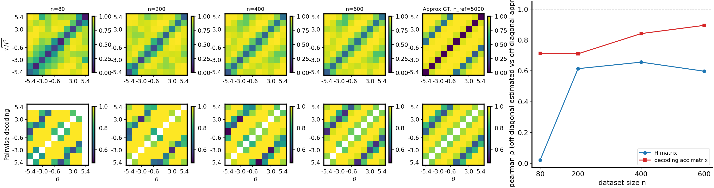

# H-decoding convergence struggles on periodic (cosine) conditional means

## Question / context

The **H-decoding convergence** study (`bin/study_h_decoding_convergence.py`) trains posterior and prior score models on nested subsets, then compares **binned symmetric \(H\)** matrices to a **Monte Carlo generative Hellinger** reference and reports **Spearman** correlations (off-diagonal) between learned summaries and references. We care whether that agreement holds when the conditional mean \(\mu(\theta)\) has **strong periodic structure in \(\theta\)** (cosine tuning), including in **dimension \(d>2\)**.

This note records a **qualitative takeaway** supported by recent runs: **the method does not work reliably in this periodic regime**, especially for the **binned-\(H\) vs MC GT** track at modest training sizes, and this fits a pattern already seen on **circular** (`cos_sin_piecewise`) data ([2026-04-10 note](2026-04-10-h-decoding-convergence-cos-sin-piecewise.md)).

## Method (what is being measured)

- **Dataset:** `cosine_gaussian` — \(\theta \sim \mathrm{Unif}[\theta_{\mathrm{low}},\theta_{\mathrm{high}}]\), conditional mean \(\mu_j(\theta)=\cos(\theta+\phi_j)\) with phases \(\phi_j=2\pi j/d\), diagonal Gaussian observation noise with **activity-coupled** variances (see `ToyConditionalGaussianDataset` in `fisher/data.py` and `family_recipe_dict` in `fisher/dataset_family_recipes.py`).
- **Protocol:** Same script as other H-decoding notes: `n_ref` reference column for MC \(\sqrt{H^2}\), nested `n` list, DSM posterior + prior, FiLM posterior by default in the study wrapper.
- **Headline metrics** (from `h_decoding_convergence_results.csv`): `corr_h_binned_vs_gt_mc` (binned learned \(H\) vs MC GT) and `corr_clf_vs_ref` (pairwise decoding vs reference subset).

Separating **observation** from **conclusion**: low `corr_h` here means **poor rank agreement** between the learned binned-\(H\) geometry and the MC Hellinger geometry for this generative model—not a proof of impossibility, but a **practical failure mode** for this pipeline.

## Reproduction (commands and scripts)

**1. Build a 3D `cosine_gaussian` pool (\(N=5000\))**

```bash
mamba run -n geo_diffusion python bin/make_dataset.py \
  --dataset-family cosine_gaussian \
  --x-dim 3 \
  --n-total 5000 \
  --output-npz /grad/zeyuan/score-matching-fisher/data/shared_fisher_dataset_cosine_gaussian_xdim3_n5000.npz
```

**2. Run H-decoding convergence (matches the saved run)**

```bash
mamba run -n geo_diffusion python bin/study_h_decoding_convergence.py \
  --dataset-npz /grad/zeyuan/score-matching-fisher/data/shared_fisher_dataset_cosine_gaussian_xdim3_n5000.npz \
  --dataset-family cosine_gaussian \
  --n-ref 5000 \
  --n-list 80,200,400,600 \
  --output-dir /grad/zeyuan/score-matching-fisher/data/h_decoding_conv_cosine_gaussian_xdim3_n5000 \
  --device cuda \
  --score-epochs 400 \
  --prior-epochs 400 \
  --decoder-epochs 50 \
  --score-early-patience 80 \
  --prior-early-patience 80
```

The study script sets **`skip_shared_fisher_gt_compare`** internally (H-matrix–focused sweep per `study_h_decoding_convergence.py`); training budget above is **reduced** from default 10k epochs for wall-clock feasibility—**compare runs only at fixed settings**, not across different epoch counts.

**3. 2D control (same \(N\), same `n_list`, same training budget)** — dataset and output dir used earlier in this project:

- NPZ: `/grad/zeyuan/score-matching-fisher/data/shared_fisher_dataset_cosine_gaussian_n5000.npz`
- Output: `/grad/zeyuan/score-matching-fisher/data/h_decoding_conv_cosine_gaussian_n5000/`

## Results (numbers from saved CSVs)

Spearman **off-diagonal** correlations (see `h_decoding_convergence_results.csv` in each output directory).

| Setting | \(d\) | \(n=80\) `corr_h` | \(n=600\) `corr_h` |
|--------|------|-------------------|-------------------|
| `cosine_gaussian`, \(N=5000\) | 2 | 0.368 | 0.544 |
| `cosine_gaussian`, \(N=5000\) | 3 | 0.022 | 0.598 |

At **\(n=80\)**, the **3D cosine** run’s binned-\(H\) vs GT correlation **collapses** (essentially **no rank alignment**), while the **2D** run at the same protocol remains **moderate**. At **\(n=600\)**, `corr_h` in 3D is **not** catastrophic, but the **small-\(n\)** behavior is the clearest sign that the **periodic / multi-phase mean** plus **higher-dimensional** observations **break the useful operating point** of the metric for this pipeline.

The **pairwise decoding** track (`corr_clf_vs_ref`) stays comparatively high in both tables—so the headline failure is **specific to the Hellinger / binned-\(H\) comparison**, not to every diagnostic in the CSV.

## Figure

Combined convergence + matrix panel for the **3D** run (same run as the table’s second row):



The left column shows **Spearman vs \(n\)** for binned \(H\) vs MC GT and for decoding; the right panel shows **heatmap blocks** per \(n\) and the reference column. When `corr_h` is near zero at small \(n\), the **\(H\)** track is not tracking the generative geometry in a useful way.

## Artifacts (absolute paths)

**3D pipeline**

- Dataset NPZ: `/grad/zeyuan/score-matching-fisher/data/shared_fisher_dataset_cosine_gaussian_xdim3_n5000.npz`
- Run directory: `/grad/zeyuan/score-matching-fisher/data/h_decoding_conv_cosine_gaussian_xdim3_n5000/`
- Results CSV: `/grad/zeyuan/score-matching-fisher/data/h_decoding_conv_cosine_gaussian_xdim3_n5000/h_decoding_convergence_results.csv`
- Summary: `/grad/zeyuan/score-matching-fisher/data/h_decoding_conv_cosine_gaussian_xdim3_n5000/h_decoding_convergence_summary.txt`
- Combined figure (source for journal copy): `/grad/zeyuan/score-matching-fisher/data/h_decoding_conv_cosine_gaussian_xdim3_n5000/h_decoding_convergence_combined.png`

**2D control (same protocol family)**

- CSV: `/grad/zeyuan/score-matching-fisher/data/h_decoding_conv_cosine_gaussian_n5000/h_decoding_convergence_results.csv`

## Takeaway

- **Periodic / cosine structured** conditional means (\(\mu_j(\theta)\) periodic in \(\theta\)) are a **stress test** for the **binned \(H\) vs generative Hellinger** agreement used in this study.
- Empirically, **agreement can be very poor at small \(n\)**, and **dimension matters**: the **3D cosine_gaussian** run shows a **near-zero** `corr_h` at \(n=80\) under the same training budget as a **2D** run that looks healthier on the same metric.
- Together with the **circular** `cos_sin_piecewise` run ([2026-04-10](2026-04-10-h-decoding-convergence-cos-sin-piecewise.md)), the practical statement is: **do not assume this H-decoding pipeline validates score geometry on strongly periodic conditionals** without separate checks.
