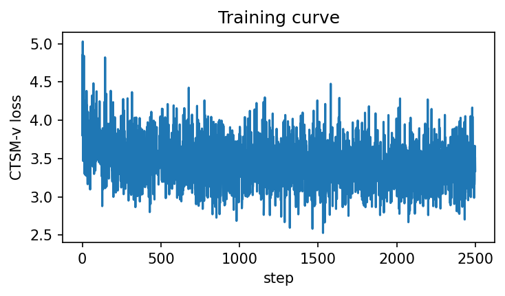
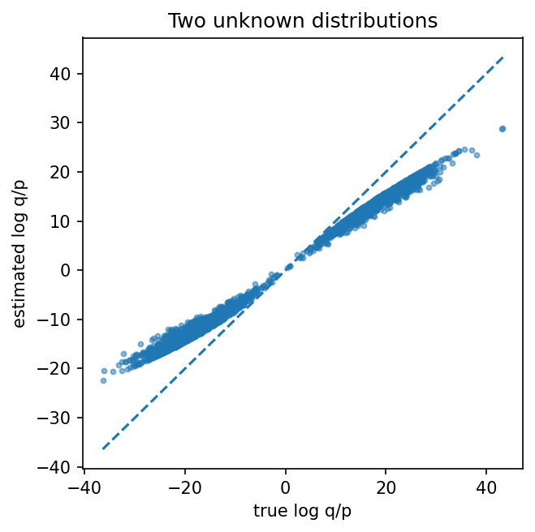
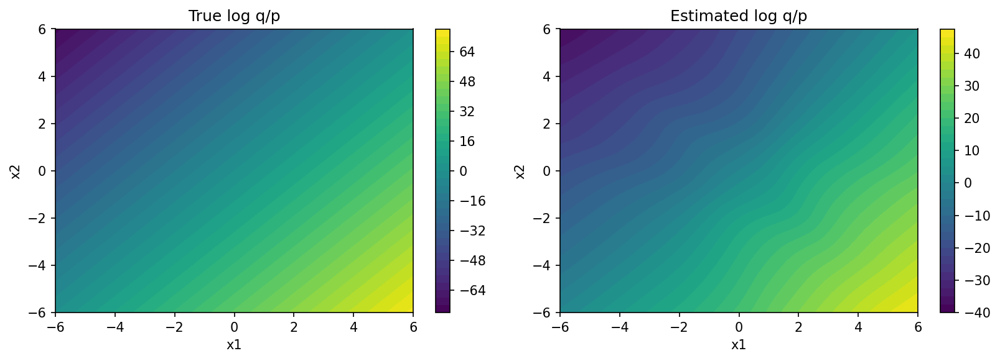

# CTSM-v toy: two-sample bridge, bimodal $p$/$q$, and recovering $\log q/p$

**Markdown + reproducibility** — documents `tests/ctsm.py` after the **two-sample Schrödinger-bridge-style path (`TwoSB`)** refactor: training uses **only samples** from unknown $p$ and $q$; **evaluation** compares the integrated time score to the **exact** $\log q - \log p$ from the chosen toy densities (two **Gaussian mixtures** in $\mathbb{R}^2$). Reusable CTSM-v pieces live under **`fisher/ctsm_paths.py`**, **`fisher/ctsm_models.py`**, and **`fisher/ctsm_objectives.py`**; the test file is the **experiment driver** (GMM setup, training loop, plots).

*(Filename still contains `gaussian` from the earlier Gaussian-only note; the experiment below is **non-Gaussian** $p$ and $q$.)*

## Question / context

Given **i.i.d. samples** from two distributions $p$ and $q$ on $\mathbb{R}^2$, can we train a small **CTSM-v** objective on a **conditional linear bridge** between paired endpoints $(x_0, x_1)$ with $x_0\sim p$, $x_1\sim q$, and then recover **$\log q(x) - \log p(x)$** by integrating a learned **scalar time score** in $t$? This note matches the current `tests/ctsm.py` (CUDA, seed $0$).

## Toy dataset (evaluation ground truth only)

Both $p$ and $q$ are **50/50 mixtures of isotropic Gaussians** with component standard deviation $\sigma = 0.7$ (`SIGMA` in code).

- **$p$** has means $(-3, 0)$ and $(0, 3)$.
- **$q$** has means $(3, 0)$ and $(0, -3)$.

Training draws independent $x_0\sim p$ and $x_1\sim q$ each step (`sample_two_unknown`). For **metrics and plots** only, the script uses PyTorch distributions to evaluate

$$
\log \frac{q(x)}{p(x)} = \log q(x) - \log p(x).
$$

## Method (minimal CTSM-v on a `TwoSB` path)

**Bridge (`TwoSB`).** With variance parameter `two_sb_var` $= 2$ (so `sigma = sqrt(2)` inside targets), the path is

$$
x_t = (1-t)x_0 + t x_1 + \sqrt{\,t(1-t)\,\mathrm{var}\,}\,\epsilon,\qquad \epsilon\sim \mathcal{N}(0,I).
$$

This is the same **linear two-sample bridge** structure as the upstream `prob_path_lib.TwoSB` sketch in the script header.

**Vector targets.** `TwoSB.full_epsilon_target` (in **`fisher/ctsm_paths.py`**) returns $(\lambda_t, \text{targets})$ in $\mathbb{R}^2$, adapted from the upstream CTSM-v construction (depends on $\epsilon$, $x_1-x_0$, $t$, and `factor` $=1$).

**Network and loss.** `ToyFullTimeScoreNet` (**`fisher/ctsm_models.py`**) maps $(x_t,t)\mapsto \mathbb{R}^2$. The training loss `ctsm_v_two_sample_loss` (**`fisher/ctsm_objectives.py`**) is the MSE matching $\lambda_t \,\mathrm{net}(x_t,t)$ to `targets` — the **full=True**-style timewise score matching branch, specialized to this path.

**Recovering $\log q/p$.** The scalar channel is $\mathrm{model}(x,t)=\sum_i \mathrm{net}_i(x,t)$. The default evaluation uses **uniform $t$ grid + trapezoid rule**:

$$
\widehat{\log \frac{q}{p}}(x) \approx \int_{\varepsilon_1}^{1-\varepsilon_2} \mathrm{model}(x,t)\,\mathrm{d}t
$$

implemented in `estimate_log_ratio_trapz` (**`fisher/ctsm_objectives.py`**, `torch.trapz`, `n_time=300` on held-out points). The same module defines `estimate_log_ratio_scipy` (`scipy.integrate.solve_ivp`) as a closer analogue to `density_ratios.get_toy_density_ratio_fn`; **`main()` in `tests/ctsm.py` uses the trapezoid path**.

**Metrics.** On $N_{\mathrm{eval}}=2000$ mixed $p$/$q$ points, the script prints **MSE** between `ratio_hat` and `ratio_true` and **Pearson correlation** between those two vectors (paired by sample index).

**Default training hyperparameters (current script):** `num_steps = 2500`, `batch_size = 512`, `hidden_dim = 128`, `lr = 2\times 10^{-3}$, `factor = 1.0`, `two_sb_var = 2.0`. Grid plots use `make_grid` with default range $[-6,6]^2$ and $n=140$.

## Results (representative run)

Regenerated on **CUDA**, **seed $0$**, with the defaults above:

| Metric | Value |
|--------|--------|
| MSE$(\widehat{\log q/p}, \log q/p)$ | $\approx 35.03$ |
| Pearson$(\text{ratio\_true}, \text{ratio\_hat})$ | $\approx 0.9968$ |

**Observation:** correlation remains very high on mixed draws. **Observation:** MSE is substantially larger than in the old Gaussian-only VP demo (different densities, bridge, and capacity). **Conclusion (tentative):** the two-sample GMM toy is a harder calibration problem; use both MSE and correlation (and the field plots) when judging fit.

## Figures



*Training curve (`num_steps = 2500`).*



*Held-out samples: true $\log q/p$ vs trapezoid-integrated estimate; title in the script is “Two unknown distributions”.*



*Contour maps of the analytic mixture ratio (left) and the integrated estimate (right).*

## Reproduction (commands and scripts)

From the **repository root**, using the `geo_diffusion` environment (`AGENTS.md`):

**Run the toy script (headless-safe matplotlib):**

```bash
cd /path/to/score-matching-fisher
MPLBACKEND=Agg mamba run -n geo_diffusion python tests/ctsm.py
```

**Regenerate the figures saved for this note** (overwrites `figure_1.png`–`figure_3.png`):

```bash
cd /path/to/score-matching-fisher
PYTHONUNBUFFERED=1 MPLBACKEND=Agg mamba run -n geo_diffusion python \
  journal/notes/figs/2026-04-16-ctsm-v-toy-gaussian/_generate_figures.py
```

Implementation pointers:

- `fisher/ctsm_paths.py` — `TwoSB` (marginal + `full_epsilon_target`).
- `fisher/ctsm_models.py` — `ToyFullTimeScoreNet`.
- `fisher/ctsm_objectives.py` — `ctsm_v_two_sample_loss`, `estimate_log_ratio_trapz`, `estimate_log_ratio_scipy`.
- `tests/ctsm.py` — seeds/device, `make_gmm` / `p_dist` / `q_dist`, sampling, `true_log_ratio`, `make_grid`, training `main` (imports from `fisher.ctsm_*`; small `sys.path` bootstrap so `python tests/ctsm.py` finds the package from repo root).
- `journal/notes/figs/2026-04-16-ctsm-v-toy-gaussian/_generate_figures.py` — loads `tests/ctsm.py` and patches `plt.show` to write PNGs next to itself.

## Artifacts

- **Figures (this note):** `/grad/zeyuan/score-matching-fisher/journal/notes/figs/2026-04-16-ctsm-v-toy-gaussian/figure_1.png`, `figure_2.png`, `figure_3.png`
- **Figure helper:** `/grad/zeyuan/score-matching-fisher/journal/notes/figs/2026-04-16-ctsm-v-toy-gaussian/_generate_figures.py`
- **Experiment driver:** `/grad/zeyuan/score-matching-fisher/tests/ctsm.py`
- **CTSM-v library modules:** `/grad/zeyuan/score-matching-fisher/fisher/ctsm_paths.py`, `fisher/ctsm_models.py`, `fisher/ctsm_objectives.py`

## Takeaway

The **two-sample** CTSM-v story is split between **`fisher/ctsm_*`** (bridge, net, loss, ratio integrators) and **`tests/ctsm.py`** (unknown $p$/$q$ via samples, training loop, 2D plots). The demo uses a **`TwoSB`** linear bridge with **bridge noise variance** `two_sb_var` and **log-ratio readout** by integrating the learned scalar time score (default: **trapezoid** in $t$). Ground truth for diagnostics is a **mixture-of-Gaussians** $\log q/p$. The recorded CUDA run shows **strong correlation** but **much higher MSE** than the earlier unimodal Gaussian VP toy — consistent with multimodal structure and limited model/training budget.
