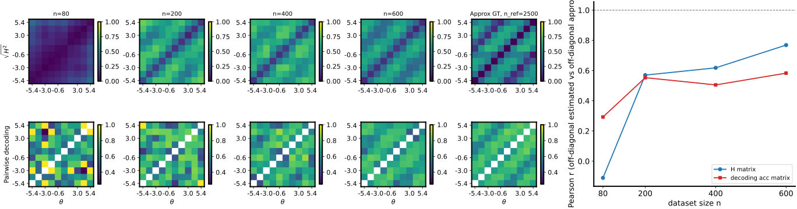

# Marginal leading dimensions for `flow_x_likelihood` H-decoding (`cosine_gaussian_sqrtd`, 10D)

## Question / context

Full **10D** `cosine_gaussian_sqrtd` data are difficult for the conditional **x-flow** H-decoding pipeline. To isolate geometry along a **prefix of coordinates** while keeping the **same** generative law in the ambient space, we train and evaluate on **slices** $x \in \mathbb{R}^K$ (first $K$ dimensions of the 10D draw) and compare the learned binned $H$ matrix to **ground-truth** Hellinger distances under the **marginal** $p(x_1,\ldots,x_K \mid \theta)$ implied by the **full** diagonal Gaussian model (including $\sqrt{d}$ variance scaling on each coordinate).

This note records the **method** (what was and was not used: two-stage training, Fourier embeddings, architecture, scheduler) and **reproducible** commands tied to saved artifacts under `data/`.

## Method

### Generative model (dataset)

- **Family:** `cosine_gaussian_sqrtd` — cosine means $\mu_j(\theta)$, observation noise with **per-coordinate** variance scaled by **ambient** $d$ (`ToyConditionalGaussianSqrtdDataset`: diagonal variances include a factor $d$ after activity coupling).
- **Fixed recipe** (`fisher/dataset_family_recipes.py`): e.g. $\sigma_{x1}=\sigma_{x2}=0.5$ (baseline scales feeding `_sigma_base`), plus internal coupling/hyperparameters; **not** exposed on the public dataset CLI.
- **Experiments below** use the **10D** archive `n_{\mathrm{total}}=3000`, `seed=7`, unless noted.

### Marginal data + marginal GT (implementation)

- **Script:** `bin/study_h_decoding_convergence_dim1_marginal.py` (name kept for history).
- **Slicing:** loads the **full** shared NPZ, writes a **new** NPZ with `x ← x[:, :K]`, `meta["x_dim"]=K`, and:
  - `meta["marginal_first_dim_gt_original_x_dim"] = 10` (ambient dimension used to rebuild the full toy model),
  - `meta["marginal_leading_dims_k"] = K`.
- **Ground truth for Hellinger MC:** `fisher/marginal_first_dim_wrapper.py` defines `MarginalLeadingDimsGaussianWrapper`, which wraps the **full** $d$-dimensional dataset object and exposes:
  - sampling the **leading** $K$ components of $x$,
  - $\log p(x_1,\ldots,x_K \mid \theta)$ for a **diagonal** Gaussian (sum of per-coordinate log-densities consistent with the parent).
- **Monkeypatch:** the study driver temporarily replaces `build_dataset_from_meta` in `fisher.shared_fisher_est`, `study_h_decoding_convergence`, and `visualize_h_matrix_binned` so that when the marginal meta keys are present, GT uses the wrapper instead of a naive $K$-dimensional “fresh” `cosine_gaussian_sqrtd` with $x_{\mathrm{dim}}=K$ (which would **not** match the $\sqrt{d}$ scaling of the original 10D experiment).

### H-decoding study (`bin/study_h_decoding_convergence.py`)

- **Field:** `--theta-field-method flow_x_likelihood` — trains a **conditional x-flow** only; **no** prior score; $H$ entries come from **x-space** ODE likelihoods $\log p(x\mid\theta)$ (see codebase / prior notes on `flow_x_likelihood`).
- **Conditional velocity architecture (`--flow-score-arch`):** runs documented here used **`mlp`** → `ConditionalXFlowVelocity` in `fisher/models.py`: an MLP on the concatenated input $[x_t,\theta,t_{\mathrm{feat}}]$ with **logit time** $t_{\mathrm{feat}} = \mathrm{logit}(t)$ (clamped).  
  - **Not used in these runs:** `--flow-score-arch film` (x-trunk + FiLM on $(\theta,t)$), `theta_fourier_mlp`, or `theta_fourier_film` (Fourier features of $\theta$ in the x-flow net).
- **Two-stage x-flow pretraining:** `--flow-x-two-stage-mean-theta-pretrain` — **off** (default). Logs show `two_stage_mean_theta_pretrain=False`. No separate “mean-$\theta$ then conditional” stage unless this flag is passed.
- **Flow-matching time schedule (`--flow-scheduler`):** after the repo default change, **`cosine`** is the default (alternatives: `vp`, `linear_vp`). The runs cited below were made with **`scheduler=cosine`** in training logs unless noted.
- **Other training defaults (CLI):** `--flow-epochs` default $10000$ with **early stopping** (`--flow-early-patience` default $1000$, `--flow-restore-best` on); `--flow-batch-size` $256$; `--flow-lr` $10^{-3}$; `--flow-hidden-dim` $128$; `--flow-depth` $3$.
- **Study sizes:** examples use `--n-ref 2500`, `--n-list 80,200,400,600`, `--num-theta-bins 10` (defaults), so GT MC uses $n_{\mathrm{mc}} = \lfloor n_{\mathrm{ref}} / n_{\mathrm{bins}}\rfloor = 250$ samples per bin row.

## Reproduction (commands & scripts)

Environment (see `AGENTS.md`):

```bash
mamba run -n geo_diffusion python <script>.py ... --device cuda
```

**Regenerate 10D dataset** (σ baseline 0.5 in current recipe):

```bash
mamba run -n geo_diffusion python bin/make_dataset.py \
  --dataset-family cosine_gaussian_sqrtd \
  --x-dim 10 \
  --n-total 3000 \
  --seed 7 \
  --output-npz data/cosine_gaussian_sqrtd_xdim10_n3000_seed7/shared_fisher_dataset.npz
```

**Marginal H-decoding** (replace `K` with 1, 2, or 5; output dir is arbitrary):

```bash
mamba run -n geo_diffusion python bin/study_h_decoding_convergence_dim1_marginal.py \
  --marginal-source-npz data/cosine_gaussian_sqrtd_xdim10_n3000_seed7/shared_fisher_dataset.npz \
  --leading-dims K \
  --dataset-family cosine_gaussian_sqrtd \
  --theta-field-method flow_x_likelihood \
  --flow-score-arch mlp \
  --output-dir data/h_decoding_dimK_marginal_flow_x_sqrtd10_sigma050_cosine_scheduler \
  --n-ref 2500 \
  --n-list 80,200,400,600 \
  --device cuda
```

Optional explicit scheduler (defaults to **cosine** if unchanged in `fisher/cli_shared_fisher.py`):

```bash
  --flow-scheduler cosine
```

**Sliced NPZ output** (default path next to the 10D file):  
`/grad/zeyuan/score-matching-fisher/data/cosine_gaussian_sqrtd_xdim10_n3000_seed7/dimK_marginal/shared_fisher_dataset.npz`

**Key modules:** `fisher/marginal_first_dim_wrapper.py`, `bin/study_h_decoding_convergence_dim1_marginal.py`, `fisher/cli_shared_fisher.py` (`add_estimation_arguments`), `fisher/shared_fisher_est.py` (training + H-matrix wiring).

## Results (off-diagonal Pearson $r$, binned $H$ vs MC GT)

Configuration: **σ recipe 0.5**, **`flow_score_arch=mlp`**, **no two-stage**, **`flow_scheduler=cosine`**, **`n=80,200,400,600`**, **`n_{\mathrm{ref}}=2500`**.

| Leading dims $K$ | Run output directory (under repo `data/`) | $n=80$ | $n=200$ | $n=400$ | $n=600$ |
|------------------|-------------------------------------------|--------|---------|---------|---------|
| 1 | `h_decoding_dim1_marginal_flow_x_sqrtd10_sigma050_cosine_scheduler` | 0.3390 | 0.5447 | 0.6377 | 0.6318 |
| 2 | `h_decoding_dim2_marginal_flow_x_sqrtd10_sigma050_cosine_scheduler` | 0.2349 | 0.6303 | 0.7246 | 0.7086 |
| 5 | `h_decoding_dim5_marginal_flow_x_sqrtd10_sigma050_cosine_scheduler` | −0.1105 | 0.5699 | 0.6180 | 0.7687 |

**Clf column** (pairwise bin decoding vs $n_{\mathrm{ref}}$ subset) is in each run’s `h_decoding_convergence_results.csv` and `run.log`.

**Observation:** $K=1$ and $K=2$ show moderate-to-strong $r$ at $n\ge200$; $K=5$ is weak at $n=80$ but rises with $n$. These numbers are **single-seed** training runs with early stopping—replication with `--run-seed` / more epochs may be needed for stable conclusions.

## Figure

Combined convergence figure ($K=5$, σ=0.5, cosine scheduler), copied from the run directory:



The left panel tracks off-diagonal Pearson correlation of $\sqrt{H_{\mathrm{sym}}}$ vs MC ground truth; the right panel shows the matrix strip for the largest $n$ in the list plus the GT column.

## Artifacts (absolute paths)

- **10D source NPZ:** `/grad/zeyuan/score-matching-fisher/data/cosine_gaussian_sqrtd_xdim10_n3000_seed7/shared_fisher_dataset.npz`
- **Marginal NPZs:**  
  - `/grad/zeyuan/score-matching-fisher/data/cosine_gaussian_sqrtd_xdim10_n3000_seed7/dim1_marginal/shared_fisher_dataset.npz`  
  - `/grad/zeyuan/score-matching-fisher/data/cosine_gaussian_sqrtd_xdim10_n3000_seed7/dim2_marginal/shared_fisher_dataset.npz`  
  - `/grad/zeyuan/score-matching-fisher/data/cosine_gaussian_sqrtd_xdim10_n3000_seed7/dim5_marginal/shared_fisher_dataset.npz`
- **Study outputs:**  
  - `/grad/zeyuan/score-matching-fisher/data/h_decoding_dim1_marginal_flow_x_sqrtd10_sigma050_cosine_scheduler/`  
  - `/grad/zeyuan/score-matching-fisher/data/h_decoding_dim2_marginal_flow_x_sqrtd10_sigma050_cosine_scheduler/`  
  - `/grad/zeyuan/score-matching-fisher/data/h_decoding_dim5_marginal_flow_x_sqrtd10_sigma050_cosine_scheduler/`  

Each directory contains `h_decoding_convergence_results.{npz,csv}`, `h_decoding_convergence_combined.{png,svg}`, `run.log`, and `training_losses/`.

## Takeaway

- **Architecture in these runs:** plain **x-flow MLP** (`--flow-score-arch mlp`), **not** FiLM or **theta Fourier** features; **no** `--flow-x-two-stage-mean-theta-pretrain`.
- **Scheduler:** **cosine** flow-matching path (default in the cited runs).
- **GT:** **Marginal** likelihood under the **10D** sqrtd model, not a separately regenerated $K$-dimensional dataset with $d=K$.

For **Fourier** or **two-stage** `flow_x_likelihood` variants, set `--flow-score-arch theta_fourier_mlp` (and `--flow-x-theta-fourier-*`) or `--flow-x-two-stage-mean-theta-pretrain` explicitly; those were **not** the configuration for the table above.
