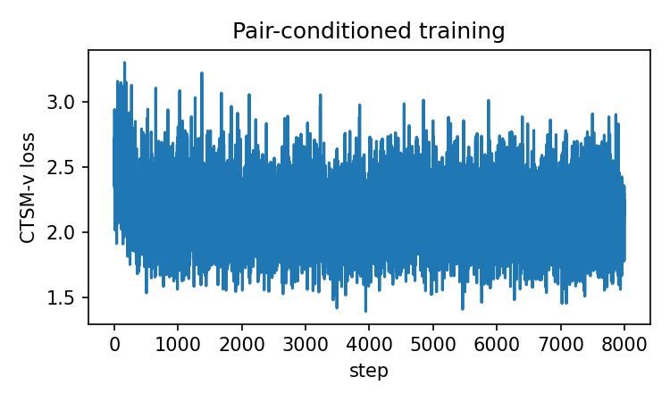
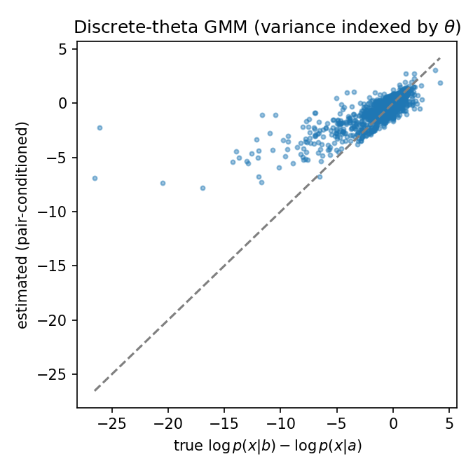

# Pair-conditioned CTSM-v: discrete $\theta$ grid on a conditional GMM (variance index)

**Markdown + reproducibility** — documents the toy stack extension for **parameterized** conditionals $p(x\mid\theta)$: a **pair-conditioned** vector field $f_\phi(x,t,m,\Delta)$ with $m=(a+b)/2$, $\Delta=b-a$, trained with the same **TwoSB** CTSM-v target as the two-sample case, and **trapezoid integration** in $t$ to estimate $\log p(x\mid b)-\log p(x\mid a)$. Implementation: `fisher/ctsm_models.py` (`ToyPairConditionedTimeScoreNet`), `fisher/ctsm_objectives.py` (`ctsm_v_pair_conditioned_loss`, `estimate_log_ratio_trapz_pair`), driver `tests/ctsm_pair_conditioned.py`. Theory note: `report/notes/ctsm_v.tex`.

## Question / context

We want a **sanity check** before using continuous $\theta$ in real data: treat $\theta$ as a **finite grid** (discretized variance), sample endpoint pairs $(a,b)$, draw $x_0\sim p(\cdot\mid a)$ and $x_1\sim p(\cdot\mid b)$, run the **linear Gaussian bridge** (TwoSB), and ask whether the learned **scalar time score** integrated over $t$ matches the **exact** log-density difference at test points.

## Method (short)

- **Family:** $p(x\mid\theta)$ is a **50/50 mixture of two isotropic Gaussians** in $\mathbb{R}^2$ with fixed means; component standard deviation $\sigma(\theta)$ is **linear** in $\theta\in[\theta_{\mathrm{lo}},\theta_{\mathrm{hi}}]$ (discretized to $K$ values on a grid).
- **Bridge:** same as `tests/ctsm.py`: $x_t=(1-t)x_0+t x_1+\sqrt{t(1-t)\,\mathrm{var}}\,\varepsilon$ with `TwoSB` variance `two_sb_var` (default $2$).
- **Network:** $f_\phi(x,t,m,\Delta)\in\mathbb{R}^2$; training matches $\lambda_t f_\phi$ to the closed-form vector target (`full_epsilon_target`). Optional input scaling: `m_scale=1`, `delta_scale=0.5` so $\Delta\in[-2,2]$ is not oversized relative to $x$.
- **Inference:** $\widehat{\log\frac{p(x\mid b)}{p(x\mid a)}}\approx \int_{\varepsilon_1}^{1-\varepsilon_2}\hat s(x,t,m,\Delta)\,dt$ with $\hat s=\mathbf{1}^\top f_\phi$, implemented as `estimate_log_ratio_trapz_pair` (trapezoid grid in $t$).

## Reproduction (commands and scripts)

From the **repository root**, with the `geo_diffusion` environment (`AGENTS.md`):

**Train + evaluate + save PNGs** (defaults: `--num-steps 8000`, `--hidden-dim 256`, `--device cuda`):

```bash
mamba run -n geo_diffusion python tests/ctsm_pair_conditioned.py --device cuda
```

**Custom output directory** (e.g. to refresh journal figures):

```bash
mamba run -n geo_diffusion python tests/ctsm_pair_conditioned.py --device cuda \
  --output-dir journal/notes/figs/2026-04-16-pair-conditioned-ctsm-v
```

**Unit smoke test** (CPU, no long training loop):

```bash
mamba run -n geo_diffusion python -m unittest discover -s tests -p "test_ctsm_pair_conditioned.py" -v
```

Key modules:

- `fisher/ctsm_paths.py` — `TwoSB`
- `fisher/ctsm_models.py` — `ToyPairConditionedTimeScoreNet`
- `fisher/ctsm_objectives.py` — `ctsm_v_pair_conditioned_loss`, `estimate_log_ratio_trapz_pair`

## Results (representative CUDA run)

Configuration: **seed 0**, **8000** steps, batch **512**, **TwoSB var = 2**, **9** $\theta$ grid points, **4000** eval points, **320** trapezoid time steps (`--n-time`), **hidden 256**.

Printed metrics (mixed $(a,b)$ and $x\sim p(\cdot\mid a)$):

| Metric | Value (approx.) |
|--------|------------------|
| MSE$(\hat r, \log p(x\mid b)-\log p(x\mid a))$ | $\approx 1.13$ |
| Pearson correlation (true vs estimated) | $\approx 0.80$ |

**Observation:** error grows when $|b-a|$ is large (coarser bins in the script), which is expected if the network must **extrapolate** in $\Delta$ across the grid.

**Observation:** the original **two-sample** GMM toy (`tests/ctsm.py`) targets a single $(p,q)$ pair; this note’s experiment adds **many** $(a,b)$ pairs — a harder **multi-bridge** fitting problem, so absolute MSE should not be compared one-to-one without matching setups.

## Figures



*CTSM-v training loss for the pair-conditioned network (default step budget).*



*Held-out tuples: horizontal axis is $\log p(x\mid b)-\log p(x\mid a)$; vertical axis is the trapezoid-integrated estimate. The diagonal reference line is gray.*

## Artifacts

- **Default PNG output (DATAROOT symlink):** `<repo-root>/data/ctsm_pair_conditioned_toy/pair_ctsm_loss.png`, `pair_ctsm_scatter.png` (same inode as `DATAROOT` when `data/` is linked).
- **Copies embedded in this note:** `/grad/zeyuan/score-matching-fisher/journal/notes/figs/2026-04-16-pair-conditioned-ctsm-v/pair_ctsm_loss.png`, `pair_ctsm_scatter.png`.

## Takeaway

The **pair-conditioned** CTSM-v wiring matches the note in `report/notes/ctsm_v.tex`: same TwoSB targets, extra inputs $(m,\Delta)$, integration in $t$ for $\log p(x\mid b)/p(x\mid a)$. On a **discrete-$\theta$ variance GMM**, a short CUDA run yields **correlation $\approx 0.8$** on mixed pairs; tightening $|a-b|$ at test time reduces MSE in the reported bins. Next step for the project is to move from this grid to **fully continuous** $\theta$ sampling and real datasets.
