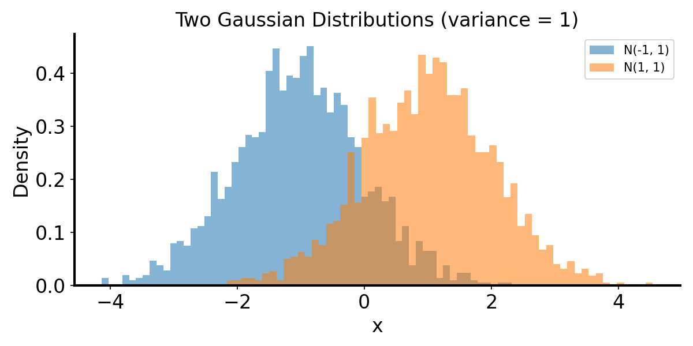
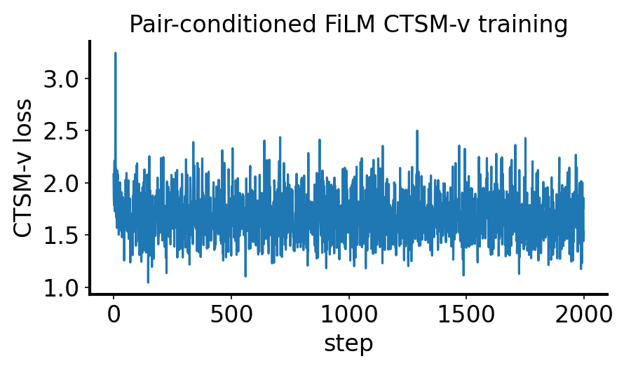
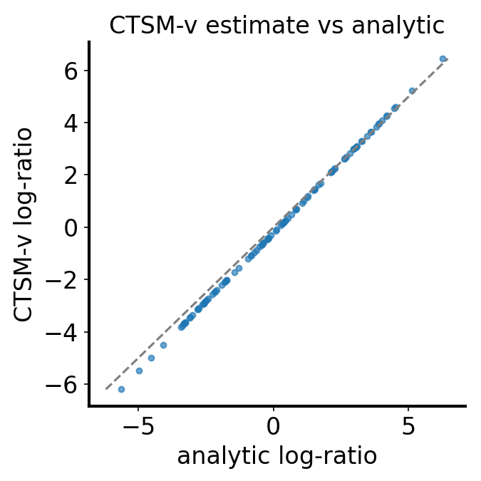

# CTSM-v log-likelihood ratio between two Gaussians ($\mu=-1$ vs $\mu=1$)

**Markdown + reproducibility** — documents the experiment implemented in `tests/gaussian_two_dist_viz.py`: two 1D Gaussian distributions with variance $1$, synthetic labels $-1$ and $+1$, and pair-conditioned CTSM-v (`ToyPairConditionedTimeScoreNetFiLM`) to estimate

$$
\log p(x\mid +1) - \log p(x\mid -1).
$$

## Question / context

Given two known toy distributions,

$$
p(x\mid -1)=\mathcal{N}(-1,1),\qquad p(x\mid +1)=\mathcal{N}(1,1),
$$

can pair-conditioned CTSM-v recover the analytic log-likelihood ratio on held-out points?

## Method

We use the pair-conditioned CTSM-v formulation with fixed condition labels:

- distribution A (`N(-1,1)`) is labeled $a=-1$,
- distribution B (`N(1,1)`) is labeled $b=+1$.

Training uses `ctsm_v_pair_conditioned_loss` with a `TwoSB` bridge and a FiLM-conditioned network `ToyPairConditionedTimeScoreNetFiLM` in 1D.

For each training batch, we draw:

$$
x_0\sim p(x\mid -1),\qquad x_1\sim p(x\mid +1),\qquad a=-1,\quad b=+1.
$$

At evaluation, CTSM-v ratio estimates are computed by trapezoid integration in time using `estimate_log_ratio_trapz_pair`:

$$
\widehat r(x)=\int_{\epsilon}^{1-\epsilon}\hat s(x,t,m,\Delta)\,dt,
\quad m=\frac{a+b}{2},\ \Delta=b-a.
$$

Ground truth (GT) is computed analytically from Gaussian log-densities:

$$
r_{\mathrm{GT}}(x)=\log p(x\mid +1)-\log p(x\mid -1).
$$

## Reproduction (commands & scripts)

Run from repository root:

```bash
mamba run -n geo_diffusion python tests/gaussian_two_dist_viz.py \
  --device cuda \
  --n-ratio 100 \
  --enable-ctsm
```

This generates data visualization, analytic ratio CSV, CTSM-v ratio CSV, and CTSM figures under `DATAROOT/tests` (reported via repo `data/` symlink).

## Results

The run evaluates on $100$ points (balanced: 50 from each Gaussian), with ratio convention
$\log p(x\mid +1)-\log p(x\mid -1)$.

Computed from `./data/tests/gaussian_two_dist_ctsm_log_ratio_100.csv`:

- $n=100$
- MSE$(\widehat r, r_{\mathrm{GT}})=0.056747$
- MAE$(\widehat r, r_{\mathrm{GT}})=0.195490$
- Pearson correlation$=0.999978$
- GT ratio mean/std: $0.152070 / 2.604252$
- CTSM ratio mean/std: $-0.021812 / 2.766080$

Interpretation: CTSM-v closely tracks GT shape (near-perfect correlation), with small but visible calibration bias (mean shift and slightly larger spread).

## Figures



*Generated samples from $\mathcal{N}(-1,1)$ and $\mathcal{N}(1,1)$.*



*Pair-conditioned FiLM CTSM-v training loss over optimization steps.*



*Estimated log-ratio vs analytic GT. The gray diagonal is the ideal line.*

## Artifacts

- Note: `/nfshome/zeyuan/score-matching-fisher/journal/notes/2026-04-18-ctsm-v-gaussian-two-dist-log-ratio.md`
- Figures copied for note:
  - `/nfshome/zeyuan/score-matching-fisher/journal/notes/figs/2026-04-18-ctsm-v-gaussian-two-dist-log-ratio/figure_1_data_hist.png`
  - `/nfshome/zeyuan/score-matching-fisher/journal/notes/figs/2026-04-18-ctsm-v-gaussian-two-dist-log-ratio/figure_2_ctsm_loss.png`
  - `/nfshome/zeyuan/score-matching-fisher/journal/notes/figs/2026-04-18-ctsm-v-gaussian-two-dist-log-ratio/figure_3_ctsm_vs_gt.png`
- Data-side outputs:
  - `/nfshome/zeyuan/score-matching-fisher/data/tests/gaussian_two_dist_log_ratio_100.csv`
  - `/nfshome/zeyuan/score-matching-fisher/data/tests/gaussian_two_dist_ctsm_log_ratio_100.csv`
  - `/nfshome/zeyuan/score-matching-fisher/data/tests/gaussian_two_dist_viz.png`
  - `/nfshome/zeyuan/score-matching-fisher/data/tests/gaussian_two_dist_ctsm_loss.png`
  - `/nfshome/zeyuan/score-matching-fisher/data/tests/gaussian_two_dist_ctsm_scatter.png`

## Takeaway

For this 1D Gaussian pair, pair-conditioned CTSM-v with fixed labels ($-1$, $+1$) reliably recovers the log-likelihood-ratio ordering and magnitude trend. The remaining error is mostly calibration-scale/offset rather than rank-order failure.
