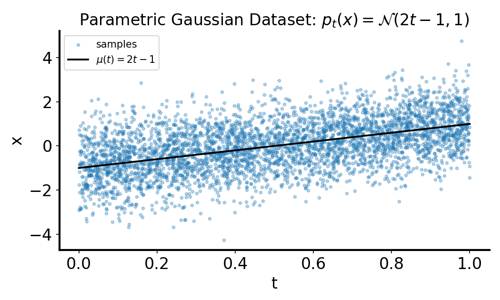
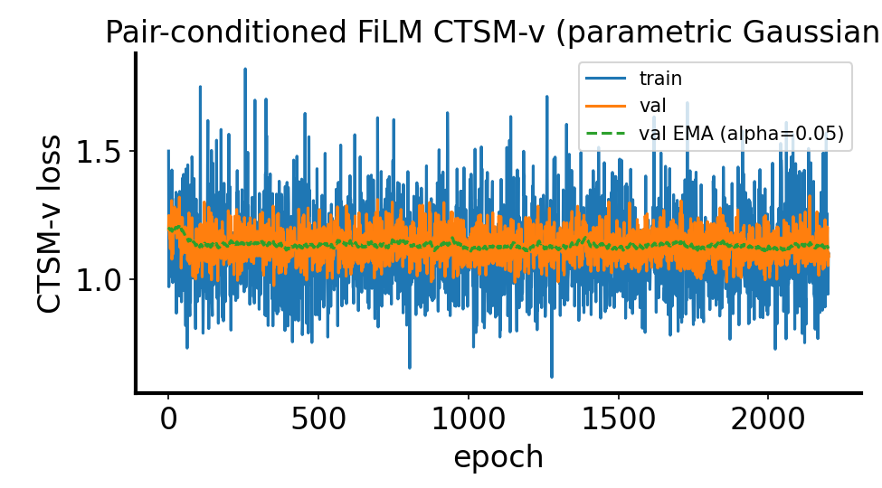
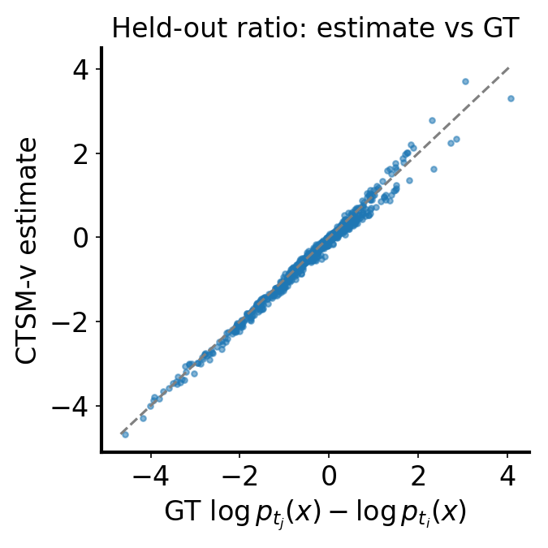

# CTSM-v log-likelihood ratio for parametric Gaussian family $p_t(x)=\mathcal{N}(2t-1,1)$

**Markdown + reproducibility** note for the new script `tests/gaussian_parametric_t_viz.py`: generate a parametric dataset of $(x,t)$ samples and estimate held-out ratios

$$
\log p_{t_j}(x)-\log p_{t_i}(x)
$$

with pair-conditioned CTSM-v (`ToyPairConditionedTimeScoreNetFiLM`).

## Question / context

Instead of two fixed Gaussians, we use a continuous family:

$$
p_t(x)=\mathcal{N}(\mu(t),1),\qquad \mu(t)=2t-1,\qquad t\in[0,1].
$$

Can pair-conditioned CTSM-v learn to estimate the held-out log-likelihood ratio between arbitrary pairs $(t_i,t_j)$ on this continuous condition axis?

## Method

### Data model

- Sample conditions uniformly: $t\sim\mathrm{Unif}(0,1)$.
- Sample observations: $x\mid t \sim \mathcal{N}(2t-1,1)$.
- Export dataset as `(x, t, mu_t)`.

### CTSM-v training target

For training batches, draw independent condition pairs and endpoints:

$$
t_0,t_1\sim\mathrm{Unif}(0,1),\quad x_0\sim p_{t_0},\quad x_1\sim p_{t_1}.
$$

Use pair-conditioned CTSM-v loss `ctsm_v_pair_conditioned_loss` with a `TwoSB` bridge and FiLM-conditioned model `ToyPairConditionedTimeScoreNetFiLM`.

### Held-out ratio evaluation

For each held-out sample, draw $(t_i,t_j)$ uniformly and sample $x\sim p_{t_i}$.  
Ground truth is analytic:

$$
r_{\mathrm{GT}}(x,t_i,t_j)=\log p_{t_j}(x)-\log p_{t_i}(x).
$$

CTSM-v estimate uses trapezoid integration:

$$
\widehat r(x,t_i,t_j)=\int_{\epsilon}^{1-\epsilon}\hat s(x,\tau,m,\Delta)\,d\tau,
\quad m=\frac{t_i+t_j}{2},\ \Delta=t_j-t_i.
$$

## Reproduction (commands & scripts)

Script:

- `tests/gaussian_parametric_t_viz.py`

Full run used for the results below:

```bash
mamba run -n geo_diffusion python tests/gaussian_parametric_t_viz.py \
  --device cuda \
  --ctsm-max-epochs 10000 \
  --ctsm-early-patience 1000
```

## Results

From `./data/tests/gaussian_parametric_t_ctsm_training_summary.json` and `./data/tests/gaussian_parametric_t_ratio_eval.csv`:

- $n=1000$ held-out ratio points
- MSE$(\widehat r, r_{\mathrm{GT}})=0.012735$
- MAE$(\widehat r, r_{\mathrm{GT}})=0.076958$
- Pearson correlation$=0.994073$
- Early stopping: stopped at epoch $2202$ (best epoch $1202$), with best val-EMA loss $1.105110$
- GT ratio mean/std: $-0.335427 / 0.936983$
- CTSM ratio mean/std: $-0.383746 / 0.936306$

Interpretation: on this continuous condition family, pair-conditioned CTSM-v recovers the held-out ratio very accurately (high correlation, low MSE/MAE), with a small mean bias remaining.

## Figures



*Sampled dataset with overlayed $\mu(t)=2t-1$ trend.*



*Training, validation, and EMA-monitored validation losses.*



*Estimated vs ground-truth log-ratio for random held-out $(t_i,t_j)$ pairs.*

## Artifacts

- Note:
  - `/nfshome/zeyuan/score-matching-fisher/journal/notes/2026-04-18-ctsm-v-parametric-gaussian-t-log-ratio.md`
- Figures copied for note:
  - `/nfshome/zeyuan/score-matching-fisher/journal/notes/figs/2026-04-18-ctsm-v-parametric-gaussian-t-log-ratio/figure_1_dataset_xt.png`
  - `/nfshome/zeyuan/score-matching-fisher/journal/notes/figs/2026-04-18-ctsm-v-parametric-gaussian-t-log-ratio/figure_2_ctsm_loss.png`
  - `/nfshome/zeyuan/score-matching-fisher/journal/notes/figs/2026-04-18-ctsm-v-parametric-gaussian-t-log-ratio/figure_3_ctsm_vs_gt.png`
- Run outputs under repo `data/` symlink:
  - `/nfshome/zeyuan/score-matching-fisher/data/tests/gaussian_parametric_t_viz.png`
  - `/nfshome/zeyuan/score-matching-fisher/data/tests/gaussian_parametric_t_dataset.csv`
  - `/nfshome/zeyuan/score-matching-fisher/data/tests/gaussian_parametric_t_ratio_eval.csv`
  - `/nfshome/zeyuan/score-matching-fisher/data/tests/gaussian_parametric_t_ctsm_loss.png`
  - `/nfshome/zeyuan/score-matching-fisher/data/tests/gaussian_parametric_t_ctsm_scatter.png`
  - `/nfshome/zeyuan/score-matching-fisher/data/tests/gaussian_parametric_t_ctsm_training_summary.json`

## Takeaway

For a continuous 1D Gaussian family with linearly varying mean, pair-conditioned CTSM-v generalizes to random held-out condition pairs and provides accurate log-likelihood-ratio estimates.
