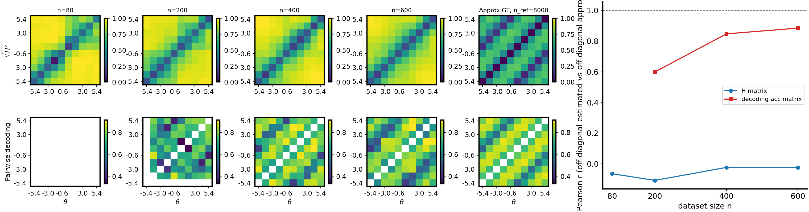

# Segment-wise θ-flow for H-decoding: equal-width θ regions, full-pool scoring, row-wise merge

**Date:** 2026-04-18  
**Context:** H-decoding convergence study (`bin/study_h_decoding_convergence.py`) with **`theta_flow`** extended by a **segmented** mode: several conditional/prior θ-space flows are trained on disjoint θ ranges, each model still evaluates Bayes log-ratios on the **entire** nested subset, and a single $N\times N$ symmetric $H^{\mathrm{sym}}$ is assembled before the usual θ-binning and correlation metrics.

---

## Method (conceptual)

1. **Nested subset**  
   For each sample size $n$ in `--n-list`, the study takes the first $n$ rows of a fixed global permutation of the shared dataset (same convention as the non-segmented pipeline).

2. **Equal-width θ segments (training regions)**  
   On that subset, scalar $\theta$ is split into $K$ **equal-width** bins between $\min\theta$ and $\max\theta$ over the $n$ rows (not the full archive). Row $i$ receives a segment id $s_i \in \{0,\ldots,K-1\}$.  
   Implementation: `theta_segment_ids_equal_width` in `bin/visualize_h_matrix_binned.py` (and a thin delegating wrapper in `bin/study_h_decoding_convergence.py`).

3. **Per-segment training bundle**  
   For each segment $s$ with at least one train and one validation row (in the subset’s train/val split), build a `SharedDatasetBundle` that only contains rows with $s_i=s$, preserving which of those rows are train vs validation relative to the parent subset (`shared_dataset_bundle_row_subset`).

4. **Per-segment θ-flow + full-pool H matrix**  
   For each segment, run the usual shared Fisher path for **`theta_flow`** (posterior θ-flow + prior θ-flow, early stopping, etc.), but when building the $H$ matrix, pass the **parent** subset’s full `(theta_all, x_all)` into the estimator via optional kwargs  
   `theta_h_matrix_eval` / `x_h_matrix_eval` on `run_shared_fisher_estimation` (`fisher/shared_fisher_est.py`).  
   So each segment model is **trained** only on its θ band, but **scores** every pair involving all $n$ points. That yields a full candidate $H^{\mathrm{sym}}_s \in \mathbb{R}^{n\times n}$ per segment.

5. **Row-wise gating**  
   The merged directed matrix before symmetrization is
   $$
   H_{ij} \;=\; \bigl(H^{\mathrm{sym}}_{s_i}\bigr)_{ij},
   $$
   i.e. row $i$ is taken from the candidate matrix of the model trained for segment $s_i$.  
   Helper: `merge_theta_flow_segmented_rows_symmetric` in `bin/visualize_h_matrix_binned.py`.

6. **Symmetrize**  
   The stored symmetric matrix is
   $$
   H^{\mathrm{sym}} \;=\; \tfrac{1}{2}\bigl(H + H^\top\bigr),
   $$
   so off-diagonal blocks mix contributions from different segment models in a standard way.

7. **Artifacts and metadata**  
   - Merged run writes `h_matrix_results_theta_cov.npz` with `h_field_method='theta_flow_segmented'`, `theta_used` in **subset row order**, plus keys such as `theta_flow_segment_edges`, `theta_flow_row_segment_ids`, `theta_flow_segment_counts`, `theta_flow_gating`.  
   - Per-segment intermediates live under `theta_flow_segments/seg_XX/` under each per-$n$ run directory.  
   - Assignment reproducibility: `theta_flow_segment_assignment.npz` in the per-$n$ output directory.

8. **Downstream metrics unchanged in spirit**  
   θ-binning for binned $H$, classifiers, and GT Hellinger comparisons still uses **scalar θ** only (not segment ids).

9. **Study driver integration**  
   - CLI: `--theta-flow-segmented`, `--theta-flow-num-segments` (default 4), `--theta-flow-segment-rule equal_width` (only implemented rule); **requires** `--theta-field-method theta_flow`.  
   - After a segmented run, a copy of `score_prior_training_losses.npz` from a reference segment is placed at the per-$n$ run root so the convergence **loss panel** can find the usual filename.

---

## Implementation map (repo)

| Piece | Location |
|--------|----------|
| Segmented orchestration, merge, NPZ save | `bin/visualize_h_matrix_binned.py` (`_run_theta_flow_segmented`, `run_h_estimation_if_needed`) |
| Full-pool H eval override | `fisher/shared_fisher_est.py` (`theta_h_matrix_eval`, `x_h_matrix_eval`) |
| CLI + validation | `bin/study_h_decoding_convergence.py` |
| Temp run dir cleanup robustness | `bin/study_h_decoding_convergence.py` (`TemporaryDirectory(..., ignore_cleanup_errors=True)` + `finally` fallback `shutil.rmtree`) |

---

## Reproduction

**Environment (project convention):** `mamba run -n geo_diffusion`, GPU via `--device cuda`.

### 1) Shared dataset (10D `cosine_gaussian_sqrtd`)

From repo root:

```bash
mamba run -n geo_diffusion python bin/make_dataset.py \
  --dataset-family cosine_gaussian_sqrtd \
  --x-dim 10 \
  --n-total 10000 \
  --train-frac 0.5 \
  --seed 7 \
  --output-npz data/h_decoding_cosine_gaussian_sqrtd_xdim10_theta_flow_segmented/shared_dataset.npz
```

### 2) Convergence study (segmented θ-flow)

Either use the checked-in launcher:

```bash
mamba run -n geo_diffusion bash \
  data/h_decoding_cosine_gaussian_sqrtd_xdim10_theta_flow_segmented/run_theta_flow_segmented_study.sh
```

or equivalently:

```bash
mamba run -n geo_diffusion python bin/study_h_decoding_convergence.py \
  --dataset-npz data/h_decoding_cosine_gaussian_sqrtd_xdim10_theta_flow_segmented/shared_dataset.npz \
  --dataset-family cosine_gaussian_sqrtd \
  --output-dir data/h_decoding_cosine_gaussian_sqrtd_xdim10_theta_flow_segmented \
  --n-ref 8000 \
  --n-list 80,200,400,600 \
  --num-theta-bins 10 \
  --clf-min-class-count 5 \
  --theta-field-method theta_flow \
  --theta-flow-segmented \
  --theta-flow-num-segments 4 \
  --theta-flow-segment-rule equal_width \
  --device cuda
```

---

## Results (recorded run)

**Artifacts directory (repo symlink):**  
`data/h_decoding_cosine_gaussian_sqrtd_xdim10_theta_flow_segmented/`

| $n$ | Wall (s) | Pearson $r$: binned $\sqrt{H_\mathrm{sym}}$ vs GT $\sqrt{H^2}$ | Pearson $r$: pairwise clf vs $n_\mathrm{ref}$ clf |
|-----|----------|----------------------------------------------------------------|-----------------------------------------------------|
| 80  | 27.6     | −0.064                                                         | NaN* |
| 200 | 33.9     | −0.108                                                         | 0.599 |
| 400 | 41.0     | −0.023                                                         | 0.847 |
| 600 | 47.1     | −0.024                                                         | 0.884 |

\*First column can be NaN when off-diagonal correlation is undefined (e.g. insufficient finite pairs); see `fisher/…` correlation helpers.

**Primary bundle:** `h_decoding_convergence_results.npz` (`n_ref=8000`, `n=[80,200,400,600]`), plus CSV/PNGs/SVGs and `training_losses/n_*.npz`.

---

## Figure

Combined convergence figure (curve + matrix panel + loss panel) from the run above:



**Read:** Binned-$H$ correlation with the generative GT Hellinger target stays weak/negative on this run (similar qualitative difficulty as other periodic cosine H-decoding notes), while pairwise decoding vs the reference column strengthens with $n$, as expected when classifiers see more data.

---

## Takeaway

Segmented θ-flow is a **locality in θ** inductive bias for training (each flow sees only a θ band) combined with a **global** likelihood evaluation (every model scores all $n$ points), fused by **row-wise gating** and an explicit **symmetrization** step. It is orthogonal to how θ **bins** are chosen for the decoding metrics: bins remain based on scalar θ, not segment ids.
