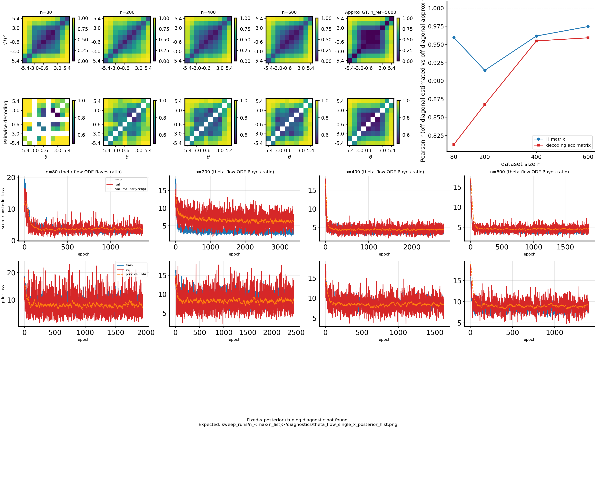
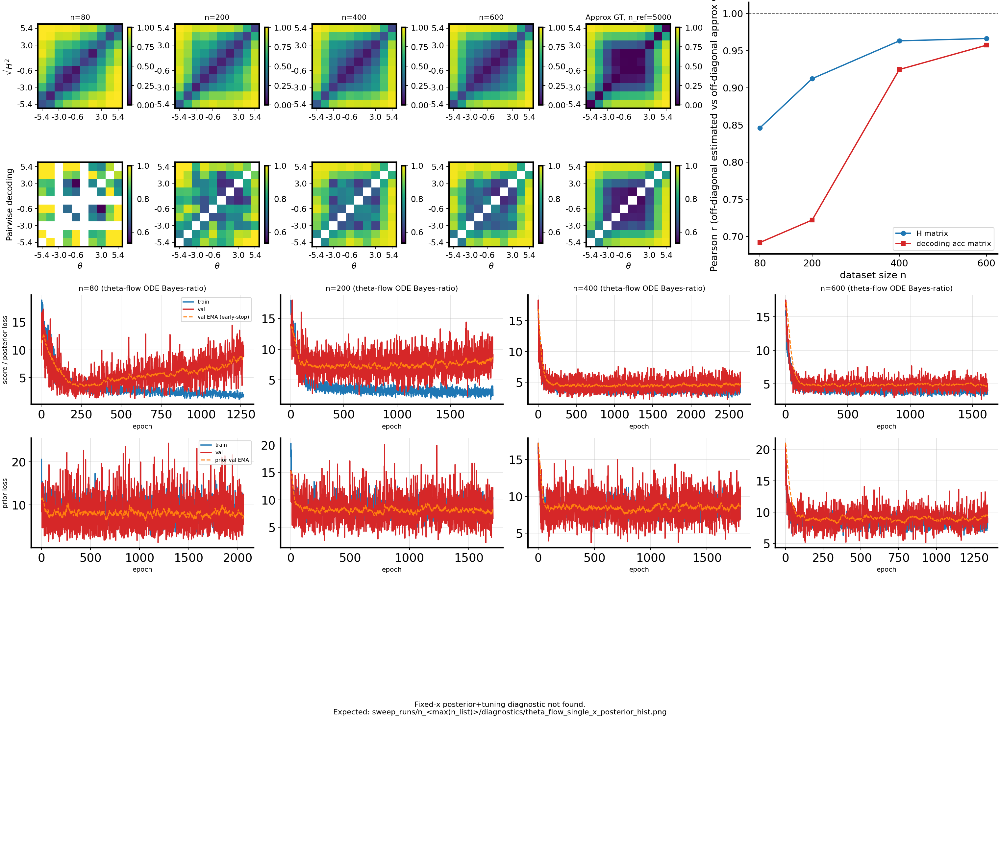

# 2026-04-20 PR-autoencoder embedding for `randamp_gaussian_sqrtd`: theta-flow H-decoding convergence (2D latent -> 10D/50D)

**Update (later 2026):** The `randamp_gaussian_sqrtd_pr_autoencoder` `dataset_family` token was removed. Use `bin/make_dataset.py --dataset-family randamp_gaussian_sqrtd` at low `--x-dim`, then `bin/project_dataset_pr_autoencoder.py` to embed; see `docs/dataset_pr_autoencoder_workflow.md`. Commands below are historical.

## Question / Context
Can we replace the RealNVP embedding path with the new PR-autoencoder embedding for
`randamp_gaussian_sqrtd`, then run the standard `theta_flow` H-decoding convergence pipeline?

Setup intent:
- latent/base data is still 2D (`z_dim=2`) from `randamp_gaussian_sqrtd`
- observed data is embedded to higher `x_dim` using PR-autoencoder
- run `bin/study_h_decoding_convergence.py` with `--theta-field-method theta_flow`

## Method
For family `randamp_gaussian_sqrtd_pr_autoencoder`, dataset generation does:

1. Sample base `(\theta, z)` from `randamp_gaussian_sqrtd` with `z \in \mathbb{R}^2`.
2. Train/load PR-autoencoder embedding model (`loss = MSE - \lambda \cdot PR(h)`) with fixed internal defaults.
3. Map `z \to h` where `h \in \mathbb{R}^{x_dim}` and save NPZ with this embedded `x`.

Then convergence runs compare:
- binned $\sqrt{H}$ from the `theta_flow` model vs GT MC binned matrix (`corr_h_binned_vs_gt_mc`)
- classifier matrix vs reference matrix (`corr_clf_vs_ref`)

## Reproduction (commands & scripts)
From repo root (`/nfshome/zeyuan/score-matching-fisher`):

```bash
# x_dim = 10 dataset (latent 2D -> embedded 10D)
mamba run -n geo_diffusion python bin/make_dataset.py \
  --dataset-family randamp_gaussian_sqrtd_pr_autoencoder \
  --x-dim 10 --n-total 6000 --train-frac 0.8 --seed 7 --device cuda \
  --output-npz data/shared_fisher_dataset_randamp_gaussian_sqrtd_pr_autoencoder_zdim2_xdim10_thetaflow_2026-04-20.npz

# convergence run (theta_flow)
PYTHONUNBUFFERED=1 mamba run -n geo_diffusion python bin/study_h_decoding_convergence.py \
  --dataset-npz data/shared_fisher_dataset_randamp_gaussian_sqrtd_pr_autoencoder_zdim2_xdim10_thetaflow_2026-04-20.npz \
  --dataset-family randamp_gaussian_sqrtd_pr_autoencoder \
  --theta-field-method theta_flow --device cuda \
  --output-dir data/h_decoding_conv_randamp_gaussian_sqrtd_pr_autoencoder_zdim2_xdim10_theta_flow_2026-04-20_full
```

```bash
# x_dim = 50 dataset (latent 2D -> embedded 50D)
mamba run -n geo_diffusion python bin/make_dataset.py \
  --dataset-family randamp_gaussian_sqrtd_pr_autoencoder \
  --x-dim 50 --n-total 6000 --train-frac 0.8 --seed 7 --device cuda \
  --output-npz data/shared_fisher_dataset_randamp_gaussian_sqrtd_pr_autoencoder_zdim2_xdim50_thetaflow_2026-04-20.npz

# convergence run (theta_flow)
PYTHONUNBUFFERED=1 mamba run -n geo_diffusion python bin/study_h_decoding_convergence.py \
  --dataset-npz data/shared_fisher_dataset_randamp_gaussian_sqrtd_pr_autoencoder_zdim2_xdim50_thetaflow_2026-04-20.npz \
  --dataset-family randamp_gaussian_sqrtd_pr_autoencoder \
  --theta-field-method theta_flow --device cuda \
  --output-dir data/h_decoding_conv_randamp_gaussian_sqrtd_pr_autoencoder_zdim2_xdim50_theta_flow_2026-04-20_full
```

Implementation paths used:
- `fisher/pr_autoencoder_embedding.py`
- `fisher/autoencoder_embedding.py`
- `bin/make_dataset.py`
- `bin/study_h_decoding_convergence.py`

## Results
### 2D -> 10D (`x_dim=10`)
From `/nfshome/zeyuan/score-matching-fisher/data/h_decoding_conv_randamp_gaussian_sqrtd_pr_autoencoder_zdim2_xdim10_theta_flow_2026-04-20_full/h_decoding_convergence_results.csv`:

| n | corr_h_binned_vs_gt_mc | corr_clf_vs_ref |
|---:|---:|---:|
| 80 | 0.9597 | 0.8125 |
| 200 | 0.9145 | 0.8676 |
| 400 | 0.9617 | 0.9550 |
| 600 | 0.9747 | 0.9592 |

### 2D -> 50D (`x_dim=50`)
From `/nfshome/zeyuan/score-matching-fisher/data/h_decoding_conv_randamp_gaussian_sqrtd_pr_autoencoder_zdim2_xdim50_theta_flow_2026-04-20_full/h_decoding_convergence_results.csv`:

| n | corr_h_binned_vs_gt_mc | corr_clf_vs_ref |
|---:|---:|---:|
| 80 | 0.8462 | 0.6921 |
| 200 | 0.9125 | 0.7223 |
| 400 | 0.9634 | 0.9248 |
| 600 | 0.9666 | 0.9575 |

## Figure
10D combined panel:



50D combined panel:



Interpretation:
- Both settings recover strong agreement by `n=400,600`.
- `x_dim=50` is clearly harder in the low-sample regime (`n=80,200`), especially on classifier correlation.

## Artifacts
- Dataset NPZ (10D):
  - `/nfshome/zeyuan/score-matching-fisher/data/shared_fisher_dataset_randamp_gaussian_sqrtd_pr_autoencoder_zdim2_xdim10_thetaflow_2026-04-20.npz`
- Convergence run dir (10D):
  - `/nfshome/zeyuan/score-matching-fisher/data/h_decoding_conv_randamp_gaussian_sqrtd_pr_autoencoder_zdim2_xdim10_theta_flow_2026-04-20_full`
- Dataset NPZ (50D):
  - `/nfshome/zeyuan/score-matching-fisher/data/shared_fisher_dataset_randamp_gaussian_sqrtd_pr_autoencoder_zdim2_xdim50_thetaflow_2026-04-20.npz`
- Convergence run dir (50D):
  - `/nfshome/zeyuan/score-matching-fisher/data/h_decoding_conv_randamp_gaussian_sqrtd_pr_autoencoder_zdim2_xdim50_theta_flow_2026-04-20_full`
- Cached PR-autoencoder checkpoints:
  - `/nfshome/zeyuan/score-matching-fisher/data/pr_autoencoder_cache/pr_ae_c310393fee51388e` (10D)
  - `/nfshome/zeyuan/score-matching-fisher/data/pr_autoencoder_cache/pr_ae_a9261f2949155875` (50D)

## Takeaway
`randamp_gaussian_sqrtd_pr_autoencoder` works end-to-end with `theta_flow` in this pipeline.
At higher embedding dimension (`50D`), convergence quality remains high at larger `n`, but early-sample behavior is weaker than `10D`.
