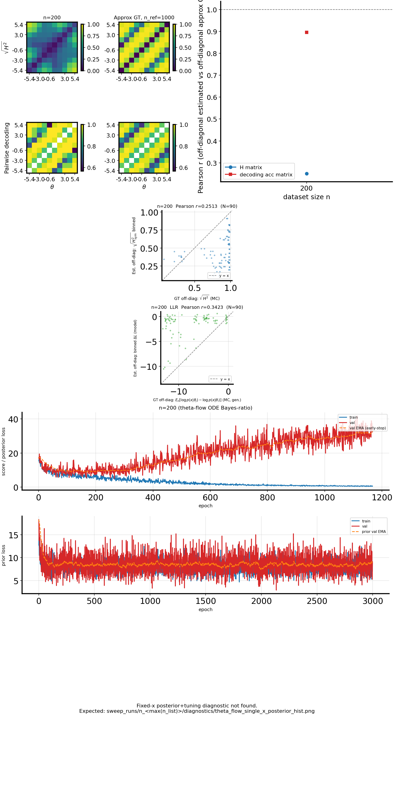
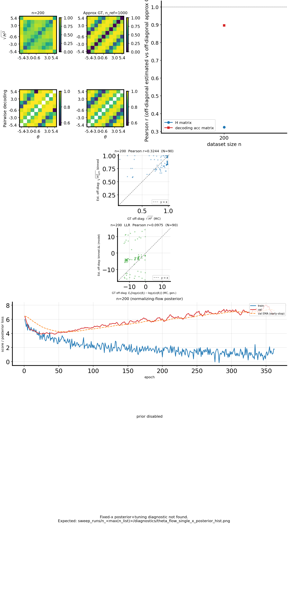

# H-decoding: generative mean LLR vs binned model $\Delta L$ (10D `cosine_gaussian_sqrtd`, $n=200$)

## Question / context

The convergence study already reports **H-matrix** agreement with Monte Carlo generative Hellinger (binned $\sqrt{H^2}$) and **decoding** agreement with a large-$n_{\mathrm{ref}}$ reference. The combined figure can now include a second scatter row that compares **one-sided generative log-likelihood structure** in $x$ to the **model’s internal log-ratio** $\Delta L$ used to form $H$.

This note records what that new panel is measuring, a minimal reproduction command, and how to read the **theta_flow** vs **NF** run on 10D `cosine_gaussian_sqrtd` with the `repro_theta_flow_mlp_n200` settings.

## Method (what the scatter is)

**Ground truth (x-space, one-sided, directional $i\!\to\!j$).** For bin centers $(\theta_i,\theta_j)$, using the *generative* observation model in the known toy:
$$
(\mathrm{LLR}^{\mathrm{gen}})_{ij}
=
\mathbb{E}_{x\sim p(x\mid \theta_i)}\big[ \log p(x\mid \theta_j) - \log p(x\mid \theta_i) \big],
$$
computed with the **same** Monte Carlo row budget as the GT Hellinger track ($n_{\mathrm{mc}}=\lfloor n_{\mathrm{ref}} / K\rfloor$ per bin row $i$, with $K$ bins). Implementation: `fisher.hellinger_gt.estimate_mean_llr_one_sided_mc`.

**Estimated (model internal).** The pipeline already builds a per-sample square matrix and forms $\Delta L = C - \mathrm{diag}(C)$ (column $j$ vs row-conditional reference on the diagonal), then **bin-averages** with the *same* fixed bin labels as the binned $H$ matrix. For **NF**, $C_{ij}=\log p(\theta_j\mid x_i)$; for **theta_flow** (and other flow/DSM paths), $C$ and $\Delta L$ follow `fisher/h_matrix.py` and are saved with `h_save_intermediates` in `h_matrix_results_*.npz` as `delta_l_matrix`.

**Correlation.** For each $n$ in the sweep, `corr_llr_binned_vs_gt_mc` is the **off-diagonal Pearson $r$** between the binned $\Delta L$ matrix and $\mathrm{LLR}^{\mathrm{gen}}$ (same off-diagonal mask as `corr_h_binned_vs_gt_mc` for $H$).

**Interpretation caution.** The generative object is a **$x\mid\theta$** log-ratio, while the learned object is a **per-sample, model-specific** log-ratio in $\theta$ or in $p(\theta\mid x)$ (depending on the method), then binned. They need not line up in high dimension even when the model is good at **decoding**; the scatter and $r$ are a **qualitative** check (scale/ordering of stress on bin pairs) rather than a second “identical to GT” target.

## Reproduction (commands and scripts)

Shared dataset and convergence are driven from the minimal repro:

```bash
mamba run -n geo_diffusion python bin/repro_theta_flow_mlp_n200.py \
  --device cuda --x-dim 10 --dataset-family cosine_gaussian_sqrtd
```

- Implementation entry points: `bin/repro_theta_flow_mlp_n200.py` (subprocess to `bin/study_h_decoding_convergence.py` per method), `bin/study_h_decoding_convergence.py` (GT LLR, load `delta_l_matrix`, binned LLR, combined figure with H + LLR scatters), `fisher/hellinger_gt.py` (MC mean LLR and GT Hellinger).

## Results (this run, $n=200$, $K=10$, $n_{\mathrm{ref}}=1000$)

| Method | `corr_h_binned_vs_gt_mc` | `corr_clf_vs_ref` | `corr_llr_binned_vs_gt_mc` |
|--------|-------------------------:|------------------:|---------------------------:|
| `theta_flow` (MLP) | 0.251 | 0.896 | 0.342 |
| `nf` | 0.324 | 0.896 | 0.098 |

- **H track** stays moderate (binned H vs generative Hellinger geometry is hard in 10D under this budget), consistent with earlier high-$d$ `cosine_gaussian_sqrtd` observations.
- **Decoding** is unchanged and high: pairwise bin classifiers on the $n_{\mathrm{ref}}$ reference are a strong second reference.
- **LLR $r$** is not expected to match the H or decoding $r$; here **theta_flow** attains a higher off-diagonal alignment between binned model $\Delta L$ and the generative mean LLR than **NF** on the same binned $x$ vs $\theta$ targets—without implying a better *generative* $p(x\mid\theta)$ match (the model is not training that object directly in $\theta$–flow or NF). The **NF** panel’s lower $r$ is consistent with **posterior** $\log p(\theta\mid x)$ log-ratios being a different functional of $(x,\theta)$ than the **$x\mid\theta$** mean LLR used on the $x$-axis.

## Figure

**Theta-flow** combined five-row figure (matrices, $r$ vs $n$, **H** est-vs-GT scatter, **LLR** est-vs-GT scatter, training losses, optional diagnostic). The **green** LLR scatter is $x=\mathrm{LLR}^{\mathrm{gen}}$, $y=$ binned $\Delta L$; dashed line is $y=x$; title shows Pearson $r$ and off-diagonal count $N$.



**NF** (same layout; LLR $r$ lower on this run):



## Artifacts

- Output directory: `./data/repro_theta_flow_mlp_n200_cosine_gaussian_sqrtd_xdim10_obsnoise0p5/`
- Per method: `theta_flow/h_decoding_convergence_combined.png`, `nf/h_decoding_convergence_combined.png` (sibling `.svg`)
- Tabulated metrics: `theta_flow/h_decoding_convergence_results.csv`, `nf/h_decoding_convergence_results.csv` (includes `corr_llr_binned_vs_gt_mc`)
- Dense arrays: `h_decoding_convergence_results.npz` in each method directory (`llr_binned_columns`, `gt_mean_llr_one_sided_mc`, etc.)

## Takeaway

The new LLR row makes the **mismatch in quantity** explicit: the panel compares a **generative** one-sided mean log-likelihood ratio in $x$ to a **model** $\Delta L$ used for $H$—use it as a stress-test on how bin-level log-ratio structure transfers between those spaces, not as a duplicate of the Hellinger or decoding metrics. For this 10D `cosine_gaussian_sqrtd` repro, **decoding** remains the strongest “learned structure” signal; **H** and **LLR** $r$ values stay in a band where the geometry is only partially shared with the generative LLR, with theta-flow’s binned $\Delta L$ showing somewhat higher off-diagonal agreement with the generative mean LLR than NF’s, on the same bins and $n$.
