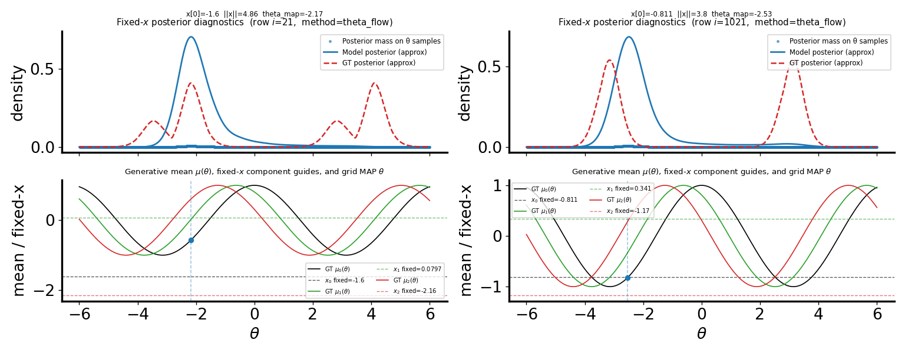

# Fixed-$x$ posterior panel: how the model curve and the “GT” curve are made

## Question / context

The H-decoding convergence combined figure can embed a **fixed-$x$ posterior diagnostic** (file name `theta_flow_single_x_posterior_hist.{png,svg}` under `sweep_runs/.../diagnostics/`). The top row shows, for a fixed training row $i$, a **model** density/curve in $\theta$ and a **generative** reference in red, sometimes labeled “GT posterior (approx)”. This note records exactly how those two curves are produced in code, what is “exact” vs “approximate,” and one important **prior** mismatch to keep in mind when comparing to the red curve.

**Implementation (single file):** `bin/study_h_decoding_convergence.py` — functions `_write_fixed_x_posterior_diagnostic`, `_plot_fixed_x_column`, `_approx_gt_posterior_density`, `_stable_softmax_log`, `_weighted_kde_density`, and `_log_std_normal_scalar`. Artifacts are built from the saved H-matrix run `h_matrix_results_theta_cov.npz` (or `_non_gauss` for the `cosine_gmm` family), which must include `c_matrix` and `theta_used` (requires intermediate saves in the H-matrix path).

## Method

### 1) Which $x$ and which matrix row

- The matrix $C$ is the same square matrix as in the H-building pipeline, loaded from the NPZ as `c_matrix`, with `theta_used` giving the per-row $\theta$ values (scalar $\theta$ only; vector-$\theta$ is skipped in the diagnostic).
- Two **deterministic** row indices $(i_a, i_b)$ are chosen from `perm_seed` and the subset size `n_subset` so runs are reproducible (see `_select_two_fixed_x_indices`).

### 2) “Model posterior (approx)” (blue)

The code does **not** plot a full continuous likelihood from a closed form. It always starts from a **vector of unnormalized log-weights** on the *same finite set* of training $\{\theta_j\}_{j=1}^N$ that appeared when building the matrix, one row for fixed $x_i$.

**Step A — log-weights for row $i$ (`c_row` $= C[i,:]$).**

- **`theta_flow`:** the saved `c_matrix` row is the **log Bayes factor matrix** from ODE flow likelihoods,
  $$C_{ij} = \log p_{\mathrm{model}}(\theta_j \mid x_i) - \log p_{\mathrm{model}}(\theta_j),$$
  with both terms from the **$\theta$-space** flows and a **standard normal** base measure in the ODE (see `HMatrixEstimator.compute_log_ratio_matrix` in `fisher/h_matrix.py`). The diagnostic then forms
  $$\texttt{logp}_j = C_{ij} + \log \mathcal{N}(\theta_j;0,1)$$
  using `_log_std_normal_scalar` (i.e. $-\tfrac12\theta_j^2 + \text{const}$), i.e. it **adds back** the same Gaussian prior in log-space so that a softmax of `logp` is a discrete approximation to $p(\theta\mid x_i)$ if the learnable “prior” flow matched $\mathcal N(0,1)$. This matches the in-code comment in `_write_fixed_x_posterior_diagnostic`.

- **`nf`:** the stored `c_matrix` is the **conditional NF log posterior** (saved as the posterior part; `c_matrix_ratio` in the same NPZ holds $\log p(\theta_j\mid x_i)-\log p(\theta_j)$ used for the H step). The diagnostic takes `c_matrix` and sets `logp = c_row` with **no** extra prior term, then normalizes (next step). See `c_matrix=...` vs `c_matrix_ratio=...` when saving the NF H-matrix in `study_h_decoding_convergence.py`.

- **Other** `h_field_method` values fall back to treating `C` as log-scale rows (may be a coarse/scale-mixed view).

**Step B — discrete “posterior mass on $\theta$ samples” (bar/stem).**  
`w = _stable_softmax_log(logp)`: a numerically stable softmax, $\sum_j w_j = 1$ on the **sampled $\theta$ grid** (irregularly spaced in general).

**Step C — smooth blue curve on a dense $\theta$ grid.**  
`q_{\mathrm{model}} = _weighted_kde_density(\theta_s, w_s, \theta_{\mathrm{dense}})$: a **weighted Gaussian kernel density** on the sorted training $\theta$ with weights $w_s$, evaluated on `th_grid` (400 points linearly between `meta["theta_low"]` and `meta["theta_high"]`). The bandwidth uses a **weighted Silverman–style** rule with a floor for robustness, then the density is **normalized** on `th_grid` with the trapezoid rule so it integrates to 1. So the **blue line is a KDE of the discrete posterior mass** — still an approximation, but a smooth one for plotting.

**Also plotted:** a step/histogram-style fill and markers at $(\theta_j, w_j)$ (“Posterior mass on θ samples”).

### 3) “GT posterior (approx)” (red, dashed)

This is a **fully generative, continuous** (on the 400-point grid) object built only from the **toy** implementation of the selected `dataset_family`:

- For each `theta_dense[k]` on the same `th_grid`, compute **only** the observation likelihood
  $$\ell_k = \log p_{\mathrm{gen}}(x_\mathrm{fixed} \mid \theta = \mathtt{theta\_dense}[k])$$
  via `fisher.evaluation.log_p_x_given_theta` and the `dataset` from `build_dataset_from_meta(meta)`.
- **Prior on $\theta$** for the red curve: **uniform** on $[\theta_\mathrm{low}, \theta_\mathrm{high}]$ with density $1/(\theta_\mathrm{high}-\theta_\mathrm{low})$, so in log form `log_post_k = l_k - log(θ_high - θ_low)`.
- Un-normalized weights $\propto \exp(\texttt{log_post} - \max)$, then **trapezoid** normalization to a density on `th_grid` (`_normalize_density_trapz`).

So the **red curve is a Bayes rule posterior under the *generative* likelihood and a *uniform* prior** on the box where data were simulated — **not** the same default prior as the `theta_flow` diagnostic step (which uses a Gaussian “add-back” in log-space to match the flow base, as above). For `nf`, the blue curve uses a learned $p(\theta\mid x)$; the red still uses the known generative with uniform $p(\theta)$. Both overlays are best read as **qualitative** shape checks, not a claim that the blue curve must match the red under a single identical prior.

### 4) Bottom panel (generative mean and guides)

The lower subplots show $\mu(\theta)$ from the dataset’s `tuning_curve` on the same `th_grid`, with **dashed horizontals** at the **fixed** components of $x$ for the selected row, and a **blue vertical** at the **MAP-$\theta$** from the model row weights (argmax of $w$ on the discrete $\theta$ list).

## Reproduction (commands and scripts)

Minimal repro (writes diagnostics under the study output dir) — adjust `--theta-*`, `--n`, and `--n-ref` as for your run:

```bash
mamba run -n geo_diffusion python bin/repro_theta_flow_mlp_n200.py \
  --device cuda \
  --dataset-family cosine_gaussian_sqrtd \
  --x-dim 10 \
  --theta-low -6 --theta-high 6 \
  --n 2000 --n-ref 2000 \
  --method both
```

Key paths:

- `bin/repro_theta_flow_mlp_n200.py` (invokes `bin/study_h_decoding_convergence.py` with fixed bin count and `keep-intermediate` content).
- `bin/study_h_decoding_convergence.py` (fixed-$x$ figure and the routines named above).
- Generative log-likelihood: `fisher/evaluation.py` — `log_p_x_given_theta`.

## Results & figure

Example diagnostic (10D `cosine_gaussian_sqrtd`, $\theta\in[-6,6]$, $n=2000$ sweep row, `theta_flow` run): two side-by-side fixed-$x$ columns with the blue (model KDE + sample masses) and red (uniform-prior generative) overlays and the generative-mean / fixed-$x$ guides below.



**Reading the figure:** agreement in **shape and peak location** is informative; a gap near boundaries can reflect **prior** differences (`theta_flow` add-back) or finite-$N$ spacing of sample $\theta$ before KDE, not only misfit of the flow.

## Artifacts (this example)

- **Image copied for the journal (under `journal/notes/`):** `journal/notes/figs/2026-04-22-fixed-x-posterior-model-vs-approx-gt/theta_flow_single_x_posterior_hist.png`
- **Full run (repo-relative):** `data/repro_theta_flow_mlp_n2000_cosine_gaussian_sqrtd_xdim10_obsnoise0p5_th-6_6/theta_flow/sweep_runs/n_002000/diagnostics/theta_flow_single_x_posterior_hist.{png,svg}` (and the same logic under `nf/` for the NF run).

## Takeaway

- **Blue “model” curve:** discrete posterior mass from the **learned** H-matrix intermediates, then **KDE** on a uniform $\theta$ grid — **not** a direct symbolically normalized $p(\theta\mid x)$.
- **Red “GT”:** **generative** $\log p(x\mid\theta)$ plus **uniform** prior, normalized on the same grid.
- Comparing the two is most meaningful when the **priors and parameterizations** are aligned; the implementation intentionally documents the `theta_flow` + Gaussian add-back for the model mass vs uniform generative for the red line.
