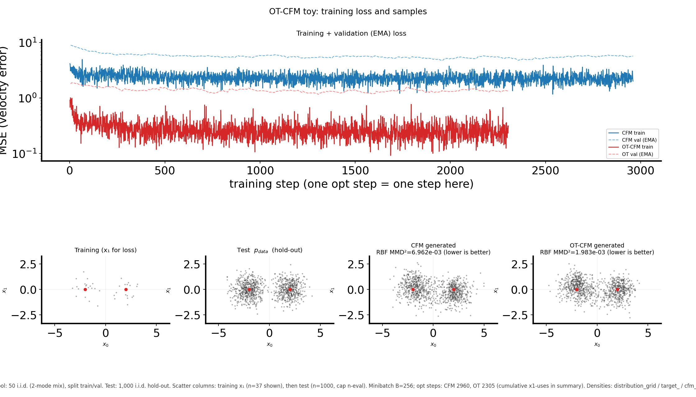

# OT-CFM vs CFM: 2D bimodal benchmark (TorchCFM) — data split, method, and reproduction

## Question / context

We want a **reproducible, visual** comparison between **plain conditional flow matching (CFM)** and **optimal-transport CFM (OT-CFM)** on the same 2D target: a **two-Gaussian mixture** (modes at roughly $(-2,0)$ and $(2,0)$). The script trains two velocity fields under matched hyperparameters, generates samples, and reports **RBF MMD²** to a **held-out test** cloud plus simple **bimodal** diagnostics (middle-band mass, per-mode center error).

A longer implementation plan (TorchCFM API, file layout) lives in [ot_cfm_torchcfm_plan.md](ot_cfm_torchcfm_plan.md); the runnable benchmark is a single file.

## Data protocol (this experiment)

The benchmark uses a **finite** i.i.d. design:

- **`--target-pool-size` $N$** defines only the **train+val** pool. It is **split into train and validation** using normalized `--train-fraction` and `--val-fraction` (weights, not required to sum to 1: e.g. $0.6$ and $0.2$ mean a 3:1 train:val count ratio after permuting the pool and slicing).
- A **separate** i.i.d. draw of size **`--test-size` (default 1000)** is the **test / evaluation** reference. It is **not** a fraction of the train+val pool. Plots, **bimodal “target” metrics**, and **MMD** use this test set (optionally **capped** by `--n-eval` for display).
- **Training** shuffles the training tensor each **epoch** and walks it in **minibatches with no replacement** until an optimizer step cap (`--train-steps`); the summary records `train_sampler: "epoch_shuffle_no_replace"`.
- If **`--early-stopping-patience` > 0**: optimization uses **only the train** split, **validation** is for **EMA-smoothed** MSE and **early stopping** (restore best val checkpoint). If patience is 0, **train and val are merged** for the optimizer; the **test** set stays separate for evaluation.

## Methods (OT-CFM vs CFM in this code)

**Goal.** Learn a time-dependent velocity $v_\theta(x_t, t)$ on $[0,1]$ that transports a **source** (here **standard 2D Gaussian** $x_0$) to **target** samples $x_1$ drawn from the (finite) **training** set. **Sampling** is forward **Euler** integration of the ODE from $t=0$ to $1$ (see `sample_euler` in the script), starting from new Gaussian noise.

**Shared TorchCFM path.** In both variants, each step samples **$x_0$** and a batch of **$x_1$** (here from the shuffled **training** set), then calls `matcher.sample_location_and_conditional_flow(x0, x1)`, which (for this matcher family) returns a time $t$, a bridge location $x_t$, and a **regression target** velocity $u_t$ under the **Gaussian** conditional path used by the library (see package defaults and `--sigma` for bridge noise in the matcher's constructor). The network **VelocityMLP** predicts $v_\theta(x_t, t)$; the loss is **MSE** to $u_t$ (batch mean).

**CFM (independent pairing).** [`ConditionalFlowMatcher`](https://github.com/atong01/conditional-flow-matching) uses **independent** $(x_0, x_1)$ within the minibatch: there is no coupling between the noise vectors and the target points beyond random pairing.

**OT-CFM (minibatch exact OT).** [`ExactOptimalTransportConditionalFlowMatcher`](https://github.com/atong01/conditional-flow-matching) **re-pairs** the batch of $x_0$ with the batch of $x_1$ by a **minibatch optimal transport** plan (cost typically squared Euclidean on the *same* size batches), **before** the conditional-path sample. Intuition: the learned transport is encouraged to be closer to a **Monge** / low-cost map, which often reduces “crossing” and **mass in the between-mode region** for multimodal targets compared with independent matching.

**Evaluation.** The script compares **generated** points to a **test** $x_1$ cloud via **RBF MMD²** (median bandwidth on a pooled subsample; `--n-mmd` caps subsample size) and the custom **bimodal** metrics on the test scatter.

Representative **combined** figure (loss + training / test / generated panels) from a run with $N=50$ in the train+val pool:



The training column shows the **points actually used in the flow-matching loss** (train only if early stopping is on, else train+val merged). The test column is the **1000-point** (default) hold-out draw.

## Reproduction (commands and script)

- **Entry point (repo):** `tests/ot_cfm_torchcfm.py` (adds the repo root to `sys.path` and reads `global_setting.DATAROOT` for the default output directory).
- **Environment (project standard):** use the `mamba` env `geo_diffusion` per [AGENTS.md](../../AGENTS.md).
- **Dependencies:** `torch`, `torchcfm`, `matplotlib` (and optionally `tqdm`).

**One run (default CUDA; override if needed):**

```bash
mamba run -n geo_diffusion python tests/ot_cfm_torchcfm.py \
  --target-pool-size 50 --test-size 1000 --device cuda
```

**Sweep train+val pool size** $N \in \{20,50,100\}$ (test always 1000 by default) into separate output folders:

```bash
mamba run -n geo_diffusion python -c "from global_setting import DATAROOT; print(DATAROOT)"
# then, from repo root:
for N in 20 50 100; do
  mamba run -n geo_diffusion python tests/ot_cfm_torchcfm.py \
    --target-pool-size "$N" --output-dir "data/tests/ot_cfm_n${N}" --device cuda
done
```

**Key flags (non-exhaustive):** `--train-steps`, `--batch-size`, `--train-fraction`, `--val-fraction`, `--early-stopping-patience`, `--n-eval` (plot cap on test), `--n-gen` (generated count for metrics/plots), `--seed` (affects data splits and training noise).

**Outputs (per run directory):** `summary.json`, `summary_pretty.md`, `combined_report.{png,svg}`, `distribution_grid.{png,svg}`, per-method loss plots and checkpoints, etc.; see `summary["figures"]` for the full list.

## Artifacts (paths in this clone)

- Example sweep directories (under the repo’s `data/` tree, i.e. `DATAROOT`):
  - `./data/tests/ot_cfm_n20/`
  - `./data/tests/ot_cfm_n50/`
  - `./data/tests/ot_cfm_n100/`
- The figure embedded above is a copy of `data/tests/ot_cfm_n50/combined_report.png` (same content as the run output).

## Takeaway

**OT-CFM** in this script differs from **CFM** only in the **pairing** of $x_0$ and $x_1$ inside each training minibatch (OT vs independent); the bridge and velocity regression follow the same TorchCFM interface. **Evaluation** is against a **fixed-size test draw** and is **separate** from the train+val pool, so MMD and scatter panels are **comparable** across different training-set sizes $N$ without shrinking the test reference.

**Observation vs conclusion:** in typical runs, **OT-CFM** often attains **lower** RBF MMD² to the test cloud than **CFM** on this toy, but the gap depends on $N$, early stopping, and seed — always check `summary.json` and the `combined_report` for the actual run you care about.
