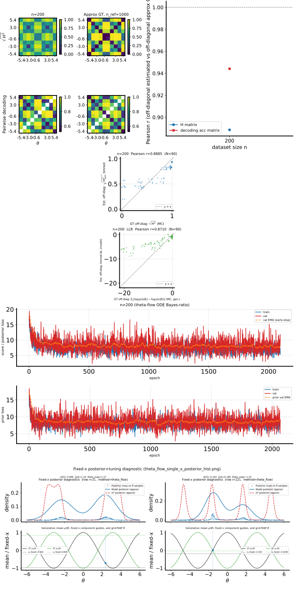

# Theta-flow **Fourier + Soft-MoE posterior** on 2D `cosine_gaussian_sqrtd` (H-decoding)

## Question / context

The **Soft-MoE** posterior for theta-flow (`ConditionalThetaFlowVelocitySoftMoE`) mixes several expert MLPs over $[\theta_t, x, t]$. Because the likelihood is **periodic** in $\theta$ (cosine mean), we also feed **Fourier features of $\theta_t$** into the router and every expert: $\sin(k\omega\theta_t)$, $\cos(k\omega\theta_t)$ for $k=1,\ldots,K$, plus the usual linear $\theta_t$ and bias term unless disabled. This note documents one **matched** H-decoding convergence run ($n=200$, 2D observations) and compares metrics to the **MLP** baseline and **Soft-MoE without Fourier** from the same repro harness.

## Method

- **Model:** `ConditionalThetaFlowVelocitySoftMoE` in `fisher/models.py`: `_theta_features` builds the periodic encoding; `forward` concatenates those features with $x$ and a scalar time feature, then applies the softmax router and dense expert mixture (same as the non-Fourier Soft-MoE, but with a larger input dimension).
- **Hyperparameters (posterior):** `--flow-arch soft_moe`; Fourier side uses the existing **`flow_theta_fourier_*`** CLI (`fisher/cli_shared_fisher.py`): default $K=4$, `omega_mode=theta_range` (effective $\omega$ from $\theta_{\mathrm{low}},\theta_{\mathrm{high}}$ via `effective_flow_theta_fourier_omega_post` in `fisher/shared_fisher_est.py`), linear $\theta_t$ and bias **on** unless `--flow-theta-fourier-no-linear` / `--flow-theta-fourier-no-bias`.
- **Prior:** still a standard MLP when the posterior is `soft_moe`.
- **Training / eval:** `bin/repro_theta_flow_mlp_n200.py` → `study_h_decoding_convergence`; fixed 2000 epochs, patience 2000 (no early stop), **last** weights (`--no-flow-restore-best`, `--no-prior-restore-best`). Metrics: `corr_h_binned_vs_gt_mc`, `corr_llr_binned_vs_gt_mc`, `corr_clf_vs_ref` in `h_decoding_convergence_results.csv`.

## Reproduction (commands)

From the repo root, with env per `AGENTS.md` (e.g. `mamba run -n geo_diffusion`):

**Fourier + Soft-MoE posterior** (output dir as in the logged run):

```bash
cd /grad/zeyuan/score-matching-fisher
PYTHONUNBUFFERED=1 mamba run -n geo_diffusion python bin/repro_theta_flow_mlp_n200.py \
  --method theta-flow \
  --dataset-family cosine_gaussian_sqrtd \
  --x-dim 2 \
  --no-theta-filter-union \
  --flow-arch soft_moe \
  --output-dir data/repro_theta_flow_mlp_n200_cosine_gaussian_sqrtd_xdim2_obsnoise0p5_th-6_6_fourier_softmoe \
  --device cuda
```

Optional explicit Fourier flags (defaults already match this run):

```bash
  --flow-theta-fourier-k 4 \
  --flow-theta-fourier-omega-mode theta_range
```

**Baselines** (same script; only `--flow-arch` and `--output-dir` differ): see [2026-04-22 Soft-MoE vs MLP note](2026-04-22-theta-flow-soft-moe-posterior-2d-h-decoding.md) for MLP and Soft-MoE commands. Baseline artifact dirs used in the table below:

- MLP: `data/repro_theta_flow_mlp_n200_cosine_gaussian_sqrtd_xdim2_obsnoise0p5_th-6_6_mlp`
- Soft-MoE (raw $\theta_t$ only): `data/repro_theta_flow_mlp_n200_cosine_gaussian_sqrtd_xdim2_obsnoise0p5_th-6_6_softmoe`

## Results ($n=200$, Pearson off-diagonal correlations)

| Posterior | `corr_h_binned_vs_gt_mc` | `corr_llr_binned_vs_gt_mc` | `corr_clf_vs_ref` | `wall_seconds` |
|-----------|--------------------------|----------------------------|-------------------|----------------|
| MLP | 0.8397 | 0.7809 | 0.9441 | 103.9 |
| Soft-MoE | 0.8894 | 0.8123 | 0.9441 | 295.4 |
| **Fourier + Soft-MoE** | **0.8885** | **0.8710** | 0.9441 | 19.7 |

**Observation:** Hellinger agreement with the generative GT (`corr_h`) stays close to **Soft-MoE without Fourier**, while **LLR-track correlation** (`corr_llr`) improves markedly versus both MLP and plain Soft-MoE on this run. **Conclusion:** periodic $\theta_t$ features are a cheap inductive bias for this family; the LLR metric in particular suggests better alignment of the learned conditional density with generative log-odds, though `corr_h` is already near ceiling for MoE here.

*(Wall time varies with hardware and cache; treat as a rough timing hint only.)*

## Figure

Combined H-decoding convergence panel for the **Fourier + Soft-MoE** run (matrices, binned vs GT tracks, training losses):



The off-diagonal structure in the Hellinger and LLR panels is visibly tight to the reference/GT tracks at $n=200$, consistent with the high correlation numbers above.

## Artifacts (this run)

Absolute paths on disk:

- **CSV:** `/grad/zeyuan/score-matching-fisher/data/repro_theta_flow_mlp_n200_cosine_gaussian_sqrtd_xdim2_obsnoise0p5_th-6_6_fourier_softmoe/h_decoding_convergence_results.csv`
- **NPZ:** `/grad/zeyuan/score-matching-fisher/data/repro_theta_flow_mlp_n200_cosine_gaussian_sqrtd_xdim2_obsnoise0p5_th-6_6_fourier_softmoe/h_decoding_convergence_results.npz`
- **Combined figure (SVG):** `/grad/zeyuan/score-matching-fisher/data/repro_theta_flow_mlp_n200_cosine_gaussian_sqrtd_xdim2_obsnoise0p5_th-6_6_fourier_softmoe/h_decoding_convergence_combined.svg`
- **Summary:** `/grad/zeyuan/score-matching-fisher/data/repro_theta_flow_mlp_n200_cosine_gaussian_sqrtd_xdim2_obsnoise0p5_th-6_6_fourier_softmoe/h_decoding_convergence_summary.txt`

## Takeaway

Adding **Fourier features of $\theta_t$** to the **Soft-MoE** posterior preserves strong **Hellinger** agreement and, in this 2D cosine-Gaussian repro, yields a clear gain on the **LLR** correlation relative to both **MLP** and **Soft-MoE without Fourier**. Further sweeps ($K$, $\omega$ mode, expert count) would test how much of that gain is robust versus this single seed and budget.
