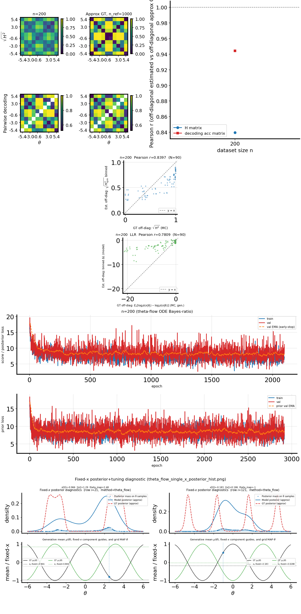
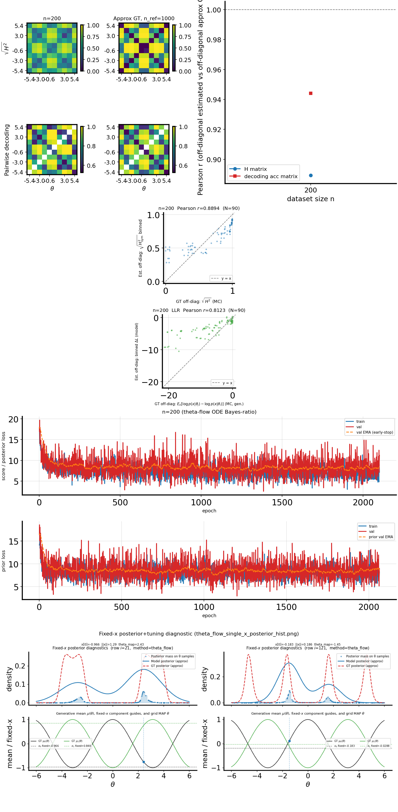

# Theta-flow posterior Soft-MoE vs MLP (2D `cosine_gaussian_sqrtd`, H-decoding)

## Question / context

For **theta-flow**, the conditional velocity $v(\theta_t, x, t)$ must represent rich **posterior** structure. On periodic cosine-mean likelihoods, $p(\theta \mid x)$ can be **multi-modal** (symmetric aliases under the cosine link). A single shared MLP may average across incompatible local behaviors. We added a **dense soft mixture-of-experts (MoE)** on the **posterior** branch only: a router and $E$ expert MLPs both see the same inputs $[\theta_t, x, t]$, with softmax weights over experts (no top-$k$ sparsity in v1). This note records a **2D** `cosine_gaussian_sqrtd` H-decoding repro comparing **MLP** vs **Soft-MoE** under matched data and training defaults.

## Method (implementation pointers)

- **Posterior model:** `ConditionalThetaFlowVelocitySoftMoE` in `fisher/models.py`: router `Linear(d_in, E)`, experts are SiLU MLPs with the same depth/hidden width as the standard MLP path; forward is $\sum_{i=1}^E \mathrm{softmax}(g)_i \, \mathrm{Expert}_i([\theta_t,x,t])$.
- **Prior:** unchanged **MLP** (`PriorThetaFlowVelocity`) when `--flow-arch soft_moe` (posterior MoE, prior stays standard).
- **CLI:** `--flow-arch soft_moe`, `--flow-moe-num-experts` (default **4**), `--flow-moe-router-temperature` (default **1.0**) in `fisher/cli_shared_fisher.py`; `soft_moe` is rejected for `x_flow` (theta-flow / theta-path-integral only).
- **Study / metrics:** `bin/study_h_decoding_convergence.py` via `bin/repro_theta_flow_mlp_n200.py`; metrics in `h_decoding_convergence_results.csv` (binned $H$ vs MC GT, LLR track, decoding vs ref).

## Reproduction (commands)

Environment per `AGENTS.md` (`mamba` env `geo_diffusion`, CUDA).

**Shared settings:** `cosine_gaussian_sqrtd`, `x_dim=2`, $\theta \sim \mathrm{Unif}([-6,6])$, no two-window theta filter (`--no-theta-filter-union`), `n=200`, `n_{\mathrm{ref}}=1000`, theta-flow only, default flow training hyperparameters from the study CLI unless overridden.

**MLP posterior:**

```bash
cd /path/to/score-matching-fisher
PYTHONUNBUFFERED=1 mamba run -n geo_diffusion python bin/repro_theta_flow_mlp_n200.py \
  --method theta-flow \
  --dataset-family cosine_gaussian_sqrtd \
  --x-dim 2 \
  --no-theta-filter-union \
  --flow-arch mlp \
  --output-dir data/repro_theta_flow_mlp_n200_cosine_gaussian_sqrtd_xdim2_obsnoise0p5_th-6_6_mlp \
  --device cuda
```

**Soft-MoE posterior** ($E=4$, temperature $1.0$):

```bash
cd /path/to/score-matching-fisher
PYTHONUNBUFFERED=1 mamba run -n geo_diffusion python bin/repro_theta_flow_mlp_n200.py \
  --method theta-flow \
  --dataset-family cosine_gaussian_sqrtd \
  --x-dim 2 \
  --no-theta-filter-union \
  --flow-arch soft_moe \
  --flow-moe-num-experts 4 \
  --flow-moe-router-temperature 1.0 \
  --output-dir data/repro_theta_flow_mlp_n200_cosine_gaussian_sqrtd_xdim2_obsnoise0p5_th-6_6_softmoe \
  --device cuda
```

## Results

| Config | `corr_h_binned_vs_gt_mc` | `corr_llr_binned_vs_gt_mc` | `corr_clf_vs_ref` | wall (s) |
|--------|--------------------------|----------------------------|-------------------|----------|
| MLP | 0.8397 | 0.7809 | 0.9441 | ~104 |
| Soft-MoE ($E=4$) | 0.8894 | 0.8123 | 0.9441 | ~295 |

**Observation:** decoding vs the reference subset is **unchanged** (same $n_{\mathrm{ref}}$ column and binning); gains are in **binned $H$ vs generative GT** and **binned LLR vs generative mean LLR**, consistent with the posterior field capturing multi-modal structure better than a single trunk.

**Conclusion (tentative):** on this 2D periodic benchmark, **input-dependent soft routing** improves agreement with **MC ground-truth** Hellinger and LLR tracks without buying the same signal in the pairwise decoding baseline—useful when the scientific target is **calibrated Bayes-ratio geometry** rather than decoding accuracy alone.

## Figures

Combined H-decoding panel (**MLP**):



Combined H-decoding panel (**Soft-MoE** posterior, $E=4$):



The layout matches the standard convergence figure (matrices, $H$/LLR scatters, training losses). Visually, the Soft-MoE run aligns off-diagonal binned structure with GT more closely in the $H$ block; numeric gains are summarized in the table above.

## Artifacts

- MLP run root: `data/repro_theta_flow_mlp_n200_cosine_gaussian_sqrtd_xdim2_obsnoise0p5_th-6_6_mlp/`
  - `h_decoding_convergence_results.csv`, `h_decoding_convergence_combined.{png,svg}`, `shared_dataset.npz`, `sweep_runs/n_000200/…`
- Soft-MoE run root: `data/repro_theta_flow_mlp_n200_cosine_gaussian_sqrtd_xdim2_obsnoise0p5_th-6_6_softmoe/`
  - same artifact names under that directory

## Takeaway

- **Soft-MoE on the theta-flow posterior** is a small, opt-in change (`--flow-arch soft_moe`) with defaults **4 experts** and dense softmax routing.
- On **2D `cosine_gaussian_sqrtd`**, it **improves** `corr_h_binned_vs_gt_mc` and `corr_llr_binned_vs_gt_mc` vs MLP under matched repro settings; **follow-up** could sweep $E$, temperature, or add load-balancing if routing collapses on harder tasks.
