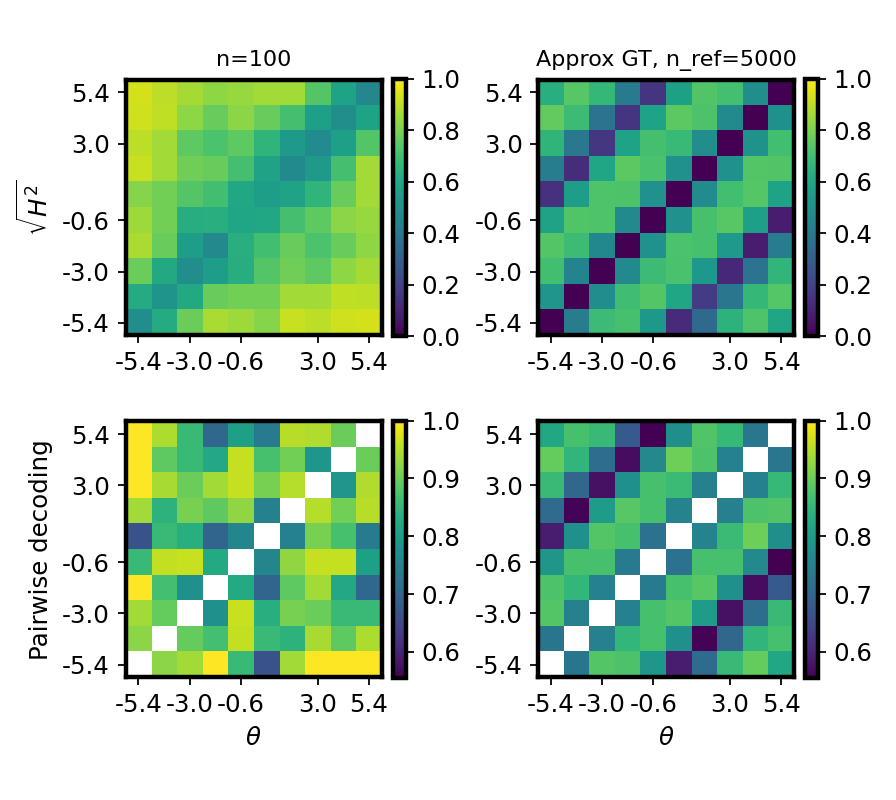
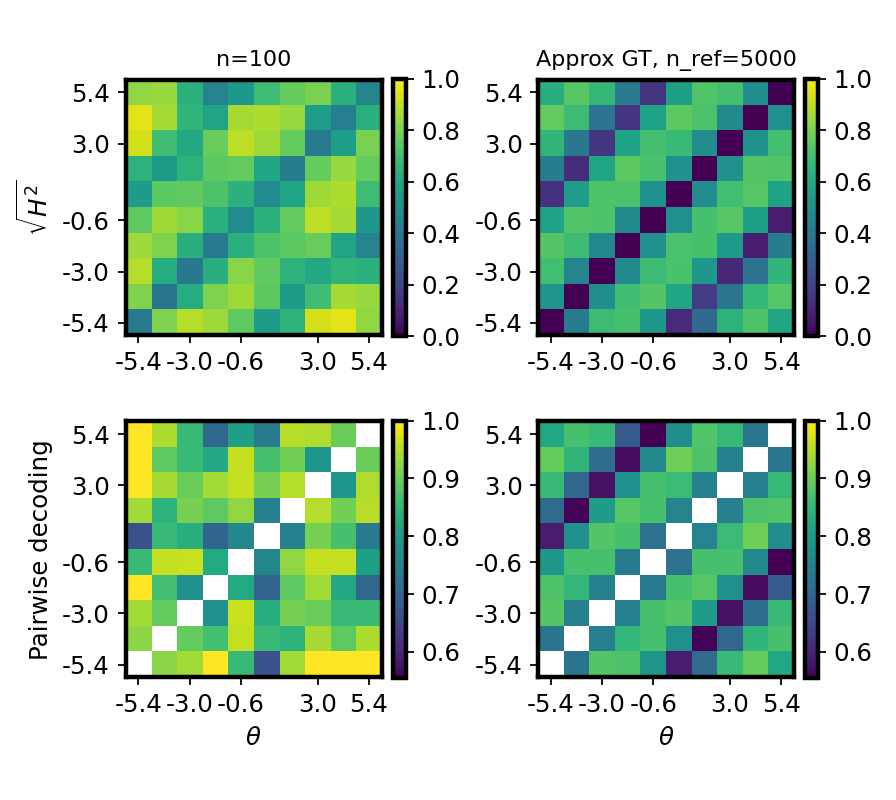
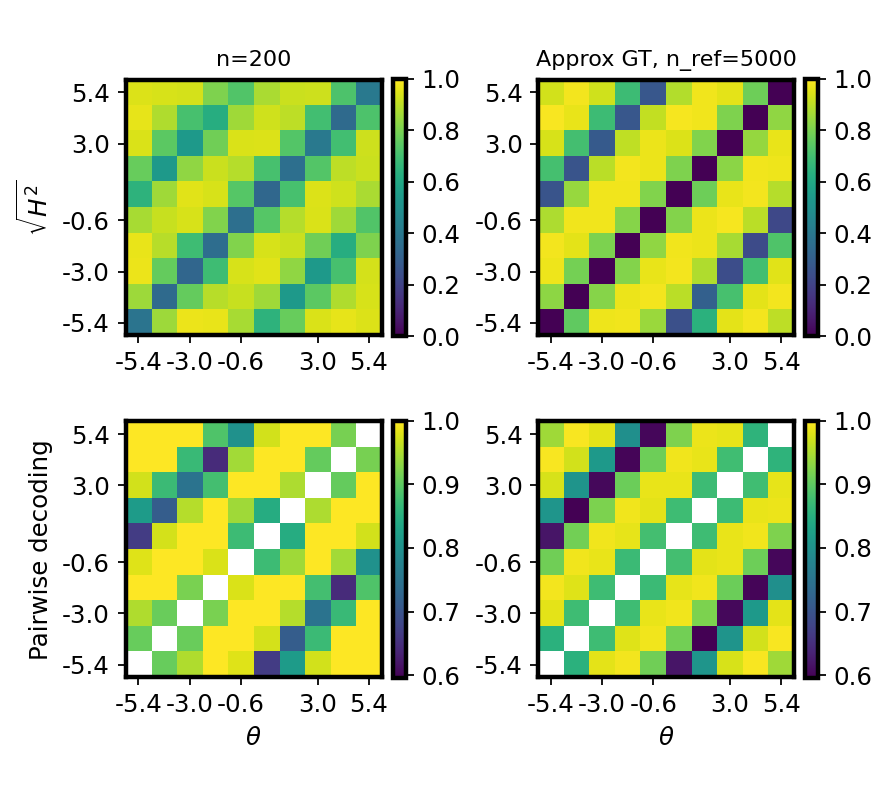
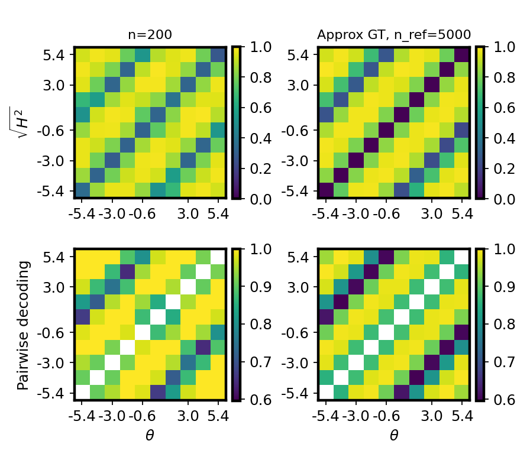

# 2026-04-23 x-flow: accuracy-MDS embedding vs vanilla theta on `cosine_gaussian_sqrtd` (10D)

## Question / Context
Raw-theta x-flow produced visually plausible Hellinger matrices, but quality versus MC GT was unstable. We tested whether re-parameterizing theta with an accuracy-derived MDS embedding improves binned H estimation.

## Method
For each run:
1. Train `x_flow` on subset size `n`.
2. Build binned matrix estimate from model output (`sqrt(H_sym)` track).
3. Compare to MC generative GT `sqrt(H^2)` with off-diagonal Pearson correlation.

MDS variant:
- Compute pairwise bin classification accuracy.
- Convert to clipped H lower-bound distance.
- Apply classical MDS to obtain embedded theta state.
- Train x-flow with that embedded state (`--theta-flow-acc-mds-state`).

## Reproduction (commands & scripts)
### A) `n=200`, noise scale `0.5` (existing repro script)
```bash
mamba run -n geo_diffusion python bin/repro_x_flow_mlp_n200_theta_binned_acc_mds.py \
  --dataset-family cosine_gaussian_sqrtd --x-dim 10 --device cuda

mamba run -n geo_diffusion python bin/study_h_decoding_convergence.py \
  --dataset-npz /nfshome/zeyuan/score-matching-fisher/data/repro_x_flow_mlp_n200_cosine_gaussian_sqrtd_xdim10_obsnoise0p5_th-6_6_thetabin10_accmds/shared_dataset.npz \
  --dataset-family cosine_gaussian_sqrtd \
  --output-dir /nfshome/zeyuan/score-matching-fisher/data/repro_x_flow_mlp_n200_cosine_gaussian_sqrtd_xdim10_obsnoise0p5_th-6_6_thetabin10_vanilla \
  --theta-field-method x_flow --flow-arch mlp --n-ref 5000 --n-list 200 \
  --num-theta-bins 10 --keep-intermediate --run-seed 7 --device cuda
```

### B) `n=100`, doubled noise (noise scale `1.0`)
Dataset was generated with the same binned-theta metadata (`repro_theta_bin_edges`) and then reused by both methods.

```bash
mamba run -n geo_diffusion python - <<'PY'
import argparse
import numpy as np
from pathlib import Path
from fisher.cli_shared_fisher import add_dataset_arguments
from fisher.shared_dataset_io import meta_dict_from_args, save_shared_dataset_npz
from fisher.shared_fisher_est import build_dataset_from_args

repo = Path('/nfshome/zeyuan/score-matching-fisher')
out = repo / 'data' / 'repro_x_flow_mlp_n100_cosine_gaussian_sqrtd_xdim10_obsnoise1p0_th-6_6_thetabin10_accmds' / 'shared_dataset.npz'
out.parent.mkdir(parents=True, exist_ok=True)

p = argparse.ArgumentParser(add_help=False)
add_dataset_arguments(p)
a = p.parse_args([])
a.dataset_family='cosine_gaussian_sqrtd'; a.x_dim=10
a.theta_low=-6.0; a.theta_high=6.0; a.obs_noise_scale=1.0
a.n_total=6000; a.train_frac=0.7; a.seed=7

np.random.seed(a.seed); rng=np.random.default_rng(a.seed)
ds=build_dataset_from_args(a)
theta_all,x_all=ds.sample_joint(a.n_total)

edges=np.linspace(a.theta_low,a.theta_high,11,dtype=np.float64)
centers=0.5*(edges[:-1]+edges[1:])
idx=np.searchsorted(edges,np.asarray(theta_all).reshape(-1),side='right')-1
idx=np.clip(idx,0,9)
theta_all=centers[idx].reshape(-1,1)
x_all=np.asarray(x_all,dtype=np.float64)

perm=rng.permutation(a.n_total)
n_train=min(max(int(a.train_frac*a.n_total),1),a.n_total-1)
tr=perm[:n_train].astype(np.int64); va=perm[n_train:].astype(np.int64)

meta=meta_dict_from_args(a)
meta['repro_theta_binned']=True
meta['repro_theta_num_bins']=10
meta['repro_theta_bin_edges']=edges.tolist()
meta['repro_theta_bin_centers']=centers.tolist()
meta['repro_theta_binning_range']=[-6.0,6.0]

save_shared_dataset_npz(str(out),meta=meta,theta_all=theta_all,x_all=x_all,train_idx=tr,validation_idx=va,
  theta_train=theta_all[tr],x_train=x_all[tr],theta_validation=theta_all[va],x_validation=x_all[va])
print(out)
PY

mamba run -n geo_diffusion python bin/study_h_decoding_convergence.py \
  --dataset-npz /nfshome/zeyuan/score-matching-fisher/data/repro_x_flow_mlp_n100_cosine_gaussian_sqrtd_xdim10_obsnoise1p0_th-6_6_thetabin10_accmds/shared_dataset.npz \
  --dataset-family cosine_gaussian_sqrtd \
  --output-dir /nfshome/zeyuan/score-matching-fisher/data/repro_x_flow_mlp_n100_cosine_gaussian_sqrtd_xdim10_obsnoise1p0_th-6_6_thetabin10_vanilla \
  --theta-field-method x_flow --flow-arch mlp --n-ref 5000 --n-list 100 \
  --num-theta-bins 10 --keep-intermediate --run-seed 7 --device cuda

mamba run -n geo_diffusion python bin/study_h_decoding_convergence.py \
  --dataset-npz /nfshome/zeyuan/score-matching-fisher/data/repro_x_flow_mlp_n100_cosine_gaussian_sqrtd_xdim10_obsnoise1p0_th-6_6_thetabin10_accmds/shared_dataset.npz \
  --dataset-family cosine_gaussian_sqrtd \
  --output-dir /nfshome/zeyuan/score-matching-fisher/data/repro_x_flow_mlp_n100_cosine_gaussian_sqrtd_xdim10_obsnoise1p0_th-6_6_thetabin10_accmds \
  --theta-field-method x_flow --flow-arch mlp --theta-flow-acc-mds-state --theta-flow-acc-mds-dim 9 \
  --n-ref 5000 --n-list 100 --num-theta-bins 10 --keep-intermediate --run-seed 7 --device cuda
```

## Results
### Metrics summary
| Setting | `corr_h_binned_vs_gt_mc` | `corr_llr_binned_vs_gt_mc` | `corr_clf_vs_ref` |
|---|---:|---:|---:|
| `n=200`, noise `0.5`, vanilla x-flow | 0.8456 | 0.7757 | 0.9387 |
| `n=200`, noise `0.5`, MDS x-flow | **0.9608** | **0.8974** | 0.9387 |
| `n=100`, noise `1.0`, vanilla x-flow | 0.0246 | 0.1547 | 0.4446 |
| `n=100`, noise `1.0`, MDS x-flow | **0.7549** | **0.7252** | 0.4446 |

Observation: in both regimes, MDS re-parameterization substantially improves H/LLR alignment with GT, while pairwise decoding correlation remains unchanged (as expected, since decoding reference target is fixed for each dataset/run).

## Figure
`n=100`, noise `1.0` comparison:




`n=200`, noise `0.5` comparison:




## Artifacts
- `n=200`, noise `0.5`, vanilla:
  - `/nfshome/zeyuan/score-matching-fisher/data/repro_x_flow_mlp_n200_cosine_gaussian_sqrtd_xdim10_obsnoise0p5_th-6_6_thetabin10_vanilla`
- `n=200`, noise `0.5`, MDS:
  - `/nfshome/zeyuan/score-matching-fisher/data/repro_x_flow_mlp_n200_cosine_gaussian_sqrtd_xdim10_obsnoise0p5_th-6_6_thetabin10_accmds`
- `n=100`, noise `1.0`, vanilla:
  - `/nfshome/zeyuan/score-matching-fisher/data/repro_x_flow_mlp_n100_cosine_gaussian_sqrtd_xdim10_obsnoise1p0_th-6_6_thetabin10_vanilla`
- `n=100`, noise `1.0`, MDS:
  - `/nfshome/zeyuan/score-matching-fisher/data/repro_x_flow_mlp_n100_cosine_gaussian_sqrtd_xdim10_obsnoise1p0_th-6_6_thetabin10_accmds`

## Takeaway
For this 10D cosine-Gaussian setup, accuracy-derived MDS theta embedding is an effective stabilizer for x-flow Hellinger estimation, especially in the harder low-sample/high-noise regime (`n=100`, noise scale `1.0`).
