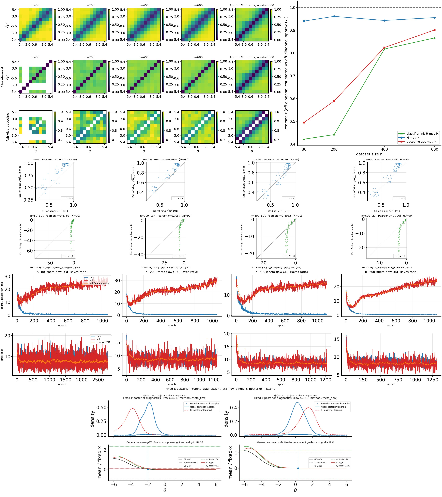
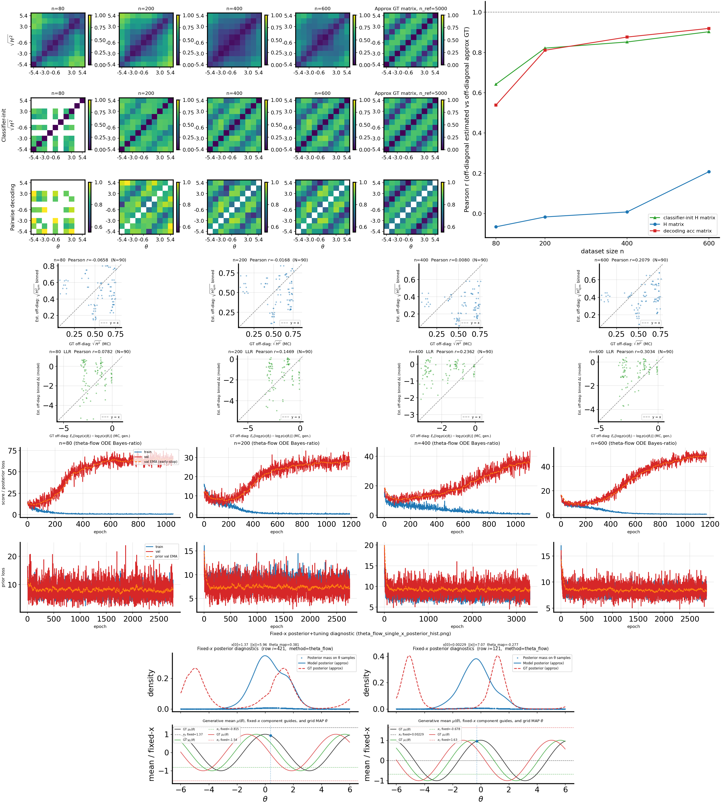

# 2026-04-24: H-decoding convergence on `randamp_gaussian_sqrtd` 50D (`theta_flow` + MLP, default `n_list`) with classifier-init detail

## Question / Context
Run `bin/study_h_decoding_convergence.py` on 50D `randamp_gaussian_sqrtd` with default sweep sizes, and document the updated classifier-initialized Hellinger row used in the matrix panel.

## Method
We run the convergence study with:
- dataset family: `randamp_gaussian_sqrtd`
- observation dimension: `x_dim=50`
- H estimator: `theta_flow`
- flow architecture: `mlp`
- device: CUDA
- default sweep: `n_list = 80,200,400,600` (default from script)
- reference subset: `n_ref=5000`
- bins: `num_theta_bins=10` with metadata theta range `[-6, 6]` (equal-width bins)

### Classifier-init method (row 2 in matrix panel)
For each bin pair `(i,j)`:
1. Train a binary logistic classifier on `x_train` restricted to bins `i/j`.
2. Use class-balanced priors through sample weights.
3. Compute logits $u=\hat{\ell}_{ij}(x)$ on pooled `x_all` rows from bins `i/j`.
4. Compute
$$
\psi(u)=1-\operatorname{sech}(u/2).
$$
5. Estimate
$$
\widehat{H^2}_{ij}=\tfrac{1}{2}\,\mathbb{E}_{x\in i}[\psi(u)] + \tfrac{1}{2}\,\mathbb{E}_{x\in j}[\psi(u)].
$$
6. Symmetrize, clip to $[0,1]$, set diagonal to $0$, then use $\sqrt{H^2}$ for plotting/correlation vs GT.

Implementation detail (important): balanced sample weights are scaled to keep total weight near pair sample count (not sum-to-1), so regularization is not unintentionally amplified and logits do not collapse toward zero.

## Reproduction (commands & scripts)
Dataset used (already present):
- `/nfshome/zeyuan/score-matching-fisher/data/shared_fisher_dataset_randamp_gaussian_sqrtd_xdim50_n6000_trainfrac07_seed7.npz`

Run command:
```bash
mamba run -n geo_diffusion python bin/study_h_decoding_convergence.py \
  --dataset-npz /nfshome/zeyuan/score-matching-fisher/data/shared_fisher_dataset_randamp_gaussian_sqrtd_xdim50_n6000_trainfrac07_seed7.npz \
  --dataset-family randamp_gaussian_sqrtd \
  --theta-field-method theta_flow \
  --flow-arch mlp \
  --n-ref 5000 \
  --num-theta-bins 10 \
  --keep-intermediate \
  --output-dir /nfshome/zeyuan/score-matching-fisher/data/h_decoding_conv_randamp_gaussian_sqrtd_xdim50_theta_flow_mlp_20260424_defaultn \
  --device cuda
```

Note: `--n-list` is intentionally omitted; script default is `80,200,400,600`.

## Results
From:
- `/nfshome/zeyuan/score-matching-fisher/data/h_decoding_conv_randamp_gaussian_sqrtd_xdim50_theta_flow_mlp_20260424_defaultn/h_decoding_convergence_results.csv`

| n | corr_h_binned_vs_gt_mc | corr_clf_h_binned_vs_gt_mc | corr_clf_vs_ref | corr_llr_binned_vs_gt_mc |
|---:|---:|---:|---:|---:|
| 80  | 0.9402 | 0.4217 | 0.4949 | 0.6760 |
| 200 | 0.9609 | 0.4418 | 0.5894 | 0.7067 |
| 400 | 0.9429 | 0.8174 | 0.8239 | 0.8082 |
| 600 | 0.9555 | 0.8663 | 0.9011 | 0.7965 |

Observation:
- `corr_clf_h_binned_vs_gt_mc` increases strongly with sample size (`n=80/200` low, `n=400/600` much higher), consistent with classifier stability improving in larger subsets.

## Figure


Interpretation:
- The classifier-init row (middle row) tracks GT structure much better at larger `n`.
- The H-correlation and decoding-correlation both improve with `n`; LLR correlation remains high overall.

## Artifacts
Primary output directory:
- `/nfshome/zeyuan/score-matching-fisher/data/h_decoding_conv_randamp_gaussian_sqrtd_xdim50_theta_flow_mlp_20260424_defaultn`

Key files:
- `/nfshome/zeyuan/score-matching-fisher/data/h_decoding_conv_randamp_gaussian_sqrtd_xdim50_theta_flow_mlp_20260424_defaultn/h_decoding_convergence_results.npz`
- `/nfshome/zeyuan/score-matching-fisher/data/h_decoding_conv_randamp_gaussian_sqrtd_xdim50_theta_flow_mlp_20260424_defaultn/h_decoding_convergence_results.csv`
- `/nfshome/zeyuan/score-matching-fisher/data/h_decoding_conv_randamp_gaussian_sqrtd_xdim50_theta_flow_mlp_20260424_defaultn/h_decoding_convergence_combined.png`
- `/nfshome/zeyuan/score-matching-fisher/data/h_decoding_conv_randamp_gaussian_sqrtd_xdim50_theta_flow_mlp_20260424_defaultn/h_decoding_convergence_summary.txt`
- `/nfshome/zeyuan/score-matching-fisher/data/h_decoding_conv_randamp_gaussian_sqrtd_xdim50_theta_flow_mlp_20260424_defaultn/training_losses/manifest.txt`

## Takeaway
For 50D `randamp_gaussian_sqrtd` under default sweep sizes, the classifier-initialized Hellinger estimate is data-size sensitive: weak at small `n`, but close to GT by `n=600` (`corr_clf_h≈0.866`). The corrected sample-weight scaling in classifier-init is necessary to avoid near-zero H estimates from over-regularized logits.

---

## Appendix: 10D `cosine_gaussian_sqrtd` run (same script, default sweep)

### Context
Additional run requested after the 50D randamp experiment:
- dataset family: `cosine_gaussian_sqrtd`
- observation dimension: `x_dim=10`
- method/arch: `theta_flow` + `mlp`
- default sweep: `n_list = 80,200,400,600`
- reference subset: `n_ref=5000`
- bins: `num_theta_bins=10`

### Reproduction command
```bash
mamba run -n geo_diffusion python bin/study_h_decoding_convergence.py \
  --dataset-npz /nfshome/zeyuan/score-matching-fisher/data/dataset_cosine_gaussian_sqrtd_xdim10_trainfrac07/shared_dataset.npz \
  --dataset-family cosine_gaussian_sqrtd \
  --keep-intermediate \
  --output-dir /nfshome/zeyuan/score-matching-fisher/data/h_decoding_conv_cosine_gaussian_sqrtd_xdim10_theta_flow_mlp_20260424_defaultn \
  --device cuda
```

### Results
From:
- `/nfshome/zeyuan/score-matching-fisher/data/h_decoding_conv_cosine_gaussian_sqrtd_xdim10_theta_flow_mlp_20260424_defaultn/h_decoding_convergence_results.csv`

| n | corr_h_binned_vs_gt_mc | corr_clf_h_binned_vs_gt_mc | corr_clf_vs_ref | corr_llr_binned_vs_gt_mc |
|---:|---:|---:|---:|---:|
| 80  | -0.0658 | 0.6420 | 0.5383 | 0.0782 |
| 200 | -0.0168 | 0.8214 | 0.8108 | 0.1469 |
| 400 | 0.0080 | 0.8519 | 0.8763 | 0.2362 |
| 600 | 0.2079 | 0.9027 | 0.9193 | 0.3034 |

Observation:
- In this 10D cosine setup, classifier-init and decoding correlations are strong, while direct `corr_h_binned_vs_gt_mc` remains much weaker than in the 50D randamp case.

### Figure


### Artifacts
- `/nfshome/zeyuan/score-matching-fisher/data/h_decoding_conv_cosine_gaussian_sqrtd_xdim10_theta_flow_mlp_20260424_defaultn/h_decoding_convergence_results.npz`
- `/nfshome/zeyuan/score-matching-fisher/data/h_decoding_conv_cosine_gaussian_sqrtd_xdim10_theta_flow_mlp_20260424_defaultn/h_decoding_convergence_results.csv`
- `/nfshome/zeyuan/score-matching-fisher/data/h_decoding_conv_cosine_gaussian_sqrtd_xdim10_theta_flow_mlp_20260424_defaultn/h_decoding_convergence_combined.png`
- `/nfshome/zeyuan/score-matching-fisher/data/h_decoding_conv_cosine_gaussian_sqrtd_xdim10_theta_flow_mlp_20260424_defaultn/h_decoding_convergence_summary.txt`
