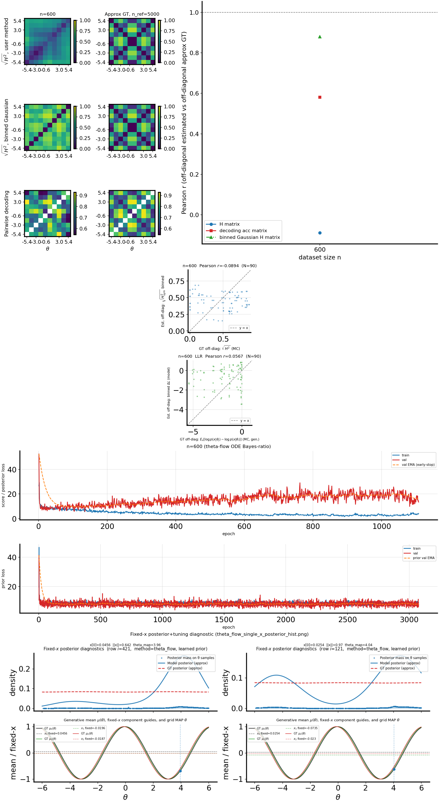
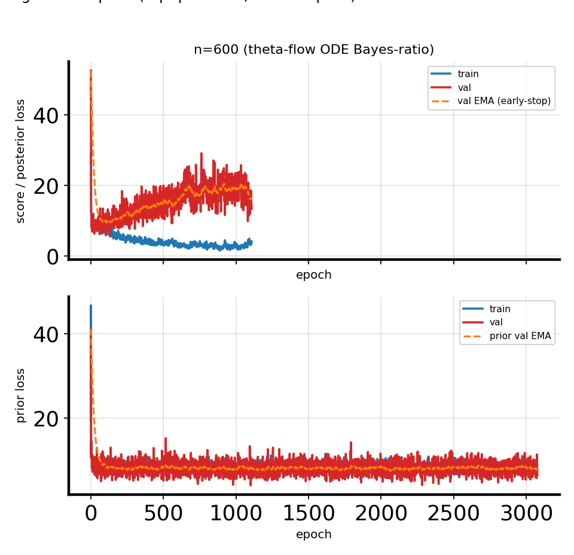

# 2026-04-26: Theta-flow **transformer** encoders (posterior + prior) on 2D `cosine_gaussian_sqrtd` (PR-100D embedding) — H-decoding convergence

## Question / Context

We added `flow_arch=transformer` for `theta_flow`: the conditional (posterior) and prior velocity fields are built from PyTorch `TransformerEncoder` stacks instead of MLPs. This note records **what the architecture is**, which CLI knobs map to it, and a completed **`study_h_decoding_convergence.py`** run on a 2D observation embedded from 100D PR space (`pr100d` dataset), no $x$-PCA, single sweep size $n=600$.

**Observation vs conclusion:** the run below is a single configuration point; the **matrix-level** agreement with the generative GT Hellinger row (`corr_h_binned_vs_gt_mc`) is **weak** for this run, while the **binned-Gaussian proxy row** still correlates well with GT. Interpret cautiously — the focus here is **reproducibility and architecture documentation**, not a claim that the transformer beats other arches on this task.

## Method: theta-space flow and `transformer` role

- **Task:** For `theta_flow`, we model a time-dependent velocity in $\theta$ for both the **posterior** $p(\theta\mid x)$ and the **prior** $p(\theta)$, train with flow matching, then use ODE log-likelihoods to fill the Hellinger / decoding matrices in `shared_fisher_est` (see older note [flow ODE and H-matrix](2026-04-13-flow-ode-direct-likelihood-theta-h-matrix.md)).
- **`--flow-arch transformer`:** `shared_fisher_est` instantiates:
  - **Posterior:** `ConditionalThetaFlowVelocityTransformer` — conditions on $x$ through **latent $x$ tokens** (a linear map from $x$ to a sequence of $d_\mathrm{model}$ vectors).
  - **Prior:** `PriorThetaFlowVelocityTransformer` — no $x$; **learned latent tokens** carry capacity analogously.

### Architecture detail (encoder token layout)

**Posterior** (`fisher/models.py`, `ConditionalThetaFlowVelocityTransformer`):

- Token sequence: **[ $\theta$ token, time token, $K$ $x$ tokens ]**, length $2+K$ with $K =$ `--flow-transformer-x-tokens` (default 8).
- $\theta$ and $t$ are linearly embedded to $d$; $x \in \mathbb{R}^{D_x}$ is mapped with `nn.Linear(x_dim, K * d)` and reshaped to $K$ tokens of dimension $d =$ `--flow-hidden-dim` (per-run; below we used 256).
- `type_embed`: learned additive embedding per token position.
- `nn.TransformerEncoder` (depth `--flow-depth`, heads `--flow-transformer-heads`, FFN width `hidden_dim * flow_transformer_ff_mult`, GELU, `norm_first=True`, `batch_first=True`).
- **Readout:** concatenate **$\theta$ token hidden** with **mean-pool of $x$ token hiddens** (not the time token) → $2d$ features → `Linear(2d, theta_dim)` → velocity in $\theta$.

**Prior** (`PriorThetaFlowVelocityTransformer`):

- Tokens: **[ $\theta$ token, time token, $L$ latent tokens ]** with $L =$ `--flow-prior-transformer-latent-tokens` (default 2). Latent token vectors are **learned `nn.Parameter`** (broadcast per batch), not functions of $\theta$ or $t$ before attention.
- Same encoder style, same **readout** pattern: $[\,h_{\theta} \;\|\; \mathrm{mean}(h_{\mathrm{latent}})\,]$ then `Linear(2d, theta_dim)`.

**Shared hyperparameters:** `--flow-transformer-heads`, `--flow-transformer-ff-mult`, `--flow-transformer-dropout` apply to **both** posterior and prior encoders. Posterior width uses `--flow-hidden-dim`; prior width uses `--prior-hidden-dim` (if you set only one of them, the other still defaults to 128 — match explicitly for symmetric width).

**Training:** for plain `theta_flow`, auxiliary endpoint NLL is off when `--flow-endpoint-loss-weight` is 0 (default; the h-decoding study also pins this in `p.set_defaults` in `bin/study_h_decoding_convergence.py`).

## Reproduction (commands & scripts)

**Dataset (from run summary):**

- `/grad/zeyuan/score-matching-fisher/data/cosine_gaussian_sqrtd_xdim2_n5000_trainfrac0p8_seed7_pr100d.npz`  
- Family: `cosine_gaussian_sqrtd`, 2D $x$ after PR embedding from 100D in the generator pipeline (`pr100d` in filename).

**Canonical command (match the run directory name `..._h256_..._transformer_nopca_n600_...`):**

```bash
mamba run -n geo_diffusion python bin/study_h_decoding_convergence.py \
  --dataset-npz /grad/zeyuan/score-matching-fisher/data/cosine_gaussian_sqrtd_xdim2_n5000_trainfrac0p8_seed7_pr100d.npz \
  --dataset-family cosine_gaussian_sqrtd \
  --theta-field-method theta_flow \
  --flow-arch transformer \
  --flow-hidden-dim 256 \
  --prior-hidden-dim 256 \
  --n-list 600 \
  --n-ref 5000 \
  --num-theta-bins 10 \
  --x-pca-dim 0 \
  --output-dir /grad/zeyuan/score-matching-fisher/data/h_decoding_conv_cosine_sqrtd_xdim2_pr100d_h256_theta_flow_transformer_nopca_n600_20260426-113310_ki \
  --device cuda
```

- Omit extra flags to use defaults: e.g. `--flow-transformer-x-tokens 8`, `--flow-prior-transformer-latent-tokens 2`, `--flow-transformer-heads 4`, `--flow-depth` / `--prior-depth` 3, `--flow-early-patience 1000`, `--prior-early-patience 1000`.
- **Source references:** `fisher/models.py` (classes above), `fisher/shared_fisher_est.py` (branches for `flow_score_arch == "transformer"` and `flow_prior_arch == "transformer"`), `fisher/cli_shared_fisher.py` (`--flow-arch`, `--flow-transformer-*`, `--flow-prior-transformer-latent-tokens`).

## Results

From  
`/grad/zeyuan/score-matching-fisher/data/h_decoding_conv_cosine_sqrtd_xdim2_pr100d_h256_theta_flow_transformer_nopca_n600_20260426-113310_ki/h_decoding_convergence_results.csv`:

| n | corr_h_binned_vs_gt_mc | corr_clf_vs_ref | corr_llr_binned_vs_gt_mc | corr_binned_gaussian_h_binned_vs_gt_mc | wall_seconds |
|---:|---:|---:|---:|---:|---:|
| 600 | -0.0894 | 0.5805 | 0.0567 | 0.8805 | 751.7 |

**Observation:** the **binned H vs MC GT** correlation is small/negative for this run, while the **binned-Gaussian** comparison remains high; decoding correlations are moderate. This is a single run — use the table as an anchor for the saved artifacts, not as a final ranking of `transformer` vs other `--flow-arch` choices.

## Figure

**Combined panel** (matrices, correlations, scatter, training losses as produced by the study script):



**Training loss panel** (posterior / prior / score curves aggregated by the study):



**Interpretation:** the combined figure shows the full H-decoding dashboard for this configuration; the loss panel reflects long effective training under default early-stopping patience (both posterior and prior flows are trained in `theta_flow`).

## Artifacts

**Output directory (repo `data/` symlink):**  
`/grad/zeyuan/score-matching-fisher/data/h_decoding_conv_cosine_sqrtd_xdim2_pr100d_h256_theta_flow_transformer_nopca_n600_20260426-113310_ki/`

| Artifact | Path |
|----------|------|
| Results CSV | `/grad/zeyuan/score-matching-fisher/data/h_decoding_conv_cosine_sqrtd_xdim2_pr100d_h256_theta_flow_transformer_nopca_n600_20260426-113310_ki/h_decoding_convergence_results.csv` |
| Results NPZ | `/grad/zeyuan/score-matching-fisher/data/h_decoding_conv_cosine_sqrtd_xdim2_pr100d_h256_theta_flow_transformer_nopca_n600_20260426-113310_ki/h_decoding_convergence_results.npz` |
| Summary (paths + protocol notes) | `/grad/zeyuan/score-matching-fisher/data/h_decoding_conv_cosine_sqrtd_xdim2_pr100d_h256_theta_flow_transformer_nopca_n600_20260426-113310_ki/h_decoding_convergence_summary.txt` |
| Embeddable combined PNG (same as figure above) | `/grad/zeyuan/score-matching-fisher/data/h_decoding_conv_cosine_sqrtd_xdim2_pr100d_h256_theta_flow_transformer_nopca_n600_20260426-113310_ki/h_decoding_convergence_combined.png` |
| Per-$n$ sweep (training artifacts) | `/grad/zeyuan/score-matching-fisher/data/h_decoding_conv_cosine_sqrtd_xdim2_pr100d_h256_theta_flow_transformer_nopca_n600_20260426-113310_ki/sweep_runs/n_000600/` |
| Journal copies of figures | `journal/notes/figs/2026-04-26-theta-flow-transformer-h-decoding/h_decoding_convergence_combined.png`, `h_decoding_training_losses_panel.png` |

## Takeaway

- **`flow_arch=transformer`** for `theta_flow` means a **shared-style transformer encoder** for posterior (with $x$ split into $K$ tokens) and prior (with $L$ learned latents), both read out by $[\,h_\theta \,\|\, \text{pool}(h_{x\text{ or lat}})\,] \to v(\theta_t,\cdot)$.
- A **reproducible** h-decoding run on **2D `cosine_gaussian_sqrtd` with PR-100D embedding** is fully specified by the command and artifact paths above; default transformer token counts and heads are in `fisher/cli_shared_fisher.py` unless overridden.
