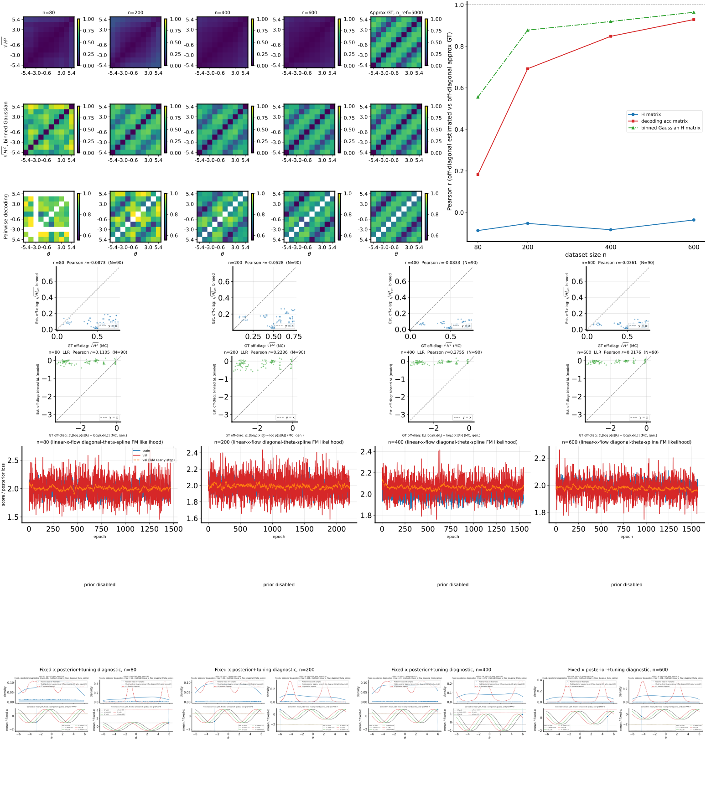

# 2026-04-29 — H-decoding: B-spline diagonal-$\theta$ linear X-flow (`linear_x_flow_diagonal_theta_spline`) on 10D `cosine_gaussian_sqrtd`

## Question / context

We added a **spline-parameterized** variant of the diagonal-$\theta$ linear X-flow likelihood used in `study_h_decoding_convergence.py`: instead of an MLP mapping $\theta \mapsto (a,b)$, both $a(\theta)$ and $b(\theta)$ are **linear functions of fixed cubic B-spline features** of **scalar** $\theta$. On the same 10D `cosine_gaussian_sqrtd` setup as a strong **MLP diagonal-$\theta$** baseline (post-training scalar EMA on validation loss), the spline run’s **binned-$H$ vs GT** correlation is **poor and often negative**, while **pairwise decoding** correlations match the baseline (as expected: decoding does not use the learned likelihood row). This note records the **method**, **repro command**, **numbers**, and a **embedded figure** for the spline run.

## Method (new `linear_x_flow_diagonal_theta_spline`)

**Velocity (same bridge as other linear X-flows).** For normalized $x$, train time-independent

$$
v(x,\theta) = a(\theta) \odot x + b(\theta),
$$

with straight-bridge flow matching on $(x_t, u_t)$ as in the existing trainer.

**Scalar $\theta$ and normalization.** Only `theta_dim = 1` is supported. Given training-set bounds $\theta_{\min}, \theta_{\max}$ from the **training** $\theta$ column,

$$
u = \mathrm{clip}\left(\frac{\theta - \theta_{\min}}{\theta_{\max} - \theta_{\min} + \varepsilon},\, [0,1]\right),
$$

then $u$ is clamped slightly inside $(0,1)$ before basis evaluation so open-uniform **clamped cubic** knots behave at repeated end knots.

**B-spline features.** Let $\phi(u) \in \mathbb{R}^K$ be the vector of **cubic** B-spline basis values (open uniform, clamped ends) with default **$K = 5$** (`--lxf-spline-k`). Implementation: `open_uniform_clamped_knot_vector`, `bspline_basis_phi_batch`, `spline_basis_features_normalized` in [`fisher/linear_x_flow.py`](/grad/zeyuan/score-matching-fisher/fisher/linear_x_flow.py).

**Linear heads (per your plan).**

$$
a(\theta) = \phi(u)\, W_a^\top + c_a, \qquad b(\theta) = \phi(u)\, W_b^\top + c_b,
$$

with $W_a, W_b \in \mathbb{R}^{D \times K}$ and biases in $\mathbb{R}^D$. Code: [`ConditionalThetaDiagonalSplineLinearXFlowMLP`](/grad/zeyuan/score-matching-fisher/fisher/linear_x_flow.py).

**Likelihood after training (diagonal Gaussian, same as MLP variant).** With diagonal $A(\theta) = \mathrm{diag}(a(\theta))$,

$$
\Sigma_{ii}(\theta) = e^{2 a_i(\theta)}, \qquad
\mu_i(\theta) = \frac{e^{a_i(\theta)} - 1}{a_i(\theta)}\, b_i(\theta),
$$

using the existing stable `_phi_expm1_div_a` helper for small $|a_i|$.

**CLI / study wiring.** Method token `linear-x-flow-diagonal-theta-spline` (aliases in `bin/study_h_decoding_convergence.py`), hyperparameter `--lxf-spline-k` (default 5; validated $4 \le K \le 64$ for cubic). Training still uses `train_linear_x_flow` and the same C-matrix path via `log_prob_observed`.

## Reproduction (commands and scripts)

From repo root, using the **same** shared dataset NPZ and sweep as the 10D diagonal-$\theta$ MLP EMA reference run:

```bash
cd /grad/zeyuan/score-matching-fisher
PYTHONUNBUFFERED=1 mamba run -n geo_diffusion python bin/study_h_decoding_convergence.py \
  --dataset-npz /grad/zeyuan/score-matching-fisher/data/cosine_gaussian_sqrtd_xdim10_n5000_trainfrac0p8_seed7.npz \
  --dataset-family cosine_gaussian_sqrtd \
  --n-ref 5000 \
  --n-list 80,200,400,600 \
  --num-theta-bins 10 \
  --theta-field-method linear-x-flow-diagonal-theta-spline \
  --lxf-spline-k 5 \
  --output-dir /grad/zeyuan/score-matching-fisher/data/h_decoding_conv_cosine_gaussian_sqrtd_xdim10_lxf_diagtheta_spline_20260429 \
  --device cuda
```

Default `lxf_*` training knobs match other linear-X-flow rows in this study (e.g. `lxf_epochs=10000`, `lxf_hidden_dim=128`, `lxf_depth=3`, `lxf_weight_ema_decay=0.9`); the spline model **does not** use the MLP trunk—only $K$ basis features per $(a,b)$ head.

**Scripts / modules:** `bin/study_h_decoding_convergence.py`; model and basis in `fisher/linear_x_flow.py` (`ConditionalThetaDiagonalSplineLinearXFlowMLP`).

## Results (this run vs MLP diagonal-$\theta$ EMA baseline)

Both runs use the same `n` grid `[80, 200, 400, 600]` and the same dataset NPZ. Metrics from `h_decoding_convergence_results.npz`:

| $n$ | `corr_h_binned_vs_gt_mc` (spline) | `corr_h_binned_vs_gt_mc` (MLP EMA) | `corr_llr_binned_vs_gt_mc` (spline) | `corr_llr_binned_vs_gt_mc` (MLP EMA) |
|-----|-----------------------------------|-------------------------------------|--------------------------------------|---------------------------------------|
| 80  | $-0.087$ | $-0.074$ | $0.110$ | $0.100$ |
| 200 | $-0.053$ | $0.636$ | $0.224$ | $0.589$ |
| 400 | $-0.083$ | $0.823$ | $0.276$ | $0.845$ |
| 600 | $-0.036$ | $0.928$ | $0.318$ | $0.919$ |

**`corr_clf_vs_ref`** (pairwise decoding vs $n_{\mathrm{ref}}$ subset) is **identical** across the two runs at every $n$ (e.g. $0.182 \to 0.929$ as $n$ increases): the decoding row does not depend on the learned $p(x\mid\theta)$ model.

**Per-$n$ wall times** (seconds, spline run only): `[14.7, 20.1, 16.0, 17.5]` — cheap vs MLP in parameter count, but **not** indicative of quality.

**Observation vs conclusion.** The spline head is a **low-dimensional** $\theta \mapsto (a,b)$ map (only $K$ basis terms per coordinate), while the baseline uses a **wide/deep MLP** on $\theta$ before linear heads to $D$ outputs. The collapse of `corr_h` for $n \ge 200$ is consistent with **underfitting / wrong inductive bias** for this 10D likelihood, not with a pipeline bug (decoding and LLR structure behave as expected).

## Figure

Combined convergence panel for the **spline** run (same layout as other `study_h_decoding_convergence` outputs: GT vs binned $H$, decoding, training losses, etc.):



Visually, the binned-$H$ row stays misaligned with the MC GT column compared to the MLP diagonal-$\theta$ EMA run at the same $n$ values; decoding rows look unchanged, matching the table above.

## Artifacts (absolute paths)

**Spline run (this note’s primary):**

- `/grad/zeyuan/score-matching-fisher/data/h_decoding_conv_cosine_gaussian_sqrtd_xdim10_lxf_diagtheta_spline_20260429/h_decoding_convergence_summary.txt` (includes `lxf_spline_k: 5`)
- `/grad/zeyuan/score-matching-fisher/data/h_decoding_conv_cosine_gaussian_sqrtd_xdim10_lxf_diagtheta_spline_20260429/h_decoding_convergence_results.npz`
- `/grad/zeyuan/score-matching-fisher/data/h_decoding_conv_cosine_gaussian_sqrtd_xdim10_lxf_diagtheta_spline_20260429/h_decoding_convergence_results.csv`
- `/grad/zeyuan/score-matching-fisher/data/h_decoding_conv_cosine_gaussian_sqrtd_xdim10_lxf_diagtheta_spline_20260429/h_decoding_convergence_combined.svg`

**MLP diagonal-$\theta$ baseline cited for `corr_h` / `corr_llr`:**

- `/grad/zeyuan/score-matching-fisher/data/h_decoding_conv_cosine_gaussian_sqrtd_xdim10_lxf_diagtheta_post_scalar_ema_20260429/h_decoding_convergence_results.npz`

**Dataset NPZ:**

- `/grad/zeyuan/score-matching-fisher/data/cosine_gaussian_sqrtd_xdim10_n5000_trainfrac0p8_seed7.npz`

## Takeaway

The **B-spline linear** parameterization is **easy to specify and cheap**, but with **default $K=5$** and **no MLP trunk**, it appears **far too weak** for this **10D** `cosine_gaussian_sqrtd` marginal-likelihood geometry: `corr_h_binned_vs_gt_mc` stays near zero or **negative** for $n \in \{200,400,600\}$, while the **MLP** diagonal-$\theta$ baseline reaches **$0.64$–$0.93$** on the same metric. Reasonable follow-ups (not done here): increase $K$, add a shallow MLP on $\phi$, or reserve splines for **low-$D$** or **very smooth** $\theta \mapsto (a,b)$ regimes.
