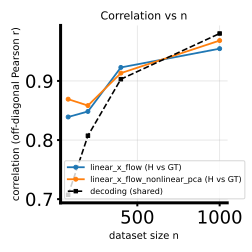

# 2026-05-01 — `linear_x_flow_nonlinear_pca`: method (math) + linearbench H-decoding twofig repro

## Question / context

The H-decoding pipeline can estimate binned Fisher / likelihood-ratio structure using a **conditional $x$-space flow-matching** model. The variant **`linear_x_flow_nonlinear_pca`** extends the closed-form Gaussian endpoint of **linear X-flow** with a **low-dimensional, PCA-guided nonlinear correction**. This note records the **mathematical definition as implemented** in [`fisher/linear_x_flow.py`](../../fisher/linear_x_flow.py) and gives a **reproducible** [`bin/study_h_decoding_twofig.py`](../../bin/study_h_decoding_twofig.py) command on **linearbench** (PR-embedded `randamp_gaussian_sqrtd`, 30D $x$).

## Method

### Stage 1 — linear X-flow (symmetric $A$, conditional offset)

Work in **normalized** observation coordinates

$$
\tilde{x} = (x - m) \oslash s,
$$

with per-dimension mean $m$ and scale $s$ fixed from the training split (same handling as plain `linear_x_flow`).

The base velocity field is **time-independent** and **affine in $\tilde{x}$**:

$$
v_{\mathrm{lin}}(\tilde{x}, \theta) = \tilde{x} A^\top + b_\phi(\theta),
$$

with **symmetric** $A \in \mathbb{R}^{d \times d}$ (parameterized as $A=\tfrac12(B+B^\top)$ in [`ConditionalLinearXFlowMLP`](../../fisher/linear_x_flow.py)) and $b_\phi$ an MLP in $\theta$. Training is **flow matching** on the straight bridge

$$
\tilde{x}_t = (1-t)\,\varepsilon + t\,\tilde{x}_1,\qquad \varepsilon \sim \mathcal{N}(0,I),\qquad t \in [t_\varepsilon,\,1-t_\varepsilon],
$$

by regressing the velocity to the **conditional** target $u_t = \tilde{x}_1 - \varepsilon$.

For this linear drift, the **endpoint** distribution at $t=1$ is Gaussian:

$$
\tilde{x} \mid \theta \sim \mathcal{N}\big(\mu(\theta),\,\Sigma\big),\qquad
\Sigma = e^{A} e^{A^\top},
$$

and $\mu(\theta)$ solves the linear system $A\,\mu(\theta)^\top = (e^{A}-I)\,b_\phi(\theta)^\top$ (see `endpoint_mean_covariance` in code; a small **solve jitter** stabilizes the solve).

### Stage 1b — frozen PCA basis on residuals

After stage 1, we compute the linear predicted mean $\mu(\theta)$ on **training** $\theta$, form residuals in normalized space (rows indexed by samples)

$$
r_i = \tilde{x}_i - \mu(\theta_i),
$$

**center** columns of the residual matrix, and take the **leading right singular vectors**:

$$
R = [r_1^\top,\ldots,r_N^\top]^\top \quad \Rightarrow \quad \mathrm{SVD}(R) = U_{\mathrm{svd}}\,\mathrm{diag}(\sigma)\,V^\top.
$$

The implementation keeps $U \in \mathbb{R}^{d \times k}$ with **orthonormal columns** spanning the top-$k$ directions (`fit_residual_pca_basis_from_linear_mean`, default $k$ from `--lxf-nlpca-dim`, CLI default $8$). This basis is **frozen** during stage 2.

### Stage 2 — nonlinear correction in PCA coordinates

Define **bridge-adjusted** PCA coefficients

$$
z(\tilde{x}, t, \theta) = U^\top\big(\tilde{x} - t\,\mu(\theta)\big) \in \mathbb{R}^k.
$$

A second MLP $h_\psi$ maps $(z,t,\theta)$ to another vector in $\mathbb{R}^k$:

$$
h = h_\psi(z, t, \theta),\qquad \Delta(\tilde{x},t,\theta) = U\,h \in \mathbb{R}^d.
$$

The **full** velocity used for FM training and for likelihood integration is

$$
v(\tilde{x}, t, \theta) = v_{\mathrm{lin}}(\tilde{x}, \theta) + \Delta(\tilde{x}, t, \theta).
$$

Optional **ridge on $h$**: training loss adds $\lambda_h \,\mathbb{E}\|h\|^2$ (`--lxf-nlpca-lambda-h`, default $0$). Optional **`--lxf-nlpca-freeze-linear`** disables gradients on the linear stage parameters during stage 2.

The final layer of $h_\psi$ is **initialized to zero** so initially $v \approx v_{\mathrm{lin}}$.

### Likelihood in normalized space (reverse flow + divergence)

Unlike stage 1 alone, the nonlinear correction depends on **time**, so the model uses the **instantaneous change-of-variables** along the learned ODE (backward from data noise). Let $\Phi_t(\tilde{x})$ solve

$$
\frac{\mathrm{d}}{\mathrm{d}t}\,\tilde{x}(t) = v(\tilde{x}(t), t, \theta)
$$

with **backward** Euler from $t=1$ to $0$ over `--lxf-nlpca-ode-steps` steps (default $32$). The log-density contribution integrates **divergence** $\nabla_{\tilde{x}}\cdot v$ along the same path:

$$
\log \tilde{p}(\tilde{x} \mid \theta)
= \log \mathcal{N}(\tilde{x}(0); 0, I)
- \int_0^1 (\nabla_{\tilde{x}}\cdot v)(\tilde{x}(t), t, \theta)\,\mathrm{d}t.
$$

Implementation detail: the divergence splits into

$$
\nabla_{\tilde{x}}\cdot v = \mathrm{tr}(A) + \sum_{j=1}^{k} \frac{\partial h_j}{\partial z_j},
$$

because $v_{\mathrm{lin}}$ has Jacobian trace $\mathrm{tr}(A)$ and the correction enters only through $z = U^\top(\tilde{x} - t\mu)$; the partials $\partial h_j / \partial z_j$ are computed by **one autograd pass per $j$** on $h_j$ w.r.t. $z$ (`divergence` in [`ConditionalPCANonlinearLinearXFlowMLP`](../../fisher/linear_x_flow.py)).

Observed-space log-probability adds the affine Jacobian from $(x-m)\oslash s$:

$$
\log p(x \mid \theta) = \log \tilde{p}(\tilde{x}\mid \theta) - \sum_{j=1}^{d} \log s_j.
$$

Pairwise **$C$-matrix** entries for H-decoding reuse these log-probs (`compute_pca_nonlinear_linear_x_flow_c_matrix`).

### Relation to plain `linear_x_flow`

| Aspect | `linear_x_flow` | `linear_x_flow_nonlinear_pca` |
|--------|------------------|-------------------------------|
| Velocity | $v_{\mathrm{lin}}(\tilde{x},\theta)$ only | $v_{\mathrm{lin}} + U h_\psi(z,t,\theta)$ |
| Endpoint | Exact Gaussian $\mathcal{N}(\mu,\Sigma)$ | **No** closed-form Gaussian endpoint in general |
| $\log p(x\mid\theta)$ | Cholesky of $\Sigma$ (`log_prob_normalized`) | Reverse ODE + divergence (`log_prob_normalized` on composite model) |

## Reproduction (commands & scripts)

**Pipeline:** [`bin/study_h_decoding_twofig.py`](../../bin/study_h_decoding_twofig.py) → shared training in [`bin/study_h_decoding_convergence.py`](../../bin/study_h_decoding_convergence.py) → [`fisher/linear_x_flow.py`](../../fisher/linear_x_flow.py).

Canonical **linearbench** PR dataset and fixed sweep per project skill **`lxf-bench-h-decoding-twofig`**:

```bash
cd /path/to/score-matching-fisher

mamba run -n geo_diffusion python bin/study_h_decoding_twofig.py \
  --dataset-npz data/randamp_gaussian_sqrtd_xdim5/randamp_gaussian_sqrtd_xdim5_pr30d.npz \
  --dataset-family randamp_gaussian_sqrtd \
  --theta-field-methods linear-x-flow,linear-x-flow-nonlinear-pca \
  --lxf-early-patience 1000 \
  --n-list 80,200,400,1000 \
  --device cuda \
  --output-dir data/randamp_gaussian_sqrtd_xdim5/h_decoding_twofig_lxf_nlpca_n80_200_400_1000
```

**Useful knobs (stage 2):** `--lxf-nlpca-dim`, `--lxf-nlpca-epochs` (0 → same as `--lxf-epochs`), `--lxf-nlpca-lr` (0 → `--lxf-lr`), `--lxf-nlpca-lambda-h`, `--lxf-nlpca-freeze-linear`, `--lxf-nlpca-ode-steps`.

## Results

Representative **two-method sweep** (linear vs nonlinear-PCA rows; columns $n \in \{80,200,400,1000\}$; decoding row shared) on the run above:


**Correlation vs $n$** for estimated binned $H$ vs MC GT (same run):



## Artifacts (exact paths)

- **Output directory:** `/grad/zeyuan/score-matching-fisher/data/randamp_gaussian_sqrtd_xdim5/h_decoding_twofig_lxf_nlpca_n80_200_400_1000/`
- **Summary:** `…/h_decoding_twofig_summary.txt`
- **Arrays:** `…/h_decoding_twofig_results.npz`
- **Figures:** `…/h_decoding_twofig_{sweep,gt,corr_vs_n,nmse_vs_n,training_losses_panel}.svg`
- **Log:** `…/run.log`

## Takeaway

**`linear_x_flow_nonlinear_pca`** is a **two-stage** model: (i) fit a **linear** conditional FM field with **Gaussian** endpoint; (ii) fit a **time-dependent** residual field that lives in the **top-$k$ PCA subspace of linear residuals**, trained by **FM** on the same bridge; **likelihoods** for H-decoding use a **fixed-step reverse ODE** plus an explicit **divergence** of the composite velocity. For linearbench at PR 30D, the archived run compares this model to plain `linear_x_flow` under **`--lxf-early-patience 1000`** and **`--n-list 80,200,400,1000`** (see figures and NPZ above).
