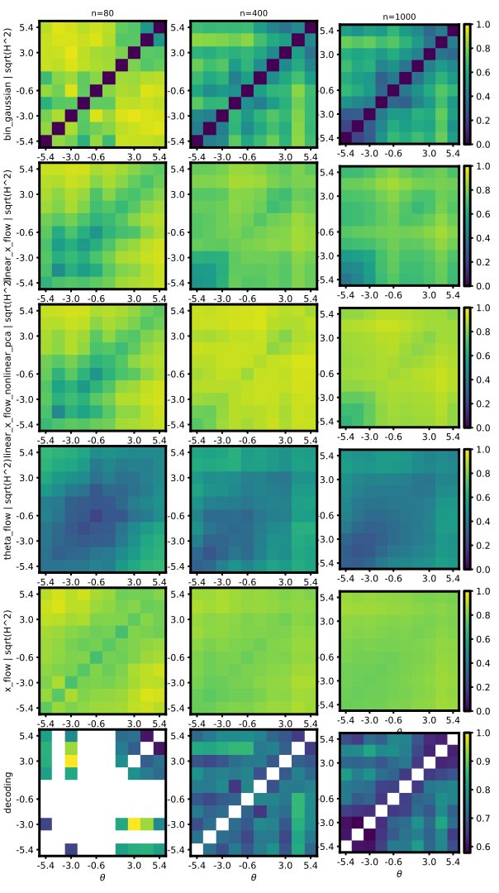
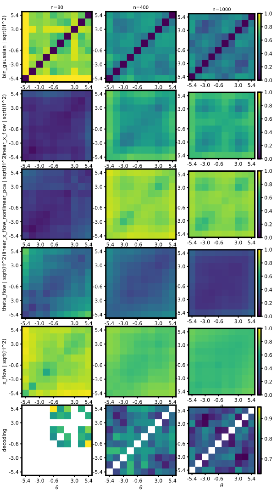
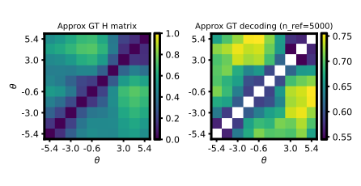
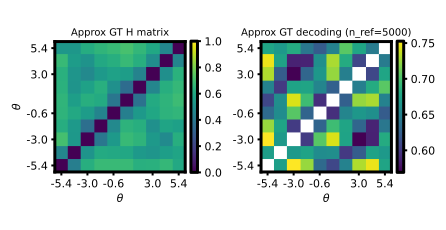
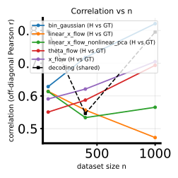
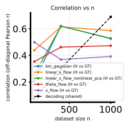
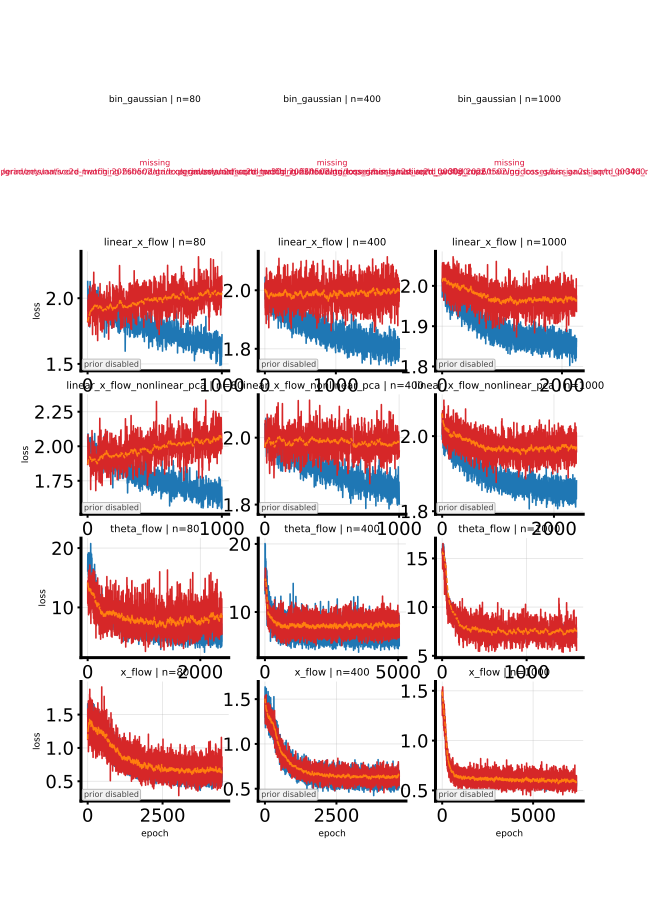

# 2026-05-02 Native 2D-$\theta$ H-decoding twofig pipeline (`study_h_decoding_twofig`)

## Question / context

The datasets in [2026-05-02-native-2d-theta-benchmark-datasets.md](2026-05-02-native-2d-theta-benchmark-datasets.md) store **full** $\theta \in \mathbb{R}^2$ and conditional means $\mu_j(\theta)$ that depend on **both** coordinates. Before this work, `bin/study_h_decoding_twofig.py` (via `bin/study_h_decoding_convergence.py`) **rejected** any bundle with `theta_all.shape[1] \neq 1`, and generative GT Monte Carlo Hellinger assumed **scalar** $\theta$ rows. This note records the **binning + GT convention**, **code touchpoints**, and **reproducible twofig runs** on the PR-30D NPZs for:

- `randamp_gaussian2d_sqrtd`
- `gridcos_gaussian2d_sqrtd_rand_tune_additive`

For the **different** setup where $x$ depends only on $\theta_1$ and $\theta_2$ is a nuisance coordinate (scalar-view NPZ), see [2026-05-02-theta2d-coordinate-benchmark-method.md](2026-05-02-theta2d-coordinate-benchmark-method.md).

## Method

### Binning and decoding

- **Bin indices** are computed from **$\theta_1$ only** (`theta[:, 0]`), using the usual equal-width edges from the `n_ref` permutation prefix (same contract as scalar $\theta$).
- **Training** still receives the **full** `(N, 2)` `theta_all` / train / validation arrays from the NPZ (nested subsets unchanged).

### Generative GT Hellinger / mean LLR MC (`theta_dim = 2`)

For each $\theta_1$ bin center $c_i$, each MC replicate draws **$\theta_2 \sim \mathrm{Unif}[\theta_{\min}, \theta_{\max}]$** (dataset bounds, using the dataset RNG). Samples are $x \sim p(x \mid c_i, \theta_2)$. When contrasting bin centers $c_i$ and $c_j$, **the same** $\theta_2$ draw is used for both likelihood evaluations (paired nuisance draw). This matches a clear conditional sampling interpretation for the learned rows, which are still conditioned on full $\theta$.

### Likelihood and x-flow architecture fixes

- **2D sqrtd classes** override `log_p_x_given_theta` to route through **`_theta_2col`**. The generic parent path applied **`_theta_col`**, which corrupts `(N, 2)` inputs before `tuning_curve`.
- **`ConditionalXFlowVelocity` (MLP)** now takes **`theta_dim`**; `build_conditional_x_velocity_model` passes `theta_score_fit.shape[1]` so **x_flow** input width matches 2D $\theta$.
- **`compute_x_conditional_loglik_matrix`** allows multi-column $\theta$ for the x-flow $H$-matrix (tile/repeat logic already matched `(N, d)` once the guard was removed).
- **`bin/visualize_h_matrix_binned.py`**: `theta_coordinate_for_binning`, alignment checks on `(N, d)` `theta_used`, SSSD uses $\theta_1$ for soft-bin targets.

### CLI

`--dataset-family` for `study_h_decoding_convergence` / twofig now includes:

- `randamp_gaussian2d_sqrtd`
- `gridcos_gaussian2d_sqrtd_rand_tune_additive`

## Reproduction

Environment and device follow [AGENTS.md](../../AGENTS.md): `mamba run -n geo_diffusion`, `--device cuda` for PR embedding and twofig.

### 1) Native NPZs (5D $x$, $N=10000$)

**Randamp 2D:**

```bash
mamba run -n geo_diffusion python bin/make_dataset.py \
  --dataset-family randamp_gaussian2d_sqrtd \
  --x-dim 5 \
  --n-total 10000 \
  --output-npz data/randamp_gaussian2d_sqrtd_xdim5/randamp_gaussian2d_sqrtd_xdim5.npz
```

**Grid-cosine 2D (noise / activity scaling analogue of cosinebench):**

```bash
mamba run -n geo_diffusion python bin/make_dataset.py \
  --dataset-family gridcos_gaussian2d_sqrtd_rand_tune_additive \
  --x-dim 5 \
  --obs-noise-scale 0.5 \
  --cov-theta-amp-scale 2 \
  --n-total 10000 \
  --output-npz data/gridcos_gaussian2d_sqrtd_rand_tune_additive_xdim5_noise2x_alpha2x/gridcos_gaussian2d_sqrtd_rand_tune_additive_xdim5_noise2x_alpha2x.npz
```

### 2) PR 30D embedding

```bash
mamba run -n geo_diffusion python bin/project_dataset_pr_autoencoder.py \
  --input-npz data/randamp_gaussian2d_sqrtd_xdim5/randamp_gaussian2d_sqrtd_xdim5.npz \
  --output-npz data/randamp_gaussian2d_sqrtd_xdim5/randamp_gaussian2d_sqrtd_xdim5_pr30d.npz \
  --h-dim 30 \
  --allow-non-randamp-sqrtd \
  --device cuda
```

```bash
mamba run -n geo_diffusion python bin/project_dataset_pr_autoencoder.py \
  --input-npz data/gridcos_gaussian2d_sqrtd_rand_tune_additive_xdim5_noise2x_alpha2x/gridcos_gaussian2d_sqrtd_rand_tune_additive_xdim5_noise2x_alpha2x.npz \
  --output-npz data/gridcos_gaussian2d_sqrtd_rand_tune_additive_xdim5_noise2x_alpha2x/gridcos_gaussian2d_sqrtd_rand_tune_additive_xdim5_noise2x_alpha2x_pr30d.npz \
  --h-dim 30 \
  --allow-non-randamp-sqrtd \
  --device cuda
```

### 3) Twofig (LXF skill bundle: `--lxf-early-patience 1000`, `--n-list 80,400,1000`)

Methods: `bin_gaussian`, `linear_x_flow`, `linear_x_flow_nonlinear_pca`, `theta_flow`, `x_flow` (default `--flow-arch mlp`).

**Randamp 2D PR30D:**

```bash
mamba run -n geo_diffusion python bin/study_h_decoding_twofig.py \
  --dataset-npz data/randamp_gaussian2d_sqrtd_xdim5/randamp_gaussian2d_sqrtd_xdim5_pr30d.npz \
  --dataset-family randamp_gaussian2d_sqrtd \
  --theta-field-methods bin_gaussian,linear_x_flow,linear_x_flow_nonlinear_pca,theta_flow,x_flow \
  --lxf-early-patience 1000 \
  --n-list 80,400,1000 \
  --device cuda \
  --output-dir data/experiments/native2d_twofig_20260502/randamp_gaussian2d_sqrtd_pr30d_run2
```

**Gridcos 2D PR30D:**

```bash
mamba run -n geo_diffusion python bin/study_h_decoding_twofig.py \
  --dataset-npz data/gridcos_gaussian2d_sqrtd_rand_tune_additive_xdim5_noise2x_alpha2x/gridcos_gaussian2d_sqrtd_rand_tune_additive_xdim5_noise2x_alpha2x_pr30d.npz \
  --dataset-family gridcos_gaussian2d_sqrtd_rand_tune_additive \
  --theta-field-methods bin_gaussian,linear_x_flow,linear_x_flow_nonlinear_pca,theta_flow,x_flow \
  --lxf-early-patience 1000 \
  --n-list 80,400,1000 \
  --device cuda \
  --output-dir data/experiments/native2d_twofig_20260502/gridcos_gaussian2d_sqrtd_pr30d_run2
```

### Key source files

- `bin/study_h_decoding_convergence.py` — `prepare_theta_binning_for_convergence`, `_validate_theta_used_matches_bundle`, `--dataset-family` choices
- `bin/study_h_decoding_twofig.py` — calls shared binning helper
- `fisher/hellinger_gt.py` — `theta_dim == 2` MC branches
- `fisher/data.py` — 2D sqrtd `log_p_x_given_theta`
- `fisher/models.py`, `fisher/shared_fisher_est.py` — x-flow `theta_dim`
- `fisher/h_matrix.py` — x-flow conditional loglik matrix for vector $\theta$
- `bin/visualize_h_matrix_binned.py` — binning coordinate + `theta_used` shape handling

### Tests (sanity)

```bash
mamba run -n geo_diffusion python -m pytest \
  tests/test_hellinger_gt.py \
  tests/test_h_matrix_binned_pipeline.py \
  tests/test_gaussian_tuning_curve.py \
  tests/test_study_h_decoding_twofig_cli_validation.py -q
```

## Results

Completed runs (CUDA, default `--n-ref 5000`, `--num-theta-bins` at script default) write `h_decoding_twofig_results.npz`, sweep/GT/corr/NMSE/loss-panel SVGs, and per-method sweep directories under `--output-dir`. Exact logs:

- `/grad/zeyuan/score-matching-fisher/data/experiments/native2d_twofig_20260502/randamp_gaussian2d_sqrtd_pr30d_run2/run.log`
- `/grad/zeyuan/score-matching-fisher/data/experiments/native2d_twofig_20260502/gridcos_gaussian2d_sqrtd_pr30d_run2/run.log`

**Caveat:** `--flow-arch film` / `film_fourier` x-flow paths still embed $\theta$ with scalar-oriented heads; this note’s benchmark uses **MLP** x-flow (default).

## Figures

### Sweep ($H$-matrix panels)

Columns $n \in \{80,400,1000\}$, rows: methods + shared decoding. Copies below for offline reading.

**Randamp 2D PR30D:**



**Gridcos 2D PR30D:**



### Ground truth (generative reference)

Standalone GT panel from `study_h_decoding_twofig` (Monte Carlo Hellinger / mean log-likelihood contrasts under the $\theta_1$-bin + paired-$\theta_2$ convention in the Method section).

**Randamp 2D PR30D:**



**Gridcos 2D PR30D:**



### Correlation vs. nested sample size $n$

`corr_h` (and related traces) vs. $n$ for each method; same runs as above.

**Randamp 2D PR30D:**



**Gridcos 2D PR30D:**



### Training loss curves

Per-method training loss trajectories (panel layout from `study_h_decoding_twofig`).

**Randamp 2D PR30D:**


**Gridcos 2D PR30D:**



The GT figures isolate the reference matrix used for correlations and decoding metrics. The sweep panels summarize how bin-averaged estimated $H$-like matrices and decoding evolve with $n$ relative to that shared GT column. The corr-vs-$n$ plots compress agreement into scalar curves per method; the loss panels show whether optimization stalled differently across families (gridcos carries sharper periodic structure in $\mu(\theta)$ than randamp on this benchmark).

## Artifacts

| Run | Results NPZ | Directory (repo `data/` symlink) |
|-----|-------------|-------------------------------------|
| Randamp 2D | `h_decoding_twofig_results.npz` | `/grad/zeyuan/score-matching-fisher/data/experiments/native2d_twofig_20260502/randamp_gaussian2d_sqrtd_pr30d_run2/` |
| Gridcos 2D | `h_decoding_twofig_results.npz` | `/grad/zeyuan/score-matching-fisher/data/experiments/native2d_twofig_20260502/gridcos_gaussian2d_sqrtd_pr30d_run2/` |

Source NPZs (same machine layout under `DATAROOT`):

- `/grad/zeyuan/score-matching-fisher/data/randamp_gaussian2d_sqrtd_xdim5/randamp_gaussian2d_sqrtd_xdim5_pr30d.npz`
- `/grad/zeyuan/score-matching-fisher/data/gridcos_gaussian2d_sqrtd_rand_tune_additive_xdim5_noise2x_alpha2x/gridcos_gaussian2d_sqrtd_rand_tune_additive_xdim5_noise2x_alpha2x_pr30d.npz`

## Takeaway

Native **2D $\theta$** PR benchmarks can be run end-to-end through **`study_h_decoding_twofig`** once binning is defined on **$\theta_1$**, GT MC respects **paired $\theta_2$**, Gaussian **log-density** uses **2-column $\theta$**, and **x-flow MLP** width matches **`theta_dim`**. The convention is explicit so correlations against GT remain interpretable for multi-coordinate stimuli; switching to **FiLM / Fourier** x-flow architectures on vector $\theta$ would need further embedding work beyond the MLP path exercised here.
