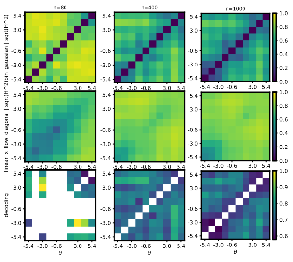
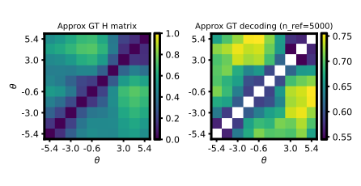
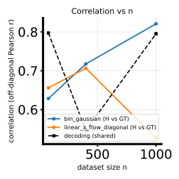
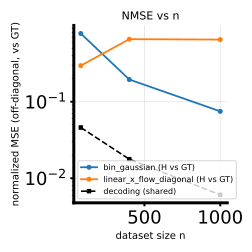
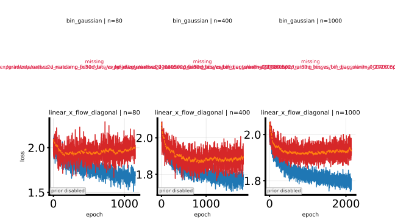
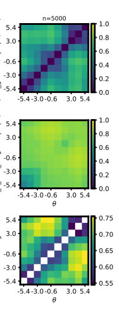
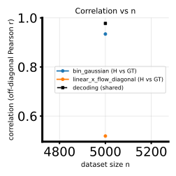
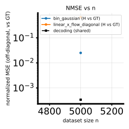
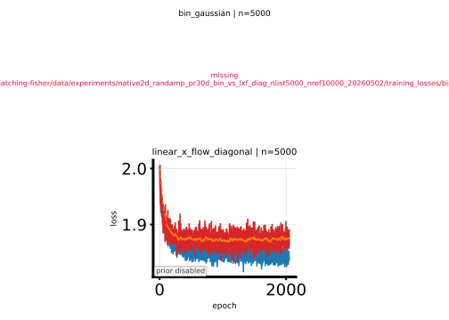

# 2026-05-02 Minimal twofig: `bin_gaussian` vs `linear_x_flow_diagonal` on native randamp 2D PR30D

## Question / context

Full native 2D-$\theta$ PR30D twofig runs ([pipeline note](2026-05-02-native-2d-theta-twofig-h-decoding-pipeline.md)) suggested that **flow-matching-style** linear X-flow rows often track GT less cleanly than **binned Gaussian** or other baselines. To isolate one axis of that gap, this note records a **minimal** `study_h_decoding_twofig` sweep with only:

- **`bin_gaussian`** — per-bin Gaussian sufficient statistics (closed-form likelihood contrasts within the pipeline’s binning contract).
- **`linear_x_flow_diagonal`** — conditional linear flow matching with **diagonal** $x$-space drift (restricted capacity vs full coupling in `linear_x_flow`).

Dataset: **`randamp_gaussian2d_sqrtd`** embedded to **30D** via PR-autoencoder (same family as the native 2D benchmark; see [benchmark datasets](2026-05-02-native-2d-theta-benchmark-datasets.md)). Binning remains **$\theta_1$-only** edges with full `(N,2)` $\theta$ passed to training, consistent with the native 2D pipeline note.

**Observation vs conclusion:** The numbers below are **for this single run directory** only. They motivate deeper comparisons (e.g. full `linear_x_flow`, optimization, inductive bias), not a universal statement about flow matching.

## Method

- **Script:** `bin/study_h_decoding_twofig.py` (delegates to `bin/study_h_decoding_convergence.py` for row training and GT MC).
- **Nested $n$:** `--n-list 80,400,1000`, default `--n-ref 5000`, `--num-theta-bins` at script default (10 for this run).
- **LXF early stopping:** `--lxf-early-patience 1000` (same spirit as LXF-focused benches elsewhere in the repo).
- **Diagonal linear X-flow:** `linear_x_flow_diagonal` uses per-coordinate drift in $x$; for high-dimensional embedded $x$ this can be a strong structural restriction relative to the bin-wise Gaussian fit.

## Reproduction

Environment: [AGENTS.md](../../AGENTS.md) — `mamba run -n geo_diffusion`, CUDA for twofig.

**Prerequisite NPZ** (already produced for the native 2D benchmark):

`/grad/zeyuan/score-matching-fisher/data/randamp_gaussian2d_sqrtd_xdim5/randamp_gaussian2d_sqrtd_xdim5_pr30d.npz`

**Minimal twofig command:**

```bash
PYTHONUNBUFFERED=1 mamba run -n geo_diffusion python bin/study_h_decoding_twofig.py \
  --dataset-npz data/randamp_gaussian2d_sqrtd_xdim5/randamp_gaussian2d_sqrtd_xdim5_pr30d.npz \
  --dataset-family randamp_gaussian2d_sqrtd \
  --theta-field-methods bin_gaussian,linear_x_flow_diagonal \
  --lxf-early-patience 1000 \
  --n-list 80,400,1000 \
  --device cuda \
  --output-dir data/experiments/native2d_randamp_pr30d_bin_vs_lxf_diag_minimal_20260502
```

Related implementation pointers: `linear_x_flow_diagonal` branch in `bin/study_h_decoding_convergence.py`; diagonal vs full linear X-flow models; earlier diagonal-$\theta$ spline variant discussion in [2026-04-29-h-decoding-lxf-diagonal-theta-spline-xdim10.md](2026-04-29-h-decoding-lxf-diagonal-theta-spline-xdim10.md).

## Results (saved NPZ)

Run: **`native2d_randamp_pr30d_bin_vs_lxf_diag_minimal_20260502`**.

Rows of `corr_h_binned_vs_gt_mc` and `nmse_h_binned_vs_gt_mc` are in **`theta_field_rows`** order: `[bin_gaussian, linear_x_flow_diagonal]`. Columns are $n \in \{80,400,1000\}$.

| Metric | bin_gaussian ($n=80,400,1000$) | linear_x_flow_diagonal ($n=80,400,1000$) |
|--------|--------------------------------|----------------------------------------|
| `corr_h_binned_vs_gt_mc` | 0.628, 0.717, **0.821** | 0.656, 0.707, **0.526** |
| `nmse_h_binned_vs_gt_mc` | 0.779, 0.195, **0.075** | 0.296, 0.657, **0.649** |

**Observation:** Binned Gaussian **improves monotonically** in correlation and NMSE as $n$ grows. Diagonal linear X-flow matching is **competitive at small $n$** on correlation but **does not improve** on NMSE at $n \in \{400,1000\}$, and `corr_h` **drops** at $n=1000$ in this run.

**Possible hooks for follow-up (not tested here):** compare **`linear_x_flow`** (non-diagonal drift); inspect **`h_decoding_twofig_training_losses_panel.svg`** and per-$n$ early-stop epochs in `run.log`; check sensitivity to `--lxf-early-patience`, hidden width/depth, or bin count.

## Figures

Sweep (two method rows $\times$ three $n$ columns, plus shared GT/decoding column):



Ground truth (MC Hellinger / mean LLR matrix used as the shared reference column in the sweep; native 2D $\theta$ with paired-$\theta_2$ convention per the [pipeline note](2026-05-02-native-2d-theta-twofig-h-decoding-pipeline.md)):



Correlation vs. $n$:



NMSE vs. $n$:



Training loss vs epoch by **nested $n$** (twofig panel): **rows** = methods, **columns** = $n \in \{80,400,1000\}$. **`bin_gaussian`** has **no** flow training—those axes intentionally show a missing-loss placeholder (see `study_h_decoding_twofig.py`, which skips loss artifacts for the closed-form row). **`linear_x_flow_diagonal`** shows train / validation / monitor flow-matching losses; curves **do not collapse** as $n$ grows, while **`corr_h` vs GT still worsens** at $n=1000$ (table above)—so the poor GT alignment is **not** explained by obviously divergent loss curves alone.



The GT panel is the same reference surface against which both method rows are scored (`corr_h_binned_vs_gt_mc`, `nmse_h_binned_vs_gt_mc`). The sweep panels show how each method’s binned matrix aligns with the shared GT column across nested subsets; the scalar curves summarize the divergence at larger $n$ for diagonal flow matching on this benchmark.

## Artifacts

| Artifact | Path |
|----------|------|
| Results NPZ | `/grad/zeyuan/score-matching-fisher/data/experiments/native2d_randamp_pr30d_bin_vs_lxf_diag_minimal_20260502/h_decoding_twofig_results.npz` |
| Summary | `/grad/zeyuan/score-matching-fisher/data/experiments/native2d_randamp_pr30d_bin_vs_lxf_diag_minimal_20260502/h_decoding_twofig_summary.txt` |
| Log | `/grad/zeyuan/score-matching-fisher/data/experiments/native2d_randamp_pr30d_bin_vs_lxf_diag_minimal_20260502/run.log` |
| Figures (SVG, same dir) | `h_decoding_twofig_sweep.svg`, `h_decoding_twofig_gt.svg`, `h_decoding_twofig_corr_vs_n.svg`, `h_decoding_twofig_nmse_vs_n.svg`, `h_decoding_twofig_training_losses_panel.svg` |

Journal-local copies of sweep / GT / corr / NMSE / **training-loss panel** (original minimal run): `journal/notes/figs/2026-05-02-native2d-randamp-bin-vs-lxf-diagonal-minimal/` (`h_decoding_twofig_*.svg`, `h_decoding_twofig_training_losses_panel_minimal_n80_400_1000.svg`). Follow-up copies use the same folder with `followup_*` prefixes (embedded below).

## Follow-up experiments (same NPZ; tighter GT MC and large-$n$ column)

**GT MC convention (twofig):** `gt_n_mc = floor(n_ref / num_theta_bins)` Monte Carlo samples per $\theta_1$ bin row (default **`num_theta_bins = 10`**). Thus **`--n-ref 5000`** $\Rightarrow$ **`gt_n_mc = 500`** per row (original minimal run); **`--n-ref 10000`** $\Rightarrow$ **`gt_n_mc = 1000`** (reference prefix uses the full **$N=10000$** pool).

Repro pattern: [AGENTS.md](../../AGENTS.md) (`mamba run -n geo_diffusion`, `--device cuda`). Locked methods / patience match the short skill **bin-lxfdiag** (`.cursor/skills/bin-lxfdiag/SKILL.md`), except where noted below.

### A — `bin_gaussian` only, `--n-ref 10000` (approx GT figure)

**Goal:** Same MC GT construction as twofig, but **double** $n_{\mathrm{mc}}$ per bin row to reduce MC noise in **`h_decoding_twofig_gt.svg`** (no second method row).

```bash
PYTHONUNBUFFERED=1 mamba run -n geo_diffusion python bin/study_h_decoding_twofig.py \
  --dataset-npz data/randamp_gaussian2d_sqrtd_xdim5/randamp_gaussian2d_sqrtd_xdim5_pr30d.npz \
  --dataset-family randamp_gaussian2d_sqrtd \
  --theta-field-methods bin_gaussian \
  --lxf-early-patience 1000 \
  --n-list 80,400,1000 \
  --n-ref 10000 \
  --device cuda \
  --output-dir data/experiments/native2d_randamp_pr30d_bin_only_nref10000_20260502
```

| Artifact | Path |
|----------|------|
| GT figure (SVG) | `/grad/zeyuan/score-matching-fisher/data/experiments/native2d_randamp_pr30d_bin_only_nref10000_20260502/h_decoding_twofig_gt.svg` |
| Results NPZ | `/grad/zeyuan/score-matching-fisher/data/experiments/native2d_randamp_pr30d_bin_only_nref10000_20260502/h_decoding_twofig_results.npz` |

Log line: `[twofig] GT Hellinger (MC likelihood) n_bins=10 n_mc=1000 ... n_ref=10000`.

**Figure (journal-local copy):** Approx GT $\sqrt{H^2}$ heatmap (left) uses **`gt_n_mc=1000`** per $\theta_1$ bin row; right panel is pairwise decoding on the **`n_ref=10000`** permutation prefix. Compared to the original minimal note’s GT panel (**`n_ref=5000`** $\Rightarrow$ **`gt_n_mc=500`**), this version is typically smoother off-diagonal.


### B — `bin_gaussian` + `linear_x_flow_diagonal`, `--n-list 5000`, `--n-ref 10000` (convergence-to-GT check)

**Goal:** Single nested column at **$n=5000$** (half the pool) with the **1000-sample-per-row** GT MC, to see whether estimates move toward the shared GT matrix.

```bash
PYTHONUNBUFFERED=1 mamba run -n geo_diffusion python bin/study_h_decoding_twofig.py \
  --dataset-npz data/randamp_gaussian2d_sqrtd_xdim5/randamp_gaussian2d_sqrtd_xdim5_pr30d.npz \
  --dataset-family randamp_gaussian2d_sqrtd \
  --theta-field-methods bin_gaussian,linear_x_flow_diagonal \
  --lxf-early-patience 1000 \
  --n-list 5000 \
  --n-ref 10000 \
  --device cuda \
  --output-dir data/experiments/native2d_randamp_pr30d_bin_vs_lxf_diag_nlist5000_nref10000_20260502
```

From **`h_decoding_twofig_results.npz`** (`gt_hellinger_n_mc = 1000`), rows **`[bin_gaussian, linear_x_flow_diagonal]`**, column **$n=5000$**:

| Metric | bin_gaussian | linear_x_flow_diagonal |
|--------|----------------|-------------------------|
| `corr_h_binned_vs_gt_mc` | **0.934** | **0.519** |
| `nmse_h_binned_vs_gt_mc` | **0.025** | **0.668** |

**Training note:** `linear_x_flow_diagonal` hit **early stopping** at epoch **2051** with **best validation epoch 1051** (`--lxf-early-patience 1000`); see **`run.log`** in the output dir.

| Artifact | Path |
|----------|------|
| Sweep / GT / corr / NMSE / losses | `/grad/zeyuan/score-matching-fisher/data/experiments/native2d_randamp_pr30d_bin_vs_lxf_diag_nlist5000_nref10000_20260502/` |
| Results NPZ | `/grad/zeyuan/score-matching-fisher/data/experiments/native2d_randamp_pr30d_bin_vs_lxf_diag_nlist5000_nref10000_20260502/h_decoding_twofig_results.npz` |

**Figures (journal-local copies):** One sweep column at **$n=5000$** plus the shared GT/decoding column; scalar summaries are single-point curves at **$n=5000$** (two methods). **Binned Gaussian** tracks the GT column visually; **diagonal linear X-flow** does not match the GT surface as closely.







**Training loss panel ($n=5000$ column):** Same layout as the minimal figure—**`bin_gaussian`** row has no saved losses; **`linear_x_flow_diagonal`** shows flow matching through early stopping (best epoch $\approx 1051$, stop $\approx 2051$ per **`run.log`**).



## Takeaway

This minimal pair isolates a **large diagnostic gap** at **$n=1000$** between **binned Gaussian** and **diagonal linear X-flow matching** on native randamp 2D PR30D under shared binning and GT MC. Treat it as a **controlled baseline** for explaining broader flow-vs-baseline trends in the multi-method twofig runs, not as a verdict on all flow architectures.

**Follow-up:** With **`--n-ref 10000`** (richer GT MC) and a single column **`--n-list 5000`**, **binned Gaussian** reaches **high** off-diagonal correlation and **low** NMSE vs GT, while **diagonal linear X-flow** remains **far** from GT on NMSE at this setting—consistent with a **model / optimization / inductive-bias** limitation rather than only finite-$n$ noise in the baseline.

## Possible solutions

1. The network is not powerful enough -> no, changed to FiLM, the result is the same.
2. Do not use early stopping, use the last epoch of 2000 epochs.
2. We should add t parameter so that the flow matching method can learn more easily.
