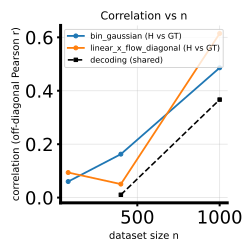

# Native 2D $\theta$: randamp vs gridcos twofig with `theta2_grid` (GT Hellinger MC, `bin_gaussian`, `linear_x_flow_diagonal`, `linear_x_flow_diagonal_t`)

> **Revision banner (read me).** After the first short draft, this file was **expanded on 2026-05-02** to include: (i) **math** for GT **MC Hellinger** and for **`bin_gaussian` / `linear_x_flow_diagonal` / `linear_x_flow_diagonal_t`** learned rows; (ii) **run C** — **`bin-2d-cos-lxfdiag`** skill rerun (`linear_x_flow_diagonal`, `native2d_gridcos_pr30d_bin_vs_lxf_diag_minimal_20260502_skill_rerun`); (iii) an **extended metrics table** and an extra embedded figure (`gridcos_skill_rerun_corr_vs_n.svg`). The body below is the **current** note (~200 lines). If you still see only “Question / context → Reproduction → Results” with **no** “Mathematical detail” heading, **reload the file from disk** (stale buffer).

## Question / context

We study **`bin/study_h_decoding_twofig.py`** on **native 2D-$\theta$** PR-30D benchmarks: **linear randamp** (`randamp_gaussian2d_sqrtd`) and **grid-cosine** (`gridcos_gaussian2d_sqrtd_rand_tune_additive`). Binning uses **`--theta-binning-mode theta2_grid`**: a **flattened $(\theta_1,\theta_2)$ grid** so Hellinger matrices are **full 2D-bin** objects (not a $\theta_1$-only marginal).

Documented runs include:

1. **Randamp**, $5\times5$ grid, **`bin_gaussian`** vs **`linear_x_flow_diagonal_t`**.
2. **Gridcos**, $10\times10$ grid, **`bin_gaussian`** vs **`linear_x_flow_diagonal_t`** (same nested $n$ list).
3. **Gridcos**, $10\times10$ grid, **`bin_gaussian`** vs **`linear_x_flow_diagonal`** — canonical **`bin-2d-cos-lxfdiag`** skill rerun with **`--lxf-epochs 50000`** and **`--lxf-early-patience 1000`** (time-independent diagonal LXF, not `_t`).

Skills: **`bin-2d-lin-lxfdiag`**, **`bin-2d-cos-lxfdiag`** (`.cursor/skills/…/SKILL.md`). Dataset background: **`journal/notes/2026-05-02-native-2d-theta-benchmark-datasets.md`**.

---

## Mathematical detail: squared Hellinger (ground truth, MC)

For densities $p_i(x)=p(x\mid\theta^{(i)})$ and $p_j(x)=p(x\mid\theta^{(j)})$ on $\mathbb{R}^{d_x}$, the **squared Hellinger distance** is

$$
H^2(p_i,p_j)
=
\frac{1}{2}\int_{\mathbb{R}^{d_x}}
\left(\sqrt{p_i(x)}-\sqrt{p_j(x)}\right)^2\mathrm{d}x
=
1-\int_{\mathbb{R}^{d_x}} \sqrt{p_i(x)\,p_j(x)}\,\mathrm{d}x
\in[0,1].
$$

**One-sided Monte Carlo estimator (used in code).** For each row index $i$, draw $x^{(m)}\sim p_i$ i.i.d., $m=1,\ldots,n_{\mathrm{mc}}$. The identity behind **`estimate_hellinger_sq_one_sided_mc`** / **`estimate_hellinger_sq_grid_centers_mc`** in **`fisher/hellinger_gt.py`** (see also **`report/notes/hellinger_idea.tex`**) gives

$$
H^2_{ij}
=
1-\mathbb{E}_{x\sim p_i}\!\left[
\exp\!\left(\tfrac{1}{2}\bigl(\log p_j(x)-\log p_i(x)\bigr)\right)
\right].
$$

The implementation averages $\exp(\tfrac{1}{2}(\log p_j-\log p_i))$ with a **log-domain shift** (subtract $\max_m \tfrac{1}{2}(\log p_j-\log p_i)$ before exponentiating) for numerical stability, then clips entries to $[0,1]$.

**`theta2_grid` mode.** **`estimate_hellinger_sq_grid_centers_mc`** takes **full** 2D centers $\theta^{(i)}\in\mathbb{R}^2$ (one per flattened cell). For row $i$, all $n_{\mathrm{mc}}$ samples use **the same** $\theta^{(i)}$ (no random $\theta_2$ draw). For each column $j$, $\log p_j(x)$ uses $\theta^{(j)}$ on the **same** $x^{(m)}$—so the estimator targets **true** $H^2\bigl(p(\cdot\mid\theta^{(i)}),p(\cdot\mid\theta^{(j)})\bigr)$ for the generative model implemented by **`fisher.evaluation.log_p_x_given_theta`**.

**Budget.** CLI enforces $n_{\mathrm{mc}}=\lfloor n_{\mathrm{ref}}/(\text{bins}_1\times\text{bins}_2)\rfloor\ge 1$.

**What the twofig compares.** Stored GT is **`h_gt_sqrt`**: elementwise **`sqrt(H^2)`** (clipped), same convention as **`bin/study_h_decoding_convergence.py`** top docstring. **`corr_h_binned_vs_gt_mc`** is the **off-diagonal Pearson correlation** between flattened learned $\sqrt{H^2}$ and GT $\sqrt{H^2}$ (see **`matrix_corr_offdiag_pearson`** usage in **`bin/study_h_decoding_twofig.py`**).

---

## Mathematical / algorithmic detail: learned H rows

### `bin_gaussian` (no training)

**`_binned_gaussian_hellinger_sq`** in **`bin/study_h_decoding_convergence.py`** fits a **diagnostic** conditional model

$$
p_{\mathrm{bin}}(x\mid b)=\mathcal{N}\bigl(\mu_b,\ \mathrm{diag}(\sigma^2)\bigr),
$$

where $\mu_b$ is the **empirical mean** of $x$ in bin $b$, and the **shared** diagonal variance $\sigma^2\in\mathbb{R}^{d_x}_{+}$ is the coordinatewise mean squared residual $(x-\mu_{\mathrm{bin}(x)})^2$ over the subset, floored by **`variance_floor`** (default $10^{-6}$). Empty bins copy the nearest nonempty mean. Off-diagonal **$H^2_{ij}$** uses the closed form for two Gaussians with **the same diagonal covariance** and different means (equivalently Mahalanobis term in the code’s `h2_ij = 1 - exp(-0.125 * maha2)` loop).

### `linear_x_flow_diagonal` (time-independent drift, $\theta$-dependent offset)

As in **`fisher/linear_x_flow.py`** module docstring: learn a velocity

$$
v(x,\theta)=\mathrm{diag}\bigl(a(\theta)\bigr)\,x + b_\phi(\theta),
$$

on the **default straight** noise$\to$data bridge (flow matching). The induced **endpoint** distribution is **diagonal Gaussian** with $\theta$-dependent mean and per-coordinate variance determined by $a(\theta)$ (elementwise stable maps, see **`_phi_expm1_div_a`**). After training, **`compute_linear_x_flow_analytic_hellinger_matrix`** evaluates **pairwise squared Hellingers** between these endpoint Gaussians using **`gaussian_hellinger_sq_diag_matrix`** (product / quadratic form in means with **harmonic mean** variance blend per coordinate—see **`gaussian_hellinger_sq_diag_matrix`** in **`fisher/linear_x_flow.py`**). No per-$x$ MC is needed for this row once $(\mu_b,\sigma^2_b)$ are computed for each bin’s $\theta$ representative.

### `linear_x_flow_diagonal_t` (time drift + scheduled affine path)

Per **`bin/study_h_decoding_convergence.py`** (`--theta-field-method linear-x-flow-diagonal-t`): velocity

$$
v(x,t,\theta)=\mathrm{diag}\bigl(a(t)\bigr)\,x + b(t,\theta),
$$

trained with **`train_time_diagonal_linear_x_flow_schedule`** on an **affine probability path** $X_t=a_t X_0+b_t X_1$ chosen by **`--lxfs-path-schedule`** (default **`cosine`** when the scheduled LXF branch applies). The learned map yields **endpoint** diagonal Gaussians $\mathcal{N}(\mu(\theta),\mathrm{diag}(\sigma^2(\theta)))$ via **`linear_x_flow_endpoint_gaussian`** with **`quadrature_steps`** (CLI **`--lxfs-quadrature-steps`**, default **64**). **Hellinger** between bins uses the **same** **`compute_linear_x_flow_analytic_hellinger_matrix`** pipeline as **`linear_x_flow_diagonal`**: analytic pairwise $H^2$ on the induced Gaussians, **not** the legacy full-sample $\log p$ + $\mathrm{sech}$ construction unless separate diagnostics are saved.

**Contrast `linear_x_flow_diagonal` vs `linear_x_flow_diagonal_t`.** The `_t` variant couples time through $a(t),b(t,\theta)$ and the **scheduled** bridge; the non-`_t` diagonal variant keeps a **$\theta$-indexed** diagonal drift $a(\theta)$ and a **fixed** straight bridge in the default training path. Cosine scheduling for the **non-`_t`** diagonal model is a **different** flag family (`linear_x_flow_schedule` / **`--lxfs-path-schedule`** on the time-independent network), not the default **`linear_x_flow_diagonal`** twofig row.

---

## Method (short)

- **Shared:** `--n-list 80,400,1000`, `--n-ref 10000`, CUDA via **`AGENTS.md`** (`mamba run -n geo_diffusion`, `--device cuda`).
- **Randamp ($5\times5$):** $n_{\mathrm{mc}}=400$ per GT cell for **`linear_x_flow_diagonal_t`** run (below A).
- **Gridcos ($10\times10$):** $n_{\mathrm{mc}}=100$ for both B and C.

The **randamp** and **gridcos** grids still differ in resolution (**25** vs **100** cells); treat cross-dataset metric tables as **illustrative**, not a controlled ablation.

---

## Reproduction

Repo root: **`/grad/zeyuan/score-matching-fisher`**.

### A — Linear randamp 2D PR30D, `theta2_grid` $5\times 5$, `linear_x_flow_diagonal_t`

```bash
PYTHONUNBUFFERED=1 mamba run -n geo_diffusion python bin/study_h_decoding_twofig.py \
  --dataset-npz data/randamp_gaussian2d_sqrtd_xdim5/randamp_gaussian2d_sqrtd_xdim5_pr30d.npz \
  --dataset-family randamp_gaussian2d_sqrtd \
  --theta-field-methods bin_gaussian,linear_x_flow_diagonal_t \
  --theta-binning-mode theta2_grid \
  --num-theta-bins 5 \
  --num-theta-bins-y 5 \
  --lxf-epochs 50000 \
  --lxf-early-patience 1000 \
  --n-list 80,400,1000 \
  --n-ref 10000 \
  --device cuda \
  --output-dir data/experiments/native2d_randamp_pr30d_bin_vs_lxf_diag_t_theta2grid_5x5_20260502
```

### B — Gridcos 2D PR30D, `theta2_grid` $10\times 10$, `linear_x_flow_diagonal_t`

```bash
mkdir -p data/experiments/native2d_gridcos_pr30d_bin_vs_lxf_diag_t_theta2grid_10x10_20260502
PYTHONUNBUFFERED=1 mamba run -n geo_diffusion python bin/study_h_decoding_twofig.py \
  --dataset-npz data/gridcos_gaussian2d_sqrtd_rand_tune_additive_xdim5_noise2x_alpha2x/gridcos_gaussian2d_sqrtd_rand_tune_additive_xdim5_noise2x_alpha2x_pr30d.npz \
  --dataset-family gridcos_gaussian2d_sqrtd_rand_tune_additive \
  --theta-field-methods bin_gaussian,linear_x_flow_diagonal_t \
  --theta-binning-mode theta2_grid \
  --num-theta-bins 10 \
  --num-theta-bins-y 10 \
  --lxf-epochs 50000 \
  --lxf-early-patience 1000 \
  --n-list 80,400,1000 \
  --n-ref 10000 \
  --device cuda \
  --output-dir data/experiments/native2d_gridcos_pr30d_bin_vs_lxf_diag_t_theta2grid_10x10_20260502 \
  2>&1 | tee data/experiments/native2d_gridcos_pr30d_bin_vs_lxf_diag_t_theta2grid_10x10_20260502/run.log
```

### C — Gridcos 2D PR30D, `theta2_grid` $10\times 10$, **`bin-2d-cos-lxfdiag`** (`linear_x_flow_diagonal`, not `_t`)

```bash
mkdir -p data/experiments/native2d_gridcos_pr30d_bin_vs_lxf_diag_minimal_20260502_skill_rerun
PYTHONUNBUFFERED=1 mamba run -n geo_diffusion python bin/study_h_decoding_twofig.py \
  --dataset-npz data/gridcos_gaussian2d_sqrtd_rand_tune_additive_xdim5_noise2x_alpha2x/gridcos_gaussian2d_sqrtd_rand_tune_additive_xdim5_noise2x_alpha2x_pr30d.npz \
  --dataset-family gridcos_gaussian2d_sqrtd_rand_tune_additive \
  --theta-field-methods bin_gaussian,linear_x_flow_diagonal \
  --theta-binning-mode theta2_grid \
  --num-theta-bins 10 \
  --num-theta-bins-y 10 \
  --lxf-epochs 50000 \
  --lxf-early-patience 1000 \
  --n-list 80,400,1000 \
  --n-ref 10000 \
  --device cuda \
  --output-dir data/experiments/native2d_gridcos_pr30d_bin_vs_lxf_diag_minimal_20260502_skill_rerun \
  2>&1 | tee data/experiments/native2d_gridcos_pr30d_bin_vs_lxf_diag_minimal_20260502_skill_rerun/run.log
```

The leading **`mkdir`** (and matching **`tee`** path) avoids **`tee: … No such file or directory`** when the output folder does not exist yet.

---

## Results (`corr_h` / `nmse_h` vs GT MC, from `h_decoding_twofig_results.npz`)

Columns **`n ∈ \{80,400,1000\}`**; rows **`bin_gaussian`** then **LXF row** (`linear_x_flow_diagonal_t` or `linear_x_flow_diagonal` as labeled).

| Run | LXF row | `corr_h` | `nmse_h` |
|-----|---------|----------|----------|
| Randamp $5\times5$ | `_t` | `[[0.204, 0.849, 0.915], [0.197, 0.897, 0.922]]` | `[[0.893, 0.398, 0.234], [0.991, 0.417, 0.321]]` |
| Gridcos $10\times10$ | `_t` | `[[0.060, 0.163, 0.486], [0.126, 0.072, 0.057]]` | `[[0.670, 0.584, 0.330], [0.973, 0.992, 0.341]]` |
| Gridcos $10\times10$ | `linear_x_flow_diagonal` (skill C) | `[[0.060, 0.163, 0.486], [0.094, 0.050, 0.614]]` | `[[0.670, 0.584, 0.330], [0.511, 0.243, 0.085]]` |

**Observation:** **`bin_gaussian`** metrics **match** between the two gridcos rows (same GT and same bin-conditional moments for that row). Replacing **`linear_x_flow_diagonal_t`** by **`linear_x_flow_diagonal`** **greatly improves** `corr_h` / `nmse_h` for the LXF row at $n=1000$ on this gridcos $10\times10$ snapshot—consistent with the scheduled time-diagonal bridge being a **poor** proxy for the true conditional laws here, while the **$\theta$-indexed** diagonal linear flow’s analytic Gaussian endpoints track the GT Hellinger surface better under this training budget.

**Conclusion (narrow):** On **gridcos** at $10\times10$, **`linear_x_flow_diagonal_t`** was **not** competitive vs GT in `corr_h`; the skill-default **`linear_x_flow_diagonal`** rerun is **much closer** on the same metrics. **Conclusion (broad):** Randamp at $5\times5$ remains an **easier** regime for both model rows than gridcos at $10\times10$ in the recorded table; resolution and $n_{\mathrm{mc}}$ still differ across the randamp vs gridcos pair.

---

## Figures

GT Hellinger panels (**`h_gt_sqrt`**, `h_decoding_twofig_gt.svg`) for the **two** `_t` runs (gridcos GT is identical for the same binning/dataset, so one panel suffices for 10×10 geometry).

**Randamp ($5\times5$):**


**Gridcos ($10\times10$) GT:**


**Gridcos skill rerun — `corr_h` vs $n$** (contrasts **`linear_x_flow_diagonal`** vs **`linear_x_flow_diagonal_t`** behavior on the same benchmark at fixed binning):



---

## Artifacts (absolute)

- **Randamp (`_t`):** `/grad/zeyuan/score-matching-fisher/data/experiments/native2d_randamp_pr30d_bin_vs_lxf_diag_t_theta2grid_5x5_20260502/`
- **Gridcos (`_t`):** `/grad/zeyuan/score-matching-fisher/data/experiments/native2d_gridcos_pr30d_bin_vs_lxf_diag_t_theta2grid_10x10_20260502/` (+ `run.log`)
- **Gridcos (skill `linear_x_flow_diagonal`):** `/grad/zeyuan/score-matching-fisher/data/experiments/native2d_gridcos_pr30d_bin_vs_lxf_diag_minimal_20260502_skill_rerun/` (+ `run.log`)
- **Journal figure copies:** `/grad/zeyuan/score-matching-fisher/journal/notes/figs/2026-05-02-native2d-randamp-gridcos-theta2grid-twofig/`

---

## Takeaway

- **`theta2_grid`** + **`estimate_hellinger_sq_grid_centers_mc`** defines a **fully 2D** GT Hellinger target at explicit $(\theta_1,\theta_2)$ centers.
- **GT MC** uses the **one-sided** likelihood-ratio expectation; **learned LXF rows** use **analytic Gaussian** pairwise $H^2$ from induced **endpoint** distributions (`linear_x_flow_diagonal` and `linear_x_flow_diagonal_t`), while **`bin_gaussian`** uses **shared-variance** diagonal Gaussians around per-bin means.
- **Empirical:** **`linear_x_flow_diagonal_t`** struggled on **gridcos** $10\times10$; **`linear_x_flow_diagonal`** (skill **`bin-2d-cos-lxfdiag`**) **recovered** strong `corr_h` at $n=1000$ in the recorded rerun—highlighting that **method variant** dominates this comparison at least as much as “linear vs cosine” dataset labeling.
