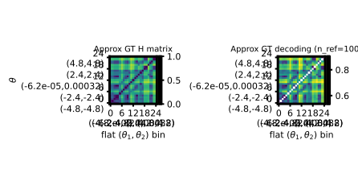
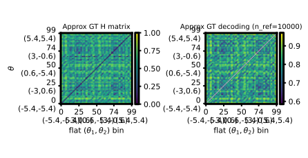

# Native 2D $\theta$: randamp vs gridcos twofig with `theta2_grid` (`bin_gaussian` vs `linear_x_flow_diagonal_t`)

## Question / context

We ran **`bin/study_h_decoding_twofig.py`** on two **native 2D-$\theta$** PR-30D benchmarks: **linear randamp** (`randamp_gaussian2d_sqrtd`) and **grid-cosine** (`gridcos_gaussian2d_sqrtd_rand_tune_additive`). Both use **flattened 2D binning** (`--theta-binning-mode theta2_grid`), so Hellinger matrices are **full $(\theta_1,\theta_2)$ grids** (not a $\theta_1$-only marginal). Rows compare **`bin_gaussian`** to **`linear_x_flow_diagonal_t`** (time-conditioned diagonal linear X-flow).

Related skills (non-`_t` baseline): **`bin-2d-lin-lxfdiag`**, **`bin-2d-cos-lxfdiag`** (`.cursor/skills/…/SKILL.md`). Dataset background: **`journal/notes/2026-05-02-native-2d-theta-benchmark-datasets.md`**.

## Method (short)

- **Shared:** nested training sizes `--n-list 80,400,1000`, prefix `--n-ref 10000`, `--lxf-early-patience 1000`, CUDA via **`AGENTS.md`** (`mamba run -n geo_diffusion`, `--device cuda`).
- **GT Hellinger:** MC at **2D grid bin centers**; per-cell sample count $n_{\mathrm{mc}}=\lfloor n_{\mathrm{ref}}/(\text{bins}_1\times\text{bins}_2)\rfloor$.
- **Randamp:** $5\times 5$ grid $\Rightarrow$ 25 cells, $n_{\mathrm{mc}}=400$.
- **Gridcos:** $10\times 10$ grid $\Rightarrow$ 100 cells, $n_{\mathrm{mc}}=100$.

The **grid resolutions differ** between the two completed runs (5×5 vs 10×10); interpret side-by-side metrics as same *pipeline family*, not a controlled resolution match.

## Reproduction

Repo root: **`/grad/zeyuan/score-matching-fisher`**.

### A — Linear randamp 2D PR30D, `theta2_grid` $5\times 5$, `linear_x_flow_diagonal_t`

```bash
PYTHONUNBUFFERED=1 mamba run -n geo_diffusion python bin/study_h_decoding_twofig.py \
  --dataset-npz data/randamp_gaussian2d_sqrtd_xdim5/randamp_gaussian2d_sqrtd_xdim5_pr30d.npz \
  --dataset-family randamp_gaussian2d_sqrtd \
  --theta-field-methods bin_gaussian,linear_x_flow_diagonal_t \
  --theta-binning-mode theta2_grid \
  --num-theta-bins 5 \
  --num-theta-bins-y 5 \
  --lxf-early-patience 1000 \
  --n-list 80,400,1000 \
  --n-ref 10000 \
  --device cuda \
  --output-dir data/experiments/native2d_randamp_pr30d_bin_vs_lxf_diag_t_theta2grid_5x5_20260502
```

### B — Gridcos 2D PR30D, `theta2_grid` $10\times 10$, `linear_x_flow_diagonal_t`

```bash
mkdir -p data/experiments/native2d_gridcos_pr30d_bin_vs_lxf_diag_t_theta2grid_10x10_20260502
PYTHONUNBUFFERED=1 mamba run -n geo_diffusion python bin/study_h_decoding_twofig.py \
  --dataset-npz data/gridcos_gaussian2d_sqrtd_rand_tune_additive_xdim5_noise2x_alpha2x/gridcos_gaussian2d_sqrtd_rand_tune_additive_xdim5_noise2x_alpha2x_pr30d.npz \
  --dataset-family gridcos_gaussian2d_sqrtd_rand_tune_additive \
  --theta-field-methods bin_gaussian,linear_x_flow_diagonal_t \
  --theta-binning-mode theta2_grid \
  --num-theta-bins 10 \
  --num-theta-bins-y 10 \
  --lxf-early-patience 1000 \
  --n-list 80,400,1000 \
  --n-ref 10000 \
  --device cuda \
  --output-dir data/experiments/native2d_gridcos_pr30d_bin_vs_lxf_diag_t_theta2grid_10x10_20260502 \
  2>&1 | tee data/experiments/native2d_gridcos_pr30d_bin_vs_lxf_diag_t_theta2grid_10x10_20260502/run.log
```

The leading **`mkdir`** (and same path for **`tee`**) avoids a failed run when the output directory does not exist yet.

## Results (`corr_h` / `nmse_h` vs GT MC, from `h_decoding_twofig_results.npz`)

Columns are **`n ∈ {80, 400, 1000}`**; rows are **`bin_gaussian`** then **`linear_x_flow_diagonal_t`**.

| Run | `corr_h` | `nmse_h` |
|-----|----------|----------|
| Randamp $5\times5$ | `[[0.204, 0.849, 0.915], [0.197, 0.897, 0.922]]` | `[[0.893, 0.398, 0.234], [0.991, 0.417, 0.321]]` |
| Gridcos $10\times10$ | `[[0.060, 0.163, 0.486], [0.126, 0.072, 0.057]]` | `[[0.670, 0.584, 0.330], [0.973, 0.992, 0.341]]` |

**Observation:** On **randamp**, both rows reach **high** `corr_h` by $n=1000$ (binned Gaussian slightly better on `nmse_h` at the largest $n$ in this snapshot). On **gridcos** at **finer** $10\times10$ resolution, **`linear_x_flow_diagonal_t`** stays **weak** vs GT on `corr_h`, while **`bin_gaussian`** improves with $n$ but remains **moderate** at $n=1000$.

**Conclusion:** Under this configuration, the **cosine-structured** native benchmark + **100-cell** grid is **substantially harder** for the diagonal time-bridge model to match the GT Hellinger surface than the **linear** randamp benchmark at **25 cells**—keeping in mind the **resolution** and **GT MC budget** differences, not only the dataset family.

## Figures

GT Hellinger panels (**`h_gt_sqrt`**, script output `h_decoding_twofig_gt.svg`): full 2D-bin matrices (flattened axes in the SVG).

**Randamp ($5\times5$):**



**Gridcos ($10\times10$):**



## Artifacts (absolute)

- **Randamp run:** `/grad/zeyuan/score-matching-fisher/data/experiments/native2d_randamp_pr30d_bin_vs_lxf_diag_t_theta2grid_5x5_20260502/` (`h_decoding_twofig_results.npz`, `h_decoding_twofig_summary.txt`, sweep / corr / nmse / losses SVGs, `training_losses/`).
- **Gridcos run:** `/grad/zeyuan/score-matching-fisher/data/experiments/native2d_gridcos_pr30d_bin_vs_lxf_diag_t_theta2grid_10x10_20260502/` (same artifact pattern + `run.log`).
- **Embedded copies (journal):** `/grad/zeyuan/score-matching-fisher/journal/notes/figs/2026-05-02-native2d-randamp-gridcos-theta2grid-twofig/`.

## Takeaway

- **`theta2_grid`** gives a **true 2D-bin** Hellinger/decoding target on native 2D-$\theta$ data.
- Documented pair of runs shows a **sharp contrast** in **`corr_h` vs GT** between **randamp** and **gridcos** under **`linear_x_flow_diagonal_t`**, with gridcos much harder at the recorded resolutions.
- For a **fairer** dataset comparison, a follow-up would align **`num_theta_bins` / `num_theta_bins_y`** (and thus $n_{\mathrm{mc}}$) across families or sweep resolution explicitly.
