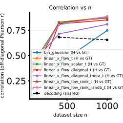
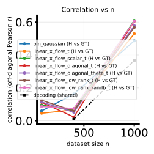
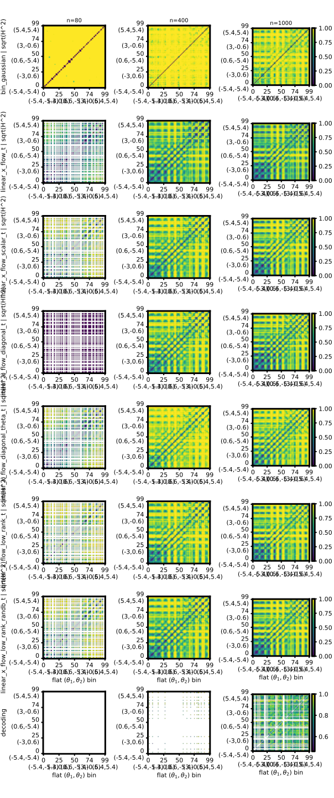
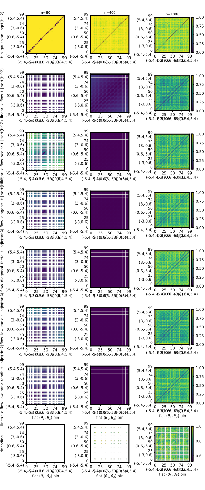

# 2026-05-02 — Native 2D $\theta$ `theta2_grid` twofig: `bin_gaussian` + all scheduled `linear_x_flow_*_t`

## Question / context

After the 1D-$\theta$ PR30D twofig run on **linearbench** and **cosinebench** ([companion note](2026-05-02-pr30d-linearbench-cosinebench-twofig-bin-plus-all-t-lxf.md)), we ran the analogous experiment on the native **2D-$\theta$** PR30D benchmarks. The important change is the binning geometry: instead of a $\theta_1$ slice, Hellinger matrices are computed on a flattened **$10\times10$ grid** over $(\theta_1,\theta_2)$ via `--theta-binning-mode theta2_grid`.

The two benchmark bundles follow the pinned skill recipes:

- **Randamp 2D:** `randamp_gaussian2d_sqrtd` (see [`.cursor/skills/bin-2d-lin-lxfdiag/SKILL.md`](../../.cursor/skills/bin-2d-lin-lxfdiag/SKILL.md)), PR30D NPZ at `/grad/zeyuan/score-matching-fisher/data/randamp_gaussian2d_sqrtd_xdim5/randamp_gaussian2d_sqrtd_xdim5_pr30d.npz`.
- **Gridcos 2D:** `gridcos_gaussian2d_sqrtd_rand_tune_additive` (see [`.cursor/skills/bin-2d-cos-lxfdiag/SKILL.md`](../../.cursor/skills/bin-2d-cos-lxfdiag/SKILL.md)), PR30D NPZ at `/grad/zeyuan/score-matching-fisher/data/gridcos_gaussian2d_sqrtd_rand_tune_additive_xdim5_noise2x_alpha2x/gridcos_gaussian2d_sqrtd_rand_tune_additive_xdim5_noise2x_alpha2x_pr30d.npz`.

We compare one diagnostic baseline, `bin_gaussian`, with the scheduled time-dependent linear X-flow family:

`linear_x_flow_t`, `linear_x_flow_scalar_t`, `linear_x_flow_diagonal_t`, `linear_x_flow_diagonal_theta_t`, `linear_x_flow_low_rank_t`, and `linear_x_flow_low_rank_randb_t`.

## Method

The script [`bin/study_h_decoding_twofig.py`](../../bin/study_h_decoding_twofig.py) constructs a Monte Carlo GT Hellinger matrix over the 2D grid, then evaluates each row method at nested subset sizes $n\in\{80,400,1000\}$. The key reported metric here is `corr_h_binned_vs_gt_mc`: the off-diagonal Pearson correlation between the estimated binned $\sqrt{H^2}$ matrix and the GT Monte Carlo $\sqrt{H^2}$ matrix.

The scheduled LXF rows are trained through the `lxfs_*` arguments in [`bin/study_h_decoding_convergence.py`](../../bin/study_h_decoding_convergence.py), using a cosine affine bridge:

- `--lxfs-path-schedule cosine`
- `--lxfs-epochs 50000`
- `--lxfs-early-patience 1000`
- `--lxf-low-rank-dim 4`

The 2D grid settings match the `bin-2d-lin-lxfdiag` and `bin-2d-cos-lxfdiag` skills:

- `--theta-binning-mode theta2_grid`
- `--num-theta-bins 10`
- `--num-theta-bins-y 10`
- `--n-ref 10000`, so GT MC uses $10000/(10\cdot10)=100$ samples per grid cell.

## Reproduction

Both jobs were launched from the repository root in the `geo_diffusion` environment, with one RTX 6000 Ada GPU per benchmark.

**Randamp 2D on GPU 0:**

```bash
cd /grad/zeyuan/score-matching-fisher

CUDA_VISIBLE_DEVICES=0 PYTHONUNBUFFERED=1 mamba run -n geo_diffusion python bin/study_h_decoding_twofig.py \
  --dataset-npz data/randamp_gaussian2d_sqrtd_xdim5/randamp_gaussian2d_sqrtd_xdim5_pr30d.npz \
  --dataset-family randamp_gaussian2d_sqrtd \
  --theta-binning-mode theta2_grid \
  --num-theta-bins 10 \
  --num-theta-bins-y 10 \
  --theta-field-rows bin_gaussian,linear_x_flow_t,linear_x_flow_scalar_t,linear_x_flow_diagonal_t,linear_x_flow_diagonal_theta_t,linear_x_flow_low_rank_t,linear_x_flow_low_rank_randb_t \
  --lxf-low-rank-dim 4 \
  --n-ref 10000 \
  --n-list 80,400,1000 \
  --lxfs-path-schedule cosine \
  --lxfs-epochs 50000 \
  --lxfs-early-patience 1000 \
  --device cuda \
  --output-dir data/experiments/native2d_randamp_pr30d_bin_plus_all_t_lxf_50k_20260502 \
  2>&1 | tee data/experiments/native2d_randamp_pr30d_bin_plus_all_t_lxf_50k_20260502/run.log
```

**Gridcos 2D on GPU 1:**

```bash
cd /grad/zeyuan/score-matching-fisher

CUDA_VISIBLE_DEVICES=1 PYTHONUNBUFFERED=1 mamba run -n geo_diffusion python bin/study_h_decoding_twofig.py \
  --dataset-npz data/gridcos_gaussian2d_sqrtd_rand_tune_additive_xdim5_noise2x_alpha2x/gridcos_gaussian2d_sqrtd_rand_tune_additive_xdim5_noise2x_alpha2x_pr30d.npz \
  --dataset-family gridcos_gaussian2d_sqrtd_rand_tune_additive \
  --theta-binning-mode theta2_grid \
  --num-theta-bins 10 \
  --num-theta-bins-y 10 \
  --theta-field-rows bin_gaussian,linear_x_flow_t,linear_x_flow_scalar_t,linear_x_flow_diagonal_t,linear_x_flow_diagonal_theta_t,linear_x_flow_low_rank_t,linear_x_flow_low_rank_randb_t \
  --lxf-low-rank-dim 4 \
  --n-ref 10000 \
  --n-list 80,400,1000 \
  --lxfs-path-schedule cosine \
  --lxfs-epochs 50000 \
  --lxfs-early-patience 1000 \
  --device cuda \
  --output-dir data/experiments/native2d_gridcos_pr30d_bin_plus_all_t_lxf_50k_20260502 \
  2>&1 | tee data/experiments/native2d_gridcos_pr30d_bin_plus_all_t_lxf_50k_20260502/run.log
```

Both commands completed with exit code 0.

## Results

Rows are in the saved `theta_field_rows` order. Columns are $n=80,400,1000$. Values are `corr_h_binned_vs_gt_mc` read from each `h_decoding_twofig_results.npz`.

| Row | Randamp 2D | Gridcos 2D |
|-----|------------|------------|
| `bin_gaussian` | 0.110, 0.421, 0.748 | 0.060, 0.163, 0.486 |
| `linear_x_flow_t` | 0.388, 0.828, 0.881 | 0.046, 0.066, 0.529 |
| `linear_x_flow_scalar_t` | 0.427, 0.817, 0.883 | 0.096, 0.063, 0.610 |
| `linear_x_flow_diagonal_t` | 0.171, 0.810, 0.851 | 0.112, 0.023, 0.605 |
| `linear_x_flow_diagonal_theta_t` | 0.432, 0.714, 0.808 | 0.115, 0.051, 0.578 |
| `linear_x_flow_low_rank_t` | 0.338, 0.829, 0.870 | 0.125, 0.059, 0.568 |
| `linear_x_flow_low_rank_randb_t` | 0.414, 0.802, 0.886 | 0.087, 0.075, 0.607 |

The 2D grid task is much harder than the 1D $\theta_1$ slice. Randamp 2D shows clear improvement with $n$, reaching roughly **0.75–0.89** by $n=1000$. Gridcos 2D remains more difficult: even at $n=1000$, correlations are roughly **0.49–0.61**, with the best scheduled rows only modestly above `bin_gaussian`.

Timing stored in `wall_seconds` sums to about **229 s** for the randamp 2D run and **206 s** for the gridcos 2D run, excluding process startup overhead.

## Figures

The correlation-vs-$n$ figures show the same pattern as the table: substantial recovery on randamp as $n$ grows, but persistently lower agreement on gridcos.





The sweep panels show the learned $100\times100$ Hellinger matrices for each row and $n$.





## Artifacts

**Randamp 2D**

- Output directory: `/grad/zeyuan/score-matching-fisher/data/experiments/native2d_randamp_pr30d_bin_plus_all_t_lxf_50k_20260502/`
- Results: `/grad/zeyuan/score-matching-fisher/data/experiments/native2d_randamp_pr30d_bin_plus_all_t_lxf_50k_20260502/h_decoding_twofig_results.npz`
- Summary: `/grad/zeyuan/score-matching-fisher/data/experiments/native2d_randamp_pr30d_bin_plus_all_t_lxf_50k_20260502/h_decoding_twofig_summary.txt`
- Figures: `h_decoding_twofig_sweep.svg`, `h_decoding_twofig_gt.svg`, `h_decoding_twofig_corr_vs_n.svg`, `h_decoding_twofig_nmse_vs_n.svg`, `h_decoding_twofig_training_losses_panel.svg`
- Log: `/grad/zeyuan/score-matching-fisher/data/experiments/native2d_randamp_pr30d_bin_plus_all_t_lxf_50k_20260502/run.log`

**Gridcos 2D**

- Output directory: `/grad/zeyuan/score-matching-fisher/data/experiments/native2d_gridcos_pr30d_bin_plus_all_t_lxf_50k_20260502/`
- Results: `/grad/zeyuan/score-matching-fisher/data/experiments/native2d_gridcos_pr30d_bin_plus_all_t_lxf_50k_20260502/h_decoding_twofig_results.npz`
- Summary: `/grad/zeyuan/score-matching-fisher/data/experiments/native2d_gridcos_pr30d_bin_plus_all_t_lxf_50k_20260502/h_decoding_twofig_summary.txt`
- Figures: `h_decoding_twofig_sweep.svg`, `h_decoding_twofig_gt.svg`, `h_decoding_twofig_corr_vs_n.svg`, `h_decoding_twofig_nmse_vs_n.svg`, `h_decoding_twofig_training_losses_panel.svg`
- Log: `/grad/zeyuan/score-matching-fisher/data/experiments/native2d_gridcos_pr30d_bin_plus_all_t_lxf_50k_20260502/run.log`

**Journal figure copies**

- `/grad/zeyuan/score-matching-fisher/journal/notes/figs/2026-05-02-native2d-theta2grid-bin-plus-all-t-lxf/randamp2d_corr_vs_n.svg`
- `/grad/zeyuan/score-matching-fisher/journal/notes/figs/2026-05-02-native2d-theta2grid-bin-plus-all-t-lxf/gridcos2d_corr_vs_n.svg`
- `/grad/zeyuan/score-matching-fisher/journal/notes/figs/2026-05-02-native2d-theta2grid-bin-plus-all-t-lxf/randamp2d_sweep.svg`
- `/grad/zeyuan/score-matching-fisher/journal/notes/figs/2026-05-02-native2d-theta2grid-bin-plus-all-t-lxf/gridcos2d_sweep.svg`

## Takeaway

For this native 2D-$\theta$ setting, the scheduled linear X-flow family improves over `bin_gaussian` on randamp 2D at moderate and large $n$, but gridcos 2D remains a hard benchmark under the same budget. The result suggests that the full `theta2_grid` Hellinger geometry exposes structure that was hidden by the easier 1D $\theta_1$ slice.
