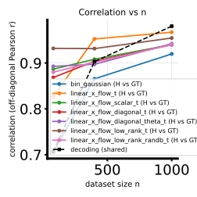
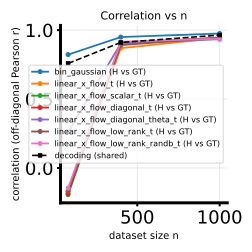
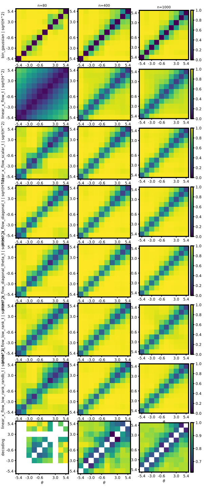

# 2026-05-02 — PR30D H-decoding twofig: `bin_gaussian` + all scheduled `linear_x_flow_*_t` on linearbench and cosinebench

## Question / context

We want a **single twofig panel per canonical 5D→PR30D benchmark** comparing:

- a **nonparametric** binned-Gaussian diagnostic row (`bin_gaussian`), and  
- the full set of **scheduled (time-dependent) linear X-flow** variants (`*_t` methods), trained on the **affine cosine bridge** (`--lxfs-path-schedule cosine`) with a **large LXFS epoch cap** and validation early stopping.

**Benchmarks (user aliases):**

- **linearbench:** `randamp_gaussian_sqrtd`, PR30D NPZ under `data/randamp_gaussian_sqrtd_xdim5/` (see `.cursor/skills/linearbench/SKILL.md`).
- **cosinebench:** `cosine_gaussian_sqrtd_rand_tune_additive` with doubled noise / activity coupling, PR30D NPZ under `data/cosine_sqrtd_rand_tune_additive_xdim5_noise2x_alpha2x/` (see `.cursor/skills/cosinebench/SKILL.md`).

Pipeline: [`bin/study_h_decoding_twofig.py`](../../bin/study_h_decoding_twofig.py) (CLI) delegates training and Hellinger assembly to [`bin/study_h_decoding_convergence.py`](../../bin/study_h_decoding_convergence.py). Scheduled LXF methods are the set `_TIME_LXF_METHODS` in that file (`linear_x_flow_t`, `linear_x_flow_scalar_t`, `linear_x_flow_diagonal_t`, `linear_x_flow_diagonal_theta_t`, `linear_x_flow_low_rank_t`, `linear_x_flow_low_rank_randb_t`).

## Method (short)

- **Twofig** builds a **GT** Monte Carlo Hellinger matrix on a $\theta$ bin grid, then for each **row method** and each **nested subset size** $n\in\{80,400,1000\}$ estimates a **binned** $\sqrt{H^2}$ matrix and records **off-diagonal Pearson correlation** vs GT (`corr_h_binned_vs_gt_mc`), NMSE, and a **shared** decoding row (see script docstring).
- This run uses **default** `--theta-binning-mode theta1` with **`num_theta_bins=10`** (10×10 matrices in the stored arrays come from the sweep tensor layout; see `h_decoding_twofig_summary.txt` in each output dir).
- For any method in `_TIME_LXF_METHODS`, convergence uses the **`lxfs_*` prefix** (epochs, LR, early patience, path schedule), **not** `lxf_epochs`, and calls `train_time_linear_x_flow_schedule` in [`fisher/linear_x_flow.py`](../../fisher/linear_x_flow.py).

## Reproduction (commands & scripts)

Environment and device per [`AGENTS.md`](../../AGENTS.md): `mamba run -n geo_diffusion`, `--device cuda`.

Two GPUs were used in parallel (**GPU0 = linearbench**, **GPU1 = cosinebench**) via `CUDA_VISIBLE_DEVICES`. Logs were tee’d to each `--output-dir/run.log`.

**Linearbench (GPU 0):**

```bash
cd /path/to/score-matching-fisher

CUDA_VISIBLE_DEVICES=0 PYTHONUNBUFFERED=1 mamba run -n geo_diffusion python bin/study_h_decoding_twofig.py \
  --dataset-npz data/randamp_gaussian_sqrtd_xdim5/randamp_gaussian_sqrtd_xdim5_pr30d.npz \
  --dataset-family randamp_gaussian_sqrtd \
  --theta-field-rows bin_gaussian,linear_x_flow_t,linear_x_flow_scalar_t,linear_x_flow_diagonal_t,linear_x_flow_diagonal_theta_t,linear_x_flow_low_rank_t,linear_x_flow_low_rank_randb_t \
  --lxf-low-rank-dim 4 \
  --n-list 80,400,1000 \
  --lxfs-path-schedule cosine \
  --lxfs-epochs 50000 \
  --lxfs-early-patience 1000 \
  --device cuda \
  --output-dir data/experiments/h_decoding_twofig_pr30d_linearbench_bin_plus_all_t_lxf_50k_20260502 \
  2>&1 | tee data/experiments/h_decoding_twofig_pr30d_linearbench_bin_plus_all_t_lxf_50k_20260502/run.log
```

**Cosinebench (GPU 1):**

```bash
CUDA_VISIBLE_DEVICES=1 PYTHONUNBUFFERED=1 mamba run -n geo_diffusion python bin/study_h_decoding_twofig.py \
  --dataset-npz data/cosine_sqrtd_rand_tune_additive_xdim5_noise2x_alpha2x/cosine_sqrtd_rand_tune_additive_xdim5_noise2x_alpha2x_pr30d.npz \
  --dataset-family cosine_gaussian_sqrtd_rand_tune_additive \
  --theta-field-rows bin_gaussian,linear_x_flow_t,linear_x_flow_scalar_t,linear_x_flow_diagonal_t,linear_x_flow_diagonal_theta_t,linear_x_flow_low_rank_t,linear_x_flow_low_rank_randb_t \
  --lxf-low-rank-dim 4 \
  --n-list 80,400,1000 \
  --lxfs-path-schedule cosine \
  --lxfs-epochs 50000 \
  --lxfs-early-patience 1000 \
  --device cuda \
  --output-dir data/experiments/h_decoding_twofig_pr30d_cosinebench_bin_plus_all_t_lxf_50k_20260502 \
  2>&1 | tee data/experiments/h_decoding_twofig_pr30d_cosinebench_bin_plus_all_t_lxf_50k_20260502/run.log
```

Nested subset sweep matches the repo skill [`.cursor/skills/lxf-bench-h-decoding-twofig/SKILL.md`](../../.cursor/skills/lxf-bench-h-decoding-twofig/SKILL.md) (`--n-list 80,400,1000`); early patience here is applied via **`--lxfs-early-patience 1000`** for the scheduled rows.

## Results (numbers from `h_decoding_twofig_results.npz`)

Rows are in `theta_field_rows` order; columns are $n\in\{80,400,1000\}$. **`corr_h_binned_vs_gt_mc`:**

| Row | linearbench | cosinebench |
|-----|-------------|-------------|
| `bin_gaussian` | 0.705, 0.866, 0.920 | 0.823, 0.950, 0.976 |
| `linear_x_flow_t` | 0.827, 0.952, 0.967 | **−0.172**, 0.869, 0.944 |
| `linear_x_flow_scalar_t` | 0.887, 0.908, 0.940 | **−0.194**, 0.906, 0.943 |
| `linear_x_flow_diagonal_t` | 0.869, 0.904, 0.940 | **−0.186**, 0.907, 0.945 |
| `linear_x_flow_diagonal_theta_t` | 0.893, 0.897, 0.942 | 0.261, 0.903, 0.934 |
| `linear_x_flow_low_rank_t` | 0.932, 0.931, 0.955 | **−0.169**, 0.891, 0.947 |
| `linear_x_flow_low_rank_randb_t` | 0.880, 0.902, 0.940 | **−0.146**, 0.916, 0.939 |

**Observation:** On **cosinebench** at **$n=80$**, several full-state / diagonal / low-rank `*_t` rows show **negative** `corr_h` vs GT (matrix agreement can be anti-aligned at tiny $n$ even when larger $n$ recovers strong positive correlation). **linear_x_flow_diagonal_theta_t** stays positive at $n=80$ but is not the best row at large $n$ in this snapshot.

**Takeaway:** Under this binning and budget, **linearbench** is relatively forgiving: all rows reach **${\sim}0.87$–0.97** correlation at $n=1000$. **Cosinebench** is harder at small $n$ for most `*_t` rows, but by $n=1000$ correlations cluster in the **0.93–0.98** range (with `bin_gaussian` best here).

## Figures (embedded copies)

Pearson correlation of flattened off-diagonal binned $\sqrt{H^2}$ vs GT, vs nested $n$ (one curve per method row):





Full sweep / GT / NMSE / training-loss panel SVGs live in the artifact directories below; a **sweep matrix panel** for linearbench is also copied here for quick visual context:



## Artifacts (exact paths)

**Linearbench run**

- Directory: `/grad/zeyuan/score-matching-fisher/data/experiments/h_decoding_twofig_pr30d_linearbench_bin_plus_all_t_lxf_50k_20260502/`
- Arrays: `…/h_decoding_twofig_results.npz`
- Summary: `…/h_decoding_twofig_summary.txt`
- Figures: `…/h_decoding_twofig_{sweep,gt,corr_vs_n,nmse_vs_n,training_losses_panel}.svg`
- Log: `…/run.log`
- Per-row training curves: `…/training_losses/`

**Cosinebench run**

- Directory: `/grad/zeyuan/score-matching-fisher/data/experiments/h_decoding_twofig_pr30d_cosinebench_bin_plus_all_t_lxf_50k_20260502/`
- Arrays: `…/h_decoding_twofig_results.npz`
- Summary: `…/h_decoding_twofig_summary.txt`
- Figures: `…/h_decoding_twofig_{sweep,gt,corr_vs_n,nmse_vs_n,training_losses_panel}.svg`
- Log: `…/run.log`
- Per-row training curves: `…/training_losses/`

**Journal figure copies**

- `/grad/zeyuan/score-matching-fisher/journal/notes/figs/2026-05-02-pr30d-linearbench-cosinebench-twofig-bin-plus-all-t-lxf/linearbench_corr_vs_n.svg`
- `/grad/zeyuan/score-matching-fisher/journal/notes/figs/2026-05-02-pr30d-linearbench-cosinebench-twofig-bin-plus-all-t-lxf/cosinebench_corr_vs_n.svg`
- `/grad/zeyuan/score-matching-fisher/journal/notes/figs/2026-05-02-pr30d-linearbench-cosinebench-twofig-bin-plus-all-t-lxf/linearbench_sweep.svg`
