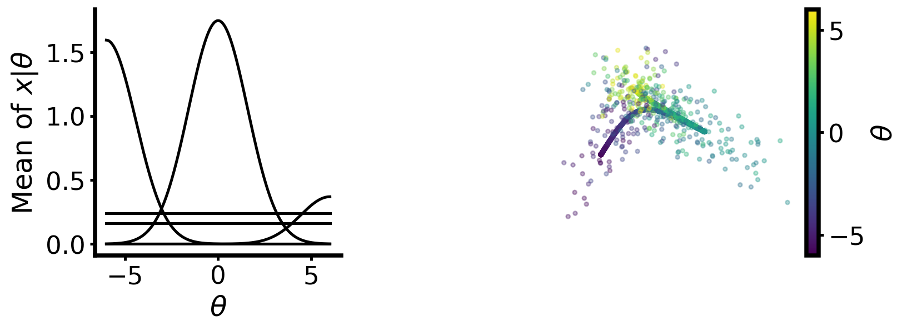
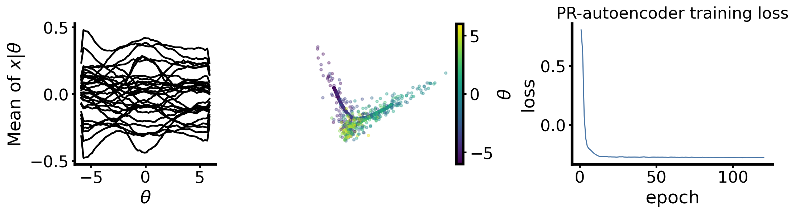
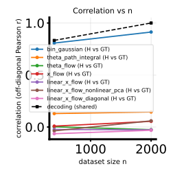
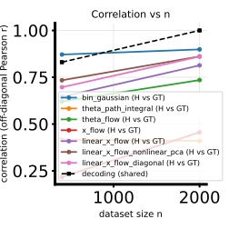

# 2D $\theta$ cosinebench- / linearbench-style data, PR embedding, and H-decoding `twofig` (Markdown + repro)

## Question / context

The canonical **cosinebench** and **linearbench** shorthands in this repo use **scalar** $\theta$. We want the same **generative families** (same internal recipes: cosine $\sqrt{d}$ rand-tune additive vs `randamp_gaussian_sqrtd`) but with **latent** $\theta \in \mathbb{R}^2$, joint samples $(\theta, x)$ at native $x \in \mathbb{R}^5$, **PR-autoencoder** embedding to $x \in \mathbb{R}^{30}$, and a full **`study_h_decoding_twofig`** sweep over seven field methods—including flows and path integral—with reproducible commands.

This note records the **generative math** (as implemented in `fisher/data.py`), **what the figures show**, and **quantitative summaries** from the experiment tree `data/experiments/theta2d_cosine_linear_bench/`.

## Method: 2D $\theta$ coupling in code

Write $\theta = (\theta_1,\theta_2)^\top$. The dataset stores `theta_all` with shape $(N,2)$. Observation dimension is $d_x$ (here $5$); latent dimension after PR is $30$.

### Sampling $\theta$

$$
\theta_{i,k} \stackrel{\text{i.i.d.}}{\sim} \mathrm{Uniform}(\theta_{\mathrm{low}}, \theta_{\mathrm{high}}), \quad k \in \{1,2\}.
$$

Defaults: $\theta_{\mathrm{low}}=-6$, $\theta_{\mathrm{high}}=6$ (same box as 1D).

### Effective scalar per observation coordinate

For each output coordinate $j \in \{0,\ldots,d_x-1\}$, the code forms a **scalar argument** $t_{ij}$ from $\theta_i$ by cycling through the columns of $\theta$:

$$
t_{ij} = \theta_{i,\,(j \bmod d_\theta)}, \qquad d_\theta \in \{1,2\}.
$$

So for $d_\theta=2$ and $d_x=5$: coordinates $0,2,4$ use $\theta_1$, and coordinates $1,3$ use $\theta_2$. This is the precise “2D mimicking 1D” rule: each $x_j$ is driven by **one** component of $\theta$, with a fixed assignment pattern.

Implementation: `_theta_effective_x_scalars` in `fisher/data.py`.

### Mean $\mu(\theta)\in\mathbb{R}^{d_x}$

**Cosine family** (`tuning_curve_family='cosine'`), including **`cosine_gaussian_sqrtd_rand_tune_additive`**:

$$
\mu_{ij} = a_j \cos(\omega\, t_{ij} + \phi_j), \qquad
\phi_j = \frac{2\pi j}{d_x}, \quad \omega = 1,
$$

with per-dimension amplitudes $a_j$ drawn once at dataset construction (Uniform recipe, then scaled by `cosine_tune_amp_scale` when applicable) unless restored from NPZ meta as `cosine_tune_amp_per_dim`.

**Randamp bumps** (`randamp_gaussian_sqrtd`): centers $c_j$ uniform on $[\theta_{\mathrm{low}},\theta_{\mathrm{high}}]$ for each $j$,

$$
\mu_{ij} = A_j \exp\bigl(-\kappa\, \omega^2\, (t_{ij}-c_j)^2\bigr),
$$

with random $A_j$ per dimension (see `ToyConditionalGaussianRandampDataset`).

### Diagonal observation covariance (Gaussian $x\mid\theta$)

Let $\sigma_{\mathrm{base},j}$ be the linearly spaced baseline between `sigma_x1` and `sigma_x2` across $j$, and let

$$
\alpha = \tfrac{1}{2}\bigl(\texttt{cov\_theta\_amp1}+\texttt{cov\_theta\_amp2}\bigr)
$$

(a scalar applied to every coordinate in the current code path via `_sigma_activity_alpha`).

**Additive $\sqrt{d_x}$ law** (used by new `randamp_gaussian_sqrtd` archives and by **`cosine_gaussian_sqrtd_rand_tune_additive`** with additive meta):

$$
V_{ij}(\theta) = d_x\, \sigma_{\mathrm{base},j}^2 + \alpha\,|\mu_{ij}(\theta)| + \varepsilon,
$$

with small $\varepsilon > 0$ for stability. **Legacy** multiplicative variants exist for older archives; see `RANDAMP_SQRTD_VAR_MU_LAW_*` in `fisher/data.py`.

Sampling uses diagonal covariances:

$$
x_i \mid \theta_i \sim \mathcal{N}\bigl(\mu(\theta_i),\,\mathrm{diag}(V_{i\cdot}(\theta_i))\bigr).
$$

Log-density used for GT / MC checks is the matching diagonal Gaussian (see `ToyConditionalGaussianDataset.log_p_x_given_theta`).

### PR embedding to 30D

Low-dimensional $x \in \mathbb{R}^{5}$ is passed through a **PR autoencoder** (`bin/project_dataset_pr_autoencoder.py`) to $x \in \mathbb{R}^{30}$. Meta flags `pr_autoencoder_embedded`, `x_dim=30`, and `pr_autoencoder_z_dim=5` preserve the generative family for `build_dataset_from_meta` while lifting the observation space for score / flow training.

## Reproduction (commands and scripts)

Environment (per `AGENTS.md`):

```bash
mamba run -n geo_diffusion python <script> ... --device cuda
```

### Loop scripts (canonical for this study)

| Stage | Script | Location |
|--------|--------|----------|
| Smoke | `run.py` | `data/experiments/theta2d_cosine_linear_bench/loop_001/run.py` |
| Native + PR | `run.py` | `data/experiments/theta2d_cosine_linear_bench/loop_002/run.py` |
| Full `twofig` | `run.py` | `data/experiments/theta2d_cosine_linear_bench/loop_003/run.py` |

Run from repo root:

```bash
cd /grad/zeyuan/score-matching-fisher

PYTHONUNBUFFERED=1 mamba run -n geo_diffusion python data/experiments/theta2d_cosine_linear_bench/loop_001/run.py --device cuda
PYTHONUNBUFFERED=1 mamba run -n geo_diffusion python data/experiments/theta2d_cosine_linear_bench/loop_002/run.py --device cuda
PYTHONUNBUFFERED=1 mamba run -n geo_diffusion python data/experiments/theta2d_cosine_linear_bench/loop_003/run.py --device cuda
```

Equivalent manual steps (illustrative):

**Cosine-style native 5D, $\theta_{\dim}=2$, $n=10^4$, bench-style noise/alpha scaling**

```bash
mamba run -n geo_diffusion python bin/make_dataset.py \
  --dataset-family cosine_gaussian_sqrtd_rand_tune_additive \
  --x-dim 5 --theta-dim 2 --n-total 10000 \
  --obs-noise-scale 0.5 --cov-theta-amp-scale 2 \
  --seed 42 --output-npz data/experiments/theta2d_cosine_linear_bench/loop_002/cosine_theta2d_x5_noise2x_alpha2x_native.npz
```

**Linear-style native**

```bash
mamba run -n geo_diffusion python bin/make_dataset.py \
  --dataset-family randamp_gaussian_sqrtd \
  --x-dim 5 --theta-dim 2 --n-total 10000 \
  --seed 42 --output-npz data/experiments/theta2d_cosine_linear_bench/loop_002/randamp_theta2d_x5_native.npz
```

**PR 30D (cosine requires override)**

```bash
mamba run -n geo_diffusion python bin/project_dataset_pr_autoencoder.py \
  --input-npz data/experiments/theta2d_cosine_linear_bench/loop_002/cosine_theta2d_x5_noise2x_alpha2x_native.npz \
  --output-npz data/experiments/theta2d_cosine_linear_bench/loop_002/cosine_theta2d_x5_noise2x_alpha2x_pr30d.npz \
  --h-dim 30 --device cuda --seed 42 --pr-train-epochs 120 --pr-train-samples 10000 \
  --allow-non-randamp-sqrtd
```

**Full `twofig` (seven methods)**

```bash
mamba run -n geo_diffusion python bin/study_h_decoding_twofig.py \
  --dataset-npz data/experiments/theta2d_cosine_linear_bench/loop_002/cosine_theta2d_x5_noise2x_alpha2x_pr30d.npz \
  --dataset-family cosine_gaussian_sqrtd_rand_tune_additive \
  --output-dir data/experiments/theta2d_cosine_linear_bench/loop_003/twofig_cosine_pr30d \
  --n-list 400,2000 --n-ref 2000 --num-theta-bins 16 --run-seed 42 \
  --theta-field-methods "bin_gaussian,theta_path_integral,theta_flow,x_flow,linear_x_flow,linear_x_flow_nonlinear_pca,linear_x_flow_diagonal" \
  --flow-epochs 80 --lxf-epochs 80 --lxf-early-patience 60 --device cuda
```

(and the parallel run with `randamp_gaussian_sqrtd` + `randamp_theta2d_x5_pr30d.npz`).

### Implementation pointers

- Generative classes: `fisher/data.py` (`ToyConditionalGaussianDataset`, `ToyConditionalGaussianRandampSqrtdDataset`, `ToyConditionalGaussianCosineRandampSqrtdDataset`).
- H-matrix / multi-$\theta$ paths: `fisher/h_matrix.py` (x-flow likelihood rows; `compute_c_matrix` polyline spacing for $d_\theta>1$; `theta_path_integral` scalar reduction of velocity-derived score—see experiment `report.md`).
- X-flow MLP width: `fisher/models.py` (`ConditionalXFlowVelocity`, `theta_dim`), `fisher/shared_fisher_est.py` (`build_conditional_x_velocity_model`).

## Results (numbers from `loop_003/metrics.json`)

Run configuration: `n \in \{400,2000\}$, `n_{\mathrm{ref}}=2000`, `16$ $\theta$ bins for GT MC Hellinger, `flow_epochs=lxf_epochs=80`, `run_seed=42`, CUDA.

| Dataset (PR30D) | Mean corr. binned $H$ vs GT (last $n$ column) | Decode vs ref (last $n$) |
|-----------------|-----------------------------------------------|---------------------------|
| Cosine-style 2D $\theta$ | $\approx 0.155$ | $1.0$ |
| Linear-style 2D $\theta$ | $\approx 0.719$ | $\approx 1.0$ |

Per-method breakdowns live in:

- `/grad/zeyuan/score-matching-fisher/data/experiments/theta2d_cosine_linear_bench/loop_003/twofig_cosine_pr30d/h_decoding_twofig_results.npz`
- `/grad/zeyuan/score-matching-fisher/data/experiments/theta2d_cosine_linear_bench/loop_003/twofig_linear_pr30d/h_decoding_twofig_results.npz`

**Observation:** On this training budget, **linear-style** 2D-$\theta$ data yields much higher aggregate binned-$H$ agreement with GT MC than the **stronger** cosine-style recipe (higher activity coupling and per-dim cosine amplitudes), which is expected from difficulty and embedding stress—but method-level ordering should be read off the NPZ / SVG sweeps, not only these two scalars.

## Figures

### Native / PR visualization (loop 002)

The files under `loop_002/` reuse fixed filenames across the two `make_dataset` calls; the PNGs copied below correspond to the **last** family written in that loop’s `run.py` order (here: **linear** `randamp` native joint, then **linear** PR summary). For cosine-native panels, re-run `make_dataset` for cosine alone or inspect the cosine NPZ with `bin/visualize_dataset.py` if you need side-by-side files without overwrite.



The left panel shows binned $\mathbb{E}[x\mid\theta]$ against the 1D marginal binning axis ($\theta_1$ when $\theta$ is 2D); the right panel overlays samples in a 2D PCA of $x$. **Interpretation:** 2D $\theta$ fills the box; the mean curves remain identifiable against the generative tuning, with MAE reported in the `make_dataset` console log.



**Interpretation:** After 120 epochs (subset `pr_train_samples=10000`), the embedded cloud tracks $\theta$-structure in PCA, and the binned embedded mean vs $\theta_1$ is smoothed for visualization.

### H-decoding correlation vs $n$ (loop 003)





**Interpretation:** Each curve is one $\theta$-field method; the cosine panel is overall harder (lower correlations at the same $n$) than the linear panel on this run.

## Artifacts (absolute paths)

**Experiment hub**

- `/grad/zeyuan/score-matching-fisher/data/experiments/theta2d_cosine_linear_bench/report.md`

**Datasets (loop 002)**

- `/grad/zeyuan/score-matching-fisher/data/experiments/theta2d_cosine_linear_bench/loop_002/cosine_theta2d_x5_noise2x_alpha2x_native.npz`
- `/grad/zeyuan/score-matching-fisher/data/experiments/theta2d_cosine_linear_bench/loop_002/randamp_theta2d_x5_native.npz`
- `/grad/zeyuan/score-matching-fisher/data/experiments/theta2d_cosine_linear_bench/loop_002/cosine_theta2d_x5_noise2x_alpha2x_pr30d.npz`
- `/grad/zeyuan/score-matching-fisher/data/experiments/theta2d_cosine_linear_bench/loop_002/randamp_theta2d_x5_pr30d.npz`

**Twofig outputs (loop 003)**

- `/grad/zeyuan/score-matching-fisher/data/experiments/theta2d_cosine_linear_bench/loop_003/twofig_cosine_pr30d/`
- `/grad/zeyuan/score-matching-fisher/data/experiments/theta2d_cosine_linear_bench/loop_003/twofig_linear_pr30d/`

**Logs / per-loop metrics**

- `.../loop_001/run.log`, `.../loop_001/metrics.json`
- `.../loop_002/run.log`, `.../loop_002/metrics.json`
- `.../loop_003/run.log`, `.../loop_003/metrics.json`

## Takeaway

- **2D $\theta$** is implemented as **independent uniforms** on each component, with **per-$x_j$** scalar drives $t_{ij}=\theta_{i,(j\bmod 2)}$ feeding the same cosine / randamp mean shapes as the 1D case.
- **Variance** follows the **additive $\sqrt{d_x}$** law for these families, with global $\alpha$ from the two `cov_theta_amp*` hyperparameters.
- **PR 30D** + **full seven-method `twofig`** completes on both benchmark-style families; aggregate **binned-$H$ vs GT** is much better on **linear-style** than **cosine-style** data at the reported training budget, while **decode vs shared ref** stays near **1** for both.
- For caveats on **multi-D `theta_path_integral`** (scalar reduction + polyline $C$), see the experiment report above.

## Figure files in this note

Relative to this `.md` file:

- `figs/2026-05-02-theta2d-cosine-linear-bench/joint_scatter_theta2d_native_last_run.png`
- `figs/2026-05-02-theta2d-cosine-linear-bench/pr_projection_theta2d_pr30d_last_run.png`
- `figs/2026-05-02-theta2d-cosine-linear-bench/h_decoding_twofig_corr_vs_n_cosine_pr30d.svg`
- `figs/2026-05-02-theta2d-cosine-linear-bench/h_decoding_twofig_corr_vs_n_linear_pr30d.svg`
