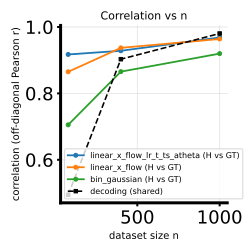
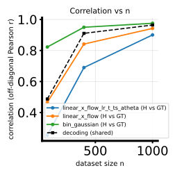

# 2026-05-03 — PR30D benchmark-1D twofig: `linear_x_flow_lr_t_ts_atheta` vs `linear_x_flow` vs `bin_gaussian`

## Question / context

We wanted a **compact benchmark-1D** panel (embedded 5D-native **linearbench** and **cosinebench**, PR-30D NPZs, 1D $\theta$ binning) comparing:

1. **`linear_x_flow_lr_t_ts_atheta`** — scheduled low-rank linear X-flow with symmetric $A(t,\theta)$ and the same $b(\theta)$ mean-regression warmup / freeze story as `linear_x_flow_lr_t_ts` (see the dedicated method note).
2. **`linear_x_flow`** — time-independent (non-scheduled) linear X-flow baseline.
3. **`bin_gaussian`** — closed-form binned Gaussian $\theta$-field (no neural training).

The goal is a **reproducible** `study_h_decoding_twofig` run with the same nested $n$ sweep and `lxfs` budget used elsewhere in the 1D bench tier.

## Method (high level)

- **Script:** [`bin/study_h_decoding_twofig.py`](../../bin/study_h_decoding_twofig.py) (full pipeline in [`bin/study_h_decoding_convergence.py`](../../bin/study_h_decoding_convergence.py)).
- **Geometry:** `theta_binning_mode=theta1`, `num_theta_bins=10` (defaults).
- **Subsets:** `n_ref=5000` (default), nested **`n_list = 80, 400, 1000`** (requires `max(n_list) <= n_ref`).
- **Low rank:** `--lxf-low-rank-dim 4` (required for `linear_x_flow_lr_t_ts_atheta`).
- **Scheduled rows:** `--lxfs-path-schedule cosine`, `--lxfs-epochs 50000`, `--lxfs-early-patience 1000`.  
  `linear_x_flow` uses the time-independent `lxf_*` training path inside the same CLI surface.

For the **velocity / divergence** definition of `linear_x_flow_lr_t_ts_atheta`, see [2026-05-04 Theta-dependent $A(t,\theta)$ …](2026-05-04-theta-dependent-a-low-rank-scheduled-x-flow-lr-t-ts-atheta.md).

## Reproduction (commands & scripts)

From the repo root, with **`mamba run -n geo_diffusion`** and **`--device cuda`** ([`AGENTS.md`](../../AGENTS.md)). **Row order** in the figures matches the comma list: `linear_x_flow_lr_t_ts_atheta`, then `linear_x_flow`, then `bin_gaussian`.

**Linearbench** (example: `CUDA_VISIBLE_DEVICES=0`):

```bash
cd /grad/zeyuan/score-matching-fisher
CUDA_VISIBLE_DEVICES=0 PYTHONUNBUFFERED=1 mamba run -n geo_diffusion python bin/study_h_decoding_twofig.py \
  --dataset-npz data/randamp_gaussian_sqrtd_xdim5/randamp_gaussian_sqrtd_xdim5_pr30d.npz \
  --dataset-family randamp_gaussian_sqrtd \
  --theta-field-rows linear_x_flow_lr_t_ts_atheta,linear_x_flow,bin_gaussian \
  --lxf-low-rank-dim 4 \
  --n-list 80,400,1000 \
  --lxfs-path-schedule cosine \
  --lxfs-epochs 50000 \
  --lxfs-early-patience 1000 \
  --device cuda \
  --output-dir data/experiments/h_decoding_twofig_pr30d_linearbench_20260503_lr_atheta_lxf_bin_bench1d \
  2>&1 | stdbuf -oL tee data/experiments/h_decoding_twofig_pr30d_linearbench_20260503_lr_atheta_lxf_bin_bench1d/run.log
```

**Cosinebench** (example: second GPU):

```bash
cd /grad/zeyuan/score-matching-fisher
CUDA_VISIBLE_DEVICES=1 PYTHONUNBUFFERED=1 mamba run -n geo_diffusion python bin/study_h_decoding_twofig.py \
  --dataset-npz data/cosine_sqrtd_rand_tune_additive_xdim5_noise2x_alpha2x/cosine_sqrtd_rand_tune_additive_xdim5_noise2x_alpha2x_pr30d.npz \
  --dataset-family cosine_gaussian_sqrtd_rand_tune_additive \
  --theta-field-rows linear_x_flow_lr_t_ts_atheta,linear_x_flow,bin_gaussian \
  --lxf-low-rank-dim 4 \
  --n-list 80,400,1000 \
  --lxfs-path-schedule cosine \
  --lxfs-epochs 50000 \
  --lxfs-early-patience 1000 \
  --device cuda \
  --output-dir data/experiments/h_decoding_twofig_pr30d_cosinebench_20260503_lr_atheta_lxf_bin_bench1d \
  2>&1 | stdbuf -oL tee data/experiments/h_decoding_twofig_pr30d_cosinebench_20260503_lr_atheta_lxf_bin_bench1d/run.log
```

`stdbuf -oL` keeps **`run.log`** line-buffered when piping through `tee` (plain `tee` can leave an empty log for a long time on some systems).

## Results

Metrics below are read from `h_decoding_twofig_results.npz`: **`corr_h_binned_vs_gt_mc`** is shape `(n_{\mathrm{methods}}, n_{\mathrm{cols}})` with columns in **`n` order** `[80, 400, 1000]`. Row order matches **`theta_field_rows`**.

### Linearbench (`randamp_gaussian_sqrtd` PR30D)

| Row | $n=80$ | $n=400$ | $n=1000$ |
|-----|--------|---------|----------|
| `linear_x_flow_lr_t_ts_atheta` | 0.917 | 0.928 | 0.968 |
| `linear_x_flow` | 0.865 | 0.937 | 0.964 |
| `bin_gaussian` | 0.705 | 0.866 | 0.920 |

**Off-diagonal Pearson $r$** between the **shared** decoding matrix and the reference decoding (same for all methods in this twofig mode): approximately **0.495** ($n=80$), **0.903** ($n=400$), **0.980** ($n=1000$).

### Cosinebench (`cosine_gaussian_sqrtd_rand_tune_additive` PR30D)

| Row | $n=80$ | $n=400$ | $n=1000$ |
|-----|--------|---------|----------|
| `linear_x_flow_lr_t_ts_atheta` | 0.254 | 0.690 | 0.901 |
| `linear_x_flow` | 0.466 | 0.842 | 0.942 |
| `bin_gaussian` | 0.823 | 0.950 | 0.976 |

Shared decoding vs reference: approximately **0.487** ($n=80$), **0.911** ($n=400$), **0.964** ($n=1000$).

### Observations vs conclusions

- **Linearbench:** At $n=80$, **`linear_x_flow_lr_t_ts_atheta`** attains the **highest** binned-$H$ correlation vs the MC GT among the three rows; at larger $n$ all three neural / analytic fields are **close**, with **`bin_gaussian` still trailing** on this metric.
- **Cosinebench:** **`bin_gaussian`** is **strongest** on binned-$H$ vs GT at every $n$, especially at $n=80$. **`linear_x_flow_lr_t_ts_atheta`** is **weakest at $n=80$** on this metric but **closes most of the gap** by $n=1000$. This is an **empirical** pattern on this fixed bench recipe, not a claim that the architecture is unsuited in general (small-$n$ variance, optimization, and the harder cosine coupling all matter).

## Figures

**Correlation vs $n$** (off-diagonal Pearson for binned $H$ vs GT and decoding curves) for **linearbench**:



**Cosinebench** (same layout):



The panels summarize the numeric tables: on cosinebench the **orange** (`linear_x_flow_lr_t_ts_atheta`) **$H$** curve starts low at $n=80$ and rises with $n$; **bin** (green) stays on top for $H$ vs GT.

Full sweep / GT / NMSE / training-loss panels live under the artifact directories below (same filenames as every twofig run).

## Artifacts (exact paths)

**Linearbench output directory**

`/grad/zeyuan/score-matching-fisher/data/experiments/h_decoding_twofig_pr30d_linearbench_20260503_lr_atheta_lxf_bin_bench1d/`

Key files:

- `/grad/zeyuan/score-matching-fisher/data/experiments/h_decoding_twofig_pr30d_linearbench_20260503_lr_atheta_lxf_bin_bench1d/h_decoding_twofig_results.npz`
- `/grad/zeyuan/score-matching-fisher/data/experiments/h_decoding_twofig_pr30d_linearbench_20260503_lr_atheta_lxf_bin_bench1d/h_decoding_twofig_summary.txt`
- `/grad/zeyuan/score-matching-fisher/data/experiments/h_decoding_twofig_pr30d_linearbench_20260503_lr_atheta_lxf_bin_bench1d/h_decoding_twofig_sweep.svg`
- `/grad/zeyuan/score-matching-fisher/data/experiments/h_decoding_twofig_pr30d_linearbench_20260503_lr_atheta_lxf_bin_bench1d/h_decoding_twofig_training_losses_panel.svg`
- `/grad/zeyuan/score-matching-fisher/data/experiments/h_decoding_twofig_pr30d_linearbench_20260503_lr_atheta_lxf_bin_bench1d/run.log`

**Cosinebench output directory**

`/grad/zeyuan/score-matching-fisher/data/experiments/h_decoding_twofig_pr30d_cosinebench_20260503_lr_atheta_lxf_bin_bench1d/`

Key files:

- `/grad/zeyuan/score-matching-fisher/data/experiments/h_decoding_twofig_pr30d_cosinebench_20260503_lr_atheta_lxf_bin_bench1d/h_decoding_twofig_results.npz`
- `/grad/zeyuan/score-matching-fisher/data/experiments/h_decoding_twofig_pr30d_cosinebench_20260503_lr_atheta_lxf_bin_bench1d/h_decoding_twofig_summary.txt`
- `/grad/zeyuan/score-matching-fisher/data/experiments/h_decoding_twofig_pr30d_cosinebench_20260503_lr_atheta_lxf_bin_bench1d/h_decoding_twofig_sweep.svg`
- `/grad/zeyuan/score-matching-fisher/data/experiments/h_decoding_twofig_pr30d_cosinebench_20260503_lr_atheta_lxf_bin_bench1d/h_decoding_twofig_training_losses_panel.svg`
- `/grad/zeyuan/score-matching-fisher/data/experiments/h_decoding_twofig_pr30d_cosinebench_20260503_lr_atheta_lxf_bin_bench1d/run.log`

**Journal copies of figures**

- `/grad/zeyuan/score-matching-fisher/journal/notes/figs/2026-05-03-pr30d-bench1d-twofig-lr-atheta-lxf-bin/linearbench_corr_vs_n.svg`
- `/grad/zeyuan/score-matching-fisher/journal/notes/figs/2026-05-03-pr30d-bench1d-twofig-lr-atheta-lxf-bin/cosinebench_corr_vs_n.svg`

## Takeaway

This run pins a **three-row benchmark-1D** snapshot: **`linear_x_flow_lr_t_ts_atheta`** is **competitive on linearbench** (and best at $n=80$ for binned-$H$ vs GT in this panel) but on **cosinebench** it needs **larger $n$** before its binned-$H$ matrix tracks the MC reference as well as **`bin_gaussian`** or plain **`linear_x_flow`**. Use the commands above to rerun or swap GPUs; keep **`--lxf-low-rank-dim`** aligned whenever the row list includes the low-rank scheduled token.
