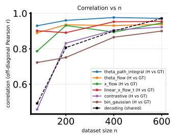
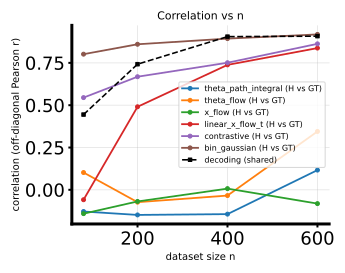

# Benchmark-1D twofig (PR30): math for `theta_path_integral`, `theta_flow`, `x_flow`, `linear_x_flow_t`, `contrastive`, `bin_gaussian` + full repro

This note records the **probabilistic objects** each method trains, the **matrices of contrasts** used in the H-decoding / two-figure pipeline, the **map from (log) likelihoods or scores to a directed and then symmetrized $H$**, and the **closed-form binned-Gaussian diagnostic** used for `bin_gaussian`. It ends with **copy-paste commands** and **artifact paths** for a completed run: six method rows, nested $n\in\{80,200,400,600\}$, PR-30D **linearbench** and **cosine** `noise2x_alpha4x` bundle.

## Context and notation

- Data are pairs $(\theta, x)$ with $x\in\mathbb{R}^{d_x}$. For 1D $\theta$ **binning** (default `theta1`, $K$ bins), each sample has a bin index $b\in\{0,\ldots,K-1\}$. The two-figure study (`fisher/h_decoding_twofig.py`) builds **per-bin** matrices by averaging per-sample $H$-like squares over rows in each bin, then takes a **$\sqrt{\cdot}$**-style display map `_sqrt_h_like` (entrywise on the binned $H^2$ object) for the sweep panels; see `fisher/h_decoding_convergence.py` and the `bin_gaussian` branch in `fisher/h_decoding_twofig.py`.
- **Ground-truth** Hellinger between generative conditionals at bin centers may be **analytic** (Gaussian family) or **one-sided MC**; see `fisher/hellinger_gt.py` and the twofig GT block in `fisher/h_decoding_twofig.py` (`estimate_hellinger_sq_grid_centers_analytic` vs `estimate_hellinger_sq_one_sided_mc`).

## Common: from a contrast matrix to $\Delta L$, then to a directed $H$, then symmetrization

All **likelihood-based** field methods in `HMatrixEstimator` (`fisher/h_matrix.py`) follow the same pattern on a square matrix $C$ (see `run` there):

1. **Row-center to a log-likelihood-ratio matrix** (off-diagonals are the object of interest):
   $$
   \Delta L_{ij} \;=\; C_{ij} - C_{ii}.
   $$
   Code: `compute_delta_l` (same idea is imported as `compute_delta_l_nf` in `fisher/h_decoding_convergence_methods.py`).

2. **Directed “$H$”** (clipped for stability):
   $$
   H^{\rightarrow}_{ij} \;=\; 1 - \frac{1}{\cosh\bigl(\tfrac{1}{2}\Delta L_{ij}\bigr)} \;=\; 1 - \operatorname{sech}\Bigl(\tfrac{1}{2}\Delta L_{ij}\Bigr), \qquad H^{\rightarrow}_{ii}=0.
   $$
   This is the map `compute_h_directed` in `fisher/h_matrix.py` (values of $\tfrac{1}{2}\Delta L$ are clipped to $[-60,60]$ before $\cosh$).

3. **Symmetrization** for a single undirected summary:
   $$
   H_{ij} \;=\; \tfrac{1}{2}\bigl(H^{\rightarrow}_{ij} + H^{\rightarrow}_{ji}\bigr).
   $$
   **Important:** binned `contrastive` and **scheduled linear $x$-flow** rows in `_estimate_one` (`fisher/h_decoding_convergence_methods.py`) do **not** stop at the per-sample $H$ from the block above in every configuration; they first form **bin-marginal** likelihoods from $C$ (next section).

## Bin-marginal likelihood map (`lxf_bin_likelihood_hellinger`)

Used for **conditional likelihood matrices** $C_{ij}\approx \log p(x_i\mid \theta_j)$ when the pipeline needs a **bin conditional** $\log p(x_i\mid B_b)$ with $B_b$ the event “$\theta$ belongs to bin $b$” estimated by **uniform mixture over training $\theta$’s in bin $b$**:

For each bin $b$ with index set $\mathcal{I}_b=\{j: \mathrm{bin}(\theta_j)=b\}$,
$$
\log p(x_i \mid B_b) \;\approx\; \log \frac{1}{|\mathcal{I}_b|}\sum_{j\in\mathcal{I}_b} \exp\bigl(C_{ij}\bigr)
$$
computed as a **log-mean-exp** for numerical stability (`fisher/lxf_bin_likelihood_hellinger.py`). The **baseline** for row $i$ is its own bin $b_i=\mathrm{bin}(\theta_i)$:
$$
\Delta L^{\mathrm{bin}}_{ib} \;=\; \log p(x_i\mid B_b) - \log p(x_i\mid B_{b_i}),
$$
then the **same** directed map $1-\operatorname{sech}(\tfrac{1}{2}\Delta L^{\mathrm{bin}})$ and averaging into $K\times K$ bin-bin matrices; see `lxf_bin_likelihood_hellinger` for the exact handling of empty bins and symmetrization. **`contrastive`** passes its score matrix into this routine as $C$ (so $C$ is **not** necessarily a calibrated $\log p$, but the same algebra is applied).

## Method-by-method definitions

### `theta_flow`

- **Train** conditional **$\theta$-space** flow matching models for **posterior** velocity $v^{\mathrm{post}}_t(\theta_t; x)$ and **prior** velocity $v^{\mathrm{prior}}_t(\theta_t)$ (architecture via `--flow-arch`, etc.).
- **Evaluate** $\log p(\theta_j\mid x_i)$ and $\log p(\theta_j)$ by **ODE likelihood** integration along the flow from data ($t{=}1$) to base ($t{=}0$) with standard Gaussian base density (see `compute_log_ratio_matrix` in `fisher/h_matrix.py`). Default **Bayes-ratio** matrix entries:
  $$
  C_{ij} \;=\; \log p(\theta_j \mid x_i) - \log p(\theta_j).
  $$
  (Optional posterior-only mode omits the prior term; not used unless explicitly requested.)
- **Then** apply the common $\Delta L\to \operatorname{sech}$ pipeline (`field_method="theta_flow"` branch in `HMatrixEstimator.run`).

### `theta_path_integral`

- Uses the **same** FM-trained posterior and prior velocities as `theta_flow`, but **does not** read off $\log p$ from the ODE solver for $C$.
- Instead, at a fixed FM evaluation time (CLI `--flow-fm-t-eps`, stored as `sigma_eval` on the estimator), convert velocities to **scores** via the flow-path scheduler (`_velocity_to_score` in `fisher/h_matrix.py`: essentially $\varepsilon$-prediction mapped to score using $\sigma_t$ from the path).
- Build the **integrand** on the sorted-$\theta$ grid:
  $$
  g_{ij} \;=\; f_{\mathrm{post}}(\theta_j\mid x_i) - f_{\mathrm{prior}}(\theta_j),
  $$
  then **trapezoid-integrate along $\theta$** (`compute_c_matrix`):
  $$
  C_{ij} \;=\; \int_{\theta_1}^{\theta_j} \bigl(f_{\mathrm{post}}(\theta\mid x_i) - f_{\mathrm{prior}}(\theta)\bigr)\, d\theta
  $$
  (discretized cumulatively on the sampled $\theta$ values in sorted order).
- **Requires** a trained prior (`prior_enable`); same $\Delta L$ / $\operatorname{sech}$ / symmetrize pipeline (`field_method` falls through to the `g_matrix` branch in `run`).

### `x_flow` (`flow_x_likelihood` inside `HMatrixEstimator`)

- Train a **conditional $x$-space** velocity $v_t(x_t;\theta)$ with flow matching for each $\theta$.
- **Evaluate** conditional likelihoods
  $$
  C_{ij} \;=\; \log p(x_i \mid \theta_j)
  $$
  by **ODE likelihood** in $x$-space (`compute_x_conditional_loglik_matrix`); **no** prior model.
- Apply the same $\Delta L$ / $\operatorname{sech}$ / symmetrize steps.

### `linear_x_flow_t` (scheduled linear $x$-flow in time)

- Train a **time-dependent linear/Gaussian** conditional model (e.g. $A(t)$, $b(t,\theta)$) so that at $t=1$ the implied law on $x$ is Gaussian (see `ConditionalTimeLinearXFlowMLP` and related classes in `fisher/linear_x_flow.py`).
- At evaluation, **pairwise**
  $$
  C_{ij} \;=\; \log p(x_i \mid \theta_j)
  $$
  computed by `model.log_prob_observed` in `compute_time_linear_x_flow_c_matrix` (`fisher/linear_x_flow.py`), using normalized $x$ with training statistics.
- **H matrix inside `_estimate_one`:** after forming $C$, the convergence stack typically feeds $C$ through `lxf_bin_likelihood_hellinger` (and may optionally replace the result by **analytic** Gaussian–Gaussian Hellinger between **endpoint** Gaussians — see `compute_linear_x_flow_analytic_hellinger_matrix` when the analytic flag is enabled).

### `contrastive` (hard binned contrastive LLR scorer)

- Train `ContrastiveLLRMLP` to output $S(x,\theta_{\mathrm{code}})$ with **theta encoding** (default one-hot bin code). Minibatch loss is **row-wise softmax classification**: for each row $i$ in a batch of distinct bins, logits are $S(x_i,\theta^{(k)})$ over columns $k$ and the label is the **own** column $i$ (`_contrastive_loss` in `fisher/contrastive_llr.py` — cross-entropy with `labels = arange(batch)`).
- Build
  $$
  C_{ij} \;=\; S(x_i,\theta_j^{\mathrm{code}}),
  $$
  (`compute_contrastive_c_matrix`), **not** an asserted calibrated $\log p$.
- **Bin-marginal step:** pass $C$ through `lxf_bin_likelihood_hellinger` so contrasts are against **mixtures within bins** (documented as treating $C$ like $\log p(x_i\mid\theta_j)$ for the log-mean-exp step).

### `bin_gaussian` (no neural training)

Closed-form **diagonal** diagnostic used directly at the **bin×bin** level (`_binned_gaussian_hellinger_sq` in `fisher/h_decoding_convergence_methods.py`):

1. **Bin means** $\mu_b \in \mathbb{R}^{d_x}$ from empirical means of $x$ in bin $b$; empty bins copy the nearest nonempty bin’s mean.
2. **One shared diagonal variance** across bins:
   $$
   v_k \;=\; \max\Bigl\{ \mathrm{mean}_n\,(x_{nk}-\mu_{b_n,k})^2,\; v_{\min}\Bigr\},\quad k=1,\ldots,d_x,
   $$
   with floor $v_{\min}=\texttt{variance\_floor}$ (defaults tied to flow regularization floors in twofig).
3. For bins $b\neq b'$,
   $$
   \mathrm{M}^2_{bb'} \;=\; \sum_{k=1}^{d_x} \frac{\bigl(\mu_{b,k}-\mu_{b',k}\bigr)^2}{v_k}, \qquad
   H^2_{bb'} \;=\; 1 - \exp\bigl(-\tfrac{1}{8}\mathrm{M}^2_{bb'}\bigr),
   $$
   which matches the **diagonal Gaussian Hellinger** formula when **both** covariances equal $\mathrm{diag}(v)$: then $\bar v_k=v_k$ and the log-variance term vanishes, leaving $d_B=\sum_k (\Delta\mu_k)^2/(8v_k)$ and $H^2=1-e^{-d_B}$ (compare `hellinger_sq_gaussian_diag` in `fisher/hellinger_gt.py`).

## Analytic Gaussian Hellinger (reference)

For **diagonal** covariances $\Sigma^{(a)}=\mathrm{diag}(v^{(a)})$, `hellinger_sq_gaussian_diag` implements
$$
d_B \;=\; \sum_k \left[ \frac{\bigl(\mu^{(1)}_k-\mu^{(2)}_k\bigr)^2}{8\bar v_k} + \tfrac{1}{2}\log\frac{\bar v_k}{\sqrt{v^{(1)}_kv^{(2)}_k}} \right],\quad \bar v_k=\tfrac{1}{2}\bigl(v^{(1)}_k+v^{(2)}_k\bigr),
$$
$$
H^2 \;=\; 1 - e^{-d_B}\quad\text{(clipped to $[0,1]$).}
$$
For **full** covariances,
$$
d_B \;=\; \tfrac{1}{8}(\mu^{(1)}-\mu^{(2)})^\top \bar\Sigma^{-1}(\mu^{(1)}-\mu^{(2)}) \;+\; \tfrac{1}{2}\Bigl(\log\det\bar\Sigma - \tfrac{1}{2}(\log\det\Sigma^{(1)}+\log\det\Sigma^{(2)})\Bigr),
$$
with $\bar\Sigma=\tfrac{1}{2}(\Sigma^{(1)}+\Sigma^{(2)})$ (`hellinger_sq_gaussian_full`).

**Monte Carlo GT** (when analytic is unavailable) uses the one-sided formula (`estimate_hellinger_sq_one_sided_mc`):
$$
H^2_{ij} \;=\; 1 - \mathbb{E}_{x\sim p(x\mid \theta_i)}\left[\exp\Bigl(\tfrac{1}{2}\bigl(\log p(x\mid\theta_j)-\log p(x\mid\theta_i)\bigr)\Bigr)\right].
$$

## Reproduction (commands and scripts)

Environment and device policy follow `AGENTS.md` (`mamba run -n geo_diffusion`, `--device cuda`).

**Shared row list** (comma-separated; hyphen aliases such as `linear-x-flow-t` are accepted where the CLI normalizes them):

```bash
ROWS='theta_path_integral,theta_flow,x_flow,linear_x_flow_t,contrastive,bin_gaussian'
NLIST='80,200,400,600'
```

**Linearbench (PR30):**

```bash
cd /grad/zeyuan/score-matching-fisher
CUDA_VISIBLE_DEVICES=0 PYTHONUNBUFFERED=1 mamba run -n geo_diffusion python fisher/h_decoding_twofig.py \
  --dataset-npz data/randamp_gaussian_sqrtd_xdim5/randamp_gaussian_sqrtd_xdim5_pr30d.npz \
  --dataset-family randamp_gaussian_sqrtd \
  --theta-field-rows "${ROWS}" \
  --n-list "${NLIST}" \
  --lxfs-path-schedule cosine \
  --lxfs-epochs 50000 \
  --lxfs-early-patience 1000 \
  --device cuda \
  --output-dir data/experiments/h_decoding_twofig_pr30d_linearbench_path_theta_x_lxf_contrastive_bin_n80200400600_20260505 \
  2>&1 | tee data/experiments/h_decoding_twofig_pr30d_linearbench_path_theta_x_lxf_contrastive_bin_n80200400600_20260505/run.log
```

**Cosine PR30 (`noise2x_alpha4x`):**

```bash
cd /grad/zeyuan/score-matching-fisher
CUDA_VISIBLE_DEVICES=1 PYTHONUNBUFFERED=1 mamba run -n geo_diffusion python fisher/h_decoding_twofig.py \
  --dataset-npz data/cosine_sqrtd_rand_tune_additive_xdim5_noise2x_alpha4x/cosine_sqrtd_rand_tune_additive_xdim5_noise2x_alpha4x_pr30d.npz \
  --dataset-family cosine_gaussian_sqrtd_rand_tune_additive \
  --theta-field-rows "${ROWS}" \
  --n-list "${NLIST}" \
  --lxfs-path-schedule cosine \
  --lxfs-epochs 50000 \
  --lxfs-early-patience 1000 \
  --device cuda \
  --output-dir data/experiments/h_decoding_twofig_pr30d_cosine_noise2x_alpha4x_path_theta_x_lxf_contrastive_bin_n80200400600_20260505 \
  2>&1 | tee data/experiments/h_decoding_twofig_pr30d_cosine_noise2x_alpha4x_path_theta_x_lxf_contrastive_bin_n80200400600_20260505/run.log
```

**Code map:** `fisher/h_decoding_twofig.py` (two-figure driver), `fisher/h_matrix.py` ($\Delta L$ / $\operatorname{sech}$ / flows), `fisher/linear_x_flow.py` (`linear_x_flow_t` likelihoods), `fisher/contrastive_llr.py` (contrastive training + $C$), `fisher/lxf_bin_likelihood_hellinger.py` (bin-marginal map), `fisher/hellinger_gt.py` (GT Hellinger / Gaussian formulas).

## Results and figures

Off-diagonal correlation curves vs generative GT for this run are embedded below (same statistics as in the saved SVGs).



*Linearbench PR30: correlation of estimated binned $\sqrt{H^2}$-style matrices vs MC/analytic GT as a function of training subset size $n$.*



*Cosine PR30 (`noise2x_alpha4x`): same metric family on the stronger theta–variance-coupling bundle.*

## Artifacts (completed run)

- **Linearbench directory:** `/grad/zeyuan/score-matching-fisher/data/experiments/h_decoding_twofig_pr30d_linearbench_path_theta_x_lxf_contrastive_bin_n80200400600_20260505/`
- **Cosine directory:** `/grad/zeyuan/score-matching-fisher/data/experiments/h_decoding_twofig_pr30d_cosine_noise2x_alpha4x_path_theta_x_lxf_contrastive_bin_n80200400600_20260505/`

Each contains `h_decoding_twofig_results.npz`, `h_decoding_twofig_summary.txt`, `h_decoding_twofig_sweep.svg`, `h_decoding_twofig_gt.svg`, `h_decoding_twofig_corr_vs_n.svg`, `h_decoding_twofig_nmse_vs_n.svg`, `h_decoding_twofig_training_losses_panel.svg`, and `run.log`.

## Takeaway

- **Likelihood rows** (`theta_flow`, `x_flow`, `linear_x_flow_t`) all produce a matrix $C$ of (approximate) **log probabilities** (or log Bayes factors for `theta_flow`), then share the **same** $\Delta L$ and $\operatorname{sech}$ transform unless the method explicitly routes through **bin-marginal** `lxf_bin_likelihood_hellinger` inside `_estimate_one`.
- **`theta_path_integral`** replaces ODE $\log p$ by a **score-difference integral** along $\theta$.
- **`contrastive`** optimizes a **classification** score and feeds it through the **same bin-marginal** machinery as scheduled LXF — it is **not** guaranteed to equal a generative $\log p$.
- **`bin_gaussian`** skips learning and uses **closed-form diagonal-Gaussian Hellinger** at the bin level with a **shared** diagonal covariance estimate.
