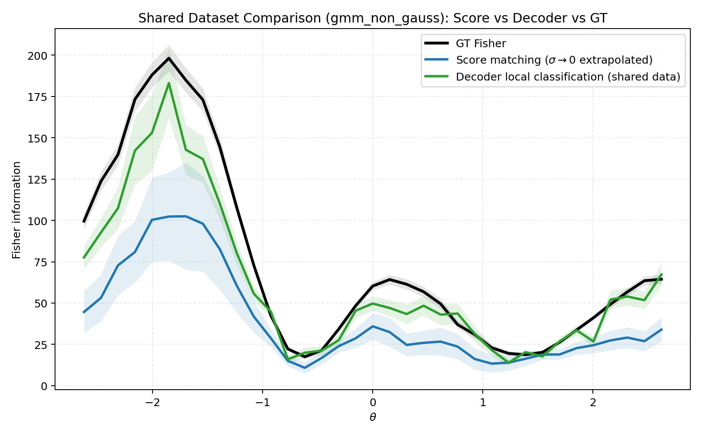
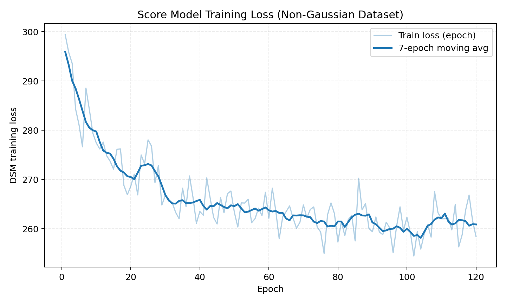

# Non-Gaussian Fisher Estimation: Continuous Noise-Conditional Score Matching vs Decoder

This note documents the current non-Gaussian toy setup, the estimators, and the latest comparison result using continuous noise-conditional denoising score matching (NCSM).

## 1) Toy Dataset

We sample

$\theta \sim \mathrm{Uniform}[\theta_{\min},\theta_{\max}]$ with $(\theta_{\min},\theta_{\max})=(-3,3)$, and $x\in\mathbb R^2$ from a conditional two-component Gaussian mixture:

$$
p(x\mid\theta)=\pi(\theta)\,\mathcal N\!\big(x;\mu^{(1)}(\theta),\Sigma^{(1)}(\theta)\big)
+\big(1-\pi(\theta)\big)\,\mathcal N\!\big(x;\mu^{(2)}(\theta),\Sigma^{(2)}(\theta)\big).
$$

### Mean (tuning) structure

A smooth base tuning curve is used:

$$
\mu_{\mathrm{base},1}(\theta)=1.10\sin(1.25\theta)+0.28\theta,
$$
$$
\mu_{\mathrm{base},2}(\theta)=0.85\cos(1.05\theta+0.30)-0.12\theta^2+0.05\theta.
$$

Two component means are separated around the base:

$$
\mu^{(1)}(\theta)=\mu_{\mathrm{base}}(\theta)+\Delta(\theta),\qquad
\mu^{(2)}(\theta)=\mu_{\mathrm{base}}(\theta)-\Delta(\theta),
$$

where $\Delta(\theta)$ is sinusoidally modulated (controlled by `gmm_sep_*` arguments).

### Mixture weight

$$
\pi(\theta)=\sigma\!\big(a\sin(\omega\theta+\phi)+b\big),
$$

with sigmoid $\sigma(\cdot)$ and numerical clipping to $(10^{-4},1-10^{-4})$.

### Covariance structure

Each component has its own $\theta$-dependent covariance:

$$
\Sigma^{(k)}(\theta)=
\begin{bmatrix}
\sigma_{1,k}(\theta)^2 & \rho_k(\theta)\sigma_{1,k}(\theta)\sigma_{2,k}(\theta)\\
\rho_k(\theta)\sigma_{1,k}(\theta)\sigma_{2,k}(\theta) & \sigma_{2,k}(\theta)^2
\end{bmatrix},\quad k\in\{1,2\}.
$$

Because both weights and both components vary with $\theta$, $p(x\mid\theta)$ is strongly non-Gaussian and can be asymmetric/multimodal.

## 2) Continuous Noise-Conditional Score Matching (NCSM)

We train a network $s_\phi(\tilde\theta,x,\sigma)$ to estimate the score of the corrupted conditional density.

For each sample $(\theta,x)$:

1. Sample noise scale continuously on a geometric spectrum (log-uniform):
$$
\log\sigma \sim \mathrm{Uniform}(\log\sigma_{\min},\log\sigma_{\max}).
$$
2. Sample $z\sim\mathcal N(0,1)$.
3. Corrupt parameter: $\tilde\theta=\theta+\sigma z$.
4. Train with weighted DSM objective:
$$
\mathcal L(\phi)=\mathbb E\left[\left\|\sigma\,s_\phi(\tilde\theta,x,\sigma)+z\right\|^2\right].
$$

This is equivalent to using target $-z/\sigma$ with weight $\lambda(\sigma)=\sigma^2$, and stabilizes learning across noise scales.

Implementation detail: the model conditions on $\log\sigma$ (instead of raw $\sigma$).

## 3) Fisher from Score Model

For each evaluation $\theta$-bin center $\theta_0$, we estimate noisy-score Fisher curves

$$
\widehat I_{\sigma}(\theta_0)=\mathbb E\!\left[\hat s(\theta,x,\sigma)^2\mid\theta\in\text{bin}(\theta_0)\right]
$$

on a geometric grid of $\sigma$ values, then fit linear regression versus $\sigma^2$:

$$
\widehat I_{\sigma}(\theta_0)\approx a(\theta_0)\,\sigma^2+b(\theta_0).
$$

The intercept $b(\theta_0)$ is used as $\widehat I_{\mathrm{score}}(\theta_0)$ (the $\sigma\to0$ estimate).

## 4) Decoder Baseline

For each center $\theta_0$, define

$$
\theta_+=\theta_0+\varepsilon/2,\qquad \theta_-=\theta_0-\varepsilon/2.
$$

A local classifier distinguishes samples near $\theta_+$ vs $\theta_-$. If classifier logit is $\ell(x)$, Fisher is estimated as

$$
\widehat I_{\mathrm{dec}}(\theta_0)=\frac{1}{\varepsilon^2}\,\mathbb E[\ell(x)^2].
$$

## 5) Ground-Truth Fisher

We use the exact conditional score of the known mixture model:

$$
s(x,\theta)=\partial_\theta \log p(x\mid\theta),
$$

including derivatives of $\pi(\theta)$, $\mu^{(k)}(\theta)$, and $\Sigma^{(k)}(\theta)$.

Ground-truth Fisher is

$$
I_{\mathrm{gt}}(\theta)=\mathbb E_{x\sim p(x\mid\theta)}[s(x,\theta)^2],
$$

computed by Monte Carlo at each bin center.

## 6) Settings and Run

Command used:

```bash
mamba run -n geo_diffusion python step6_shared_dataset_compare.py \
  --device cuda \
  --dataset-family gmm_non_gauss \
  --score-noise-mode continuous \
  --score-epochs 250
```

Key score noise settings (current defaults):
- continuous $\sigma$ sampling with $\sigma_{\min}=0.01\,\mathrm{std}(\theta_{\mathrm{train}})$
- $\sigma_{\max}=0.25\,\mathrm{std}(\theta_{\mathrm{train}})$
- 12 geometric evaluation levels for $\sigma^2\to0$ extrapolation

## 7) Results

Fisher curve comparison:



Score training loss curve:



Metrics:
- score vs GT: `valid=35/35`, `rmse=43.7623`, `mae=33.5258`, `corr=0.9854`
- decoder vs GT: `valid=35/35`, `rmse=18.2054`, `mae=13.1027`, `corr=0.9876`

## 8) Takeaway

- Continuous NCSM trains stably (loss decreases and remains bounded), but Fisher calibration is still weaker than decoder on this harder non-Gaussian dataset.
- The score method captures trend (high correlation) but has larger absolute error, especially near high-Fisher regions.
