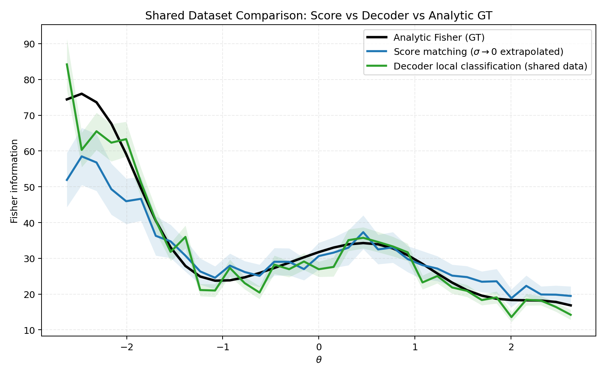

# Score Matching and Fisher Information Estimation (Toy Study)

This note documents the current toy setup and three Fisher-information curves on the same dataset:
1. score-matching estimator,
2. decoder-based estimator,
3. analytic Fisher ground truth.

## 1) Toy Dataset

We use scalar latent parameter $\theta$ and 2D observation $x$:

$$
\theta \sim \mathrm{Uniform}[\theta_{\min},\theta_{\max}], \quad \theta_{\min}=-3,\ \theta_{\max}=3,
$$

$$
x\mid\theta \sim \mathcal N\!\left(\mu(\theta),\,\Sigma(\theta)\right), \quad x\in\mathbb R^2.
$$

### Mean (tuning curve)

$$
\mu_1(\theta)=1.10\sin(1.25\theta)+0.28\theta,
$$

$$
\mu_2(\theta)=0.85\cos(1.05\theta+0.30)-0.12\theta^2+0.05\theta.
$$

### Covariance depends on $\theta$

Write

$$
\Sigma(\theta)=
\begin{bmatrix}
\sigma_1(\theta)^2 & \rho(\theta)\sigma_1(\theta)\sigma_2(\theta) \\
\rho(\theta)\sigma_1(\theta)\sigma_2(\theta) & \sigma_2(\theta)^2
\end{bmatrix}.
$$

In current code/settings:

$$
\sigma_1(\theta)=\sigma_{1,0}\bigl(1+a_1\sin(\omega_1\theta+\phi_1)\bigr),
\quad
\sigma_2(\theta)=\sigma_{2,0}\bigl(1+a_2\cos(\omega_2\theta+\phi_2)\bigr),
$$

$$
\rho(\theta)=\mathrm{clip}\!\left(\rho_0+a_\rho\sin(\omega_\rho\theta+\phi_\rho),\,-\rho_{\mathrm{clip}},\,\rho_{\mathrm{clip}}\right),
$$

with defaults
$\sigma_{1,0}=0.30$,
$\sigma_{2,0}=0.22$,
$\rho_0=0.15$,
$a_1=0.35$,
$a_2=0.30$,
$a_\rho=0.30$,
$\omega_1=0.90$,
$\omega_2=0.75$,
$\omega_\rho=1.10$,
$\phi_1=0.20$,
$\phi_2=-0.35$,
$\phi_\rho=0.40$,
$\rho_{\mathrm{clip}}=0.85$.

Dataset visualization script:

```bash
mamba run -n geo_diffusion python bin/step2_toy_dataset_uniform_theta.py
```

Figures:
- `outputs_step2/joint_scatter_theta_color.png`
- `outputs_step2/tuning_curve.png`
- `outputs_step2/conditional_slices.png`

## 2) Score Matching Estimator

We train a conditional denoising score model for the posterior score in $\theta$-space:

$$
s_\phi(\tilde\theta,x,\sigma)\approx \partial_{\tilde\theta}\log p_\sigma(\tilde\theta\mid x),
$$

with noisy target

$$
\tilde\theta=\theta+\sigma\varepsilon,\quad \varepsilon\sim\mathcal N(0,1),
$$

and loss

$$
\mathcal L(\phi)=\mathbb E\!\left[
\left(
 s_\phi(\tilde\theta,x,\sigma)+\frac{\tilde\theta-\theta}{\sigma^2}
\right)^2
\right].
$$

With uniform prior in the interior of support,
$\partial_\theta\log p(\theta\mid x)=\partial_\theta\log p(x\mid\theta)$,
so this gives the likelihood score needed by Fisher information.

Score-demo script (score quality only):

```bash
mamba run -n geo_diffusion python bin/step1_score_matching_2d.py --device cuda
```

## 3) From Score to Fisher Information

For scalar $\theta$:

$$
\mathcal I(\theta)=\mathbb E_{x\sim p(x\mid\theta)}\left[\left(\partial_\theta\log p(x\mid\theta)\right)^2\right].
$$

Our score-based estimator:
1. Train with multiple noise levels $\{\sigma_k\}$.
2. Compute $\hat s(\theta_i,x_i,\sigma_k)^2$ on evaluation pairs.
3. Bin by $\theta$ to get $\hat I_{\sigma_k}(\theta_b)$.
4. Extrapolate linearly in $\sigma^2$:

$$
\hat I_{\sigma}(\theta_b)\approx a_b+b_b\sigma^2,
\qquad
\hat I_{0}(\theta_b)=a_b.
$$

We report $\hat I_0(\theta_b)$ as the score-based Fisher curve.

## 4) Decoder-Based Fisher Estimator

For each center $\theta_0$, define

$$
\theta_+=\theta_0+\frac{\varepsilon}{2},\qquad
\theta_-=\theta_0-\frac{\varepsilon}{2}.
$$

Using nearby samples from the same shared dataset, train a local binary classifier:
- class 1: samples near $\theta_+$
- class 0: samples near $\theta_-$

Let classifier logit be $\ell(x)\approx\log\frac{p(x\mid\theta_+)}{p(x\mid\theta_-)}$. Then for small $\varepsilon$:

$$
\ell(x)=\varepsilon\,\partial_\theta\log p(x\mid\theta_0)+O(\varepsilon^3),
$$

so we estimate

$$
\hat I_{\mathrm{dec}}(\theta_0)=\frac{1}{\varepsilon^2}\,\mathbb E\!\left[\ell(x)^2\right].
$$

## 5) Analytic Ground-Truth Fisher

Because $x\mid\theta$ is Gaussian with both mean and covariance depending on $\theta$:

$$
\mathcal I_{\mathrm{gt}}(\theta)
=
\mu'(\theta)^\top\Sigma(\theta)^{-1}\mu'(\theta)
+
\frac{1}{2}\,\mathrm{tr}\!\left[
\Sigma(\theta)^{-1}\Sigma'(\theta)\Sigma(\theta)^{-1}\Sigma'(\theta)
\right].
$$

where

$$
\mu_1'(\theta)=1.10\cdot1.25\cos(1.25\theta)+0.28,
$$

$$
\mu_2'(\theta)=-0.85\cdot1.05\sin(1.05\theta+0.30)-0.24\theta+0.05.
$$

$\Sigma'(\theta)$ is computed analytically from the parameterized
$\sigma_1(\theta),\sigma_2(\theta),\rho(\theta)$.

## 6) Shared-Dataset Comparison and Results

Run:

```bash
mamba run -n geo_diffusion python bin/step6_shared_dataset_compare.py --device cuda
```

This uses one shared train/eval split to fit both methods and compare to analytic GT.

Main figure:



Metrics (`outputs_step6_shared_dataset/metrics_vs_analytic_theta_cov.txt`):
- score vs GT: `valid=35/35`, `rmse=7.141434`, `mae=4.294039`, `corr=0.978338`
- decoder vs GT: `valid=35/35`, `rmse=4.518555`, `mae=3.084805`, `corr=0.965513`

Interpretation:
- Both methods follow the analytic Fisher trend under the harder $\Sigma(\theta)$ setting.
- In this run, decoder has lower RMSE/MAE, while score method has slightly higher correlation.
