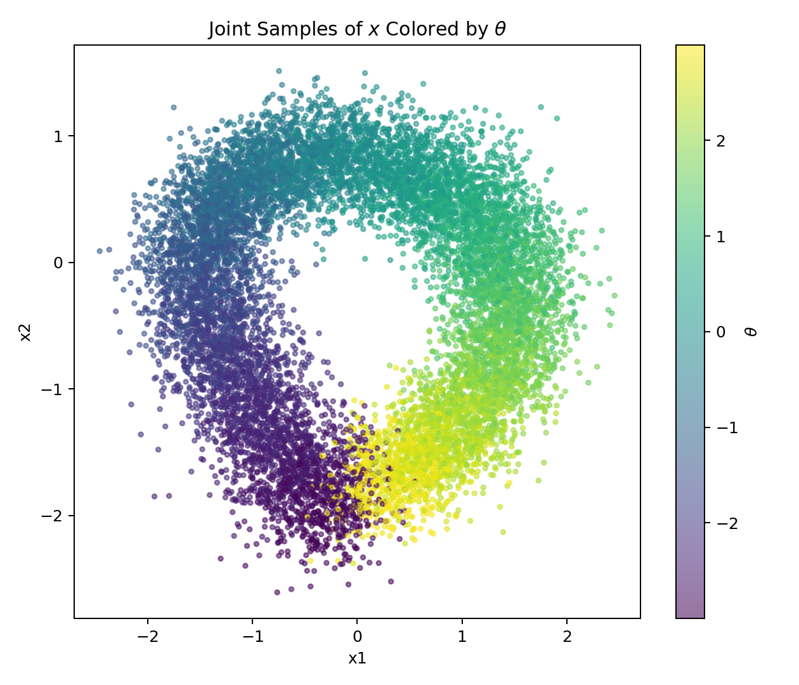
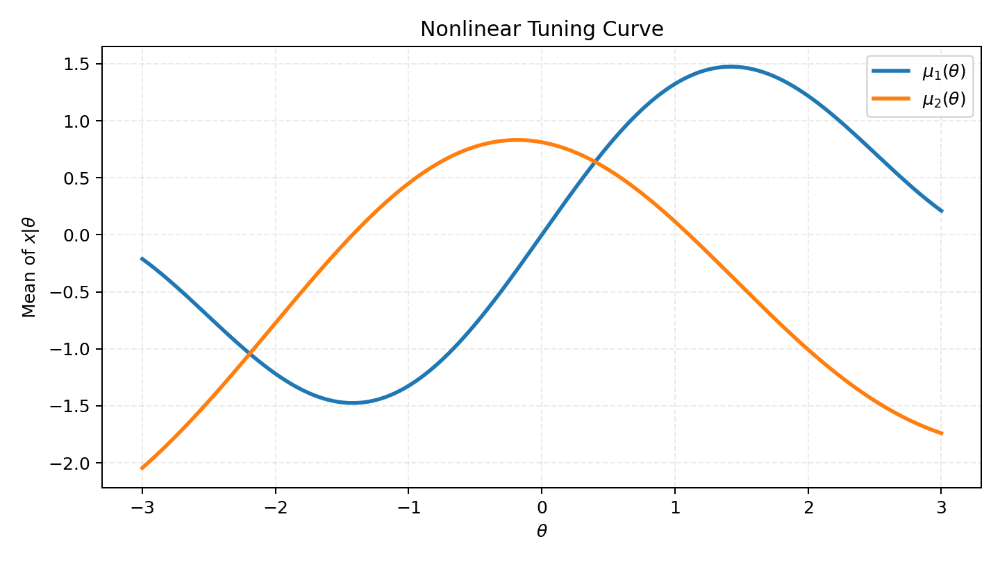
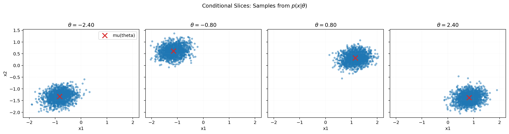
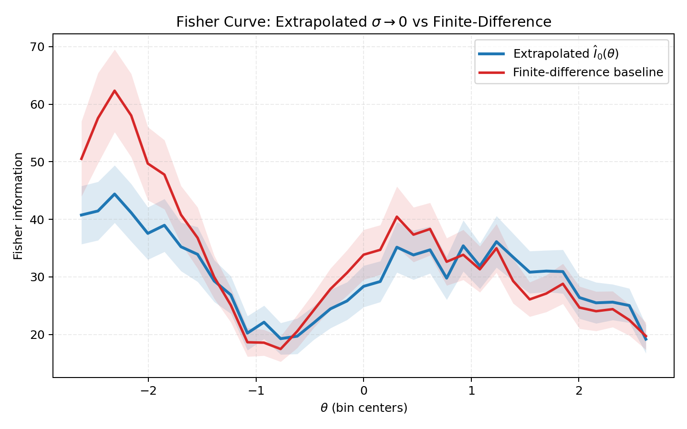
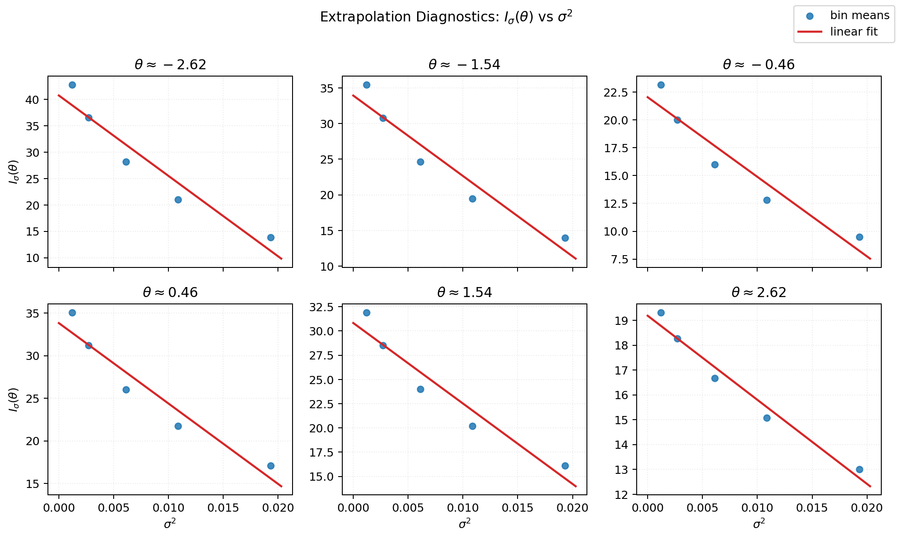
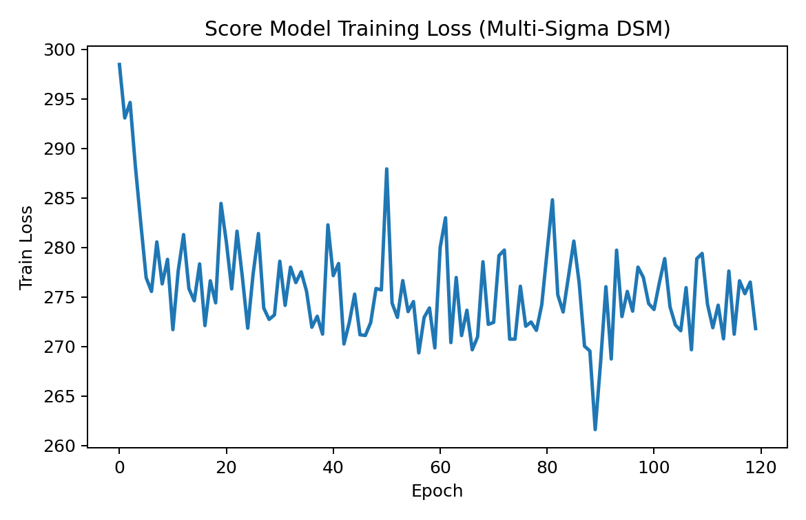

# Score Matching for Fisher Information Estimation (Toy Study)

## 1) Goal

This note documents our end-to-end toy experiment for estimating Fisher information using **conditional denoising score matching (DSM)**.

Key constraints in this implementation:
- We **do not use kernel averaging**.
- We estimate Fisher directly from learned score outputs.
- We train with **multiple noise levels** and extrapolate to $\sigma \to 0$.

---

## 2) Problem Setup

We want Fisher information with respect to scalar parameter $\theta$:

$$
\mathcal I(\theta) = \mathbb E_{x \sim p(x \mid \theta)}\left[\left(\partial_\theta \log p(x \mid \theta)\right)^2\right].
$$

We train a score model

$$
\hat s_\phi(\tilde\theta, x, \sigma) \approx \partial_{\tilde\theta}\log p_\sigma(\tilde\theta \mid x),
$$

and use it to build Fisher estimates from $\hat s_\phi^2$.

---

## 3) Toy Dataset (Uniform Prior + Nonlinear Tuning Curve)

We use:

$$
\theta \sim \mathrm{Uniform}[-3,3], \qquad x \in \mathbb R^2,
$$

$$
x \mid \theta \sim \mathcal N(\mu(\theta), \Sigma).
$$

### Tuning curve $\mu(\theta)$

$$
\mu_1(\theta) = 1.10\sin(1.25\theta) + 0.28\theta,
$$

$$
\mu_2(\theta) = 0.85\cos(1.05\theta + 0.30) - 0.12\theta^2 + 0.05\theta.
$$

### Covariance $\Sigma$

Using $\sigma_{x1}=0.30$, $\sigma_{x2}=0.22$, $\rho=0.15$:

$$
\Sigma =
\begin{bmatrix}
\sigma_{x1}^2 & \rho\,\sigma_{x1}\sigma_{x2} \\
\rho\,\sigma_{x1}\sigma_{x2} & \sigma_{x2}^2
\end{bmatrix}
=
\begin{bmatrix}
0.0900 & 0.0099 \\
0.0099 & 0.0484
\end{bmatrix}.
$$

---

## 4) Multi-Noise DSM Method

For each training pair $(\theta_i, x_i)$, sample a noise level $\sigma$ from a predefined grid and create

$$
\tilde\theta_i = \theta_i + \sigma\varepsilon_i, \quad \varepsilon_i \sim \mathcal N(0,1).
$$

Train with DSM loss:

$$
\mathcal L(\phi)=
\mathbb E\left[
\left(
\hat s_\phi(\tilde\theta, x, \sigma)
+
\frac{\tilde\theta-\theta}{\sigma^2}
\right)^2
\right].
$$

Neural model:
- Input: $(\tilde\theta, x_1, x_2, \sigma)$
- Output: scalar score
- MLP with SiLU activations, depth $=3$, hidden width $=128$

---

## 5) Practical Noise-Scale Choice

Instead of absolute noise values, we use a **data-relative policy**:

$$
\sigma_k = \alpha_k \cdot \mathrm{std}(\theta_{\text{train}}).
$$

This makes noise selection portable across datasets with different parameter scales.

In this run:
- $\alpha$ grid: $[0.08, 0.06, 0.045, 0.03, 0.02]$
- observed $\mathrm{std}(\theta_{\text{train}})=1.737246$
- resulting absolute $\sigma$ grid:
  - $[0.13898,\, 0.10423,\, 0.07818,\, 0.05212,\, 0.03474]$

---

## 6) Direct Fisher Estimation + $\sigma \to 0$ Extrapolation

We do not use kernel smoothing.

1. For each eval pair $(\theta_i, x_i)$ and each noise level $\sigma_k$, compute:

$$
\hat s_{i,k} = \hat s_\phi(\theta_i, x_i, \sigma_k).
$$

2. Bin $\theta$ into uniform bins over an interior range $[\theta_{\min}+m,\theta_{\max}-m]$.

3. For each bin $b$ and each $\sigma_k$:

$$
\hat I_{\sigma_k}(\theta_b) = \frac{1}{|b|}\sum_{i\in b} \hat s_{i,k}^2.
$$

4. Extrapolate to zero noise by linear fit in $\sigma^2$:

$$
\hat I_{\sigma}(\theta_b) \approx a_b + b_b\sigma^2,
$$

and take

$$
\hat I_0(\theta_b) = a_b.
$$

---

## 7) Baseline for Evaluation

We compare against finite-difference scores from analytic $p(x\mid\theta)$:

$$
s_{\text{fd}}(x,\theta) \approx
\frac{\log p(x\mid\theta+\delta)-\log p(x\mid\theta-\delta)}{2\delta}, \quad \delta=0.03.
$$

Then baseline Fisher per bin:

$$
I_b^{\text{fd}} = \frac{1}{|b|}\sum_{i\in b} s_{\text{fd},i}^2.
$$

We report RMSE, MAE, relative RMSE, correlation, and extrapolation fit quality ($R^2$).

---

## 8) Experimental Settings

### Data
- Train samples: `n_train = 28000`
- Eval samples: `n_eval = 18000`
- $\theta \in [-3,3]$
- Eval interior margin: `0.30`
- Number of bins: `35`
- Minimum bin count: `80`

### Training
- Epochs: `120`
- Batch size: `256`
- Learning rate: `1e-3`
- Device: CPU
- Multi-noise training with uniform sampling over sigma grid

---

## 9) Results (Multi-Noise Extrapolation)

From `outputs_step3_multi_sigma/metrics_extrapolated.txt`:

- Valid bins: `35/35`
- RMSE: `6.522256`
- MAE: `4.651831`
- Relative RMSE: `0.196625`
- Correlation: `0.924494`
- Mean extrapolation $R^2$: `0.926104`

Interpretation:
- The extrapolated Fisher curve tracks the finite-difference baseline well across $\theta$.
- The extrapolation diagnostics show mostly linear behavior of $I_\sigma(\theta)$ vs $\sigma^2$ in bins.

---

## 10) Visualizations

### Step-2 dataset intuition

Joint samples $x$ colored by $\theta$:



Tuning curve $\mu(\theta)$:



Conditional slices $p(x\mid\theta)$ at selected $\theta$:



### Step-3 multi-noise Fisher result

Extrapolated Fisher ($\sigma\to0$) vs finite-difference baseline:



Extrapolation diagnostics ($I_\sigma(\theta)$ vs $\sigma^2$ in representative bins):



Training loss:



---

## 11) Repro Commands

Generate toy dataset visualizations:

```bash
python step2_toy_dataset_uniform_theta.py
```

Run multi-noise score-to-Fisher extrapolation:

```bash
python step3_direct_fisher_score.py
```

---

## 12) Takeaways

- Using multiple noise levels with $\sigma\to0$ extrapolation is practical and aligns with standard score-model practice.
- Relative noise scaling ($\sigma=\alpha\cdot\mathrm{std}(\theta)$) is a good default for portability across different data scales.
- On this toy problem, the method gives a strong match to the finite-difference Fisher reference without kernel averaging.
