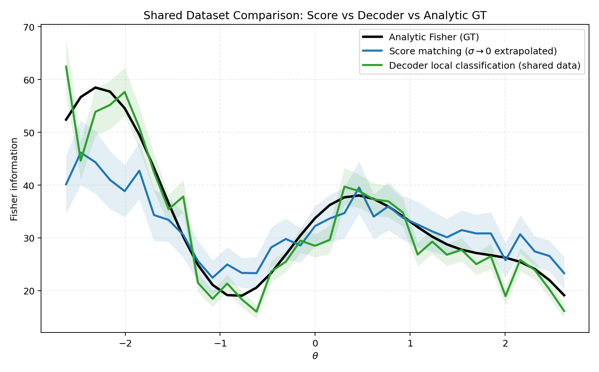

# Score Matching and Fisher Information Estimation (Toy Study)

This note summarizes the toy setup, the score-matching method, the decoder method, and the final Fisher-information comparison.

## 1) Dataset

We use a scalar latent parameter and 2D observation:

$$
\theta \sim \mathrm{Uniform}[-3,3], \qquad x \in \mathbb{R}^2,
$$

$$
x \mid \theta \sim \mathcal{N}(\mu(\theta), \Sigma).
$$

Tuning curve:

$$
\mu_1(\theta) = 1.10\sin(1.25\theta) + 0.28\theta,
$$

$$
\mu_2(\theta) = 0.85\cos(1.05\theta + 0.30) - 0.12\theta^2 + 0.05\theta.
$$

Covariance:

$$
\Sigma =
\begin{bmatrix}
0.0900 & 0.0099 \\
0.0099 & 0.0484
\end{bmatrix}.
$$

Dataset visualization script:

```bash
mamba run -n geo_diffusion python step2_toy_dataset_uniform_theta.py
```

Generated figures:
- `outputs_step2/joint_scatter_theta_color.png`
- `outputs_step2/tuning_curve.png`
- `outputs_step2/conditional_slices.png`

## 2) Score Matching Method (Score Estimation)

The score network learns

$$
s_\phi(\tilde\theta, x, \sigma) \approx \partial_{\tilde\theta} \log p_\sigma(\tilde\theta \mid x),
$$

with denoising objective:

$$
\mathcal{L}(\phi)=
\mathbb{E}\left[
\left(
 s_\phi(\tilde\theta, x, \sigma) + \frac{\tilde\theta-\theta}{\sigma^2}
\right)^2
\right],
\qquad
\tilde\theta=\theta+\sigma\varepsilon,\; \varepsilon\sim\mathcal N(0,1).
$$

Score-demo script (not Fisher):

```bash
mamba run -n geo_diffusion python step1_score_matching_2d.py --device cuda
```

Generated figures:
- `outputs_step1/loss_curve.png`
- `outputs_step1/score_field_quiver.png`
- `outputs_step1/score_error_heatmap.png`

## 3) From Score to Fisher Information

For scalar $\theta$:

$$
\mathcal I(\theta)=\mathbb E_{x\sim p(x\mid\theta)}\left[\left(\partial_\theta \log p(x\mid\theta)\right)^2\right].
$$

In the Fisher script, we estimate score-based Fisher by:

1. train multi-noise DSM score model,
2. compute $\hat s(\theta_i,x_i,\sigma_k)^2$ on evaluation pairs,
3. bin over $\theta$ to get $\hat I_{\sigma_k}(\theta_b)$,
4. extrapolate linearly in $\sigma^2$ to $\sigma\to0$:

$$
\hat I_{\sigma}(\theta_b) \approx a_b + b_b\sigma^2,
\qquad
\hat I_{0}(\theta_b)=a_b.
$$

## 4) Decoder Method for Fisher

At each center $\theta_0$, define

$$
\theta_+ = \theta_0 + \frac{\varepsilon}{2},
\qquad
\theta_- = \theta_0 - \frac{\varepsilon}{2}.
$$

Using neighborhoods from the **same shared dataset**, train a local classifier to separate:
- class 1: samples near $\theta_+$
- class 0: samples near $\theta_-$

If classifier logit is $\ell(x)$, estimate

$$
\hat I_{\mathrm{dec}}(\theta_0)=\frac{1}{\varepsilon^2}\,\mathbb E\left[\ell(x)^2\right].
$$

## 5) Analytic Ground Truth

Because covariance is constant and $x\mid\theta$ is Gaussian,

$$
\mathcal I_{\mathrm{gt}}(\theta)=\mu'(\theta)^\top\Sigma^{-1}\mu'(\theta),
$$

with

$$
\mu_1'(\theta)=1.10\cdot1.25\cos(1.25\theta)+0.28,
$$

$$
\mu_2'(\theta)=-0.85\cdot1.05\sin(1.05\theta+0.30)-0.24\theta+0.05.
$$

## 6) Final Comparison Script

Run:

```bash
mamba run -n geo_diffusion python step6_shared_dataset_compare.py --device cuda
```

This script:
- generates one shared dataset,
- fits both score and decoder methods on that same split,
- compares both against analytic $\mathcal I_{\mathrm{gt}}(\theta)$.

Main output figure:



Result metrics (`outputs_step6_shared_dataset/metrics_vs_analytic.txt`):
- score vs GT: `valid=35/35`, `rmse=6.270841`, `mae=4.500989`, `corr=0.942100`
- decoder vs GT: `valid=35/35`, `rmse=4.039407`, `mae=2.824792`, `corr=0.948503`

Interpretation:
- Both methods track the analytic Fisher curve well.
- On this toy setting, decoder-based estimation is slightly closer to GT by RMSE/MAE.
